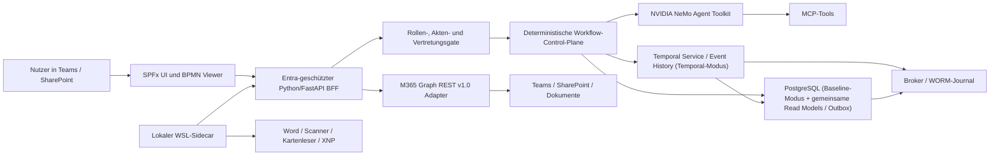

# Microsoft-first, On-Prem-AI Zielarchitektur

Status: angenommenes Zielbild und Umsetzungsrahmen, keine Runtime- oder
Deployment-Freigabe.

Führendes Issue: [#613](https://github.com/notariat8/NaC/issues/613)

## Entscheidung

NaC wird **Microsoft-first an der Benutzer-, Identitäts- und Datenkante**, aber
**on-prem-first für AI, Prozessausführung und technische Langzeitwahrheit**.

- Microsoft Teams ist der primäre Arbeitsplatz.
- SharePoint Framework (SPFx) liefert Teams-/SharePoint-Oberflächen und den
  read-only `bpmn-js`-Viewer.
- Entra ID authentifiziert Benutzer und technische Anwendungen.
- Microsoft Graph REST `v1.0` oder MCP-Server, die ausschließlich Graph REST
  `v1.0` verwenden, bilden die einzige M365-Datenkante.
- SharePoint speichert Dokumente, sichtbare Listen und fachliche Projektionen,
  ist aber weder Workflow-Engine noch technische Langzeitwahrheit.
- Python/FastAPI, die deterministische Workflow-Control-Plane, PostgreSQL,
  Outbox/Broker und WORM-Nachweise laufen zentral on-prem.
- NVIDIA NeMo Agent Toolkit ist das einzige produktive Agentic Toolkit.
- Microsoft 365 Agents SDK darf später nur als Teams-Kanaladapter dienen. Es
  darf keine zweite Agentic Runtime oder fachliche Wahrheit einführen.
- Lokale WSL-Container sind nichtautoritative Arbeitsplatz-Sidecars für Word,
  Track Changes, Scanner, Kartenarbeitsplatz und XNP.

Temporal ist **keine beschlossene Plattform**. Es ist Kandidat eines
zeitbegrenzten Durable-Workflow-Spikes. Der Spike vergleicht Temporal mit einer
kleinen Python/PostgreSQL-Baseline anhand festgelegter Anforderungen. Temporal
ist dabei keine Ausnahme vom NeMo-Agentic-Toolkit: Es wäre ausschließlich eine
deterministische Workflow-Control-Plane.

## Bewertung Des Bereitgestellten PDFs

Das PDF `Python in Teams mit SharePoint Hosting` beschreibt eine grundsätzlich
passende Trennung von SPFx-Frontend, externem Python-Backend und SharePoint als
Daten-/Dokumentenplattform. NaC übernimmt die folgenden Punkte jedoch nur mit
den finalen Sicherheits- und Runtime-Grenzen.

| PDF-Aussage | Urteil | NaC-Festlegung |
| --- | --- | --- |
| Teams als Benutzereinstieg | Übernehmen | Teams ist primäre Arbeitsoberfläche; SharePoint-Seiten bleiben direkt nutzbar. |
| SPFx + React/TypeScript | Übernehmen | Ein Webpart kann als SharePoint-Webpart, Teams-Tab und später persönliche App dienen. |
| SPFx 1.22+ mit Heft-Toolchain | Übernehmen | Neue Oberflächen verwenden die aktuelle SPFx-/Heft-Toolchain und eine reproduzierbar gepinnte Node-/Paketbasis. |
| App Catalog, .sppkg, Teams-Publishing und Admin-Freigabe | Anpassen | Paketierung und Veröffentlichung folgen einem getrennten App-Catalog-/Teams-Lifecycle mit frühem Admin-Gate; kein stilles Tenant-Deployment. |
| Python außerhalb SharePoint | Übernehmen | Python/FastAPI läuft on-prem hinter einer Entra-geschützten API. |
| SharePoint als Hosting-Plattform | Anpassen | SharePoint hostet SPFx und verwaltet Dokumente/Projektionen, nicht Python und nicht die technische Workflow-Wahrheit. |
| Graph oder SharePoint REST | Anpassen | Ausschließlich rohe Graph-REST-v1.0-Aufrufe oder Graph-v1.0-basierte MCP-Server; kein SharePoint REST, PnP, Graph SDK oder Graph Beta. |
| Entra SSO/AadHttpClient | Übernehmen | SPFx ruft den NaC-BFF im Benutzerkontext auf; App-Rollen und `Sites.Selected` begrenzen technische Zugriffe. |
| SharePoint-Listen für Prozesszustand | Anpassen | Listen zeigen fachliche Projektionen und Aufgaben; Timer, Leases, Retries und autoritativer Laufzustand liegen zentral. |
| BPMN.js | Anpassen | Viewer zuerst; Modeler erst nach Versionierungs-, Freigabe- und Roundtrip-Gates. Keine BPMN-Ausführung in SharePoint. |
| BPMN-Modellversion pro laufender Instanz | Übernehmen | Jede Prozessinstanz bindet eine unveränderliche BPMN-Modellversion; neue Modellstände verändern laufende Instanzen nicht still. |
| Lazy Loading und Code Splitting für bpmn-js | Übernehmen | Der Viewer wird getrennt geladen, damit Teams-/SharePoint-Startzeit und Bundle-Größe kontrollierbar bleiben. |
| Teams-Custom-App-Richtlinien und frühes Admin-Gate | Anpassen | Tenant-Richtlinien, App-Berechtigungen und Freigabefähigkeit werden vor Pilotimplementierung geprüft und als Deployment-Gate geführt. |
| SpiffWorkflow als Default | Verwerfen | Keine verdeckte Engine-Entscheidung. Durable Execution wird anhand eines Spikes ausgewählt. |
| PostgreSQL | Anpassen | Immer für Domain-Read-Models, Outbox, Task-Metadaten und Projektionen; nur im Baseline-Modus zusätzlich autoritativ für Workflow-Zustand, Timer, Leases und Retries. |
| Microsoft 365 Agents SDK | Anpassen | Optionaler Kanaladapter, niemals Agentic Toolkit oder Workflow-Control-Plane. |
| Azure App Service/Container Apps | Verwerfen als Voraussetzung | Kein Cloud-AI- oder Azure-Runtime-Zwang; eine spätere Betriebsvariante braucht eine eigene Entscheidung. |
| WSL-Container | Anpassen | Pilot und Arbeitsplatz-Sidecar, nicht zentrale Prozesswahrheit oder alleinige Synchronisationsinstanz. |

## Verbindliche Schichtentrennung

| Schicht | Verantwortung | Darf nicht |
| --- | --- | --- |
| SPFx/Teams UI | Formulare, Aufgaben, Aktenansicht, BPMN-Viewer, Benutzerinteraktion | Geschäftsregeln, Secrets, dauerhafte Timer oder Agentic Runtime besitzen |
| Python/FastAPI BFF | Entra-Token prüfen, API-Fassade, Rollen-/Zweckbindung, DTO-Redaktion | Graph-Rohantworten oder Mandatsdaten unkontrolliert weiterreichen |
| Workflow-Control-Plane | 3–12 Monate laufende Prozesse, Human Tasks, Fristen, Retries, Idempotenz | probabilistische Agentenantwort als verbindlichen Zustandsübergang akzeptieren |
| Personal Agent | Nutzerassistenz, lokale Dokumentarbeit, Vorschläge und MCP-Aufrufe | alleinige Prozesswahrheit, globale Rechte oder dauerhafte Mandatsdatenhaltung besitzen |
| M365-Adapter | Graph REST v1.0, ETag, Paging, Retry, Delta-/Webhook-Grenzen | SharePoint REST, PnP, Graph SDK, Beta-Endpunkte oder Fachentscheidungen nutzen |
| Persistenz | Temporal-Modus: Temporal Service/Event History für Ausführung; Baseline-Modus: PostgreSQL für Ausführung; PostgreSQL in beiden Modi für Read Models/Outbox/Task-Metadaten/Projektionen | parallele Ausführungswahrheiten oder SharePoint als Lease-/Timer-/Retry-Store verwenden |
| Audit | Append-only Ereignisse, Hashbindung, WORM, Reconciliation | nur auf SharePoint-Versionierung oder Runtime-Logs vertrauen |

## Speicherrollen Und Synchronisation

| Speicher | Autoritativ für | Nicht autoritativ für |
| --- | --- | --- |
| SharePoint | Dokumente, sichtbare Metadaten, Aufgaben- und Aktenprojektionen, Team-Berechtigungsoberfläche | Timer, Retries, Leases, globale Idempotenz, unveränderlichen Rechtsnachweis |
| PostgreSQL (beide Modi) | Domain-Read-Models, Outbox, Human-Task-Metadaten, Projektionen und Synchronisationszustand | im Temporal-Modus Workflow-Zustand, Timer oder Retries |
| Temporal-Modus | Temporal Service und Event History sind autoritativ für Workflow-Ausführungszustand, Timer und Retries | parallelen PostgreSQL-Timer-/Lease-Store oder alleinigen notariellen Auditnachweis |
| Baseline-Modus | PostgreSQL ist zusätzlich autoritativ für Workflow-Zustand, Timer, Leases und Retries | Temporal-History oder parallele Ausführungswahrheit |
| Workflow-History | technische Replay-/Ablaufhistorie des ausgewählten Modus | alleinigen notariellen Auditnachweis |
| WORM-Journal | Freigaben, Vertretungen, Zugriffe, Mutationen, Signatur-/Anchor-Nachweise | operative UI-Projektion |
| Lokaler Sidecar-Cache | verschlüsselte Kurzzeitdaten und signierte Outbox für Arbeitsplatzintegration | zentrale Prozess- oder Berechtigungswahrheit |
| Agent Memory | persönliche Bedienpräferenzen ohne Mandatsdaten | fachliche Wahrheit, Aktenstatus, Freigaben oder Audit |

Temporal- und Baseline-Modus sind gegenseitig exklusive Ausführungsmodi. In beiden bleibt das WORM-Journal der getrennte revisionsbezogene Nachweis; weder Temporal History noch PostgreSQL ersetzen es.

Synchronisation folgt dem Outbox-/Inbox-Prinzip. Jede Mutation besitzt
Correlation-ID, Idempotenzschlüssel, erwartete Version und redigierte Evidence.
Lokale Offline-Arbeit erzeugt nur signierte Vorschläge oder Outbox-Einträge. Ein
zentraler, berechtigter Dienst entscheidet über Annahme und Konflikte.

## Durable-Workflow-Spike

Der Spike dauert höchstens sechs Wochen und implementiert denselben
synthetischen Vorgang in zwei Varianten:

1. Temporal self-hosted mit Python SDK und PostgreSQL.
2. Kleine Python/PostgreSQL-Baseline mit expliziten Timern, Leases, Retries,
   Replay und Outbox.

Pflichtmessungen sind Wiederanlauf nach Prozess-/Hostausfall, Monats-Timer,
Human-Task-Wartezeit, Schema-/Workflow-Versionierung, Idempotenz, Backup/Restore,
HA-Aufwand, Monitoring, Betriebsstunden und Lizenz-/Infrastrukturkosten. Ein
Go für Temporal setzt nachweislich weniger eigene kritische Betriebslogik und
einen akzeptierten On-Prem-Betriebsplan voraus. Andernfalls bleibt die
Python/PostgreSQL-Control-Plane führend oder es wird ein neuer Kandidat geprüft.

## Roadmap

### 0–90 Tage

- S3 BusinessCaseType-Runtime und S4 Graph-Read-Adapter abschließen.
- Entra-geschützten FastAPI-BFF als schmale API-Grenze spezifizieren.
- SPFx Read-only Workspace mit Aktenstatus, Aufgaben und BPMN-Viewer liefern.
- Gemeinsames PostgreSQL-Schema für Domain-Read-Models, Outbox, Task-Metadaten,
  Projektionen und Idempotenz entwerfen; Workflow-Zustand, Timer und Leases erst
  nach dem Spike modusspezifisch in Temporal oder der PostgreSQL-Baseline verankern.
- SPFx-/Heft-Baseline, App-Catalog-/sppkg-/Teams-Publishing-Gate und frühe
  Admin-Freigabe festschreiben.
- Unveränderliche BPMN-Modellversion pro Prozessinstanz und Lazy Loading des
  bpmn-js-Viewers nachweisen.
- Durable-Workflow-Spike ausführen und Entscheidung dokumentieren.
- Einen synthetischen End-to-End-Vorgang mit Dokument, Aufgabe, Frist und
  Vertretung demonstrieren.

### 91–180 Tage

- Gewählte Workflow-Control-Plane mit Human Tasks, Fristen, Retries und
  Versionierung produktionsnah umsetzen.
- NeMo-Aktivitäten ausschließlich als begrenzte Workflow-Aktivitäten über MCP
  anbinden.
- Outbox-/Inbox-Synchronisation, Reconciliation und WORM-Evidence ergänzen.
- Lokalen Word-/Scanner-/Karten-/XNP-Sidecar mit verschlüsseltem Kurzzeitcache
  und signierter Outbox pilotieren.
- Ausfall-, Monatslauf-, Backup-/Restore- und Vertretungstests ausführen.

### 181–365 Tage

- Vier First-Wave-Geschäftsvorfälle vollständig durchgängig betreiben.
- HA, Monitoring, Capacity, Backup/Restore und WORM-Retention nachweisen.
- Teams-Benachrichtigungen und optionalen M365-Agents-Kanaladapter einführen,
  falls der Pilot dafür einen messbaren Nutzen zeigt.
- Kontrollierten Pilot mit zwei Notaren und zwei Fachangestellten durchführen.
- BPMN-Modeler nur nach Viewer-, Versionierungs-, Review- und Roundtrip-Reife
  freigeben.

## Kritischer Pfad

1. S3 BusinessCaseType-Runtime und S4 Graph-Adapter.
2. Durable-Workflow-Spike und explizite Engine-Entscheidung.
3. Entra-geschützter BFF und deterministisches Access-Gate.
4. SPFx Read-only Arbeitsfläche.
5. Ein vollständiger synthetischer Vorgang mit Human Task, Frist, Dokument,
   Vertretung, Outbox und WORM-Evidence.
6. Erst danach Modeler, Teams-Chat-Agent und breiter Rollout.

## Repository-Ownership

Alles bleibt bis zur nachgewiesenen Betriebsentkopplung im NaC-Repo:

- `spfx/`: Teams-/SharePoint-Oberflächen und BPMN-Viewer.
- `src/nac_m365_graph/`: ausschließlich Graph REST v1.0.
- `src/notary_kg/`: Ontologie und BusinessCaseType-Runtime.
- `src/nac_runtime/`: künftige Workflow-Control-Plane und Engine-Adapter.
- `workflows/`: BPMN-, NeMo-, Domain- und Verification Contracts.
- `deploy/runtime/onprem/`: künftige Container-, PostgreSQL-, Broker- und
  Gateway-Manifeste.
- `plugins/`: lokale Arbeitsplatz- und Geräteschnittstellen.

Ein separates Deployment-Repo entsteht erst, wenn kundenspezifische
Infrastrukturmanifeste einen eigenen Lifecycle brauchen. Secrets,
Zertifikats-Private-Keys und Mandatsdaten gehören in kein Produktrepo.

## Kosten- Und Betriebsfolgen

- Bereits vorhandene M365-/Teams-/SharePoint-Lizenzen reduzieren zusätzliche
  UI- und Kollaborationskosten, ersetzen aber keine Prüfung von Entra-, Teams-,
  SharePoint-, App-Catalog- oder Compliance-Lizenzgrenzen.
- On-prem entstehen Kosten für redundante Hosts, PostgreSQL, Backup, WORM,
  Broker, Monitoring, Patchen, Zertifikate, GPU-/Modellbetrieb und Rufbereitschaft.
- Temporal würde zusätzliche Betriebs-, Upgrade- und Observability-Komplexität
  einführen; der Spike muss diese gegen selbst gebaute Durable-Execution-Logik
  quantifizieren.
- WSL-Sidecars verlagern Support auf Arbeitsplatz-Patching, Gerätekonnektoren,
  lokale Verschlüsselung und Offline-Konflikte.
- `Sites.Selected`, App-Rollen und getrennte Provisioning-/Runtime-Identitäten
  senken Rechteumfang, erhöhen aber Bootstrap-, Zertifikats- und Review-Aufwand.
- Serverless-ähnlich bedeutet on-prem: zustandslose APIs/Worker, Queues, Jobs und
  skalierbare Container. Es bedeutet nicht „kein Serverbetrieb“.

## Offene Owner-Entscheidungen

Vor Produktionsumsetzung sind zu entscheiden:

1. RPO, RTO, Verfügbarkeitsklasse und Wartungsfenster.
2. WORM-Ziel, Aufbewahrungsfristen, Signatur-/Anchor-Verfahren und Exit.
3. Entra-/M365-Lizenzniveau für Conditional Access, PIM, App Catalog und Audit.
4. Ergebnis des Durable-Workflow-Spikes.
5. Ob Teams-Chat im ersten Pilot notwendig ist oder der SPFx-Tab genügt.
6. Betriebsverantwortung für PostgreSQL, Broker, Modelle/GPU und Sidecars.

Diese Punkte sind keine Blocker für S3, S4, BFF-Spezifikation, SPFx-Read-only
oder den Offline-Spike. Jede Live-, Credential-, Tenant- oder Deployment-Aktion
bleibt separat owner-gated.

## Nachweise

- [Entscheidungsvertrag](../../../workflows/contracts/microsoft-first-onprem-target-architecture.contract.json)
- [Spec](../superpowers/specs/2026-07-11-microsoft-first-onprem-target-architecture-design.md)
- [Umsetzungsplan](../superpowers/plans/2026-07-11-microsoft-first-onprem-target-architecture.md)
- Validator: `python3 scripts/validate_microsoft_first_onprem_target_architecture.py`

