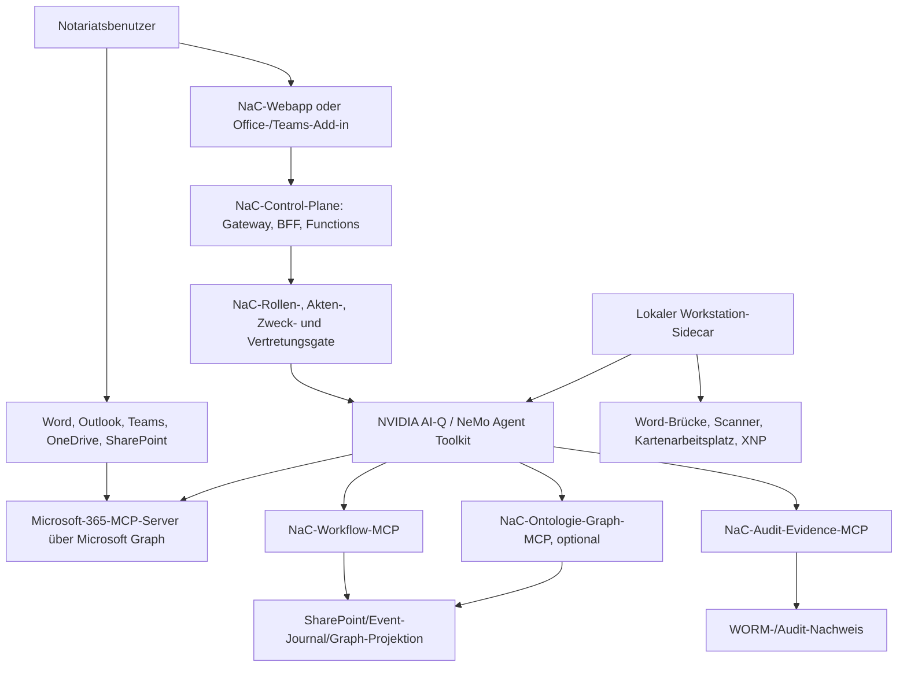

# NeMo Agent Toolkit, AI-Q Und Microsoft-365-MCP-Zielarchitektur

Status: Architekturentscheidung und Integrationsgrenze
Letzte inhaltliche Anpassung: 2026-07-06

## Zweck

Diese Seite legt für NaC fest, wie produktive agentische Workflows,
Microsoft-365-Datenflächen und lokale Arbeitsplatzagenten zusammenspielen.
Sie ergänzt die bestehende
[NaC-On-Prem-Agent-Runtime](nac-onprem-agent-runtime.md): NemoClaw/OpenClaw
bleibt dort Target-Control- und Sandbox-Evidence, ist aber nicht die führende
produktive Agentic-Runtime für neue NaC-Workflows.

## Entscheidung

Das führende agentische Toolkit für NaC ist
[NVIDIA NeMo Agent Toolkit](https://docs.nvidia.com/nemo/agent-toolkit/latest/index.html).
Die bevorzugte Blueprint- und Paketierungsstrecke ist
[NVIDIA AI-Q](https://build.nvidia.com/nvidia/aiq). Andere Agentic-Toolkits
wie CrewAI, LangChain als primäre Runtime, OpenClaw-Runtime-Aktivierung oder
eigene Agent-Frameworks sind für produktive NaC-Agenten gesperrt, solange kein
bewusstes Owner-Gate mit dokumentierter Ausnahme vorliegt.

Diese Entscheidung gilt für:

- Agent-Orchestrierung,
- agentische Workflows,
- Tool-Calling,
- MCP-Client-Bindung,
- Runtime- und Packaging-Entscheidungen für Agenten.

Sie gilt nicht als Verbot für:

- deterministische Python-Validatoren und CLI-Werkzeuge,
- Office-, Word- oder Teams-Add-ins als Benutzeroberfläche,
- schlanke MCP-Server-Adapter in Python,
- Event-Journal-, WORM-, Speicher- und Vault-Schichten,
- lokale Geräte- und Arbeitsplatz-Connectoren.

Damit bleibt Python die führende Sprache für NaC. Java ist für diese Schicht
nicht erforderlich.

## Warum Das Zu NaC Passt

NeMo Agent Toolkit bietet Workflow-Konfiguration, Functions, LLMs, Retriever,
Memory, Object Stores, MCP, API-Server, UI, MCP-Server und FastMCP-Server als
Runtime-Bausteine. Workflows können als MCP-Host externe MCP-Server anbinden,
deren Tools als normale Functions nutzen und lokal gehostete LLMs über NIM,
vLLM oder OpenAI-kompatible APIs verwenden.

AI-Q passt als Blueprint, weil es Agenten für Enterprise-Daten als
komponierbare Workflows, CLI/Web-UI/Async-Job-Modi, Docker-Compose-/Helm-Assets
und MCP-Tool-Integration über NeMo Agent Toolkit vorsieht. Für NaC bedeutet
das: AI-Q ist die Integrations- und Deployment-Schablone, NeMo Agent Toolkit
ist die Runtime- und Tool-Orchestrierung.

Produktiv dürfen NeMo-eigene MCP-Server nicht direkt öffentlich exponiert
werden. Die NeMo-Dokumentation weist darauf hin, dass `nat mcp serve` aktuell
ohne eingebaute Server-Authentifizierung startet. NaC setzt deshalb für
Produktionsverkehr ein authentifizierendes Gateway oder einen BFF mit HTTPS,
OAuth2/JWT oder mTLS vor jeden MCP-Endpunkt. Lokale MCP-Server bleiben an
`localhost` oder an eine explizit kontrollierte Workstation-Grenze gebunden.

## Zielbild

Die dauerhafte Wahrheit liegt nicht im Agenten. Langlaufende Vorgänge werden
als Prozessinstanzen, Ereignisse, Freigaben, Leases und Audit-Metadaten in der
zentralen Runtime-Schicht geführt. Agenten sind wiederholbare Worker, die aus
diesem Zustand lesen, nächste Schritte vorschlagen, freigegebene Tools
aufrufen und ihre Ergebnisse als Ereignisse zurückschreiben.

## Serverless-Und Container-Grenze

Das Zielbild bleibt möglichst serverless:

- API Gateway oder BFF für Browser-, Office- und Teams-Aufrufe,
- Functions für metadata-only APIs, Webhooks, Delta-Sync, Grant-Prüfung und
  kurze Werkzeugaufrufe,
- SharePoint-Listen, ein freigegebener Runtime-Store oder ein späteres
  Event-Journal für Prozessinstanzen, Leases, Rollenbindungen,
  Grant-Metadaten und Audit-Anker,
- Object Store oder private Payload-Schicht für Dokumente,
- Queue/Streaming für idempotente Agent-Jobs,
- Vault für Secrets, Zertifikate und Connector-Credentials.

NeMo/AI-Q selbst sollte als kurzlebiger Worker, Job oder Container laufen,
wenn der Ablauf länger lebt als eine Function, WebSocket/Human-in-the-loop
benötigt, lokale Modelle/GPU braucht oder Tools mit stärkerem
Runtime-Kontext ausführt. Die Regel lautet: Der Workflow-Zustand bleibt
zentral und serverless-kompatibel; der Agent-Prozess darf neu gestartet werden,
ohne fachliche Wahrheit zu verlieren.

## Microsoft-365-Datenpfad

Outlook, Teams, OneDrive und SharePoint bleiben die führenden
Microsoft-365-Arbeitsflächen. NaC kopiert diese Daten nicht pauschal in eine
Agenten-Memory. Der Zugriff läuft über Microsoft Graph und
akten-/zweckgebundene MCP-Server. Wo möglich, werden Delta-APIs, Webhooks,
Pointer, Metadaten und freigegebene Dokument-Handles genutzt; Rohinhalte werden
erst nach NaC-Rollen-, Akten-, Zweck- und Private-Payload-Gate geladen.

Die Architektur folgt damit dem Federated-Connector-Prinzip: regulated content
bleibt in seiner Quelle, und der Agent fragt zur Laufzeit über MCP ab. Für
NaC ist das auch dann die richtige Grenze, wenn Microsoft-365-Copilot später
eigene federierte MCP-Connectoren nutzt.

## Erforderliche MCP-Server

| MCP-Server | Platzierung | Aufgabe | Grenze |
| --- | --- | --- | --- |
| `nac-workflow-mcp` | zentral, serverless oder Container | BPMN, Knowledge Graph, Prozessstatus, nächste Aktionen, Tool-Gates | metadata-only, keine rohen Mandatsdaten |
| `nac-access-grant-mcp` | zentral | Rollen, Aktenbindung, Zweck, Vertretung, befristete Freigaben | Freigabe-Metadaten und Audit; jede Vertretung mit Grund und Dauer |
| `nac-ontology-graph-mcp` | optional zentral | Abgeleitete Graph-Projektion über BPMN, usecase-lokale KGs, SharePoint-Metadaten und Audit-Ereignisse; Omnigraph ist nur eine spätere Backend-Option | read-only Start, keine führende Datenhaltung, keine BPMN-Engine, keine Rohmandatsdaten |
| `m365-mail-calendar-mcp` | zentral oder Workstation-Sidecar | Outlook-Mail, Kalender, Frei/Belegt, Meeting-Kontext über Graph | least privilege, kein Bulk-Export; Senden nur nach menschlicher Freigabe |
| `m365-teams-mcp` | zentral | Teams-Chats, Kanäle, Threads, Meetingnachrichten über Graph | aktengebundene Suche, keine unbeschränkten Chat-Dumps |
| `m365-files-mcp` | zentral | OneDrive, SharePoint-Drives, Dokumentbibliotheken, Listen, Delta/Webhooks | zuerst Pointer/Metadaten; Inhalte nur über Private-Payload-Gate |
| `entra-identity-mcp` | zentral | Entra-ID-Subjekte, Gruppen, App-Rollen, Consent-Evidence | keine Token- oder Roh-Claim-Speicherung |
| `nac-document-mcp` | zentrale private Runtime | Dokumentenumschläge, Hashes, Versionen, Track-Changes-Status, Extraktionsjobs | Rohdokumente nur in freigegebenem privatem Speicher |
| `nac-audit-evidence-mcp` | zentral | Append-only Journal, WORM-Nachweis, Zugriff, Freigabe, Widerruf | redigierte Evidence, keine Secrets, keine Roh-Payload |
| `local-workstation-mcp` | je Arbeitsplatz, WSL-Container oder lokaler Sidecar | Word-Brücke, Scanner/OCR, Kartenarbeitsplatz, XNP-Readiness | lokaler Cache/Outbox; zentrale Wahrheit bleibt Pflicht |
| `nac-office-addin-mcp` | optional lokal oder App-Backend | Word-/Teams-Add-in-Kommandos, falls die UI nicht direkt in NeMo/AI-Q läuft | UI-Kommandos und Dokument-Pointer; Human-in-the-loop |

## Lokaler Betrieb Mit WSL-Containern

Ein lokaler Workflow ist möglich, aber nur mit klarer Synchronisationsgrenze.
Microsoft WSL Containers ist laut WSL-Release 2.9.3 als Public Preview
verfügbar und kann Container, Images, Netzwerke, Volumes und GPU-fähige
Container in WSL verwalten. Das ist für Piloten, lokale Sidecars und
Arbeitsplatzadapter interessant, aber noch keine alleinige
Produktionsgrundlage für regulierte Notariatsworkflows.

Empfohlenes Muster:

- zentraler Prozesszustand, Rollenbindung, Grants, Leases und Audit bleiben in
  der NaC-Control-Plane,
- der lokale Container führt nur Arbeit aus, die lokale Nähe braucht,
- lokale Ergebnisse laufen über eine signierte Outbox,
- jeder Aufruf hat Idempotency-Key, Lease, Version und Zweckbindung,
- Konflikte werden zentral erkannt und menschlich aufgelöst.

Ein vollständig lokaler Workflow mit späterer Synchronisation ist technisch
möglich, aber teurer: Er braucht Event-Sourcing, Konfliktauflösung,
Rollback-Regeln, WORM-Nachweis, Backup, Widerruf und Vertretungsfreigaben auf
jedem Arbeitsplatz. Für NaC ist deshalb der bessere Start: zentrale
serverless Control Plane, lokale Sidecars nur für Arbeitsplatz- und
Dokumentnähe.

## Ausnahmen

Eine Ausnahme gegen NeMo Agent Toolkit ist nur gerechtfertigt, wenn eine
konkrete regulierte Anforderung nicht durch NeMo/AI-Q, Python-Adapter,
MCP-Server oder eine vorgelagerte BFF-/Gateway-Schicht erfüllbar ist. Die
Ausnahme braucht:

- dokumentierten Grund,
- Scope,
- Owner-Gate,
- Sicherheits- und Datenschutzbewertung,
- Rückbau- oder Migrationspfad,
- Validator- oder Contract-Erweiterung.

Ohne diese Ausnahme bleiben CrewAI, LangChain als führende Runtime,
OpenClaw-Runtime-Aktivierung und eigene Agent-Frameworks für produktive
NaC-Agenten gesperrt.

## Nächste Umsetzungsschritte

1. NeMo/AI-Q als einzige produktive Agentic-Runtime im Runtime-Vertrag führen.
2. Die oben genannten MCP-Server zunächst als Python-Adapter mit
   metadata-only Tools schneiden.
3. Einen ersten Vorgang, etwa Immobilienkaufvertrag, als NeMo-Workflow gegen
   `nac-workflow-mcp`, `nac-access-grant-mcp` und `nac-audit-evidence-mcp`
   ausführen.
4. Omnigraph nur als optionale Projektion nach
   [omnigraph-ontology-projection.md](omnigraph-ontology-projection.md)
   evaluieren; nicht als MVP-Store, nicht als BPMN-Engine.
5. Microsoft-365-Zugriffe zuerst read-only, least privilege und
   aktengebunden über Graph prüfen.
6. Workstation-Sidecar für Word-/Track-Changes-, Scanner-, Karten- und
   XNP-nahe Funktionen getrennt von der zentralen Wahrheit bauen.
7. Schreibende Microsoft-365- und Dokumentoperationen erst nach
   Human-in-the-loop, Audit und Owner-Gate aktivieren.
