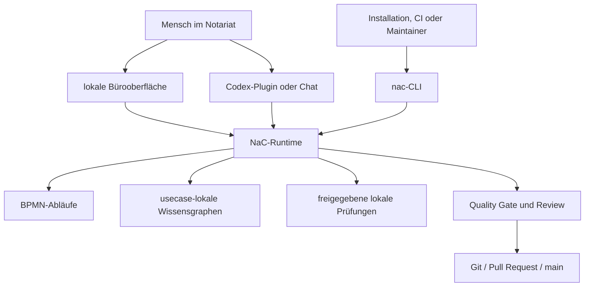

# Ausführungsmodell: Bürooberfläche Vorne, Prüfbarer Kern Dahinter

NaC wird als ausführbare Software für das Notariat entwickelt. Die sichtbare
Bedienung soll für fachliche Nutzer verständlich sein: lokale Bürooberfläche,
Codex-Plugins, Checklisten, Ablaufansichten, BPMN-Bearbeitung und geführte
Prüfungen.

Dahinter liegt eine technische Ausführungsschicht. Sie heißt `nac` und sorgt
davor, dass dieselben Vorgänge lokal, nachvollziehbar, automatisierbar und im
Quality Gate prüfbar bleiben.

## Drei Schichten

| Schicht | Aufgabe | Wer Sie Typisch Nutzt |
| --- | --- | --- |
| Sichtbare Bedienung | Vorgänge auswählen, Abläufe ansehen, Checklisten bearbeiten, lokale Tests starten. | Notar, Sachbearbeitung, Büroorganisation. |
| Technische Ausführung | Dieselben Aktionen als eindeutige, wiederholbare NaC-Aufträge ausführen. | lokale Installation, Codex-Plugin, CI, Maintainer. |
| Governance und Nachweis | Regeln, Validierungen, Review, Lizenz, Audit und Merge nachvollziehbar halten. | Owner, technische Dienstleister, Prüfer, externe Bewertung. |

## Agentische Betriebsschicht Und Semi-Ausführbarer Stack

NaC folgt hier einem neueren Verständnis von agentischem Software Engineering:
Nicht nur Code ist ein technisches Artefakt. Auch Prompts, BPMN-Modelle,
Workflow-Verträge, Plugin-Aufrufe, Guardrails, Freigaberegeln, Rollen,
Datenschutzgrenzen, QMS-Nachweise und Issue-/Gantt-Steuerung prägen das
Systemverhalten.

Diese Artefakte sind semi-ausführbar: Sie steuern Arbeit, aber nicht immer wie
klassischer Programmcode vollständig deterministisch. Manche Teile werden von
Python ausgeführt, manche von Codex oder einem Plugin interpretiert, manche
brauchen fachliche Entscheidung, Review oder Freigabe. Genau deshalb müssen sie
in NaC versioniert, lesbar, prüfbar und an `nac` angebunden sein.

| Ring | NaC-Entsprechung | Regel |
| --- | --- | --- |
| Ausführbarer Code | Python-Runtime, CLI, Validatoren, Tests, Schemas. | Muss deterministisch prüfbar sein. |
| Anweisungen und Spezifikationen | Markdown, Prompts, Usecase-KG, BPMN-Beschreibungen. | Deutsch führt fachlich; Änderungen brauchen Sprach- und Link-Parität. |
| Orchestrierte Abläufe | Codex-Plugins, `nac`-Befehle, Import-Jobs, BPMN-Workflows. | Jede neue Funktion braucht eine prüfbare Bedienkante. |
| Kontrollen | Datenschutz-Policy, Secret-Scan, Quality Gate, Rollen- und Freigaberegeln. | Abschluss erst nach frischer Verifikation. |
| Operative Logik | Issue-Betrieb, Gantt, QMS, Akten- und Nachweisentscheidungen. | Muss für Owner, Büro und Prüfer nachvollziehbar bleiben. |
| Institutionelle Passung | BRAO, DSGVO, EU AI Act, Notariatsbetrieb, ISO-9001-Zielbild. | Kein produktiver Pfad ohne fachliche und rechtliche Freigabe. |

Review-Hinweis: Der Begriff des "Semi-Executable Stack" stammt aus dem Paper
[The Semi-Executable Stack: Agentic Software Engineering and the Expanding Scope of SE](https://arxiv.org/abs/2604.15468).
Der deutschsprachige Anlassartikel ist
[Forscher: KI-Agenten machen Entwickler nicht überflüssig, sondern bringen neue Disziplinen](https://the-decoder.de/forscher-ki-agenten-machen-entwickler-nicht-ueberfluessig-sondern-bringen-neue-disziplinen/).
Für NaC folgt daraus: Code ist nicht nur Ergebnis, sondern Betriebsschicht;
Regeln, Workflows und Nachweise sind Teil derselben technischen Verantwortung.

## Was Bedeutet CLI?

CLI steht für "Command Line Interface", also Kommandozeilen-Schnittstelle. In
NaC ist das nicht als Alltagsoberfläche für Notare gemeint.

Eine CLI ist ein eindeutig benannter Auftrag an die Software. Derselbe Auftrag
kann von einer Schaltfläche, einem Plugin, einer Automation oder direkt im
Terminal gestartet werden. Beispiel:

```bash
python scripts/nac.py status
```

Der fachliche Nutzer soll nicht Befehle auswendig lernen müssen. Der Wert der
CLI liegt darin, dass ein sichtbarer Klick und ein automatisierter Prüflauf am
Ende dieselbe geprüfte NaC-Runtime verwenden.

## Heutiges Produktbild



## Warum Das Elegant Ist

| Grund | Bedeutung |
| --- | --- |
| Verständliche Bedienung | Die Bürooberfläche kann fachlich formulieren, was passiert, ohne technische Details in den Vordergrund zu stellen. |
| Wiederholbare Ausführung | Dieselbe Aktion bleibt lokal, im Plugin und in CI technisch gleich prüfbar. |
| Einfach einzuführen | Python und Git laufen auf vielen Arbeitsplätzen und Servern; eine zentrale Cloud-App ist nicht Voraussetzung. |
| Gut für sensible Daten | NaC kann lokal am Arbeitsplatz laufen; PINs, Kartendaten und Mandatsgeheimnisse gehören nicht in Git. |
| Automatisierbar | GitHub Actions, Codex-Plugins, lokale Schaltflächen und spätere Apps können dieselbe Runtime aufrufen. |
| UI-fähig ohne Lock-in | Die Oberfläche darf wachsen, ohne dass die fachliche Logik in einer einzelnen Maske verschwindet. |
| Auditierbar | Auftrag, Eingabe, Ergebnis, Review und Merge lassen sich versioniert nachvollziehen. |

## Warum Trotzdem Eine Technische Kante?

Eine reine Oberfläche wirkt zunächst einfacher, kann aber die fachliche Logik in
Klickwegen verstecken. NaC muss auch erklären und beweisen können:

1. Welche Vorgangstypen gibt es?
2. Welche offenen Angaben, Dokumente, Entscheidungen und Freigaben sind nötig?
3. Welche Daten dürfen nicht in Git oder externe Dienste?
4. Welche lokalen Prüfungen sind freigegeben?
5. Welche menschliche Freigabe bleibt erforderlich?

Die sichtbare Oberfläche führt durch diese Fragen. `nac` macht die Ausführung
dahinter eindeutig prüfbar.

## Mobile Mandanten-App Und Sichere Links

Für angemeldete Beteiligte soll zusätzlich eine mobile App möglich sein, zum
Beispiel als Demo-App `n8-demonotariat` im iOS-App-Store. Die App ist keine
fachliche Wahrheitsschicht, sondern eine sichere Bedienkante für einzelne
freigegebene Vorgänge.

Ein Nutzer kann nach Authentifizierung und Freigabe einen sicheren Link
erhalten, um Dokumente hochzuladen oder seine aktuellen Akten zu sehen. Der
Link darf nur kurzlebig, mandanten- und aktengebunden, widerrufbar und
zweckgebunden sein. Als technische Zielorte kommen je nach Betriebsmodell ein
Object Store, ein Datenbank-Blob oder OneDrive in Betracht. NaC speichert dazu
nicht den geheimen Link oder Rohinhalt im Produktrepo, sondern nur Metadaten,
Hash, Zweck, Ablaufzeit, Aktenbezug, Freigabestatus und Auditereignis. Das
detaillierte Zielbild steht im
[Authenticated-Webapp-Betriebsmodell](authenticated-webapp-operating-model.md).

Uploads aus der App landen zuerst in einem Eingang oder Importvorschlag. Erst
nach menschlicher Prüfung, Rollenprüfung und gegebenenfalls Vier-Augen-Freigabe
werden sie einer Akte zugeordnet. Leserechte auf Akten bleiben Rollen-,
Vorgangs- und Mandantenregeln unterworfen; ein mobiler Link ersetzt keine
NaC-Autorisierung.

## Heute, Pilot, Später

| Ebene | Stand | Rolle |
| --- | --- | --- |
| Lokale Operator-Webapp | Heute nutzbar | Startet als Bürooberfläche über `python scripts/nac.py operator --open` und zeigt Vorgänge, Checklisten, BPMN, KG-Ansichten und Arbeitsplatztests. |
| Zentrale `nac`-CLI und Python-Runtime | Heute nutzbar | Prüft KG, BPMN, Konfiguration, Status, Editor-View, Plugins und Quality Gates. |
| Codex-Plugins | Pilotfähig | Führen lokale Readiness-, Plan- und Nachweisprüfungen geführt aus. |
| GitHub Actions | Heute nutzbar | Führen Gates und Validierungen reproduzierbar aus. |
| BPMN-js Business Layer | Erstes Profil vorhanden | Visuelle BPMN-Bearbeitung für fachliche Abläufe; Python prüft das Modell vor Merge. |
| Lokaler Webserver | Heute nutzbar | Zeigt BPMN- und KG-Ansichten lokal im Browser, ohne Cloud und ohne echte Mandatsdaten. |
| Sidecar-Editor | Geplant | Grafische Bedienung für KG-Formulare und Checklisten. |
| ChatGPT-App oder Workspace-App | Geplant | Komfortable Bedienoberfläche für berechtigte Nutzer auf Basis einer geprüften `nac-mcp`-Werkzeugschicht; Custom-GPT-Actions mit Tunnel bleiben ein Demo-Pfad für synthetische Daten. |
| Mobile Mandanten-/Beteiligten-App | Geplant | Ermöglicht nach Authentifizierung sichere Upload- oder Aktenlese-Links auf Object Store, Datenbank-Blob oder OneDrive, mit NaC-Audit und nachgelagerter fachlicher Freigabe. |
| Eigenständige NaC-Web-App | Möglich | Sinnvoll, sobald Runtime, Rollen, Rechte und Gates stabil genug für breitere Nutzung sind. |

## Merksatz

NaC ist keine reine Dokumentation und kein Terminalprodukt. NaC ist eine lokale,
ausführbare Bürosoftware mit sichtbarer Bedienung und einem prüfbaren Kern.

Neue NaC-Funktionalität braucht deshalb zwei Dinge: eine verständliche
Bedienung für den fachlichen Kontext und eine eindeutige Ausführung über `nac`
oder die NaC-Runtime. Alte Skriptnamen können intern oder kompatibel bleiben;
die Produktdokumentation soll den verständlichen NaC-Weg zeigen.

## Nächste Dokumente

- [docs/de/notar-start.md](notar-start.md)
- [docs/de/cli.md](cli.md)
- [docs/de/betriebsstart.md](betriebsstart.md)
- [docs/de/integration-start.md](integration-start.md)
- [docs/de/authenticated-webapp-operating-model.md](authenticated-webapp-operating-model.md)
- [docs/de/kg-editor-workstream.md](kg-editor-workstream.md)
- [docs/de/bpmn-js-business-layer.md](bpmn-js-business-layer.md)
- [docs/de/lokaler-webserver.md](lokaler-webserver.md)
- [workflows/python/README.md](../../workflows/python/README.md)
