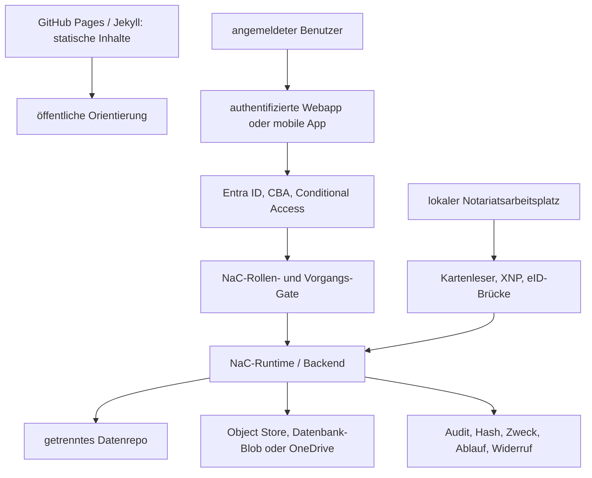

# Authenticated-Webapp-Betriebsmodell

Dieses Zielbild beschreibt, wie öffentliche statische Inhalte, echte
angemeldete Benutzer, lokale Notariatsarbeitsplätze und mobile
Beteiligtenzugänge in NaC zusammenspielen sollen.

## Grundentscheidung

GitHub Pages mit einem Jekyll-/Hydra-ähnlichen Theme ist sinnvoll für
öffentliche, statische Inhalte:

- Produktkommunikation,
- Dokumentation,
- Onboarding,
- Release- und Statushinweise,
- synthetische Demos ohne Mandatsdaten.

Diese statische Schicht darf keine fachliche Wahrheit und keine echten
Vorgangsdaten halten. Sie ist die öffentliche Lesefläche, nicht der Ort für
Anmeldung, Aktenzugriff, Uploads, Signatur, Kartenleser oder Freigaben.

Echte Vorgänge angemeldeter Benutzer brauchen eine getrennte authentifizierte
Webapp oder mobile App. Diese Bedienkante ruft geprüfte NaC-Runtime- und
Backend-Dienste auf, schreibt Nachweise kontrolliert und bleibt durch Policies,
Rollen, Verträge und `nac`-Validierung begrenzt.

## Zielarchitektur



Die statische Seite kann auf die authentifizierte Webapp verlinken. Sie darf
aber keine Tokens, geheimen Uploadlinks, Rohdokumente, Ausweisdaten,
Zertifikatsmaterialien oder Mandatsinhalte ausliefern.

Für externe juristische Recherche- und MCP-Anbindungen darf die Webapp zunächst
nur einen Status- und Prüfbacklog anzeigen. Der
[Legal-Research-Connector-Backlog](plugin-plans/legal-research-connectors.md)
trennt Quelle, Lizenzstatus, AVV-/AI-SBOM-Prüfung, Sicherheitsgrenze und
nächsten Review-Schritt, ohne daraus schon eine Produktintegration zu machen.

## Identität Und Autorisierung

Entra ID ist als erste Unternehmens-Identitätsschicht sinnvoll. Für
Notariats- und interne Benutzer sollte geprüft werden, ob Entra ID mit
Certificate-Based Authentication, Conditional Access und KeyCards oder
Smartcards die Anmeldung absichern kann.

Diese Prüfung beantwortet nur die Frage, ob eine Person oder ein Gerät
vertrauenswürdig angemeldet ist. Die fachliche Berechtigung entsteht danach im
NaC-Rollen- und Vorgangs-Gate:

- Rolle im Notariat,
- Mandant- oder Tenant-Bindung,
- Akten- und Vorgangsbezug,
- Zweck des Zugriffs,
- Freigabestatus,
- Vier-Augen-Pflicht für sensible Schritte.

XNP- und digitale-Ausweis-Pfade mit Kartenleser bleiben lokale
Arbeitsplatz-Gates. Sie können Identitäts- oder Readiness-Nachweise liefern,
ersetzen aber keine NaC-Autorisierung und speichern keine PINs, Kartendaten,
Ausweisrohdaten oder Zertifikatsgeheimnisse im Repository.

## Mobile App Und Sichere Links

Eine mobile App wie `n8-demonotariat` kann als Beteiligten- oder
Mandanten-App dienen. Nach Anmeldung und Freigabe erhält der Benutzer keinen
pauschalen Zugriff auf NaC, sondern nur einen eng begrenzten sicheren Link.

Consumer-ChatGPT, nicht bezahlte Accounts oder nicht EU-residente
ChatGPT-Zugänge sind kein Mandanten-Gateway. Ein Mandant darf sein
Personalausweisfoto, Mandatsdokument oder sonstiges Rohdokument nicht an einen
solchen Chat schicken, damit es anschließend in einen Enterprise Workspace
weitergereicht wird. Dieser Umweg wäre nicht aktengebunden, nicht zuverlässig
widerrufbar und nicht als NaC-Auditpfad prüffähig.

Der erste Produktpfad ist deshalb:

1. NaC-Backend erzeugt einen sicheren Link mit Zweck, Ablauf,
   Aktenbindung und Widerruf.
2. Mandant öffnet eine mobile Web-App oder PWA; eine native iOS-/Android-App
   kommt erst für NFC-eID, Push, Device Binding, Liveness-Prüfung,
   Offline-Fähigkeit oder App-Store-Vertrauen hinzu.
3. Datei oder Foto landet zuerst in einem EU-kontrollierten Speicherziel.
4. Optional verarbeitet ein serverseitiges Backend Metadaten oder Extraktionen
   über freigegebene Dienste, etwa OpenAI API Europe mit
   `https://eu.api.openai.com`; Mobilgeräte erhalten dabei keine API-Keys.
5. Interne Benutzer prüfen den Eingang über die NaC-Webapp oder einen
   freigegebenen Enterprise-Workspace-Connector.

Zulässige Linkziele sind:

- Upload in einen Object Store,
- Upload in einen Datenbank-Blob,
- Upload oder Lesesicht in OneDrive,
- read-only Ansicht aktueller Akteninformationen, soweit der Vorgang dies
  zulässt.

Jeder Link muss kurzlebig, widerrufbar, mandanten-, akten- und
zweckgebunden sein. NaC speichert im Produktrepo nur Nachweise wie Hash,
Speicherzielklasse, Aktenbindung, Ablaufzeit, ausstellende Rolle,
Freigabestatus und Auditereignis. Der geheime Link selbst, Access Tokens und
Rohdokumente gehören nicht in Git.

Uploads aus der App landen zuerst in einem Eingang oder Importvorschlag. Erst
nach menschlicher Prüfung, Rollenprüfung und gegebenenfalls Vier-Augen-Freigabe
werden sie einer Akte zugeordnet.

## Prüffähige Grenze

Die minimale technische Grenze steht im
[Secure-Document-Link-Vertrag](../../workflows/contracts/secure-document-link.contract.json)
und wird über die zentrale NaC-CLI geprüft:

```bash
nac contracts validate
```

Der Vertrag verlangt Zweck, Ablauf, Aktenbindung, Speicherziel, Widerruf und
Auditnachweis. Damit ist die mobile oder authentifizierte Webapp nicht nur eine
Produktidee, sondern ein prüfbarer NaC-Artefaktpfad.

## Umsetzungsreihenfolge

1. Statische GitHub-Pages-Schicht für öffentliche Inhalte und synthetische
   Demos weiter nutzen.
2. Interne authentifizierte Webapp für Notariatsbenutzer über Entra ID und
   NaC-Rollen-Gate entwerfen.
3. Consumer-ChatGPT ausdrücklich nicht als Mandanten-Upload-Gateway zulassen.
4. Kartenleser-, XNP- und eID-Pfade nur lokal über das Profil
   `notary-workstation` prüfen.
5. Mobile Web-App oder PWA zuerst über kurzlebige sichere Links an
   Speicherziele anbinden; native Apps nur bei konkretem Gerätebedarf bauen.
6. Uploads immer erst als Eingang oder Importvorschlag behandeln.
7. Vertrag, Validator, Audit und menschliche Freigabe vor produktiven Links
   verpflichtend machen.
