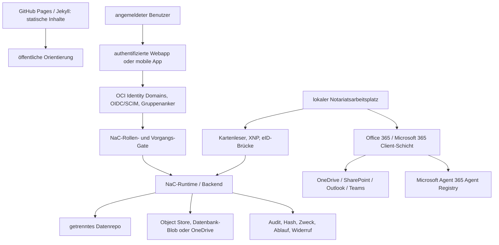

# Authenticated-Webapp-Betriebsmodell

Dieses Zielbild beschreibt, wie öffentliche statische Inhalte, echte
angemeldete Benutzer, lokale Notariatsarbeitsplätze und mobile
Beteiligtenzugänge in NaC zusammenspielen sollen.

## Grundentscheidung

GitHub Pages mit einem Jekyll-/Hydra-ähnlichen Theme ist sinnvoll für
öffentliche, statische Inhalte:

- Produktkommunikation,
- Dokumentation,
- Onboarding,
- Release- und Statushinweise,
- synthetische Demos ohne Mandatsdaten.

Diese statische Schicht darf keine fachliche Wahrheit und keine echten
Vorgangsdaten halten. Sie ist die öffentliche Lesefläche, nicht der Ort für
Anmeldung, Aktenzugriff, Uploads, Signatur, Kartenleser oder Freigaben.

Echte Vorgänge angemeldeter Benutzer brauchen eine getrennte authentifizierte
Webapp oder mobile App. Diese Bedienkante ruft geprüfte NaC-Runtime- und
Backend-Dienste auf, schreibt Nachweise kontrolliert und bleibt durch Policies,
Rollen, Verträge und `nac`-Validierung begrenzt.

## Zielarchitektur



Office 365 ist auf der Client-Seite Pflicht. Für NaC bedeutet das nicht, dass
die SaaS-Identität oder das aktuelle OCI-Deployment umgestellt werden. Office
365 bildet die verpflichtende Arbeitsplatz-, Dokumenten-, Kalender-,
Kommunikations- und Kollaborationsschicht des Notariats; NaC darf deshalb
OneDrive, SharePoint, Outlook, Teams und künftige Microsoft-365-Features als
Client-nahe Integrationsziele vorsehen, muss aber jeden Zugriff über
NaC-Rollen, Aktenbindung, Zweckbindung, Audit und menschliche Freigaben
begrenzen.

Microsoft Agent 365 Agent Registry wird als Zielarchitektur-Baustein für
Agent-Governance aufgenommen. Die laut Microsoft Learn als Vorschau geführte
Agent Registry Sync-Funktion im Microsoft 365 Admin Center soll zentrale
Sichtbarkeit und Governance für Agents aus externen KI-Agent-Umgebungen
ermöglichen. Die Quelle nennt als unterstützte Plattformen Amazon Bedrock,
Google Vertex AI, Salesforce Agentforce und Databricks Genie. Für NaC ist das
kein aktueller Deploy-Schritt und keine produktive Pflichtintegration, sondern
ein künftiger Kontrollanker: Wenn NaC-Agenten, MCP-Connectoren oder externe
Agent-Plattformen produktiv angebunden werden, muss ihre Registrierung,
Sichtbarkeit, Verantwortlichkeit und Deaktivierbarkeit mit der
Microsoft-365-Agent-Governance abgeglichen werden.

Die statische Seite kann auf die authentifizierte Webapp verlinken. Sie darf
aber keine Tokens, geheimen Uploadlinks, Rohdokumente, Ausweisdaten,
Zertifikatsmaterialien oder Mandatsinhalte ausliefern.

Für externe juristische Recherche- und MCP-Anbindungen darf die Webapp zunächst
nur einen Status- und Prüfbacklog anzeigen. Der
[Legal-Research-Connector-Backlog](plugin-plans/legal-research-connectors.md)
trennt Quelle, Lizenzstatus, AVV-/AI-SBOM-Prüfung, Sicherheitsgrenze und
nächsten Review-Schritt, ohne daraus schon eine Produktintegration zu machen.

## Identität Und Autorisierung

Oracle OCI Identity Domains ist für diesen SaaS-Pfad die produktive
Identitätsschicht. Der öffentliche Übergang von `www-n8` in die NaC-App läuft
tenant-aware: Bestandskunden übergeben einen Tenant-Hinweis, Neukunden werden
zuerst über eine Domain-Readiness-Prüfung geführt. Danach erzeugt NaC einen
prüfbaren Admin-Provisioning-Plan für OCI Identity Domains.

Office 365 ergänzt diesen Pfad auf der Client- und Arbeitsplatzseite. OCI
Identity Domains bleibt für den aktuellen SaaS-Pfad die IdP- und
Tenant-Provisioning-Schicht; Microsoft 365 liefert Arbeitsplatzdienste und
Agent-Governance, solange eine separate, reviewte IdP-Änderung nichts anderes
entscheidet.

Endbenutzer arbeiten nicht in der OCI Console. NaC bedient Identity Domains
über geprüfte API- und CLI-Verträge; produktive Schreiboperationen an
Benutzern, Gruppen oder Mitgliedschaften brauchen vor dem Apply einen
separaten Owner-Review und eine ausdrückliche Freigabe.

Die IdP-Anmeldung beantwortet nur die Frage, ob eine Person vertrauenswürdig
angemeldet ist. Die fachliche Berechtigung entsteht danach im
NaC-Rollen- und Vorgangs-Gate:

- Rolle im Notariat,
- Mandant- oder Tenant-Bindung,
- Akten- und Vorgangsbezug,
- Zweck des Zugriffs,
- Freigabestatus,
- Vier-Augen-Pflicht für sensible Schritte.

Der erste NaC-App-Einstieg nutzt deshalb einen Login-Intent-Contract statt
einer impliziten Anmeldung. NaC baut den OIDC-Redirect zu OCI Identity Domains
über `/.well-known/openid-configuration` und `/oauth2/v1/authorize`, verlangt
serverseitig erzeugte `state`- und `nonce`-Werte und hält `tenant_hint` nur als
Kontext. Der Hinweis darf nicht in Rollen, Gruppen, Aktenzugriff oder OCI-Write
übersetzt werden.

Der Auth-Callback ist in diesem Modell noch kein erfolgreicher Login. Er ist
zuerst ein geschlossenes Zwischenereignis mit eigenem
`nac.auth-callback/v0.1`-Vertrag: `code`, `state` und Fehlerdetails werden
nicht angezeigt, nicht in Kundentexte übernommen und nicht als Berechtigung
ausgelegt. Ohne konfigurierte serverseitige State-Prüfung und Token-Austausch
bleibt der notariat8-Arbeitsbereich geschlossen; erst danach darf das
NaC-Rollen- und Vorgangs-Gate entscheiden.

Der Token-Austausch ist als serverseitiger Adapter vorbereitet. Er nimmt Code
und Client-Secret nur intern entgegen, gibt keine Roh-Tokens zurück und liefert
erst nach ID-Token-Verifikation Claims an das notariat8-Rollengate. Fehlen
Secret, Metadaten oder Verifier, bleibt die Anmeldung geschlossen.

Der zustandsbehaftete Auth-Callback ist mit diesem Adapter verbunden, bleibt
aber fail-closed: Secret-Lesen und Token-Austausch starten nur nach gültigem
State, vorhandenem Authorization Code, vollständigen OIDC-Metadaten und
konfigurierter serverseitiger ID-Token-Prüfung. Bei positivem
notariat8-Rollengate darf ein kurzlebiges, signiertes Session-Cookie gesetzt
werden; Tokens, Claims, Nonces, Providerdetails und Callback-Werte bleiben aus
dem Cookie heraus. Ein Arbeitsbereich wird in diesem Stand weiterhin nicht
geöffnet.

Die nächste Q2J-Grenze prüft dieses signierte Session-Cookie vor `/workspace`.
Ein gültiges Cookie öffnet nur eine geschützte notariat8-Start-/Statusseite;
Mandatsdaten werden nicht geladen und der vollständige Arbeitsbereich bleibt
geschlossen. Fehlende, manipulierte, abgelaufene oder unkonfigurierte Cookies
führen zur Anmeldeseite.

Q2Q definiert die nächste fachliche Grenze vor jedem Pfad jenseits dieses
Startstatus: geprüfte Session plus fachliche Rolle, Tenant-Bindung,
Vorgangsbindung und Zweckbindung. Der Vertrag öffnet zunächst nur geschützte
Status-Metadaten; Rohdaten, Dokumente und vollständige Arbeitsbereiche bleiben
geschlossen. Für sensible Schritte kann das Gate eine Vier-Augen-Freigabe als
zusätzliche Bedingung verlangen.

Die operative Grenze für signierte State-Werte und Callback-Logs steht in
[OIDC State- und Log-Grenze](operations/oidc-state-log-boundary.md).

XNP- und digitale-Ausweis-Pfade mit Kartenleser bleiben lokale
Arbeitsplatz-Gates. Sie können Identitäts- oder Readiness-Nachweise liefern,
ersetzen aber weder OCI-Login noch NaC-Autorisierung und speichern keine PINs,
Kartendaten, Ausweisrohdaten oder Zertifikatsgeheimnisse im Repository.

## Mobile App Und Sichere Links

Eine mobile App wie `n8-demonotariat` kann als Beteiligten- oder
Mandanten-App dienen. Nach Anmeldung und Freigabe erhält der Benutzer keinen
pauschalen Zugriff auf NaC, sondern nur einen eng begrenzten sicheren Link.

Consumer-ChatGPT, nicht bezahlte Accounts oder nicht EU-residente
ChatGPT-Zugänge sind kein Mandanten-Gateway. Ein Mandant darf sein
Personalausweisfoto, Mandatsdokument oder sonstiges Rohdokument nicht an einen
solchen Chat schicken, damit es anschließend in einen Enterprise Workspace
weitergereicht wird. Dieser Umweg wäre nicht aktengebunden, nicht zuverlässig
widerrufbar und nicht als NaC-Auditpfad prüffähig.

Der erste Produktpfad ist deshalb:

1. NaC-Backend erzeugt einen sicheren Link mit Zweck, Ablauf,
   Aktenbindung und Widerruf.
2. Mandant öffnet eine mobile Web-App oder PWA; eine native iOS-/Android-App
   kommt erst für NFC-eID, Push, Device Binding, Liveness-Prüfung,
   Offline-Fähigkeit oder App-Store-Vertrauen hinzu.
3. Datei oder Foto landet zuerst in einem EU-kontrollierten Speicherziel.
4. Optional verarbeitet ein serverseitiges Backend Metadaten oder Extraktionen
   über freigegebene Dienste, etwa OpenAI API Europe mit
   `https://eu.api.openai.com`; Mobilgeräte erhalten dabei keine API-Keys.
5. Interne Benutzer prüfen den Eingang über die NaC-Webapp oder einen
   freigegebenen Enterprise-Workspace-Connector.

Zulässige Linkziele sind:

- Upload in einen Object Store,
- Upload in einen Datenbank-Blob,
- Upload oder Lesesicht in OneDrive,
- read-only Ansicht aktueller Akteninformationen, soweit der Vorgang dies
  zulässt.

Jeder Link muss kurzlebig, widerrufbar, mandanten-, akten- und
zweckgebunden sein. NaC speichert im Produktrepo nur Nachweise wie Hash,
Speicherzielklasse, Aktenbindung, Ablaufzeit, ausstellende Rolle,
Freigabestatus und Auditereignis. Der geheime Link selbst, Access Tokens und
Rohdokumente gehören nicht in Git.

Uploads aus der App landen zuerst in einem Eingang oder Importvorschlag. Erst
nach menschlicher Prüfung, Rollenprüfung und gegebenenfalls Vier-Augen-Freigabe
werden sie einer Akte zugeordnet.

## Prüffähige Grenze

Die minimale technische Grenze steht im
[Secure-Document-Link-Vertrag](../../workflows/contracts/secure-document-link.contract.json)
und wird über die zentrale NaC-CLI geprüft:

```bash
nac contracts validate
```

Der Vertrag verlangt Zweck, Ablauf, Aktenbindung, Speicherziel, Widerruf und
Auditnachweis. Damit ist die mobile oder authentifizierte Webapp nicht nur eine
Produktidee, sondern ein prüfbarer NaC-Artefaktpfad.

## Umsetzungsreihenfolge

1. Statische GitHub-Pages-Schicht für öffentliche Inhalte und synthetische
   Demos weiter nutzen.
2. Interne authentifizierte Webapp für Notariatsbenutzer über OCI Identity
   Domains und NaC-Rollen-Gate entwerfen.
3. Office 365 als verpflichtende Client-Schicht und Microsoft Agent 365 Agent
   Registry als Preview-Governance-Anker in Zielarchitektur und Backlog
   führen.
4. Consumer-ChatGPT ausdrücklich nicht als Mandanten-Upload-Gateway zulassen.
5. Kartenleser-, XNP- und eID-Pfade nur lokal über das Profil
   `notary-workstation` prüfen.
6. Mobile Web-App oder PWA zuerst über kurzlebige sichere Links an
   Speicherziele anbinden; native Apps nur bei konkretem Gerätebedarf bauen.
7. Uploads immer erst als Eingang oder Importvorschlag behandeln.
8. Vertrag, Validator, Audit und menschliche Freigabe vor produktiven Links
   verpflichtend machen.
