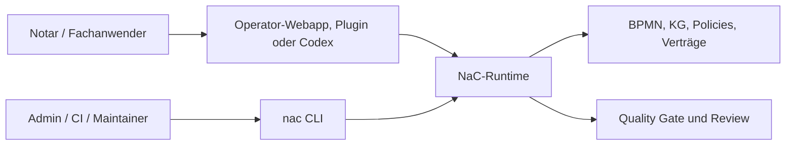

# NaC-CLI: Technische Steuerfläche Hinter Der Bürooberfläche

Status: erste zentrale CLI umgesetzt am 2026-05-19

## Idee

Die NaC-CLI ist nicht die Produktoberfläche für das Notariat. Sie ist die
technische Steuer- und Prüfschicht hinter der lokalen Bürooberfläche, hinter
Codex-Plugins und hinter späteren Automatisierungen.

Für fachliche Nutzer beginnt NaC mit der lokalen Operator-Webapp:

```bash
python scripts/nac.py operator --open
```

Die CLI bleibt wichtig, weil sie dieselben Prüfungen reproduzierbar macht:
Status, Quality Gate, BPMN, Knowledge Graphs, Plugins und Konfigurationen.

Der gemeinsame Einstieg heißt:

```bash
nac
```

Ohne Installation kann derselbe Einstieg direkt aus dem Repo gestartet werden:

```bash
python scripts/nac.py status
```

Nach einer lokalen Installation aus dem Repo steht der kurze Befehl bereit:

```bash
python -m pip install -e .
nac status
```

## Warum Das Für Nicht-Techniker Trotzdem Relevant Ist

Eine CLI ist ein klar benannter Arbeitsauftrag an den Computer. Ein Notar muss
diese Befehle nicht auswendig können. Aber das Büro profitiert davon, dass
jeder Button, jeder Plugin-Aufruf und jeder automatische Check auf eine
prüfbare technische Handlung zurückgeführt werden kann.

| Frage | Antwort |
| --- | --- |
| Muss der Notar Befehle auswendig können? | Nein. Der sichtbare Einstieg ist die Bürooberfläche; die CLI ist die technische Prüffläche dahinter. |
| Warum nicht nur Web-UI? | Eine reine UI kann Logik verstecken. Die CLI macht Prüfungen, Ergebnisse und Wiederholung sichtbar. |
| Warum ist das zukunftsfähig? | Lokale Webapp, Codex-Plugin, CI und spätere Apps können dieselbe geprüfte Runtime nutzen. |
| Was wird protokollierbar? | Befehl, Eingabe, Ergebnis, Review und Git-Änderung. |

## Erste Befehle

```bash
python scripts/nac.py status
python scripts/nac.py doctor --profile strict
python scripts/nac.py web
python scripts/nac.py kg status
python scripts/nac.py kg cost-view immobilienkaufvertrag
python scripts/nac.py kg workflow-contract immobilienkaufvertrag
python scripts/nac.py kg pilot-checklist online-gmbh-gruendung
python scripts/nac.py legal-graph status
python scripts/nac.py legal-graph model-card-proposal
python scripts/nac.py legal-graph ai-sbom-delta-proposal
python scripts/nac.py ai-sbom export-mapping
python scripts/nac.py gnotkg quote --business-value 500000 --table A --fee-rate 1.0 --kv-number 21100
python scripts/nac.py bpmn validate
python scripts/nac.py config list
python scripts/nac.py m365 teams-sharepoint privileged-plan --format json
python scripts/nac.py m365 teams-sharepoint runtime-smoke --owner-approved --format json
python scripts/nac.py m365 teams-sharepoint runtime-metadata --owner-approved --format json
python scripts/nac.py plugins actions
python scripts/nac.py tenant domain-check --domain kanzlei-notariat.example --tenant-slug kanzlei-notariat --admin-email admin@kanzlei-notariat.example
python scripts/nac.py import jobs status --repo ../demo8notariat
python scripts/nac.py time-ledger summary
```

Nach Installation entsprechend:

```bash
nac status
nac doctor --profile strict
nac web
nac kg status
nac kg cost-view immobilienkaufvertrag
nac kg workflow-contract immobilienkaufvertrag
nac kg pilot-checklist online-gmbh-gruendung
nac legal-graph status
nac legal-graph model-card-proposal
nac legal-graph ai-sbom-delta-proposal
nac ai-sbom export-mapping
nac gnotkg quote --business-value 500000 --table A --fee-rate 1.0 --kv-number 21100
nac bpmn validate
nac config list
nac m365 teams-sharepoint privileged-plan --format json
nac m365 teams-sharepoint runtime-smoke --owner-approved --format json
nac m365 teams-sharepoint runtime-metadata --owner-approved --format json
nac plugins actions
nac tenant domain-check --domain kanzlei-notariat.example --tenant-slug kanzlei-notariat --admin-email admin@kanzlei-notariat.example
nac tenant customer-plan --domain kanzlei-notariat.example --tenant-slug kanzlei-notariat --admin-email admin@kanzlei-notariat.example --saas-admin-email saas-owner@example.com --format json
nac tenant status --repo ../demo8notariat
nac import jobs status --repo ../demo8notariat
nac qms status
nac time-ledger summary
```

## Technische Bedienflächen

| Bereich | Befehl | Aufgabe |
| --- | --- | --- |
| Überblick | `nac status` | Zeigt Usecases, offene Pflichtangaben, BPMN-Modelle und Konfigurationen. |
| Qualität | `nac doctor --profile strict` | Führt den strikten Quality Gate aus. |
| Bürooberfläche | `nac operator --open` | Startet die lokale Operator-Webapp mit Vorgängen, Checklisten, BPMN, Editor und Arbeitsplatztests. |
| Grafische Modellansicht | `nac web` | Startet den lokalen Webserver für BPMN- und KG-Ansichten. |
| Knowledge Graphs | `nac kg status`, `nac kg workflow-contract <slug>` und `nac kg pilot-checklist <slug>` | Zeigt den Stand der usecase-lokalen Wissensgraphen, erzeugt mandatsdatenfreie Workflow-Vertragsentwürfe und baut deterministische Pilot-Aufnahmechecklisten aus einem Usecase-KG. |
| Legal Graph | `nac legal-graph status`, `nac legal-graph sources`, `nac legal-graph source-inventory`, `nac legal-graph model-card-proposal`, `nac legal-graph ai-sbom-delta-proposal`, `nac legal-graph review erbrecht` und `nac legal-graph update-dry-run erbrecht` | Zeigt den mandatsdatenfreien Rechtsgraphen, Primärquellen, Quelleninventar-/Lizenz-/TDM-Gates, Model-Card- und AI-SBOM-Delta-Vorschlag, Reviewpunkte und Update-Patches ohne Auto-Merge. |
| AI-SBOM | `nac ai-sbom export-mapping` | Zeigt das gewählte CycloneDX-/SPDX-Export-Mapping, ohne Release-Export, externe Toolausführung, Mandatsdaten oder Secrets freizugeben. |
| GNotKG-Kostenprüfung | `nac kg cost-view <slug>` und `nac gnotkg quote` | Zeigt die mandatsdatenfreie Kosten-Reviewansicht und berechnet lokale technische Kostenentwürfe. |
| BPMN | `nac bpmn list` und `nac bpmn validate` | Listet und prüft fachliche BPMN-Prozessmodelle. |
| Prozesse | `nac process validate-all` | Prüft deterministische Prozessanträge. |
| Workflow-Verträge | `nac contracts validate` | Prüft Workflow-Verträge, Spec-Traceability, Secure-Link-Grenzen, Teams-/SharePoint-Graph-Datenebene und Legal-Research-Connector-Kandidaten. |
| Microsoft 365 | `nac m365 teams-sharepoint plan`, `nac m365 teams-sharepoint privileged-plan`, `nac m365 teams-sharepoint privileged-apply --owner-approved`, `nac m365 teams-sharepoint runtime-smoke --owner-approved`, `nac m365 teams-sharepoint runtime-metadata --owner-approved`, `nac batch-approval m365`, `nac m365 teams-sharepoint mcp-manifest` und `nac m365 teams-sharepoint mcp-stdio` | Plant die Teams/SharePoint-Datenebene, führt den privilegierten App-/Sites.Selected-Bootstrap nur owner-gated über Microsoft Graph REST v1.0 aus, prüft den Runtime-App-Lesezugriff auf Sites, Listen und Dokumentbibliotheken ohne Listenelemente, rendert Batch-Freigabetexte ohne Live-Zugriff, zeigt das sichere Tool-Manifest von `teams-sharepoint-data-mcp` ohne Live-Zugriff, startet den lokalen MCP-stdio-Adapter für Request-Planung und bereinigt synthetische Smoke-Reste nur owner-gated. |
| Import-Jobs | `nac import jobs status --repo ../demo8notariat` | Steuert begrenzte Codex-/OCR-Aufträge für Importvorschläge im getrennten Datenrepo. |
| Plugins | `nac plugins actions` und `nac plugins install --mode dry-run` | Listet fachliche Plugin-Befehle und prüft die lokale Plugin-Spiegelung. |
| Konfiguration | `nac config list` und `nac config validate` | Zeigt und prüft steuernde Policies, Verträge und Runtime-Konfiguration. |
| Datenrepo | `nac tenant status --repo ../demo8notariat` | Prüft ein getrenntes NaC-Datenrepo für Demo- oder spätere Produktivdaten. |
| Tenant-Onboarding | `nac tenant domain-check` und `nac tenant customer-plan` | Prüft Neukunden-Domains und erzeugt den Entra-/M365-/SharePoint-Plan ohne produktive Graph-Schreiboperation. |
| QMS | `nac qms status` und `nac qms evidence --repo ../demo8notariat` | Zeigt ISO-9001/QMS-Artefakte und Nachweiszahlen aus dem Datenrepo. |
| Codex Time Ledger | `nac time-ledger add`, `nac time-ledger run` und `nac time-ledger summary` | Protokolliert agentische Arbeitsblöcke und summiert Toolzeit, Freigaben, Wartezeit, lokale CPU/I/O und geschätzte LLM-Zeit. |

## Codex Time Ledger

Das Time Ledger ist die lokale Messschicht für längere Codex-Sessions. Es
schreibt abgeschlossene Arbeitsblöcke als JSONL unter
`out/observability/codex-time-ledger.jsonl` und fasst sie nach Kategorie und
Phase zusammen.

```bash
nac time-ledger add --session-id 2026-06-15-nac --task "NaC Time Ledger" --phase context-read --category local_io --started-at 2026-06-15T10:00:00Z --ended-at 2026-06-15T10:08:00Z
nac time-ledger run --session-id 2026-06-15-nac --task "NaC Time Ledger" --phase unit-tests --category local_cpu -- python -m unittest tests/test_codex_time_ledger.py
nac time-ledger summary --session-id 2026-06-15-nac
```

Die Bedien- und Datenschutzgrenzen stehen in
[operations/codex-time-ledger.md](operations/codex-time-ledger.md).

## `nac legal-graph`

Der Befehl steuert den mandatsdatenfreien NaC-Rechtsgraphen. Die ersten MVPs
sind Erbrecht, Familienrecht und Gesellschaftsrecht. Automatische Quellenläufe
erzeugen nur Review-Patches; ein Merge braucht fachliche Prüfung.

```bash
nac legal-graph status
nac legal-graph sources --format json
nac legal-graph source-inventory --format json
nac legal-graph model-card-proposal --format json
nac legal-graph ai-sbom-delta-proposal --format json
nac legal-graph review erbrecht --format json
nac legal-graph update-dry-run erbrecht --format json
```

Der erste Update-Pilot nutzt ein Primärquellen-Manifest für Erbrecht mit
`metadata_only_fixture`, `commentary_access_allowed=false`,
`provider_query_allowed=false` und `credentials_required=false`. Damit bleiben
Kommentare und Verlagsdatenbanken solange außen vor, bis ein lizenzierter
MCP-/API-Connector fachlich, vertraglich und technisch freigegeben ist.

Lizenzierte Kommentare und Verlagsquellen laufen nicht über Scraping oder
Volltextimport, sondern nur über geprüfte MCP-/API-Connectoren mit Lizenz-,
AVV-/DPA-, Berufsgeheimnis-, AI-SBOM- und Review-Gate.

Der Model-Card-Vorschlag ist ebenfalls nur metadata-only. Er zeigt, welche
Abschnitte, Kandidaten und Blockaden vor einer späteren Legal-Nemotron-Nutzung
zu prüfen sind; er startet kein Training, veröffentlicht keinen Checkpoint und
behauptet keine juristische Antwortqualität.

Der AI-SBOM-Delta-Vorschlag bleibt gleich begrenzt. Er zeigt spätere
Komponenten, Kandidaten, Attestationen und Blockaden, aktiviert aber keine
Runtime, keinen Endpunkt, kein Training, keine Evaluation und keinen
Checkpoint.

## `nac ai-sbom`

Der Befehl zeigt repo-weite AI-SBOM-Governance-Artefakte. Das aktuelle
Export-Mapping wählt CycloneDX JSON und SPDX JSON als Zielprofile, aktiviert
aber keinen Release-Export und führt keine externen SBOM-Tools aus.

```bash
nac ai-sbom export-mapping --format json
```

Release-Bindung, Toolausführung und veröffentlichte Artefakte brauchen ein
separates Owner-Apply-Gate.

## QMS- und ISO-9001-Schicht

NaC enthält eine QMS-Schicht unter [qms/](../../qms). Sie ordnet
Qualitätspolitik, Qualitätsziele, Rollen, Prozesslandkarte, interne Audits,
Managementbewertung und Abweichungen den NaC-Artefakten zu.

```bash
nac qms status
nac qms iso9001-map
nac qms audit-plan
nac qms evidence --repo ../demo8notariat
```

## Getrenntes Datenrepo

NaC schreibt Vorgangs- und Testdaten nicht in das Produktrepo. Für synthetische
Demo-Daten gibt es ein getrenntes Datenrepo, zum Beispiel `../demo8notariat`:

```bash
nac tenant init --repo ../demo8notariat --name demo8notariat --remote-url https://github.com/notariat8/demo8notariat.git
nac tenant write-sample-akte --repo ../demo8notariat --akten-id UVZ-2026-0001
nac tenant list-akten --repo ../demo8notariat
nac tenant show-akte --repo ../demo8notariat --akten-id UVZ-2026-0001
nac tenant write-demo immobilienkaufvertrag --repo ../demo8notariat --case-id DEMO-2026-0001
```

## Tenant-Onboarding Und M365-Graph-Plan

Neukunden starten nicht in einer Cloud-Console. NaC prüft zuerst, ob die
Kundendomain und die initiale Admin-E-Mail zusammenpassen:

```bash
nac tenant domain-check --domain kanzlei-notariat.example --tenant-slug kanzlei-notariat --admin-email admin@kanzlei-notariat.example --format json
```

Danach erzeugt NaC einen M365-/SharePoint-Plan. Dieser Befehl schreibt nicht
gegen Microsoft Graph und enthält keine Credentials:

```bash
nac tenant customer-plan --domain kanzlei-notariat.example --tenant-slug kanzlei-notariat --admin-email admin@kanzlei-notariat.example --saas-admin-email saas-owner@example.com --format json
```

Produktive Graph-Änderungen laufen danach über die M365-Bedienkante und
brauchen ein Owner-Gate:

```bash
nac m365 teams-sharepoint privileged-plan --format json
nac m365 teams-sharepoint runtime-smoke --owner-approved --format json
nac m365 teams-sharepoint mcp-manifest --format json
nac batch-approval m365 --batch-pr 383 --batch-pr 385 --format json
nac m365 teams-sharepoint mcp-stdio
nac m365 teams-sharepoint mcp-stdio --owner-approved --mcp-live-read
nac m365 teams-sharepoint mcp-live-read-smoke --owner-approved --mcp-smoke-tool case_get --mcp-smoke-case-id <case-id> --format json
nac m365 teams-sharepoint mcp-positive-write-read-smoke --owner-approved --format json
nac m365 teams-sharepoint mcp-smoke-cleanup --owner-approved --mcp-smoke-case-id <case-id> --format json
nac m365 teams-sharepoint mcp-smoke-suite --owner-approved --mcp-suite-cleanup --format json
nac m365 teams-sharepoint mcp-smoke-leftover-cleanup --owner-approved --mcp-leftover-dry-run --format json
nac m365 teams-sharepoint mcp-smoke-leftover-cleanup --owner-approved --format json
```

`runtime-smoke` und `runtime-metadata` lesen dabei nur Graph-REST-Metadaten und
prüfen die gefundenen Listen und Dokumentbibliotheken gegen das deklarative
MVP-Schema.
`mcp-manifest` ist offline und gibt nur die geplanten Runtime-Tools, Gates und
Graph-REST-Grenzen aus. `mcp-stdio` ist ebenfalls offline und spricht
newline-delimited JSON-RPC über stdin/stdout. `tools/call` plant nur
Microsoft-Graph-v1.0-Requests und führt keine Requests aus.
`nac batch-approval m365` ist ebenfalls offline. Der Befehl rendert kopierbare
Owner-Freigabetexte für vorbereitete PR-Batches und synthetische
Live-Smoke-Batches, führt aber weder GitHub- noch
Microsoft-Graph-Schreibaktionen aus.

`mcp-stdio --owner-approved --mcp-live-read` aktiviert zusätzlich Live-Reads
für `case_get` und `document_list`. Dafür müssen Runtime-Credentials außerhalb
des Repos gesetzt sein, zum Beispiel über `M365_RUNTIME_GRAPH_ACCESS_TOKEN_FILE`
oder über `M365_TENANT_ID`, `M365_RUNTIME_CLIENT_ID` und
`M365_RUNTIME_CLIENT_SECRET`. Für den bevorzugten zertifikatsbasierten
Runtime-Pfad werden `M365_TENANT_ID`, `M365_RUNTIME_CLIENT_ID`,
`M365_RUNTIME_CLIENT_CERTIFICATE_PATH` und `M365_RUNTIME_CLIENT_KEY_PATH`
gesetzt; bei verschlüsseltem Schlüssel zusätzlich
`M365_RUNTIME_CLIENT_KEY_PASSWORD`. Schreibende Tools werden in diesem Modus
nicht ausgeführt.

`mcp-live-read-smoke` führt genau einen owner-gated Live-Read aus und schreibt
das redigierte Artefakt
`out/m365/teams-sharepoint/mcp-live-read-smoke.redacted.json`. Das Artefakt
enthält keine Graph-Rohantwort, keine Case-ID im Klartext, keinen Graph-Pfad,
keine Feldwerte und keine Tokens oder Secrets.

`mcp-positive-write-read-smoke` schreibt genau eine synthetische `Akten`-Zeile
mit `NAC-SMOKE-WRITE-READ-`-Präfix und liest dieselbe Akte zurück. Der
Standalone-Befehl ist nur sinnvoll, wenn der zugehörige Cleanup-Pfad explizit
vorbereitet ist. Für den regulären Betriebsnachweis ist
`mcp-smoke-suite --mcp-suite-cleanup` vorzuziehen, weil Write, Read und Cleanup
im selben owner-gated Lauf geprüft werden.

`mcp-smoke-cleanup` löscht genau eine per Case-ID benannte synthetische
Smoke-Akte. Die Case-ID muss mit `NAC-SMOKE-WRITE-READ-` beginnen; andere
Treffer werden verweigert.

`mcp-smoke-suite` erzeugt eine synthetische Case-ID nur im Prozessspeicher,
führt Write und Read aus und löscht dieselbe Akte bei
`--mcp-suite-cleanup` im gleichen Lauf. Sie ist der Standard-Betriebsnachweis
nach MCP-/Runtime-Änderungen, bleibt aber owner-gated, weil sie im Live-Tenant
schreibt und löscht.

`mcp-smoke-leftover-cleanup` sucht und löscht nur synthetische
`Akten`-Listenelemente mit `NacCaseId`-Präfix `NAC-SMOKE-WRITE-READ-`.
Der Befehl verweigert Pagination und Nicht-Smoke-Treffer vor jedem Delete.
Mit `--mcp-leftover-dry-run` liest er owner-gated nur die Trefferanzahl.
Das redigierte Artefakt liegt unter
`out/m365/teams-sharepoint/mcp-smoke-leftover-cleanup.redacted.json`.

OCI/ATP ist für den MVP archiviert und keine aktive CLI-Bedienkante.

Das führende Aktenmodell nutzt kleine JSON-Dateien mit stabilen IDs für Akten,
Personen, Dokumente, Ereignisse und Indizes. PDF-, JPG- und andere
Binärdateien liegen als Dateien neben ihren Metadaten. Die Trennung ist
dokumentiert in
[datenrepo-demo8notariat.md](datenrepo-demo8notariat.md).
Die fachliche Herleitung aus üblichen Notarsoftware-Bausteinen steht in
[notarsoftware-datenmodell.md](notarsoftware-datenmodell.md).

## Workflow-Verträge, Sichere Dokumentlinks Und Connector-Kandidaten

Workflow-Verträge beschreiben, welche Bedienkante welche fachlichen Aktionen
auslösen darf und welche Nachweise zwingend sind. Der
Secure-Document-Link-Vertrag begrenzt mobile Apps und authentifizierte Webapps
auf kurzlebige, widerrufbare, akten- und zweckgebundene Upload- oder
Leselinks. Der Legal-Research-Connector-Vertrag führt externe juristische
Recherche-, MCP- und Verlagsdatenbank-Hinweise nur als Kandidaten, bis Lizenz,
AVV, AI-SBOM, Sicherheitsgrenze und menschliche Review geklärt sind.
Der Legal-Graph-Vertrag begrenzt Rechtsgraph-Aktualisierungen für Erbrecht,
Familienrecht und Gesellschaftsrecht auf mandatsdatenfreie Primärquellen und
Review-Patches; der Kommentar-Connector-Vertrag verlangt lizenzierte
MCP/API-Zugänge ohne Credentials, Mandatsdaten oder Kommentar-Volltexte im
Produktrepo und führt pro Provider Lizenzstatus, Evidence-Felder,
Ausgabegrenzen, Aktivierungsgates, Lizenzbasis, AVV-/DPA-Status,
Berufsgeheimnis-Status, AI-SBOM-Status, Sicherheitsgrenze und
Credential-Betriebsmodell.
Primärquellen-Manifeste werden zusätzlich als eigener Artefakttyp validiert,
damit ein Update-Lauf keinen Kommentarzugriff, keine Provider-Abfrage und keine
Credential-Pflicht einschleust.
Das Quelleninventar-, Lizenz- und TDM-Gate ist über
`nac legal-graph source-inventory --format json` als Statusfläche sichtbar. Der
Befehl liest nur den Gate-Vertrag, zeigt keine Quellentexte an, erzeugt keinen
Benchmark-Datensatz und startet kein Training. Pro Quelle zeigt er zusätzlich
die Prüftiefe für Seed-Metadaten, Lizenz/TDM, Attribution, Storage-Grenze und
nächsten Review.
Der Spec-Traceability-Vertrag verbindet Issue, Spec, Plan, AC-IDs und
Validierungsbefehle für spec-driven Arbeit.

```bash
nac contracts validate
```

Der GNotKG-Kostenvertrag wird dabei ebenfalls geprüft. Grundlage sind
[GNotKG § 3](https://www.gesetze-im-internet.de/gnotkg/__3.html),
[GNotKG § 34](https://www.gesetze-im-internet.de/gnotkg/__34.html),
[GNotKG § 35](https://www.gesetze-im-internet.de/gnotkg/__35.html),
[Anlage 1](https://www.gesetze-im-internet.de/gnotkg/anlage_1.html) und
[Anlage 2](https://www.gesetze-im-internet.de/gnotkg/anlage_2.html).
`nac gnotkg quote` speichert keine Eingabewerte; die finale notarielle
Kostenprüfung bleibt ein Review-Gate.

Die Prüfung stellt sicher, dass der Vertrag Zweck, Ablauf, Aktenbindung,
Speicherziel, Widerruf und Auditnachweis fordert, dass Spec-Manifeste gültige
AC-IDs und Validierungsbefehle führen und dass Connector-Kandidaten keine
Tracking-URLs, Credentials, Mandatsdaten oder produktive Integrationsstufen
enthalten. Details zum Zielbild stehen im
[Authenticated-Webapp-Betriebsmodell](authenticated-webapp-operating-model.md)
und im
[Legal-Research-Connector-Backlog](plugin-plans/legal-research-connectors.md).

## Import-Jobs Für Codex Und OCR

Der Eingangskanal trennt Upload, maschinelle Extraktion und fachliche
Übernahme. Die Webapp legt zunächst einen Import-Vorschlag mit gestagten
Testdateien im Datenrepo an. Danach erzeugt sie einen begrenzten Import-Job
unter `eingang/jobs/`. Codex oder die CLI verarbeitet diesen Auftrag
metadata-only und schreibt ein prüfbares Ergebnis nach
`eingang/extraktionen/`.

```bash
nac import jobs create --repo ../demo8notariat --proposal-id IMP-20260521-BEISPIEL
nac import jobs status --repo ../demo8notariat
nac import jobs process --repo ../demo8notariat --job-id JOB-20260521-BEISPIEL --format json
nac import jobs apply-result --repo ../demo8notariat --job-id JOB-20260521-BEISPIEL
```

`apply-result` führt das Extraktionsergebnis nur in den Import-Vorschlag zurück
und markiert es für menschliche Prüfung. Erst die sichtbare Aktion `Übernehmen`
in der Operator-Webapp erzeugt daraus eine Demo-Akte. Für echte OCR-,
KI- oder SaaS-Verarbeitung mit personenbezogenen Daten bleiben AVV, Rollen-,
Rechte- und Datenablagegrenzen verpflichtend.

## Plugin-Befehle

Die Plugin-Verwaltung und die bereits vorhandenen lokalen Plugin-Fachprüfungen
laufen jetzt ebenfalls über `nac`:

```bash
nac plugins actions
nac plugins status
nac plugins status nac-grundbuch-portal
nac plugins validate
nac plugins install --mode dry-run
nac plugins card-readiness
nac plugins xnp-reader-prompt
nac plugins xnp-workflow-gate --evidence out/xnp-reader-prompt.json
nac plugins pkcs7-inspect --input beispiel.p7b
```

| Befehl | Bedeutung |
| --- | --- |
| `nac plugins status` | Listet alle repo-lokalen NaC-Anbindungen aus dem Marketplace mit CLI-Status. |
| `nac plugins status <plugin>` | Zeigt die Grenze zwischen Codex-Plugin und kanonischer NaC-CLI für eine Anbindung. |
| `nac plugins card-readiness` | Prüft lokale Kartenleser-, SAK-/XNP- und Readiness-Metadaten. Bei installierter Hardware ist ein echter lokaler Hardwaretest möglich; PINs und Kartenrohdaten werden nicht gespeichert. |
| `nac plugins xnp-reader-prompt` | Erzeugt einen sicheren XNP-Reader-Prompt mit vorgeschaltetem Karten-Gate. |
| `nac plugins xnp-workflow-gate` | Wertet vorhandenen XNP-Reader-Prompt-Nachweis als mandatsdatenfreies Workflow-Gate aus. |
| `nac plugins pkcs7-inspect` | Prüft ein lokales PKCS7/P7B/P7C-Zertifikatsbündel metadata-only, ohne Signatur oder Private-Key-Zugriff. |

Die alten Plugin-Skripte bleiben die interne Ausführungsebene. Sichtbar für
Anwender, Doku und Agenten ist der `nac plugins ...`-Aufruf. Geplante
Anbindungen sind ebenfalls über `nac plugins status <plugin>` erreichbar, aber
werden als `geplant` ausgewiesen, bis ein echter fachlicher CLI-Befehl
implementiert ist.

Für einen Arbeitsplatz mit installierter echter Hardware:

```bash
nac plugins card-readiness --manual-card-present yes --manual-rfid-off yes --probe-morris-api --json
nac plugins xnp-reader-prompt --manual-card-present yes --manual-rfid-off yes --probe-morris-api --json
nac plugins xnp-workflow-gate --evidence out/xnp-reader-prompt.json --json
```

Diese Befehle dürfen reale lokale Treiber, morris, PC/SC, Kartenleser- und
XNP-Erreichbarkeit prüfen und vorhandene Nachweise in Workflow-Gate-Metadaten
überführen. Gesperrt bleiben produktive Portalaktionen,
Signaturvorgänge, PIN-Erfassung, Kartenrohdaten, Secrets und Mandatsdaten im
Repository.

## Architekturregel

Neue NaC-Funktionalität braucht eine verständliche Bedienfläche und eine
prüfbare technische Ausführung. Für fachliche Nutzung kann das eine Webapp-,
Plugin- oder Codex-Fläche sein; für Reproduzierbarkeit, Tests und Betrieb soll
die technische Kante über `nac` erreichbar sein. Direkte Skripte wie
`scripts/quality_gate.py` dürfen als interne oder kompatible Ebene bleiben.

Für schreibende Konfigurationsänderungen gilt eine zusätzliche Grenze:
Solange eine Konfiguration kein klares Schema, keine Validierung und keine
Freigaberegel besitzt, zeigt und prüft die CLI diese Datei nur. Schreibbefehle
werden pro Konfigurationsfamilie ergänzt, sobald der sichere Änderungsvertrag
feststeht.

## Beziehung Zur Lokalen Webapp

Die lokale Webapp ist die sichtbare Bürooberfläche. Sie startet über `nac`,
liest dieselben BPMN-/KG-Dateien und nutzt dieselbe geprüfte Runtime-Familie.
Das Zielbild ist:



Dadurch wird NaC für das Büro visuell nutzbar und bleibt für Betrieb, Prüfung
und Weiterentwicklung maschinell nachvollziehbar.
