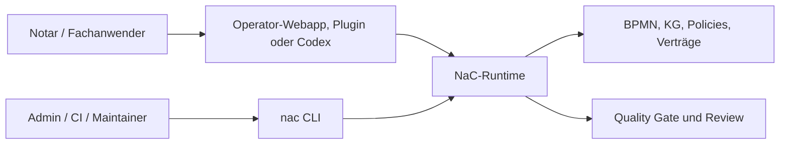

# NaC-CLI: Technische Steuerfläche Hinter Der Bürooberfläche

Status: erste zentrale CLI umgesetzt am 2026-05-19

## Idee

Die NaC-CLI ist nicht die Produktoberfläche für das Notariat. Sie ist die
technische Steuer- und Prüfschicht hinter der lokalen Bürooberfläche, hinter
Codex-Plugins und hinter späteren Automatisierungen.

Für fachliche Nutzer beginnt NaC mit der lokalen Operator-Webapp:

```bash
python scripts/nac.py operator --open
```

Die CLI bleibt wichtig, weil sie dieselben Prüfungen reproduzierbar macht:
Status, Quality Gate, BPMN, Knowledge Graphs, Plugins und Konfigurationen.

Der gemeinsame Einstieg heißt:

```bash
nac
```

Ohne Installation kann derselbe Einstieg direkt aus dem Repo gestartet werden:

```bash
python scripts/nac.py status
```

Nach einer lokalen Installation aus dem Repo steht der kurze Befehl bereit:

```bash
python -m pip install -e .
nac status
```

## Warum Das Für Nicht-Techniker Trotzdem Relevant Ist

Eine CLI ist ein klar benannter Arbeitsauftrag an den Computer. Ein Notar muss
diese Befehle nicht auswendig können. Aber das Büro profitiert davon, dass
jeder Button, jeder Plugin-Aufruf und jeder automatische Check auf eine
prüfbare technische Handlung zurückgeführt werden kann.

| Frage | Antwort |
| --- | --- |
| Muss der Notar Befehle auswendig können? | Nein. Der sichtbare Einstieg ist die Bürooberfläche; die CLI ist die technische Prüffläche dahinter. |
| Warum nicht nur Web-UI? | Eine reine UI kann Logik verstecken. Die CLI macht Prüfungen, Ergebnisse und Wiederholung sichtbar. |
| Warum ist das zukunftsfähig? | Lokale Webapp, Codex-Plugin, CI und spätere Apps können dieselbe geprüfte Runtime nutzen. |
| Was wird protokollierbar? | Befehl, Eingabe, Ergebnis, Review und Git-Änderung. |

## Erste Befehle

```bash
python scripts/nac.py status
python scripts/nac.py doctor --profile strict
python scripts/nac.py git worktree-audit --format json
python scripts/nac.py web
python scripts/nac.py kg status
python scripts/nac.py kg cost-view immobilienkaufvertrag
python scripts/nac.py kg workflow-contract immobilienkaufvertrag
python scripts/nac.py kg pilot-checklist online-gmbh-gruendung
python scripts/nac.py legal-graph status
python scripts/nac.py legal-graph model-card-proposal
python scripts/nac.py legal-graph ai-sbom-delta-proposal
python scripts/nac.py ai-sbom export-mapping
python scripts/nac.py gnotkg quote --business-value 500000 --table A --fee-rate 1.0 --kv-number 21100
python scripts/nac.py bpmn validate
python scripts/nac.py contracts verify
python scripts/nac.py config list
python scripts/nac.py m365 teams-sharepoint application-owner-readiness --format json
python scripts/nac.py m365 teams-sharepoint bff-azure-readiness --format json
python scripts/nac.py m365 teams-sharepoint runtime-certificate-expiry-monitor --format json
python scripts/nac.py m365 teams-sharepoint runtime-certificate-readiness --format json
python scripts/nac.py m365 teams-sharepoint runtime-env-bootstrap --format json
python scripts/nac.py m365 teams-sharepoint test-environment-deploy --owner-approved --mcp-smoke-workspace-id notary_team_01 --mcp-smoke-correlation-id <correlation-id> --test-environment-package-sha256 <sha256> --test-environment-include-teams --format json
python scripts/nac.py m365 teams-sharepoint bpmn-viewer-plan --format json
python scripts/nac.py m365 teams-sharepoint matter-access-plan --format json
python scripts/nac.py m365 teams-sharepoint matter-access-decision-replay --format json
python scripts/nac.py m365 teams-sharepoint matter-access-apply-readiness --mcp-smoke-workspace-id notary_team_01 --format json
python scripts/nac.py m365 teams-sharepoint matter-access-apply-request-plan --mcp-smoke-workspace-id notary_team_01 --mcp-smoke-correlation-id <correlation-id> --format json
python scripts/nac.py m365 teams-sharepoint matter-access-smoke --mcp-smoke-workspace-id notary_team_01 --format json
python scripts/nac.py m365 teams-sharepoint bpmn-viewer-runtime-readiness --format json
python scripts/nac.py m365 teams-sharepoint spfx-bpmn-viewer-skeleton --format json
python scripts/nac.py m365 teams-sharepoint spfx-bpmn-viewer-process-selection --format json
python scripts/nac.py m365 teams-sharepoint privileged-plan --format json
python scripts/nac.py m365 teams-sharepoint release-gate-run --owner-approved --mcp-smoke-workspace-id notary_team_01 --mcp-smoke-correlation-id <correlation-id> --format json
python scripts/nac.py m365 teams-sharepoint release-gate-run --owner-approved --mcp-smoke-workspace-id notary_team_01 --mcp-smoke-correlation-id <correlation-id> --release-gate-write-audit-pack --release-gate-compare-left <baseline-correlation-id> --release-gate-write-readiness --release-gate-readiness-require-audit-pack --release-gate-write-post-run-report --release-gate-write-post-run-report-index --format json
python scripts/nac.py m365 teams-sharepoint release-gate-run --owner-approved --mcp-smoke-workspace-id notary_team_01 --mcp-smoke-correlation-id <correlation-id> --release-gate-write-audit-pack --release-gate-write-readiness --release-gate-readiness-require-audit-pack --format json
python scripts/nac.py m365 teams-sharepoint release-readiness --format json
python scripts/nac.py m365 teams-sharepoint release-gate-post-run-report --release-gate-readiness-correlation-id <correlation-id> --format json
python scripts/nac.py m365 teams-sharepoint release-gate-post-run-report-index --format json
python scripts/nac.py m365 teams-sharepoint release-gate-post-run-report-index-artifact --format json
python scripts/nac.py m365 teams-sharepoint release-gate-retention-list --format json
python scripts/nac.py m365 teams-sharepoint release-gate-retention-compare --release-gate-compare-left <left-correlation-id> --release-gate-compare-right <right-correlation-id> --format json
python scripts/nac.py m365 teams-sharepoint release-gate-retention-compare-artifact --release-gate-compare-left <left-correlation-id> --release-gate-compare-right <right-correlation-id> --format json
python scripts/nac.py m365 teams-sharepoint release-gate-retention-compare-index --format json
python scripts/nac.py m365 teams-sharepoint release-gate-retention-compare-index-artifact --format json
python scripts/nac.py m365 teams-sharepoint release-gate-retention-audit-pack --release-gate-compare-left <left-correlation-id> --release-gate-compare-right <right-correlation-id> --format json
python scripts/nac.py plugins actions
python scripts/nac.py tenant domain-check --domain kanzlei-notariat.example --tenant-slug kanzlei-notariat --admin-email admin@kanzlei-notariat.example
python scripts/nac.py import jobs status --repo ../demo8notariat
python scripts/nac.py time-ledger summary
```

Nach Installation entsprechend:

```bash
nac status
nac doctor --profile strict
nac git worktree-audit --format json
nac web
nac kg status
nac kg business-case-inventory --format json
nac kg ontology-storage-contract --format json
nac kg process-ontology-contract --format json
nac kg process-ontology-schema-gap --format json
nac kg process-ontology-schema-apply-plan --format json
nac kg process-ontology-schema-apply-readiness --format json
nac kg process-ontology-schema-apply-execution-contract --format json
nac kg process-ontology-schema-apply-runner-dry-run --format json
nac kg process-ontology-schema-apply-runner-dry-run-artifact --format json
nac kg process-ontology-schema-apply-artifact-index --format json
nac kg process-ontology-schema-apply-live-readiness-gate --format json --workspace-id notary_team_01
nac kg process-ontology-schema-apply-owner-gated-live-plan --format json
nac kg process-ontology-schema-apply-owner-gated-runner-contract --format json
nac kg process-ontology-schema-apply-live --format json --workspace-id notary_team_01 --owner-approved --owner-approval-reference <approval-reference> --reason "Freigegebener Schema-Apply für Workspace-Rollout" --execute-live-schema-apply --live-readiness-gate out/notary-kg/process-ontology-schema-apply-live-readiness-gate.redacted.json --correlation-id nac-schema-apply-live --write-redacted-evidence
nac kg process-ontology-schema-apply-live-dispatch --format json --workspace-id notary_team_01 --owner-approved --owner-approval-reference <approval-reference> --reason "Freigegebener Schema-Apply für Workspace-Rollout" --execute-live-schema-apply --live-readiness-gate out/notary-kg/process-ontology-schema-apply-live-readiness-gate.redacted.json --provisioner-state <privileged-apply-state.json> --provisioner-certificate-path <provisioner.cert.pem> --provisioner-private-key-path <provisioner.key.pem> --provisioner-env-bootstrap-output <provisioner-env-bootstrap.redacted.json> --correlation-id nac-schema-apply-live-dispatch --write-redacted-evidence
nac kg ontology-scale-budget --format json
nac kg deep-process-candidates --format json
nac kg first-wave-bpmn-outline --format json
nac kg first-wave-gap-review --format json
nac kg first-wave-process-deep-model --format json
nac kg first-wave-gap-review-artifact --format json
nac kg cost-view immobilienkaufvertrag
nac kg workflow-contract immobilienkaufvertrag
nac kg pilot-checklist online-gmbh-gruendung
nac legal-graph status
nac legal-graph model-card-proposal
nac legal-graph ai-sbom-delta-proposal
nac ai-sbom export-mapping
nac gnotkg quote --business-value 500000 --table A --fee-rate 1.0 --kv-number 21100
nac bpmn validate
nac contracts verify
nac config list
nac m365 teams-sharepoint application-owner-readiness --format json
nac m365 teams-sharepoint bff-azure-readiness --format json
nac m365 teams-sharepoint runtime-certificate-expiry-monitor --format json
nac m365 teams-sharepoint runtime-certificate-readiness --format json
nac m365 teams-sharepoint runtime-env-bootstrap --format json
nac m365 teams-sharepoint test-environment-deploy --owner-approved --mcp-smoke-workspace-id notary_team_01 --mcp-smoke-correlation-id <correlation-id> --test-environment-package-sha256 <sha256> --test-environment-include-teams --format json
nac m365 teams-sharepoint bpmn-viewer-plan --format json
nac m365 teams-sharepoint matter-access-plan --format json
nac m365 teams-sharepoint matter-access-decision-replay --format json
nac m365 teams-sharepoint matter-access-apply-readiness --mcp-smoke-workspace-id notary_team_01 --format json
nac m365 teams-sharepoint matter-access-apply-request-plan --mcp-smoke-workspace-id notary_team_01 --mcp-smoke-correlation-id <correlation-id> --format json
nac m365 teams-sharepoint matter-access-smoke --mcp-smoke-workspace-id notary_team_01 --format json
nac m365 teams-sharepoint bpmn-viewer-runtime-readiness --format json
nac m365 teams-sharepoint spfx-bpmn-viewer-skeleton --format json
nac m365 teams-sharepoint spfx-bpmn-viewer-process-selection --format json
nac m365 teams-sharepoint privileged-plan --format json
nac m365 teams-sharepoint release-gate-run --owner-approved --mcp-smoke-workspace-id notary_team_01 --mcp-smoke-correlation-id <correlation-id> --format json
nac m365 teams-sharepoint release-gate-run --owner-approved --mcp-smoke-workspace-id notary_team_01 --mcp-smoke-correlation-id <correlation-id> --release-gate-write-audit-pack --release-gate-compare-left <baseline-correlation-id> --release-gate-write-readiness --release-gate-readiness-require-audit-pack --release-gate-write-post-run-report --release-gate-write-post-run-report-index --format json
nac m365 teams-sharepoint release-gate-run --owner-approved --mcp-smoke-workspace-id notary_team_01 --mcp-smoke-correlation-id <correlation-id> --release-gate-write-audit-pack --release-gate-write-readiness --release-gate-readiness-require-audit-pack --format json
nac m365 teams-sharepoint release-readiness --format json
nac m365 teams-sharepoint release-gate-post-run-report --release-gate-readiness-correlation-id <correlation-id> --format json
nac m365 teams-sharepoint release-gate-post-run-report-index --format json
nac m365 teams-sharepoint release-gate-post-run-report-index-artifact --format json
nac m365 teams-sharepoint release-gate-retention-list --format json
nac m365 teams-sharepoint release-gate-retention-compare --release-gate-compare-left <left-correlation-id> --release-gate-compare-right <right-correlation-id> --format json
nac m365 teams-sharepoint release-gate-retention-compare-artifact --release-gate-compare-left <left-correlation-id> --release-gate-compare-right <right-correlation-id> --format json
nac m365 teams-sharepoint release-gate-retention-compare-index --format json
nac m365 teams-sharepoint release-gate-retention-compare-index-artifact --format json
nac m365 teams-sharepoint release-gate-retention-audit-pack --release-gate-compare-left <left-correlation-id> --release-gate-compare-right <right-correlation-id> --format json
nac plugins actions
nac tenant domain-check --domain kanzlei-notariat.example --tenant-slug kanzlei-notariat --admin-email admin@kanzlei-notariat.example
nac tenant customer-plan --domain kanzlei-notariat.example --tenant-slug kanzlei-notariat --admin-email admin@kanzlei-notariat.example --saas-admin-email saas-owner@example.com --format json
nac tenant status --repo ../demo8notariat
nac import jobs status --repo ../demo8notariat
nac qms status
nac time-ledger summary
```

## Technische Bedienflächen

| Bereich | Befehl | Aufgabe |
| --- | --- | --- |
| Überblick | `nac status` | Zeigt Usecases, offene Pflichtangaben, BPMN-Modelle und Konfigurationen. |
| Qualität | `nac doctor --profile strict` | Führt den strikten Quality Gate aus. |
| Git-Hygiene | `nac git worktree-audit` | Prüft lokale Worktrees, Branches und Cleanup-Kandidaten read-only; Löschaktionen bleiben owner-gated. |
| Bürooberfläche | `nac operator --open` | Startet die lokale Operator-Webapp mit Vorgängen, Checklisten, BPMN, Editor und Arbeitsplatztests. |
| Grafische Modellansicht | `nac web` | Startet den lokalen Webserver für BPMN- und KG-Ansichten. |
| Knowledge Graphs | `nac kg status`, `nac kg business-case-inventory`, `nac kg business-case-type-get`, `nac kg business-case-type-migration-dry-run`, `nac kg ontology-storage-contract`, `nac kg process-ontology-contract`, `nac kg process-ontology-schema-gap`, `nac kg process-ontology-schema-apply-plan`, `nac kg process-ontology-schema-apply-readiness`, `nac kg process-ontology-schema-apply-execution-contract`, `nac kg process-ontology-schema-apply-runner-dry-run`, `nac kg process-ontology-schema-apply-runner-dry-run-artifact`, `nac kg process-ontology-schema-apply-artifact-index`, `nac kg process-ontology-schema-apply-live-readiness-gate`, `nac kg process-ontology-schema-apply-owner-gated-live-plan`, `nac kg process-ontology-schema-apply-owner-gated-runner-contract`, `nac kg process-ontology-schema-apply-live`, `nac kg process-ontology-schema-apply-live-dispatch`, `nac kg ontology-scale-budget`, `nac kg deep-process-candidates`, `nac kg first-wave-bpmn-outline`, `nac kg first-wave-gap-review`, `nac kg first-wave-process-deep-model`, `nac kg first-wave-gap-review-artifact`, `nac kg workflow-contract <slug>` und `nac kg pilot-checklist <slug>` | Zeigt den Stand der usecase-lokalen Wissensgraphen, erzeugt ein dünnes Geschäftsvorfall-Inventar für Ontologie-Sizing ohne zentralen Knowledge Graph, prüft die Ontologie-/Storage-Grenze gegen SharePoint-MVP- und Graph-REST-Regeln, fixiert den Prozess-/Ontologie-Produktmodell-Vertrag für SharePoint-MVP-Projektionen, prüft diesen Vertrag gegen das aktuelle SharePoint-Listenmodell, erzeugt daraus einen owner-gated Offline-Graph-REST-Apply-Plan ohne Live-Apply, prüft offline Workspace-/ID-/Rechte-/Reihenfolge-Readiness vor einem späteren Live-Apply, definiert die owner-gated Ausführungskante, den Dry-Run-Runner, den redigierten Dry-Run-Nachweis, dessen Offline-Index, ein Live-Readiness-Gate, einen owner-gated Live-Plan, den Runner-Vertrag, den owner-gated Live-Runner-Envelope und den Graph-REST-Dispatcher für einen SharePoint-Schema-Apply, misst Offline-Scale-Budgets über alle Geschäftsvorfälle, routet Kandidaten für tiefe BPMN-/Ontologie-Modellierung, erzeugt First-Wave-BPMN-/Ontologie-Outline-Pläne, prüft diese Outlines auf SharePoint-/BPMN-/Ontologie-Gaps, verdichtet sie zu einem mandatsdatenfreien Deep-Process-Model-Vertrag, schreibt daraus redigierte JSON-/Markdown-Evidence-Artefakte, erzeugt mandatsdatenfreie Workflow-Vertragsentwürfe und baut deterministische Pilot-Aufnahmechecklisten aus einem Usecase-KG. |
| Legal Graph | `nac legal-graph status`, `nac legal-graph sources`, `nac legal-graph source-inventory`, `nac legal-graph model-card-proposal`, `nac legal-graph ai-sbom-delta-proposal`, `nac legal-graph review erbrecht` und `nac legal-graph update-dry-run erbrecht` | Zeigt den mandatsdatenfreien Rechtsgraphen, Primärquellen, Quelleninventar-/Lizenz-/TDM-Gates, Model-Card- und AI-SBOM-Delta-Vorschlag, Reviewpunkte und Update-Patches ohne Auto-Merge. |
| AI-SBOM | `nac ai-sbom export-mapping` | Zeigt das gewählte CycloneDX-/SPDX-Export-Mapping, ohne Release-Export, externe Toolausführung, Mandatsdaten oder Secrets freizugeben. |
| GNotKG-Kostenprüfung | `nac kg cost-view <slug>` und `nac gnotkg quote` | Zeigt die mandatsdatenfreie Kosten-Reviewansicht und berechnet lokale technische Kostenentwürfe. |
| BPMN | `nac bpmn list` und `nac bpmn validate` | Listet und prüft fachliche BPMN-Prozessmodelle. |
| Prozesse | `nac process validate-all` | Prüft deterministische Prozessanträge. |
| Workflow-Verträge | `nac contracts validate` und `nac contracts verify` | Prüft Workflow-Verträge, Spec-Traceability, Secure-Link-Grenzen, Teams-/SharePoint-Graph-Datenebene, Legal-Research-Connector-Kandidaten und den agentischen Verification-Contract-Harness. |
| Microsoft 365 | `nac m365 teams-sharepoint plan`, `nac m365 teams-sharepoint application-owner-readiness`, `nac m365 teams-sharepoint runtime-certificate-expiry-monitor`, `nac m365 teams-sharepoint runtime-certificate-readiness`, `nac m365 teams-sharepoint runtime-env-bootstrap`, `nac m365 teams-sharepoint bpmn-viewer-plan`, `nac m365 teams-sharepoint matter-access-plan`, `nac m365 teams-sharepoint matter-access-decision-replay`, `nac m365 teams-sharepoint matter-access-apply-readiness`, `nac m365 teams-sharepoint matter-access-apply-request-plan`, `nac m365 teams-sharepoint matter-access-apply-smoke --owner-approved`, `nac m365 teams-sharepoint matter-access-smoke`, `nac m365 teams-sharepoint bpmn-viewer-runtime-readiness`, `nac m365 teams-sharepoint spfx-bpmn-viewer-skeleton`, `nac m365 teams-sharepoint privileged-plan`, `nac m365 teams-sharepoint privileged-apply --owner-approved`, `nac m365 teams-sharepoint runtime-smoke --owner-approved`, `nac m365 teams-sharepoint runtime-metadata --owner-approved`, `nac batch-approval m365`, `nac m365 teams-sharepoint release-gate-run --owner-approved`, `nac m365 teams-sharepoint release-readiness`, `nac m365 teams-sharepoint release-gate-post-run-report`, `nac m365 teams-sharepoint release-gate-post-run-report-index`, `nac m365 teams-sharepoint release-gate-post-run-report-index-artifact`, `nac m365 teams-sharepoint release-gate-evidence`, `nac m365 teams-sharepoint release-gate-retention-list`, `nac m365 teams-sharepoint release-gate-retention-compare`, `nac m365 teams-sharepoint release-gate-retention-compare-artifact`, `nac m365 teams-sharepoint release-gate-retention-compare-index`, `nac m365 teams-sharepoint release-gate-retention-compare-index-artifact`, `nac m365 teams-sharepoint release-gate-retention-audit-pack`, `nac m365 teams-sharepoint mcp-manifest`, `nac m365 teams-sharepoint mcp-inventory-smoke` und `nac m365 teams-sharepoint mcp-stdio` | Plant die Teams/SharePoint-Datenebene, prüft den Application-Owner-/Technical-Owner-Pfad und den Runtime-Zertifikatspfad offline und redigiert, überwacht den Runtime-Zertifikatsablauf ohne Live-Zugriff, bereitet die zertifikatsbasierte Runtime-Umgebung aus nicht-geheimer Evidence und lokalen Pfaden ohne Graph-Zugriff vor, erzeugt den optionalen BPMN-Viewer-Provisioning-Plan ohne Live-Apply, rendert den M365-Akten-/Vertretungszugriffsplan offline ohne Live-Tenant-Aktion, spielt synthetische SharePoint-Listensnapshots für Matter-Access-Entscheidungen lokal nach, prüft die künftige owner-gated Apply-Kante für zeitbegrenzte Vertretungsfreigaben offline, rendert den konkreten redigierten Apply-Request-Plan für `grant_request` und `audit_append` ohne Live-Apply, führt die synthetische Apply-Kante owner-gated mit Write/Read/Cleanup aus, schreibt den redigierten Offline-Smoke für die Akten-/Vertretungszugriffsgrenze, prüft die BPMN-Viewer-Runtime-Readiness für SPFx-Paketierung, App Catalog und späteren `.bpmn`-Graph-Content-Read ohne Live-Zugriff, rendert das source-only SPFx/bpmn-js-Viewer-Skeleton ohne App-Catalog-Deploy, führt den privilegierten App-/Sites.Selected-Bootstrap nur owner-gated über Microsoft Graph REST v1.0 aus, prüft den Runtime-App-Lesezugriff auf Sites, Listen und Dokumentbibliotheken ohne Listenelemente, rendert Batch-Freigabetexte ohne Live-Zugriff, führt das Runtime-Release-Gate nur owner-gated als feste Sequenz aus und kann danach direkt ein redigiertes Audit-Pack schreiben, verdichtet die lokale Release-Gate-Evidence zu einem kompakten MVP-Readiness-Status, erzeugt einen redigierten Offline-Post-Gate-Report mit automatischer vorheriger Baseline und GitHub-Nachweiskommentarentwurf, listet und indiziert diese Post-Gate-Reports offline, erzeugt redigierte Release-Gate-Abschlussberichte aus lokalen Evidence-Artefakten, listet und vergleicht lokale Release-Gate-Retention-Laufordner offline, schreibt redigierte Vergleichsnachweise, listet/durchsucht diese Vergleichsnachweise offline, schreibt daraus redigierte Indexartefakte und bündelt Retention-Liste, Vergleich, Vergleichsindex und Manifest als redigiertes Offline-Audit-Paket, zeigt das sichere Tool-Manifest von `teams-sharepoint-data-mcp` ohne Live-Zugriff, prüft das metadata-only Schnittstelleninventar offline, startet den lokalen MCP-stdio-Adapter für Request-Planung und bereinigt synthetische Smoke-Reste nur owner-gated. |
| Import-Jobs | `nac import jobs status --repo ../demo8notariat` | Steuert begrenzte Codex-/OCR-Aufträge für Importvorschläge im getrennten Datenrepo. |
| Plugins | `nac plugins actions` und `nac plugins install --mode dry-run` | Listet fachliche Plugin-Befehle und prüft die lokale Plugin-Spiegelung. |
| Konfiguration | `nac config list` und `nac config validate` | Zeigt und prüft steuernde Policies, Verträge und Runtime-Konfiguration. |
| Datenrepo | `nac tenant status --repo ../demo8notariat` | Prüft ein getrenntes NaC-Datenrepo für Demo- oder spätere Produktivdaten. |
| Tenant-Onboarding | `nac tenant domain-check` und `nac tenant customer-plan` | Prüft Neukunden-Domains und erzeugt den Entra-/M365-/SharePoint-Plan ohne produktive Graph-Schreiboperation. |
| QMS | `nac qms status` und `nac qms evidence --repo ../demo8notariat` | Zeigt ISO-9001/QMS-Artefakte und Nachweiszahlen aus dem Datenrepo. |
| Codex Time Ledger | `nac time-ledger add`, `nac time-ledger run` und `nac time-ledger summary` | Protokolliert agentische Arbeitsblöcke und summiert Toolzeit, Freigaben, Wartezeit, lokale CPU/I/O und geschätzte LLM-Zeit. |

## Codex Time Ledger

Das Time Ledger ist die lokale Messschicht für längere Codex-Sessions. Es
schreibt abgeschlossene Arbeitsblöcke als JSONL unter
`out/observability/codex-time-ledger.jsonl` und fasst sie nach Kategorie und
Phase zusammen.

```bash
nac time-ledger add --session-id 2026-06-15-nac --task "NaC Time Ledger" --phase context-read --category local_io --started-at 2026-06-15T10:00:00Z --ended-at 2026-06-15T10:08:00Z
nac time-ledger run --session-id 2026-06-15-nac --task "NaC Time Ledger" --phase unit-tests --category local_cpu -- python -m unittest tests/test_codex_time_ledger.py
nac time-ledger summary --session-id 2026-06-15-nac
```

Die Bedien- und Datenschutzgrenzen stehen in
[operations/codex-time-ledger.md](operations/codex-time-ledger.md).

## `nac legal-graph`

Der Befehl steuert den mandatsdatenfreien NaC-Rechtsgraphen. Die ersten MVPs
sind Erbrecht, Familienrecht und Gesellschaftsrecht. Automatische Quellenläufe
erzeugen nur Review-Patches; ein Merge braucht fachliche Prüfung.

```bash
nac legal-graph status
nac legal-graph sources --format json
nac legal-graph source-inventory --format json
nac legal-graph model-card-proposal --format json
nac legal-graph ai-sbom-delta-proposal --format json
nac legal-graph review erbrecht --format json
nac legal-graph update-dry-run erbrecht --format json
```

Der erste Update-Pilot nutzt ein Primärquellen-Manifest für Erbrecht mit
`metadata_only_fixture`, `commentary_access_allowed=false`,
`provider_query_allowed=false` und `credentials_required=false`. Damit bleiben
Kommentare und Verlagsdatenbanken solange außen vor, bis ein lizenzierter
MCP-/API-Connector fachlich, vertraglich und technisch freigegeben ist.

Lizenzierte Kommentare und Verlagsquellen laufen nicht über Scraping oder
Volltextimport, sondern nur über geprüfte MCP-/API-Connectoren mit Lizenz-,
AVV-/DPA-, Berufsgeheimnis-, AI-SBOM- und Review-Gate.

Der Model-Card-Vorschlag ist ebenfalls nur metadata-only. Er zeigt, welche
Abschnitte, Kandidaten und Blockaden vor einer späteren Legal-Nemotron-Nutzung
zu prüfen sind; er startet kein Training, veröffentlicht keinen Checkpoint und
behauptet keine juristische Antwortqualität.

Der AI-SBOM-Delta-Vorschlag bleibt gleich begrenzt. Er zeigt spätere
Komponenten, Kandidaten, Attestationen und Blockaden, aktiviert aber keine
Runtime, keinen Endpunkt, kein Training, keine Evaluation und keinen
Checkpoint.

## `nac ai-sbom`

Der Befehl zeigt repo-weite AI-SBOM-Governance-Artefakte. Das aktuelle
Export-Mapping wählt CycloneDX JSON und SPDX JSON als Zielprofile, aktiviert
aber keinen Release-Export und führt keine externen SBOM-Tools aus.

```bash
nac ai-sbom export-mapping --format json
```

Release-Bindung, Toolausführung und veröffentlichte Artefakte brauchen ein
separates Owner-Apply-Gate.

## QMS- und ISO-9001-Schicht

NaC enthält eine QMS-Schicht unter [qms/](../../qms). Sie ordnet
Qualitätspolitik, Qualitätsziele, Rollen, Prozesslandkarte, interne Audits,
Managementbewertung und Abweichungen den NaC-Artefakten zu.

```bash
nac qms status
nac qms iso9001-map
nac qms audit-plan
nac qms evidence --repo ../demo8notariat
```

## Getrenntes Datenrepo

NaC schreibt Vorgangs- und Testdaten nicht in das Produktrepo. Für synthetische
Demo-Daten gibt es ein getrenntes Datenrepo, zum Beispiel `../demo8notariat`:

```bash
nac tenant init --repo ../demo8notariat --name demo8notariat --remote-url https://github.com/notariat8/demo8notariat.git
nac tenant write-sample-akte --repo ../demo8notariat --akten-id UVZ-2026-0001
nac tenant list-akten --repo ../demo8notariat
nac tenant show-akte --repo ../demo8notariat --akten-id UVZ-2026-0001
nac tenant write-demo immobilienkaufvertrag --repo ../demo8notariat --case-id DEMO-2026-0001
```

## Tenant-Onboarding Und M365-Graph-Plan

Neukunden starten nicht in einer Cloud-Console. NaC prüft zuerst, ob die
Kundendomain und die initiale Admin-E-Mail zusammenpassen:

```bash
nac tenant domain-check --domain kanzlei-notariat.example --tenant-slug kanzlei-notariat --admin-email admin@kanzlei-notariat.example --format json
```

Danach erzeugt NaC einen M365-/SharePoint-Plan. Dieser Befehl schreibt nicht
gegen Microsoft Graph und enthält keine Credentials:

```bash
nac tenant customer-plan --domain kanzlei-notariat.example --tenant-slug kanzlei-notariat --admin-email admin@kanzlei-notariat.example --saas-admin-email saas-owner@example.com --format json
```

Produktive Graph-Änderungen laufen danach über die M365-Bedienkante und
brauchen ein Owner-Gate:

```bash
nac m365 teams-sharepoint application-owner-readiness --format json
nac m365 teams-sharepoint bff-azure-readiness --format json
nac m365 teams-sharepoint bff-azure-activation-plan --format json
nac m365 teams-sharepoint bff-azure-activation-attestations --bff-attestation-provisioner-certificate <public-certificate-path> --format json
nac m365 teams-sharepoint bff-azure-activate-live --owner-approved --execute-live-activation --expected-activation-hash <64-lowercase-hex> --approval-reference https://github.com/notariat8/NaC/issues/632#issuecomment-<id> --approval-body-sha256 <64-lowercase-hex> --approved-commit <40-lowercase-hex> --approved-tree <40-lowercase-hex> --azure-cli-toolchain-sha256 <64-lowercase-hex> --m365-cli-sha256 <64-lowercase-hex> --m365-node-sha256 <64-lowercase-hex> --build-python-sha256 <64-lowercase-hex> --build-node-sha256 <64-lowercase-hex> --build-npm-cli-sha256 <64-lowercase-hex> --gh-cli-sha256 <64-lowercase-hex> --provisioner-certificate-sha256 <64-lowercase-hex> --reason "<owner-reason>" --correlation-id <safe-correlation-id> --format json
nac m365 teams-sharepoint bff-azure-activation-recovery --owner-approved --expected-activation-hash <64-lowercase-hex> --approval-reference https://github.com/notariat8/NaC/issues/632#issuecomment-<id> --approval-body-sha256 <64-lowercase-hex> --approved-commit <40-lowercase-hex> --approved-tree <40-lowercase-hex> --azure-cli-toolchain-sha256 <64-lowercase-hex> --m365-cli-sha256 <64-lowercase-hex> --m365-node-sha256 <64-lowercase-hex> --build-python-sha256 <64-lowercase-hex> --build-node-sha256 <64-lowercase-hex> --build-npm-cli-sha256 <64-lowercase-hex> --gh-cli-sha256 <64-lowercase-hex> --provisioner-certificate-sha256 <64-lowercase-hex> --reason "<owner-reason>" --correlation-id <safe-correlation-id> [--confirm-unlock] --format json
nac m365 teams-sharepoint runtime-certificate-expiry-monitor --runtime-certificate-warning-days 90 --runtime-certificate-critical-days 30 --format json
nac m365 teams-sharepoint runtime-certificate-readiness --format json
nac m365 teams-sharepoint runtime-env-bootstrap --format json
nac m365 teams-sharepoint test-environment-deploy --owner-approved --mcp-smoke-workspace-id notary_team_01 --mcp-smoke-correlation-id <correlation-id> --test-environment-package-sha256 <sha256> --test-environment-include-teams --format json
nac m365 teams-sharepoint privileged-plan --format json
nac m365 teams-sharepoint mcp-manifest --format json
nac batch-approval m365 --batch-pr 383 --batch-pr 385 --format json
nac batch-approval m365 --batch-mode release-gate --workspace-id notary_team_01 --format json
nac batch-approval m365 --batch-mode release-gate --workspace-id notary_team_01 --correlation-id <correlation-id> --release-gate-compare-left <baseline-correlation-id> --format json
nac batch-approval m365 --batch-mode runtime-certificate-rotation --workspace-id notary_team_01 --correlation-id <correlation-id> --format json
nac m365 teams-sharepoint release-gate-run --owner-approved --mcp-smoke-workspace-id notary_team_01 --mcp-smoke-correlation-id <correlation-id> --format json
nac m365 teams-sharepoint release-gate-run --owner-approved --mcp-smoke-workspace-id notary_team_01 --mcp-smoke-correlation-id <correlation-id> --release-gate-write-audit-pack --release-gate-compare-left <baseline-correlation-id> --release-gate-write-readiness --release-gate-readiness-require-audit-pack --release-gate-write-post-run-report --release-gate-write-post-run-report-index --format json
nac m365 teams-sharepoint release-gate-evidence --mcp-smoke-workspace-id notary_team_01 --mcp-smoke-correlation-id <correlation-id> --format json
nac m365 teams-sharepoint release-gate-post-run-report-index --release-gate-post-run-report-query <search-text> --format json
nac m365 teams-sharepoint release-gate-post-run-report-index-artifact --release-gate-post-run-report-query <search-text> --format json
nac m365 teams-sharepoint release-gate-retention-list --format json
nac m365 teams-sharepoint release-gate-retention-compare --release-gate-compare-left <left-correlation-id> --release-gate-compare-right <right-correlation-id> --format json
nac m365 teams-sharepoint release-gate-retention-compare-artifact --release-gate-compare-left <left-correlation-id> --release-gate-compare-right <right-correlation-id> --format json
nac m365 teams-sharepoint release-gate-retention-compare-index --release-gate-compare-query <search-text> --format json
nac m365 teams-sharepoint release-gate-retention-compare-index-artifact --release-gate-compare-query <search-text> --format json
nac m365 teams-sharepoint release-gate-retention-audit-pack --release-gate-compare-left <left-correlation-id> --release-gate-compare-right <right-correlation-id> --format json
nac m365 teams-sharepoint runtime-smoke --owner-approved --runtime-smoke-output out/m365/teams-sharepoint/runtime-smoke.redacted.json --format json
nac m365 teams-sharepoint runtime-metadata --owner-approved --runtime-metadata-output out/m365/teams-sharepoint/runtime-metadata.redacted.json --format json
nac m365 teams-sharepoint mcp-inventory-smoke --format json
nac m365 teams-sharepoint mcp-stdio
nac m365 teams-sharepoint mcp-stdio --owner-approved --mcp-live-read
nac m365 teams-sharepoint mcp-live-read-smoke --owner-approved --mcp-smoke-tool case_get --mcp-smoke-case-id <case-id> --format json
nac m365 teams-sharepoint mcp-positive-write-read-smoke --owner-approved --format json
nac m365 teams-sharepoint mcp-smoke-cleanup --owner-approved --mcp-smoke-case-id <case-id> --format json
nac m365 teams-sharepoint mcp-smoke-suite --owner-approved --mcp-suite-cleanup --format json
nac m365 teams-sharepoint mcp-smoke-leftover-cleanup --owner-approved --mcp-leftover-dry-run --format json
nac m365 teams-sharepoint mcp-smoke-leftover-cleanup --owner-approved --format json
```

`application-owner-readiness` ist offline und prüft den Least-Privilege-Pfad
für den konfigurierten technischen direkten Application Owner. Der Befehl liest
nur die Privileged-Change-Konfiguration und, wenn vorhanden, den nicht-geheimen
angewendeten State. Er meldet Graph-REST-only, getrennte Provisioning-/Runtime-
App, `nac_platform_admins` als Governance-Gruppe, Owner-Gates,
Sites.Selected-Readiness und Reviewpunkte wie Lizenz-/Terms-Check. Die Ausgabe
enthält keine Tenant-ID, App-/Client-IDs, Site-IDs, Tokens, Secrets,
Graph-Rohantworten oder Mandatsdaten.

`bff-azure-readiness` arbeitet ausschließlich offline. Der Befehl liest nur
die festgelegten Repository-Dateien, keine Environment-Secrets, und führt
keine HTTP-, DNS-, Azure- oder Graph-Zugriffe sowie keine Live-Aktion aus. Er
prüft Source, Function Host, Packaging, Bicep, Managed Identity, CORS und die
Health-/Readiness-Dateien. Die redigierte Ausgabe enthält nur repo-relative
Pfade, statische Prüfergebnisse und einen Plan mit `READY` oder `NOT_READY`;
Dateiinhalte, Environment-Werte, Credentials, Tenant-/App-IDs und
Provider-Rohantworten bleiben ausgeschlossen.

`bff-azure-activation-attestations` misst lokal die acht nicht-geheimen Ausführungs-Digests und gibt den kombinierten Owner-Hash samt vollständiger Live-CLI-Argumentmap aus. Der Befehl liest keinen Private Key und führt keine Provider-Anfrage aus. Optionale `--bff-attestation-*`-Pfade dürfen ausschließlich die dokumentierten, fest gepinnten Ausführungspfade explizit bestätigen; jede Abweichung führt zu `NOT_READY`.

`bff-azure-activation-recovery` ist die einzige Recovery-Kante für einen nach einem Finalisierungsfehler bewusst gehaltenen Lock. Ohne `--confirm-unlock` prüft sie ausschließlich die gebundenen lokalen State-, Ledger-, Evidence- und Marker-Artefakte. Das Entsperren verlangt zusätzlich `--confirm-unlock`, schreibt einen redigierten Reconcile-Marker und führt weder Providerzugriffe noch Resume, Rollback oder automatische Löschungen aus.

`bff-azure-activation-plan` erzeugt den hashgebundenen Offline-Plan für
Aktivierungs-Issue [#632](https://github.com/notariat8/NaC/issues/632);
[#620](https://github.com/notariat8/NaC/issues/620) bleibt ausschließlich
Parent-Kontext. `bff-azure-activate-live` akzeptiert genau einen
unveränderlichen Kommentar des exakten GitHub-Logins `ofunk` aus Issue #632.
Vor dem ersten Provider-Write müssen die vollständige Duplikat- und
Breitrechteinventur, der zielglobale Lock sowie die vorgebauten und
hashgebundenen Function-/SPFx-Pakete und Bicep-/Parameter-Snapshots bestanden
sein. Schritt 11 prüft `healthz` vor Auth, authentifizierte Reads und Deny-
Fälle, stellt den synthetischen Assigned-Ausgangszustand deterministisch
wieder her und prüft `readyz` erst nach einem weiteren authentifizierten Read.
Die Evidence einschließlich `summary` folgt exakten Feld-Allowlists.

Resume ist im MVP deaktiviert: Die CLI bietet kein `--resume`; jeder
Resume-Versuch muss vor Lock oder Providerzugriff mit
`RESUME_DISABLED_FOR_MVP` stoppen. Freischaltung setzt providerspezifische
read-only Reconciliation für jeden Write-Schritt und jedes Crash-Fenster sowie
eine unabhängige Prüfung voraus.

`runtime-certificate-readiness` ist offline und prüft den bevorzugten
Runtime-Pfad `client_credentials_with_certificate`. Der Befehl liest nur
nicht-geheime Runtime-Smoke-/Runtime-Metadata-Evidence, gibt
Umgebungsvariablen-Namen, Owner-Gates, Ablaufdatum und Rotationshinweise aus
und liest keine Zertifikats-, Private-Key- oder Secret-Dateien. Zertifikat
erzeugen, Private Key speichern, Public Certificate hochladen und Entra-App-
Credentials ändern bleiben eigene Owner-Gates. Die Ausgabe enthält keine
Tenant-ID, Client-ID, Site-ID, Zertifikatsthumbprint, Zertifikatskörper,
Private-Key-Daten, Tokens, Secrets, Graph-Rohantworten oder Mandatsdaten.

`runtime-certificate-expiry-monitor` ist die frühe Ablaufampel für das
Runtime-Zertifikat. Der Befehl liest dieselbe nicht-geheime Runtime-Smoke- und
Runtime-Metadata-Evidence wie `runtime-certificate-readiness`, schreibt das
redigierte Artefakt
`out/m365/teams-sharepoint/runtime-certificate-expiry-monitor.redacted.json`
und wertet die Schwellen `--runtime-certificate-warning-days` und
`--runtime-certificate-critical-days` aus. Außerhalb der Warnschwelle meldet
er `PASSED`; innerhalb der Warn- oder kritischen Schwelle meldet er
`REVIEW_REQUIRED` und verweist auf den gebündelten
`runtime-certificate-rotation`-Freigabepfad. Er liest keine Zertifikats-,
Private-Key- oder Secret-Dateien und gibt keinen Thumbprint, keine Tenant-ID,
Client-ID, Site-ID, Graph-Rohantwort oder Mandatsdaten aus.

`runtime-env-bootstrap` ist offline und bereitet die zertifikatsbasierte
Runtime-Umgebung für lokale Release-Gate-Subprozesse vor. Der Befehl liest nur
den nicht-geheimen Runtime-Smoke-State, prüft lokale Zertifikats- und
Private-Key-Pfade nur auf Existenz und schreibt
`out/m365/teams-sharepoint/runtime-env-bootstrap.redacted.json`. Das Artefakt
enthält Variablennamen, Status und Privacy-Flags, aber keine Tenant-ID,
Client-ID, Zertifikatsthumbprint, Zertifikatskörper, Private-Key-Daten,
Token- oder Secret-Werte. `release-gate-run` nutzt dieselbe Bootstrap-Logik
intern, damit `runtime-smoke`, `runtime-metadata` und die MCP-Smoke-Schritte
die benötigten Runtime-Env-Werte als Subprozess-Overlay erhalten. Der Runner
schreibt diesen Bootstrap-Nachweis zusätzlich als redigiertes Artefakt und
hängt ihn an `release-gate-evidence` und den Artifact-Index an. Der Live-Lauf
bleibt trotzdem owner-gated und führt ohne `--owner-approved` nicht aus.

`test-environment-deploy` ist der owner-gated One-Shot-Runner für die
synthetische MVP-Testumgebung. Er akzeptiert ausschließlich den exakten
Workspace `notary_team_01`, bindet das site-spezifische SPFx-Paket an den
mit `--test-environment-package-sha256` übergebenen SHA-256 und verwendet
die bestehende `runtime-env-bootstrap`-Grenze. Mit
`--test-environment-include-teams` wird das abgeleitete Teams-Paket
optional im exakten Team veröffentlicht und installiert. Der Lauf darf
ausschließlich die deklarierte synthetische Immobilienkaufakte, ihre Aufgaben
und Frist per Microsoft Graph REST `v1.0` schreiben, gezielt zurücklesen
und anschließend laufgebunden bereinigen. Deployment-, Readback- und Cleanup-
Evidence ist redigiert. Der Befehl erzeugt oder ändert keine Berechtigung,
keinen Scope und kein Credential. Der Live-BFF, delegierte BFF-Scope und die
Entra-Tokenvalidierung bleiben `DEFERRED`; die sichtbare Oberfläche
verwendet bis zu deren separater Aktivierung ausschließlich die
paketgebundene synthetische Projektion.

`runtime-smoke` und `runtime-metadata` lesen dabei nur Graph-REST-Metadaten und
prüfen die gefundenen Listen und Dokumentbibliotheken gegen das deklarative
MVP-Schema. Beide Befehle schreiben zusätzlich redigierte Artefakte unter
`out/m365/teams-sharepoint/runtime-smoke.redacted.json` beziehungsweise
`out/m365/teams-sharepoint/runtime-metadata.redacted.json`. Diese Artefakte
enthalten Zähler, Status und Privacy-Flags, aber keine Site-IDs, URLs,
Listen-/Drive-IDs, Graph-Rohantworten, Tokens, Secrets oder Dateiinhalte.
`mcp-manifest` ist offline und gibt nur die geplanten Runtime-Tools, Gates und
Graph-REST-Grenzen aus. `mcp-stdio` ist ebenfalls offline und spricht
newline-delimited JSON-RPC über stdin/stdout. `tools/call` plant nur
Microsoft-Graph-v1.0-Requests und führt keine Requests aus.
`mcp-inventory-smoke` ist offline und prüft die metadata-only Tools
`notarial_interface_inventory_list` und `notarial_interface_boundary_check`
über denselben MCP-Serverpfad. Der Befehl braucht kein `--owner-approved`, keine
Credentials und schreibt standardmäßig
`out/m365/teams-sharepoint/mcp-inventory-smoke.redacted.json`. Das Artefakt
enthält nur Gate-Status, Zähler und Privacy-Flags; BNotK-HTML, XSD-Rohdaten,
Credentials, Tokens, Nachrichten-Payloads und Mandatsdaten werden nicht
gespeichert.
`matter-access-smoke` ist ebenfalls offline und prüft den
M365-Akten-/Vertretungszugriffsplan aus `matter-access-plan` als redigiertes
Evidence-Artefakt. Der Befehl braucht kein `--owner-approved`, keine
Credentials und schreibt standardmäßig
`out/m365/teams-sharepoint/matter-access-delegation-smoke.redacted.json`. Das
Artefakt enthält nur Workspace-/Correlation-Metadaten, Zähler, geplante
Aktionsnamen und Privacy-Flags; konkrete Graph-Pfade, SharePoint-Dateiinhalte,
Mandats-Rohdaten, Tokens und Secrets werden nicht gespeichert.
`matter-access-decision-replay` ist ebenfalls offline und spielt
synthetische SharePoint-Listensnapshots für konkrete
Matter-Access-Entscheidungen nach. Der Befehl schreibt standardmäßig
`out/m365/teams-sharepoint/matter-access-decision-replay.redacted.json` und
speichert nur Hashes, Counts, Decision-Codes und Privacy-Flags; er führt keine
Graph Requests, Graph Writes oder Tenant-Aktionen aus.
`matter-access-apply-readiness` ist ebenfalls offline und prüft die spätere
Apply-Grenze für `grant_request` und `audit_append`. Der Nachweis schreibt
standardmäßig
`out/m365/teams-sharepoint/matter-access-apply-readiness.redacted.json` und
attestiert Owner-Gate, Write-Approval, Rollen-/Akten-/Zweckgate,
Gültigkeitsfenster, Grund, Approver, Audit-Correlation und Privacy-Grenze ohne
Graph-Requests oder SharePoint-Item-Writes.
`matter-access-apply-request-plan` ist ebenfalls offline und rendert aus dieser
Readiness den konkreten redigierten Owner-Apply-Auftrag für `grant_request` und
`audit_append`. Der Nachweis schreibt standardmäßig
`out/m365/teams-sharepoint/matter-access-apply-request-plan.redacted.json` und
enthält nur Hashes, Feldnamen, Listenrollen und Privacy-Flags; konkrete
Graph-Pfade, Graph-Rohantworten, Tokens, Nutzerdaten und Mandats-Payloads
werden nicht gespeichert.
`matter-access-apply-smoke --owner-approved` ist der vorbereitete Live-Smoke
für eine echte synthetische Vertretungsfreigabe. Der Befehl schreibt per
Graph REST v1.0 nur `NAC-SMOKE-`-begrenzte Items in `Vertretungsfreigaben` und
`AuditJournalLite`, liest beide zurück, löscht sie im selben Lauf wieder und
schreibt
`out/m365/teams-sharepoint/matter-access-apply-smoke.redacted.json`. Das
Artefakt speichert keine Rohpfade, Rohantworten, Nutzerdaten, Gründe, Tokens
oder Secrets. Beim Aufruf über die zentrale `nac`-CLI nutzt der Befehl die
vorhandene `runtime-env-bootstrap`-Overlay-Logik automatisch, wenn explizite
Runtime-Env fehlt: Tenant-ID und Runtime-Client-ID kommen aus dem
nicht-geheimen Runtime-Smoke-State, Zertifikats- und Key-Pfade aus den
Bootstrap-Defaults oder den CLI-Optionen. Explizit gesetzte Runtime-Credentials
werden nicht überschrieben; der Bootstrap liest keine Zertifikats-, Key- oder
Secret-Inhalte. Nach `PASSED` schreibt der Befehl zusätzlich automatisch eine
redigierte Retention-Kopie unter
`out/m365/teams-sharepoint/matter-access-apply-live-smokes/<correlation-id>/`
und aktualisiert
`matter-access-apply-live-smoke-retention-index.redacted.json`. Bereits
vorhandene Artefakte können offline mit
`matter-access-apply-live-smoke-retain` nacharchiviert werden; der lokale
Index wird mit `matter-access-apply-live-smoke-retention-index` nach
Correlation-ID, Workspace, Status oder Suchtext gelesen. Diese Retention- und
Indexbefehle führen keine Graph-Anfrage, keinen Tenant-Write und keine
Löschung aus. Die Retention-Evidence setzt
`retention_executes_graph_requests=false` und
`retention_tenant_writes_executed=false`; zusätzlich muss der rekursive
Redaktions-Shape-Check `redaction_shape_status=PASSED` und
`sourceArtifactRedactionShapeChecked=true` melden. Der lokale Index und die
Readiness-Ausgabe zeigen zusätzlich `redaction_shape_status_counts` und
`redaction_shape_legacy_missing_count`, damit ältere Retention-Läufe ohne
Shape-Evidence ausdrücklich als `NOT_EVALUATED` statt stillschweigend fehlend
sichtbar sind. Wenn solche Läufe gefunden werden, setzt die Evidence
`redaction_shape_upgrade_required=true` und
`upgrade_advice.status=UPGRADE_REQUIRED` mit einem lokalen
`matter-access-apply-live-smoke-retain`-Nacharchivierungsbefehl ohne Graph- oder
Tenant-Aktion. Der Validator führt dafür einen `upgrade advice`-Smoke mit
Legacy-Fixture über die CLI-Index-/Readiness-Ausgaben und den Markdown-Abschnitt
`Upgrade Advice` aus. `matter-access-apply-live-smoke-retention-upgrade-plan`
rendert denselben Nacharchivierungsbefehl als expliziten Dry-Run-Plan mit
`dry_run=true`, `mutates_artifacts=false` und `would_execute=false`; der Befehl
ändert keine Retention-Artefakte, führt keine Shell-Kommandos aus und nutzt
keinen Graph-/Tenant-Zugriff. Mit
`matter-access-apply-live-smoke-retention-readiness` wird derselbe lokale
Retention-Index offline als `READY`/`NOT_READY` bewertet; optional schreibt
`--matter-access-apply-live-smoke-write-readiness` die redigierten Artefakte
`matter-access-apply-live-smoke-retention-readiness.redacted.json` und
`matter-access-apply-live-smoke-retention-readiness.redacted.md`, ohne Graph-
oder Tenant-Aktion.
`nac batch-approval m365` ist ebenfalls offline. Der Befehl rendert kopierbare
Owner-Freigabetexte für vorbereitete PR-Batches, synthetische Live-Smoke-Batches
das M365 Runtime Release-Gate und den M365 Runtime-Zertifikatslebenszyklus,
führt aber weder GitHub- noch
Microsoft-Graph-Schreibaktionen aus.

`mcp-stdio --owner-approved --mcp-live-read` aktiviert zusätzlich Live-Reads
für `case_get` und `document_list`. Dafür müssen Runtime-Credentials außerhalb
des Repos gesetzt sein, zum Beispiel über `M365_RUNTIME_GRAPH_ACCESS_TOKEN_FILE`
oder über `M365_TENANT_ID`, `M365_RUNTIME_CLIENT_ID` und
`M365_RUNTIME_CLIENT_SECRET`. Für den bevorzugten zertifikatsbasierten
Runtime-Pfad werden `M365_TENANT_ID`, `M365_RUNTIME_CLIENT_ID`,
`M365_RUNTIME_CLIENT_CERTIFICATE_PATH` und `M365_RUNTIME_CLIENT_KEY_PATH`
gesetzt; bei verschlüsseltem Schlüssel zusätzlich
`M365_RUNTIME_CLIENT_KEY_PASSWORD`. Schreibende Tools werden in diesem Modus
nicht ausgeführt.

`mcp-live-read-smoke` führt genau einen owner-gated Live-Read aus und schreibt
das redigierte Artefakt
`out/m365/teams-sharepoint/mcp-live-read-smoke.redacted.json`. Das Artefakt
enthält keine Graph-Rohantwort, keine Case-ID im Klartext, keinen Graph-Pfad,
keine Feldwerte und keine Tokens oder Secrets.

`mcp-positive-write-read-smoke` schreibt genau eine synthetische `Akten`-Zeile
mit `NAC-SMOKE-WRITE-READ-`-Präfix und liest dieselbe Akte zurück. Der
Standalone-Befehl ist nur sinnvoll, wenn der zugehörige Cleanup-Pfad explizit
vorbereitet ist. Für den regulären Betriebsnachweis ist
`mcp-smoke-suite --mcp-suite-cleanup` vorzuziehen, weil Write, Read und Cleanup
im selben owner-gated Lauf geprüft werden.

`mcp-smoke-cleanup` löscht genau eine per Case-ID benannte synthetische
Smoke-Akte. Die Case-ID muss mit `NAC-SMOKE-WRITE-READ-` beginnen; andere
Treffer werden verweigert.

`mcp-smoke-suite` erzeugt eine synthetische Case-ID nur im Prozessspeicher,
führt Write und Read aus und löscht dieselbe Akte bei
`--mcp-suite-cleanup` im gleichen Lauf. Sie bleibt der isolierte
MCP-Komponentennachweis und Diagnosepfad; für den vollständigen
Runtime-/MCP-Betriebsnachweis ist `release-gate-run` der Standard. Die Suite
bleibt owner-gated, weil sie im Live-Tenant schreibt und löscht.

`mcp-smoke-leftover-cleanup` sucht und löscht nur synthetische
`Akten`-Listenelemente mit `NacCaseId`-Präfix `NAC-SMOKE-WRITE-READ-`.
Der Befehl verweigert Pagination und Nicht-Smoke-Treffer vor jedem Delete.
Mit `--mcp-leftover-dry-run` liest er owner-gated nur die Trefferanzahl.
Das redigierte Artefakt liegt unter
`out/m365/teams-sharepoint/mcp-smoke-leftover-cleanup.redacted.json`.

`batch-approval m365 --batch-mode release-gate` rendert die wiederholbare
Release-Gate-Freigabe für Runtime-/MCP-Änderungen. Das Paket gibt den
owner-gated One-Shot-Befehl `release-gate-run --owner-approved` als führenden
Live-Pfad aus und dokumentiert die intern abgedeckten Schritte:
`mcp-inventory-smoke`, `runtime-certificate-expiry-monitor`,
`runtime-smoke`, `runtime-metadata`, `mcp-smoke-suite --mcp-suite-cleanup`,
`mcp-smoke-leftover-cleanup --mcp-leftover-dry-run` und
`release-gate-evidence --release-gate-require-runtime-artifacts`,
`release_gate_audit_pack` und `release_gate_readiness`. Der Renderer selbst ist
offline; der ausgegebene Live-Befehl bleibt owner-gated. Audit-Pack,
MVP-Readiness-Status und `--release-gate-readiness-require-audit-pack` sind in
diesem Batch-Modus der Standard; `--release-gate-compare-left` setzt nur die
optionale Baseline und `--release-gate-audit-pack-dir` den optionalen Zielordner.

`batch-approval m365 --batch-mode runtime-certificate-rotation` rendert eine
gebündelte Freigabe für den Runtime-Zertifikatslebenszyklus. Der Renderer ist
offline, liest keine Zertifikats- oder Private-Key-Dateien, keine
Secret-Werte und führt keine Graph-Anfrage aus. Das Paket beschreibt die
Owner-gated Sequenz: `runtime-certificate-readiness`, lokales Zertifikat
erzeugen, Public Certificate in Entra hochladen, lokale Runtime-Credential-
Grenze aktualisieren, `release-gate-run`, nicht-geheime Runtime-Evidence per
PR refreshen, altes Entra-Credential entfernen, lokales altes Zertifikatsarchiv
löschen und lokale delegated M365-CLI-Session abmelden.

`release-gate-run` führt dieselbe Sequenz in einem owner-gated Lauf aus und
bereitet vor den Live-Schritten offline das Runtime-Environment vor. Der Runner
stoppt beim ersten fehlgeschlagenen Schritt und schreibt nur die
redigierten Standardartefakte unter `out/m365/teams-sharepoint/`, verlangt
`--owner-approved` und lässt den abschließenden Evidence-Export mit
`--release-gate-require-runtime-artifacts` laufen. Nach erfolgreichem Lauf
kopiert der Runner die vorhandenen redigierten Artefakte zusätzlich in
`out/m365/teams-sharepoint/release-gates/<correlation-id>/` und schreibt dort
`release-gate-retention-index.redacted.json`. Diese Retention-Kopie verhindert,
dass Audits nur den zuletzt überschriebenen `latest`-Stand vergleichen können;
der Laufordner kann mit `--release-gate-run-artifact-dir` überschrieben werden.
Nach dem Kopieren aktualisiert der Runner
`release-gate-evidence.redacted.md`,
`release-gate-evidence.redacted.json` und
`release-gate-artifact-index.redacted.json` mit dem Retention-Pfad und kopiert
diese aktualisierten Artefakte erneut in den Laufordner. Damit zeigt auch die
archivierte Abschlussbericht-Kopie auf ihren
`release-gate-retention-index.redacted.json`. Mit
`--release-gate-write-audit-pack` schreibt der Runner danach direkt ein
redigiertes Offline-Audit-Pack. `--release-gate-compare-left` ist dabei die
Baseline, `--release-gate-compare-right` ist standardmäßig die aktuelle
Correlation-ID, und `--release-gate-audit-pack-dir` kann den Zielordner setzen.
Das Audit-Pack bündelt zusätzlich den lokalen
`matter-access-apply-live-smoke-retention-upgrade-plan` als redigiertes JSON-
und Markdown-Artefakt und übernimmt
`matter_access_retention_upgrade_plan_status` sowie
`matter_access_retention_upgrade_command_count` in das Manifest.
`UPGRADE_REQUIRED` bleibt dabei ein Nacharchivierungshinweis und macht das
Audit-Pack nicht fehlerhaft; `BLOCKED` bleibt ein echter Blocker.
Fehlt eine ausdrücklich angeforderte Baseline, schlägt nur dieser
Post-Retention-Schritt fehl; Graph-Anfragen, Tenant-Schreiboperationen,
Löschungen und SharePoint-Content-Reads bleiben ausgeschlossen.
Mit `--release-gate-write-readiness` schreibt der Runner danach direkt den
redigierten `release-readiness`-Status für die aktuelle Correlation-ID,
speichert das JSON standardmäßig im Laufordner und meldet in der Runner-Summary
`release_gate_readiness=READY` oder `NOT_READY`. Mit
`--release-gate-readiness-require-audit-pack` wird der Status nur `READY`, wenn
ein passendes redigiertes Audit-Pack mit `PASSED` vorliegt.
`release-readiness` verdichtet den neuesten oder mit
`--release-gate-readiness-correlation-id` ausgewählten lokalen Release-Gate-
Lauf zu einem kompakten MVP-Status. Der Befehl liest nur redigierte
Retention-, Evidence- und optional Audit-Pack-Artefakte, prüft
`complete_release_gate_artifacts`, alle Pflichtartefakte inklusive
`matter_access_delegation_smoke`, `matter_access_apply_readiness`,
`matter_access_apply_request_plan` und `matter_access_apply_policy_smoke`,
Retention-Verweis, Step-Status und Privacy-Flags und gibt
`mvp_release_readiness=READY` nur bei einem vollständigen `PASSED`-Stand aus. Mit
`--release-gate-readiness-require-audit-pack` blockiert der Status, wenn kein
passendes redigiertes Audit-Pack mit `PASSED` vorliegt. Ein expliziter
`--release-gate-audit-pack-dir` hat Vorrang; ohne expliziten Pfad sucht der
Befehl lokal nach redigierten Audit-Packs, deren rechte Correlation-ID dem
ausgewählten Lauf entspricht. Der Befehl führt keine
Graph-Anfrage, keinen Tenant-Write, keine Löschung und keinen SharePoint-
Content-Read aus.
`release-gate-post-run-report` erzeugt nach einem Release-Gate aus einer
Correlation-ID einen redigierten Offline-Post-Gate-Report. Der Befehl führt
`release-readiness` mit Audit-Pack-Pflicht aus, vergleicht den Ziel-Lauf mit
`--release-gate-compare-left` oder automatisch mit dem vorherigen vollständigen
`PASSED`-Lauf derselben Workspace-ID und schreibt zusätzlich einen GitHub-
Nachweiskommentarentwurf. Der Kommentar ist nur ein lokales Markdown-Artefakt;
der Befehl postet nichts auf GitHub und führt keine Graph-Anfrage, keinen
Tenant-Write, keine Löschung und keinen SharePoint-Content-Read aus. Die
Zielpfade können mit `--release-gate-post-run-report-output`,
`--release-gate-post-run-report-json-output` und
`--release-gate-github-comment-output` gesetzt werden.
Der Report und der GitHub-Kommentarentwurf zeigen außerdem den lokalen
Matter-Access-Retention-Nacharchivierungsplan mit
`matter_access_retention_upgrade_plan_status`,
`matter_access_retention_upgrade_command_count`, `dry_run=true`,
`mutates_artifacts=false` und `would_execute_commands=false`; auch dieser
Nachweis liest nur redigierte lokale Retention-Artefakte.
Mit `--release-gate-write-post-run-report` kann `release-gate-run` diesen
Post-Gate-Report direkt nach Audit-Pack und Readiness schreiben. Der Schalter
impliziert `--release-gate-write-audit-pack`, `--release-gate-write-readiness`
und `--release-gate-readiness-require-audit-pack`; ohne explizite Baseline
nutzt der Runner den vorherigen vollständigen `PASSED`-Lauf derselben
Workspace-ID.
Mit `--release-gate-write-post-run-report-index` schreibt der One-Shot-Runner
danach direkt auch das redigierte Post-Gate-Report-Index-Artefakt. Der
Schalter impliziert `--release-gate-write-post-run-report`; die Zielpfade
können mit `--release-gate-post-run-report-index-output` und
`--release-gate-post-run-report-index-json-output` gesetzt werden.
`release-gate-post-run-report-index` listet diese lokalen Post-Gate-Reports
offline. Der Befehl liest nur
`release-gate-post-run-report.redacted.json` unter
`out/m365/teams-sharepoint/release-gate-post-run-reports/`, liefert
Correlation-ID, Baseline, Status, MVP-Readiness,
`matter_access_retention_upgrade_plan_status`,
`matter_access_retention_upgrade_command_count` sowie Report-, JSON- und
Kommentar-Pfade und unterstützt Filter über
`--release-gate-post-run-report-correlation-id`,
`--release-gate-post-run-report-baseline`,
`--release-gate-post-run-report-status` und
`--release-gate-post-run-report-query`. Graph-Anfragen, GitHub-Posts,
Tenant-Schreiboperationen, Löschungen, Tokens, Raw Case IDs und
SharePoint-Dateiinhalte sind ausgeschlossen.
`release-gate-post-run-report-index-artifact` schreibt diese gefilterte
Indexansicht zusätzlich als redigierte JSON- und Markdown-Artefakte. Ohne
explizite Pfade liegen sie unter
`out/m365/teams-sharepoint/release-gate-post-run-report-indexes/<filter>/`.
`--release-gate-post-run-report-index-output` überschreibt den Markdown-Pfad,
`--release-gate-post-run-report-index-json-output` überschreibt den JSON-Pfad.
`release-gate-retention-list` ist der offline Audit-Index für diese
Laufordner. Der Befehl liest nur lokale
`release-gate-retention-index.redacted.json`-Dateien und optional das
zugehörige `release-gate-evidence.redacted.json`, sortiert die Läufe nach
Timestamp und gibt Correlation-ID, Status, Workspace, Artefaktzähler,
Retention-Index-Pfad und Evidence-Pfade aus. Der Root kann mit
`--release-gate-retention-root` überschrieben werden; Graph-Anfragen,
Tenant-Schreiboperationen, Löschungen, Tokens, Roh-Graph-Antworten, Raw Case
IDs und SharePoint-Dateiinhalte sind ausgeschlossen.
`release-gate-retention-compare` vergleicht zwei dieser lokalen Laufordner
offline. `--release-gate-compare-left` und `--release-gate-compare-right`
akzeptieren Correlation-IDs, Laufordner oder direkte
`release-gate-retention-index.redacted.json`-Pfade. Die Ausgabe meldet
Unterschiede bei Status, Workspace, Timestamp, Artefaktzählern, fehlenden
Anhängen, Artefakt-IDs, Artefakt-Hashwerten und lokalen Evidence-Pfaden. Der
Befehl liest keine SharePoint-Dateiinhalte und führt keine Graph-Anfrage,
Tenant-Schreiboperation oder Löschung aus.
`release-gate-retention-compare-artifact` schreibt denselben Vergleich als
redigierte JSON- und Markdown-Artefakte. Ohne explizite Pfade liegen sie unter
`out/m365/teams-sharepoint/release-gate-comparisons/<left>__<right>/`.
`--release-gate-compare-output` überschreibt den Markdown-Pfad,
`--release-gate-compare-json-output` überschreibt den JSON-Pfad. Der Export
nutzt nur die lokalen Retention-Index- und Evidence-JSON-Dateien und speichert
keine Tokens, Graph-Rohantworten, Raw Case IDs oder SharePoint-Dateiinhalte.
`release-gate-retention-compare-index` listet und durchsucht diese lokalen
Vergleichsnachweise offline. Der Befehl liest nur
`release-gate-retention-compare.redacted.json` unter
`out/m365/teams-sharepoint/release-gate-comparisons/`, liefert Left-/Right-
Correlation-ID, Timestamp, Status, Differenzzahlen sowie Report- und JSON-Pfad
und unterstützt Filter über `--release-gate-compare-left`,
`--release-gate-compare-right`, `--release-gate-compare-status` und
`--release-gate-compare-query`. Graph-Anfragen, Tenant-Schreiboperationen,
Löschungen, Tokens, Raw Case IDs und SharePoint-Dateiinhalte sind
ausgeschlossen.
`release-gate-retention-compare-index-artifact` schreibt diese gefilterte
Indexansicht zusätzlich als redigierte JSON- und Markdown-Artefakte. Ohne
explizite Pfade liegen sie unter
`out/m365/teams-sharepoint/release-gate-comparison-indexes/<filter>/`.
`--release-gate-compare-index-output` überschreibt den Markdown-Pfad,
`--release-gate-compare-index-json-output` überschreibt den JSON-Pfad. Der
Export ist offline und übernimmt dieselben Redaktions- und Filtergrenzen wie
`release-gate-retention-compare-index`.
`release-gate-retention-audit-pack` bündelt Retention-Liste, Vergleich,
Vergleichsindex und Manifest in einem redigierten Offline-Paket. Ohne expliziten
Zielordner liegt das Paket unter
`out/m365/teams-sharepoint/release-gate-audit-packs/<filter>/`;
`--release-gate-audit-pack-dir` setzt einen eigenen Zielordner. Der Befehl
schreibt `release-gate-retention-audit-pack.redacted.md/json`,
`release-gate-retention-list.redacted.md/json`, den Vergleich unter
`comparisons/<left>__<right>/` und den gefilterten Vergleichsindex im Paket. Er
liest nur lokale redigierte Retention- und Evidence-Artefakte und führt keine
Graph-Anfrage, keinen Tenant-Write, keine Löschung und keinen
SharePoint-Content-Read aus.
Der offline
`mcp-inventory-smoke` ist Teil des One-Shot-Runners, läuft vor den
owner-gated Live-Schritten offline ohne Runtime-Credential-Overlay und hängt
sein redigiertes Inventar-Artefakt automatisch an `release-gate-evidence` an.
`matter-access-smoke` läuft direkt danach ebenfalls offline und hängt sein
redigiertes Akten-/Vertretungszugriffsartefakt an `release-gate-evidence` und
den Artifact-Index an. Für `release-readiness` ist
`matter_access_delegation_smoke` ein Pflichtnachweis.
`matter-access-apply-readiness` läuft im One-Shot-Runner nach dem Smoke,
ebenfalls ohne Runtime-Credential-Overlay, und hängt den redigierten Nachweis
für die spätere owner-gated Apply-Kante an `release-gate-evidence` und den
Artifact-Index an. Für `release-readiness` ist
`matter_access_apply_readiness` ein Pflichtnachweis. Der Einzelbefehl bleibt
der Diagnose- und Fallback-Pfad, wenn dieser
Runner-Schritt isoliert reproduziert werden muss.
`matter-access-apply-request-plan` läuft danach ebenfalls im One-Shot-Runner
und hängt den konkreten redigierten Owner-Apply-Auftrag für `grant_request` und
`audit_append` an `release-gate-evidence`, den Artifact-Index und die
Retention-Kopie an. Für `release-readiness` ist
`matter_access_apply_request_plan` ein Pflichtnachweis. Bei manuellem
`release-gate-evidence` kann dasselbe Artefakt mit
`--release-gate-matter-access-apply-request-artifact` referenziert werden.
`matter-access-apply-policy-smoke` prüft negative Apply-Fälle offline:
fehlende Begründung, abgelaufene Vertretung, falscher Workspace, fehlendes
Cleanup und fehlender Audit-Readback. Der Befehl schreibt
`out/m365/teams-sharepoint/matter-access-apply-policy-smoke.redacted.json`,
nutzt nur einen Fake-Graph-Client, führt keine Graph-Anfrage aus, schreibt
keine SharePoint-Items und speichert keine konkreten Graph-Pfade,
Rohantworten, Nutzerdaten, Gründe, Tokens oder Mandats-Payloads.
`matter-access-apply-smoke` läuft nicht automatisch im One-Shot-Runner, weil
es echte synthetische SharePoint-Item-Writes ausführt. Ein bereits owner-gated
erzeugtes `matter-access-apply-smoke.redacted.json` kann aber mit
`--release-gate-matter-access-apply-smoke-artifact` an
`release-gate-evidence`, den Artifact-Index und die Retention-Kopie angehängt
werden. Der verbindliche Release-Lane-Standard steht unter
`docs/de/operations/m365-matter-access-apply-live-smoke-release-lane.md`.
Der zugehörige Live-Smoke-Retention-Index liegt separat unter
`out/m365/teams-sharepoint/matter-access-apply-live-smokes/` und wird mit
`matter-access-apply-live-smoke-retention-index` offline durchsucht.

`release-gate-evidence` liest nur lokale redigierte JSON-Artefakte unter
`out/m365/teams-sharepoint/` und erzeugt
`out/m365/teams-sharepoint/release-gate-evidence.redacted.md`,
`out/m365/teams-sharepoint/release-gate-evidence.redacted.json` und
`out/m365/teams-sharepoint/release-gate-artifact-index.redacted.json`. Der
Artifact-Index enthält Step-Status, Required-/Attached-Flags, lokale Pfade und
SHA-256-Hashes der redigierten lokalen Artefakte, aber keine Tokens,
Roh-Graph-Antworten, Raw Case IDs oder SharePoint-Dateiinhalte. Die Pfade
können mit `--release-gate-evidence-output`,
`--release-gate-evidence-json-output` und
`--release-gate-artifact-index-output` überschrieben werden. Der Exporter führt
keine Graph-Anfrage aus und schreibt oder löscht nichts im Tenant. Wenn die
Runtime- und MCP-Artefakte vorhanden sind, meldet er
`complete_release_gate_artifacts`; fehlen optionale Runtime-Artefakte, markiert
der Bericht die Runtime-Schritte als `NOT_ATTACHED`. Mit
`--release-gate-require-runtime-artifacts` blockiert der Export in diesem Fall.
Ein vorhandenes `runtime-env-bootstrap.redacted.json` kann zusätzlich mit
`--release-gate-runtime-env-bootstrap-artifact` angehängt werden; fehlt es,
bleibt dieser Evidence-Schritt `NOT_ATTACHED`, ohne die
Vollständigkeitsbewertung zu verschlechtern. Ist es vorhanden, aber ungültig
oder nicht redigiert, schlägt der Export fehl.
Ein vorhandenes `mcp-inventory-smoke.redacted.json` kann bei einem manuellen
`release-gate-evidence`-Export weiterhin mit
`--release-gate-inventory-artifact` angehängt werden; fehlt es außerhalb des
One-Shot-Runners, bleibt dieser Evidence-Schritt `NOT_ATTACHED`, ohne das
manuelle Release-Gate-Evidence zu blockieren. Ist es vorhanden, aber ungültig,
schlägt der Export fehl.
Ein vorhandenes `matter-access-delegation-smoke.redacted.json` kann analog mit
`--release-gate-matter-access-artifact` angehängt werden. Fehlt es außerhalb
des One-Shot-Runners, bleibt dieser Evidence-Schritt `NOT_ATTACHED`; ist es
vorhanden, aber nicht redigiert oder inkonsistent, schlägt der Export fehl.
Ein vorhandenes `matter-access-apply-readiness.redacted.json` kann mit
`--release-gate-matter-access-apply-readiness-artifact` angehängt werden.
Fehlt es außerhalb des One-Shot-Runners, bleibt dieser Evidence-Schritt
`NOT_ATTACHED`; `release-readiness` stuft einen archivierten Lauf ohne diesen
Pflichtnachweis jedoch als `NOT_READY` ein.
Ein vorhandenes `matter-access-apply-request-plan.redacted.json` kann mit
`--release-gate-matter-access-apply-request-artifact` angehängt werden. Fehlt
es außerhalb des One-Shot-Runners, bleibt dieser Evidence-Schritt
`NOT_ATTACHED`; `release-readiness` stuft einen archivierten Lauf ohne diesen
Pflichtnachweis ebenfalls als `NOT_READY` ein.
Ein vorhandenes `matter-access-apply-smoke.redacted.json` kann zusätzlich mit
`--release-gate-matter-access-apply-smoke-artifact` angehängt werden. Fehlt es,
bleibt dieser optionale Evidence-Schritt `NOT_ATTACHED`; ist es vorhanden, aber
nicht redigiert, ohne Cleanup oder mit inkonsistenten Privacy-Flags, schlägt
der Export fehl.

OCI/ATP ist für den MVP archiviert und keine aktive CLI-Bedienkante.

Das führende Aktenmodell nutzt kleine JSON-Dateien mit stabilen IDs für Akten,
Personen, Dokumente, Ereignisse und Indizes. PDF-, JPG- und andere
Binärdateien liegen als Dateien neben ihren Metadaten. Die Trennung ist
dokumentiert in
[datenrepo-demo8notariat.md](datenrepo-demo8notariat.md).
Die fachliche Herleitung aus üblichen Notarsoftware-Bausteinen steht in
[notarsoftware-datenmodell.md](notarsoftware-datenmodell.md).

## Workflow-Verträge, Sichere Dokumentlinks Und Connector-Kandidaten

Workflow-Verträge beschreiben, welche Bedienkante welche fachlichen Aktionen
auslösen darf und welche Nachweise zwingend sind. Der
Secure-Document-Link-Vertrag begrenzt mobile Apps und authentifizierte Webapps
auf kurzlebige, widerrufbare, akten- und zweckgebundene Upload- oder
Leselinks. Der Legal-Research-Connector-Vertrag führt externe juristische
Recherche-, MCP- und Verlagsdatenbank-Hinweise nur als Kandidaten, bis Lizenz,
AVV, AI-SBOM, Sicherheitsgrenze und menschliche Review geklärt sind.
Der Legal-Graph-Vertrag begrenzt Rechtsgraph-Aktualisierungen für Erbrecht,
Familienrecht und Gesellschaftsrecht auf mandatsdatenfreie Primärquellen und
Review-Patches; der Kommentar-Connector-Vertrag verlangt lizenzierte
MCP/API-Zugänge ohne Credentials, Mandatsdaten oder Kommentar-Volltexte im
Produktrepo und führt pro Provider Lizenzstatus, Evidence-Felder,
Ausgabegrenzen, Aktivierungsgates, Lizenzbasis, AVV-/DPA-Status,
Berufsgeheimnis-Status, AI-SBOM-Status, Sicherheitsgrenze und
Credential-Betriebsmodell.
Primärquellen-Manifeste werden zusätzlich als eigener Artefakttyp validiert,
damit ein Update-Lauf keinen Kommentarzugriff, keine Provider-Abfrage und keine
Credential-Pflicht einschleust.
Das Quelleninventar-, Lizenz- und TDM-Gate ist über
`nac legal-graph source-inventory --format json` als Statusfläche sichtbar. Der
Befehl liest nur den Gate-Vertrag, zeigt keine Quellentexte an, erzeugt keinen
Benchmark-Datensatz und startet kein Training. Pro Quelle zeigt er zusätzlich
die Prüftiefe für Seed-Metadaten, Lizenz/TDM, Attribution, Storage-Grenze und
nächsten Review.
Der Spec-Traceability-Vertrag verbindet Issue, Spec, Plan, AC-IDs und
Validierungsbefehle für spec-driven Arbeit.

```bash
nac contracts validate
```

Der GNotKG-Kostenvertrag wird dabei ebenfalls geprüft. Grundlage sind
[GNotKG § 3](https://www.gesetze-im-internet.de/gnotkg/__3.html),
[GNotKG § 34](https://www.gesetze-im-internet.de/gnotkg/__34.html),
[GNotKG § 35](https://www.gesetze-im-internet.de/gnotkg/__35.html),
[Anlage 1](https://www.gesetze-im-internet.de/gnotkg/anlage_1.html) und
[Anlage 2](https://www.gesetze-im-internet.de/gnotkg/anlage_2.html).
`nac gnotkg quote` speichert keine Eingabewerte; die finale notarielle
Kostenprüfung bleibt ein Review-Gate.

Die Prüfung stellt sicher, dass der Vertrag Zweck, Ablauf, Aktenbindung,
Speicherziel, Widerruf und Auditnachweis fordert, dass Spec-Manifeste gültige
AC-IDs und Validierungsbefehle führen und dass Connector-Kandidaten keine
Tracking-URLs, Credentials, Mandatsdaten oder produktive Integrationsstufen
enthalten. Details zum Zielbild stehen im
[Authenticated-Webapp-Betriebsmodell](authenticated-webapp-operating-model.md)
und im
[Legal-Research-Connector-Backlog](plugin-plans/legal-research-connectors.md).

## Import-Jobs Für Codex Und OCR

Der Eingangskanal trennt Upload, maschinelle Extraktion und fachliche
Übernahme. Die Webapp legt zunächst einen Import-Vorschlag mit gestagten
Testdateien im Datenrepo an. Danach erzeugt sie einen begrenzten Import-Job
unter `eingang/jobs/`. Codex oder die CLI verarbeitet diesen Auftrag
metadata-only und schreibt ein prüfbares Ergebnis nach
`eingang/extraktionen/`.

```bash
nac import jobs create --repo ../demo8notariat --proposal-id IMP-20260521-BEISPIEL
nac import jobs status --repo ../demo8notariat
nac import jobs process --repo ../demo8notariat --job-id JOB-20260521-BEISPIEL --format json
nac import jobs apply-result --repo ../demo8notariat --job-id JOB-20260521-BEISPIEL
```

`apply-result` führt das Extraktionsergebnis nur in den Import-Vorschlag zurück
und markiert es für menschliche Prüfung. Erst die sichtbare Aktion `Übernehmen`
in der Operator-Webapp erzeugt daraus eine Demo-Akte. Für echte OCR-,
KI- oder SaaS-Verarbeitung mit personenbezogenen Daten bleiben AVV, Rollen-,
Rechte- und Datenablagegrenzen verpflichtend.

## Plugin-Befehle

Die Plugin-Verwaltung und die bereits vorhandenen lokalen Plugin-Fachprüfungen
laufen jetzt ebenfalls über `nac`:

```bash
nac plugins actions
nac plugins status
nac plugins status nac-grundbuch-portal
nac plugins validate
nac plugins install --mode dry-run
nac plugins card-readiness
nac plugins xnp-reader-prompt
nac plugins xnp-workflow-gate --evidence out/xnp-reader-prompt.json
nac plugins pkcs7-inspect --input beispiel.p7b
```

| Befehl | Bedeutung |
| --- | --- |
| `nac plugins status` | Listet alle repo-lokalen NaC-Anbindungen aus dem Marketplace mit CLI-Status. |
| `nac plugins status <plugin>` | Zeigt die Grenze zwischen Codex-Plugin und kanonischer NaC-CLI für eine Anbindung. |
| `nac plugins card-readiness` | Prüft lokale Kartenleser-, SAK-/XNP- und Readiness-Metadaten. Bei installierter Hardware ist ein echter lokaler Hardwaretest möglich; PINs und Kartenrohdaten werden nicht gespeichert. |
| `nac plugins xnp-reader-prompt` | Erzeugt einen sicheren XNP-Reader-Prompt mit vorgeschaltetem Karten-Gate. |
| `nac plugins xnp-workflow-gate` | Wertet vorhandenen XNP-Reader-Prompt-Nachweis als mandatsdatenfreies Workflow-Gate aus. |
| `nac plugins pkcs7-inspect` | Prüft ein lokales PKCS7/P7B/P7C-Zertifikatsbündel metadata-only, ohne Signatur oder Private-Key-Zugriff. |

Die alten Plugin-Skripte bleiben die interne Ausführungsebene. Sichtbar für
Anwender, Doku und Agenten ist der `nac plugins ...`-Aufruf. Geplante
Anbindungen sind ebenfalls über `nac plugins status <plugin>` erreichbar, aber
werden als `geplant` ausgewiesen, bis ein echter fachlicher CLI-Befehl
implementiert ist.

Für einen Arbeitsplatz mit installierter echter Hardware:

```bash
nac plugins card-readiness --manual-card-present yes --manual-rfid-off yes --probe-morris-api --json
nac plugins xnp-reader-prompt --manual-card-present yes --manual-rfid-off yes --probe-morris-api --json
nac plugins xnp-workflow-gate --evidence out/xnp-reader-prompt.json --json
```

Diese Befehle dürfen reale lokale Treiber, morris, PC/SC, Kartenleser- und
XNP-Erreichbarkeit prüfen und vorhandene Nachweise in Workflow-Gate-Metadaten
überführen. Gesperrt bleiben produktive Portalaktionen,
Signaturvorgänge, PIN-Erfassung, Kartenrohdaten, Secrets und Mandatsdaten im
Repository.

## Architekturregel

Neue NaC-Funktionalität braucht eine verständliche Bedienfläche und eine
prüfbare technische Ausführung. Für fachliche Nutzung kann das eine Webapp-,
Plugin- oder Codex-Fläche sein; für Reproduzierbarkeit, Tests und Betrieb soll
die technische Kante über `nac` erreichbar sein. Direkte Skripte wie
`scripts/quality_gate.py` dürfen als interne oder kompatible Ebene bleiben.

Für schreibende Konfigurationsänderungen gilt eine zusätzliche Grenze:
Solange eine Konfiguration kein klares Schema, keine Validierung und keine
Freigaberegel besitzt, zeigt und prüft die CLI diese Datei nur. Schreibbefehle
werden pro Konfigurationsfamilie ergänzt, sobald der sichere Änderungsvertrag
feststeht.

## Beziehung Zur Lokalen Webapp

Die lokale Webapp ist die sichtbare Bürooberfläche. Sie startet über `nac`,
liest dieselben BPMN-/KG-Dateien und nutzt dieselbe geprüfte Runtime-Familie.
Das Zielbild ist:



Dadurch wird NaC für das Büro visuell nutzbar und bleibt für Betrieb, Prüfung
und Weiterentwicklung maschinell nachvollziehbar.

## S3-Vorgangsartenprüfung Offline
Der Befehl `nac kg business-case-type-get` ist die reine S3-Offline-Bedienkante. Er liest nur das mit `--registry-fixture` angegebene synthetische JSON und bietet keine Token-, Tenant-, Graph-, HTTP-, Credential- oder Live-Option. Relative Fixture-Pfade werden gegen das Repository aufgelöst. Der Exit-Code ist nur bei `status=VALID` null.

Beispiel für ein lokales Fixture:

```json
{
  "status": "OK",
  "pages_complete": true,
  "rows": [
    {
      "business_case_type_id": "immobilienkaufvertrag",
      "lifecycle_status": "active",
      "selectable": true,
      "catalog_version": "<aktuelle-64-stellige-CatalogVersion>",
      "etag": "\"synthetic-etag\""
    }
  ]
}
```

Aufruf:

```bash
nac kg business-case-type-get immobilienkaufvertrag --site-id synthetic-site-01 --purpose canonical_assignment --registry-fixture tests/fixtures/business-case-type-registry.json --format json
```

## S4 Graph-Read-Plan Offline

`nac m365 teams-sharepoint business-case-type-read-plan` erzeugt ausschließlich einen redigierten Offline-Request-Plan für den BusinessCaseType-Read-Edge aus Issue #616. Der Befehl lädt keine Credentials, führt keine HTTP-, DNS- oder Live-Graph-Aufrufe aus und plant nur Graph REST v1.0 `GET` mit `Sites.Selected` und Site-Grant `read`. S4b-Writes bleiben offen.
