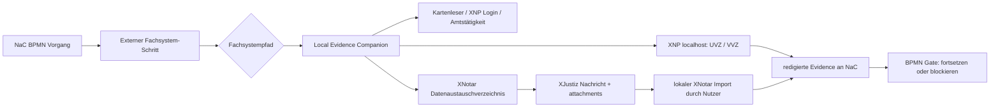

# Notarkammer-Demo: XNP als lokale Fachsystem-Grenze

Stand: 2026-06-20

Diese Demo-Spezifikation beschreibt, wie NaC XNP, XNotar, XJustiz,
Kartenleser und externe Registerpfade im BPMN-Prozessfluss zeigen soll. Ziel
ist ein belastbares Demo-Bild für die Notarkammer: NaC ist 100% notariat,
orchestriert den notariellen Vorgang, aber fachliche BNotK-/Registersysteme
bleiben an ihren offiziellen, lokalen oder dateibasierten Grenzen. XNP ist
dabei die externe notarielle Arbeitsumgebung, nicht ein NaC-Backend.

## Belegte Faktenbasis

- Die BNotK beschreibt XNP als lokale Integrationskante für
  Notariatssoftware. Stand Oktober 2025 sind öffentlich Funktionen für
  Login, UVZ-Suche, UVZ-Abfrage, nächste UVZ-Nummer, UVZ-Anlage,
  Dokumentanhänge zu UVZ-Einträgen sowie VVZ-Suche, VVZ-Abfrage und
  VVZ-Anlage genannt.
- Die XNP-Schnittstelle wird lokal angeboten. XNP startet dafür einen
  lokalen Webserver auf `localhost`; ohne individuelle Konfiguration wird ein
  Port im Bereich 12774 bis 12784 gesucht.
- Für die Login-Funktion sind Login-Informationen, Amtstätigkeitskontext und
  je nach Weg ein lokaler API-Key relevant. Diese Informationen gehören nicht
  in NaC SaaS.
- Für XNotar beschreibt die BNotK keine softwareseitige Schnittstelle, an die
  Vorgangsdaten übergeben und von außen automatisiert importiert werden.
  Grundbuch, Handelsregister und sonstige Anträge werden über ein
  Datenaustauschverzeichnis und XJustiz-Strukturen vorbereitet und dann lokal
  in XNotar importiert.
- XJustiz ist der Standard für den elektronischen Rechtsverkehr und
  beschreibt strukturierte Inhaltsdaten für automatisierte Weiterleitung und
  direkte Datenübernahme.

Quellen:

- BNotK Onlinehilfe, Integration XNP mit Notariatssoftware:
  https://onlinehilfe.bnotk.de/technischer-bereich/systembetreuer/xnp-die-basisanwendung-der-bnotk/integration-xnp-mit-notariatssoftware.html
- BNotK Onlinehilfe, Integration XNP-XNotar mit weiterer Notariatssoftware:
  https://onlinehilfe.bnotk.de/technischer-bereich/systembetreuer/xnotar/integration-xnp-xnotar-mit-weiterer-notariatssoftware.html
- XJustiz:
  https://xjustiz.justiz.de/

## Harte Demo-Grenze

Aus der öffentlichen Dokumentation folgt keine direkte
Grundbuchdatenlieferung aus XNP an NaC. XNP liefert keine Grundbuchdaten an NaC
im Demo-Modell. Für die Demo gilt deshalb nur:

1. NaC darf einen BPMN-Schritt modellieren, der lokalen XNP-/Kartenleser- und
   Amtstätigkeitskontext als Voraussetzung prüft.
2. NaC darf UVZ-/VVZ-nahe Schritte als lokale XNP-Aufgabe mit Evidence
   modellieren, solange keine Secrets, PINs, Login-Token oder Rohdokumente in
   NaC SaaS landen.
3. NaC darf für Grundbuch- und Registerpfade ein XNotar-/XJustiz-Paket oder
   ein Datenaustauschverzeichnis als zu erzeugendes oder zu prüfendes Artefakt
   modellieren.
4. NaC darf eine lokale Nutzerbestätigung modellieren: "Paket wurde lokal in
   XNotar importiert" oder "Rückmeldung wurde lokal erfasst".
5. NaC darf keine direkte XNP-zu-NaC-Grundbuchdatenlieferung behaupten.
6. NaC darf keinen automatisierten externen XNotar-Import-Trigger
   modellieren.
   Für NaC gilt: kein automatisierter externer XNotar-Import-Trigger im
   Demo-Kontrakt.

## Zielarchitektur für BPMN

Der `Local Evidence Companion` läuft auf demselben Arbeitsplatz und im
passenden Benutzerkontext wie XNP. Er ist die einzige Komponente, die lokale
XNP-, Kartenleser- oder Dateipfade prüft. Die SaaS sieht nur redigierte
Evidence, Status und Hashes.

## BPMN-Modellierung

Jeder XNP-/XNotar-bezogene Schritt wird als Service Task oder User Task mit
explizitem Gate modelliert:

| BPMN-Schritt | Systemgrenze | Input | Output | Kritische Abhängigkeit |
| --- | --- | --- | --- | --- |
| Arbeitsplatz prüfen | lokal | XNP-Konfiguration, Kartenleserstatus | Readiness-Evidence | Nutzer, Karte, XNP lokal verfügbar |
| UVZ/VVZ vorbereiten | lokal XNP | Vorgangsmetadaten, Dokumenthashes | lokale XNP-Aktion oder Attestation | XNP Login und Amtstätigkeit |
| Grundbuchantrag vorbereiten | XNotar/XJustiz | fachliche Antragsdaten, Anlagen | XJustiz-Paket im Datenaustauschverzeichnis | Paketvalidierung |
| Handelsregisteranmeldung vorbereiten | XNotar/XJustiz | Registerdaten, Anlagen | XJustiz-Paket im Datenaustauschverzeichnis | Signatur/Freigabe/Import |
| Rückmeldung erfassen | lokal/manuell | externe Rückmeldung oder Nachweis | redigierte Evidence | menschliche Prüfung |

Gate-Regeln fuer die BPMN-Profile:

- Jeder Schritt mit `xnp_local`, `xnotar_xjustiz`, `register_portal` oder
  `land_register_portal` braucht `nac:evidence="required"` oder bleibt
  fail-closed.
- Lokale XNP-, local-notary-workstation- und card-reader-Pruefungen brauchen
  `nac:localExecution="true"` oder eine manuelle Notariatsfreigabe.
- Register- und Grundbuch-Gates werden nur als externe Warte-, Uebergabe- oder
  Nachweispunkte modelliert. Ohne Evidence darf der Folgepfad nicht als frei
  angezeigt werden.
- `durationBand`, `parallelGroup` und `criticalPath` sind Pflichtueberlegungen
  fuer Demo-Readiness: Dauerband fuer die erwartete Abhaengigkeit,
  Parallelgruppe fuer gleichzeitig nachzuhaltende Vollzugsgates und
  kritischer Pfad fuer externe Blocker.

Der kritische Pfad wird nicht durch NaC-Wartezeit allein bestimmt, sondern
durch externe Abhängigkeiten: lokale Anmeldung, Signatur/Karte, XNotar-Import,
Register- oder Grundbuchamt, Nachweise, Zahlung, Genehmigungen und
Zwischenverfügungen.

## Kunden-UI

Die Kunden-UI zeigt keine Providerdetails, keine XNP-Ports, keine lokalen
Dateipfade, keine Register- oder Grundbuchsystemnamen und keine
Kartenleserdiagnose. Der zulässige Status lautet: "Externe notarielle
Arbeitsumgebung erforderlich". Intern darf der Notariatsarbeitsplatz genauer
zwischen `local-notary-workstation`, `card-reader`, `register` und
`land-register` unterscheiden.

## Demo-Aussage

Zulässige Demo-Aussage:

> NaC zeigt im BPMN-Prozess, wann XNP, Kartenleser, XNotar, XJustiz,
> Grundbuch- oder Registerpfade relevant werden. NaC macht diese Schritte
> sichtbar, prüfbar und auditierbar. Die eigentliche XNP-/XNotar-Arbeit
> bleibt lokal und folgt den offiziellen Schnittstellen- und Importgrenzen.

Nicht zulässige Demo-Aussage, sinngemäß:

> NaC erhält Grundbuchinhalte unmittelbar aus XNP oder steuert XNP aus der
> Cloud.

## 1-Stunden-Demo-Schnitt

1. Öffentliche Prozessübersicht zeigen: Immobilienkaufvertrag mit
   parallelen Strängen Grundbuch, Finanzierung, Gemeinde/Steuer und
   Nachweise.
2. BPMN-Detail zeigen: XNP-/Kartenleser-Readiness als lokales Gate.
3. XNotar-/XJustiz-Schritt zeigen: Paket vorbereiten, lokal importieren,
   Evidence zurückführen.
4. Fail-closed zeigen: ohne lokale Readiness oder ohne Evidence bleibt der
   nächste BPMN-Schritt blockiert.
5. Auditsicht zeigen: nur Status, Hashes, Zeitpunkt, Rolle und
   Prüfergebnis; keine PINs, Login-Token, Secrets oder Mandatsinhalte.

## Nächste umsetzbare Tracks

1. BPMN-Profil um External-System-Gates für `xnp_local`, `xnotar_xjustiz`,
   `grundbuch_external` und `register_external` schärfen.
2. Usecase-Modelle für Immobilienkaufvertrag, Grundschuld und
   Handelsregisteranmeldung mit expliziten XNP-/XNotar-Gates anreichern.
3. Demo-UI so erweitern, dass externe Wartezeiten, parallele Stränge und
   kritischer Pfad sichtbar sind.
4. Lokalen Companion als Readiness-Demo ohne Live-XNP-API bauen:
   Konfigurations-/Pfadstatus, Kartenleserstatus, Paketvalidierung,
   redigierte Evidence.
5. Erst nach offizieller Schnittstellendefinition und Sicherheitsfreigabe:
   lokale XNP-REST-Adapter für freigegebene UVZ-/VVZ-Funktionen.
