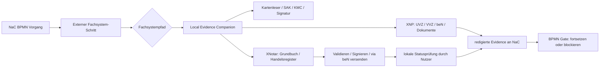

# Notarkammer-Demo: XNP als lokale Fachsystem-Grenze

Stand: 2026-06-20

Diese Demo-Spezifikation beschreibt, wie NaC XNP, XNotar, Kartenleser und
externe Registerpfade im BPMN-Prozessfluss zeigen soll. Ziel
ist ein belastbares Demo-Bild für die Notarkammer: NaC ist 100% notariat,
orchestriert den notariellen Vorgang, aber fachliche BNotK-/Registersysteme
bleiben an ihren offiziellen, lokalen oder dateibasierten Grenzen. XNP ist
dabei die externe notarielle Arbeitsumgebung, nicht ein NaC-Backend.

## Belegte Faktenbasis

- NotarNet beschreibt XNP als Basisanwendung der Bundesnotarkammer. Die
  genannten Module sind UVZ, VVZ, notarielle Onlineverfahren, beN, Dokumente
  mit PDF-Viewer und Signaturmappe, Benutzerverwaltung und Kartenverwaltung.
- Die BNotK-Onlinehilfe beschreibt XNP als Basisanwendung für Anwendungen
  der Bundesnotarkammer und den elektronischen Rechtsverkehr. Die
  XNotar-Module Grundbuch und Handelsregister werden innerhalb der
  XNP-Basisanwendung bereitgestellt.
- NotarNet beschreibt XNotar als Anwendung für elektronischen Rechtsverkehr
  in Register- und Grundbuchangelegenheiten, eNoVA, Geldwäschebekämpfung
  und qeS-Beglaubigung. Genannte Module sind Handelsregister, Grundbuch,
  sonstige Anträge, GWG, eNoVA, qeS und Transparenzregister.
- Die BNotK-Onlinehilfe zeigt für Grundbuchanträge einen geführten Ablauf
  von Grunddaten, Grundstücken, Anträgen, Beteiligten und Dokumenten über
  Validieren, Signieren, PIN/Kartenleser, Versand via beN bis zum Status
  "Versendet".
- Die BNotK-Onlinehilfe zeigt für Registeranmeldungen einen geführten
  Ablauf von Grunddaten, Rechtsträger, Anmeldefällen, Beteiligten und
  Dokumenten über Vorbereitung abschließen, Signieren, SAK/KMC/Kartenleser,
  Versand via beN bis zum Status "Versendet".
- Für Kartenleser verweist die BNotK auf getestete REINER SCT-Geräte. Für
  andere Geräte nennt sie mindestens Sicherheitsklasse 3, Display und eigene
  PIN-Tastatur.
- Details, die diese öffentlichen Quellen nicht belegen, werden im
  Demo-Kontrakt als "zu klären im XNP-Testzugang" markiert.
- Fragen zu SNP, freigegebenen XNP-/SNP-APIs, Testrollen, Testdaten,
  Zertifizierung und Pilotfreigabe werden im ergänzenden
  [ISV-Fragenkatalog](notarkammer-xnp-snp-api-testzugang.md) gesammelt.

Quellen:

- NotarNet, XNP:
  https://notarnet.de/produkte/xnp
- NotarNet, XNotar:
  https://notarnet.de/produkte/xnotar
- BNotK Onlinehilfe, XNP - die Basisanwendung der BNotK:
  https://onlinehilfe.bnotk.de/technischer-bereich/systembetreuer/xnp-die-basisanwendung-der-bnotk.html
- BNotK Onlinehilfe, alle Schritte eines Grundbuchantrags:
  https://onlinehilfe.bnotk.de/einrichtungen/notarnet/xnotar/einstiegshilfen/alle-schritte-eines-grundbuchantrags-auf-einen-blick.html
- BNotK Onlinehilfe, alle Schritte einer Registeranmeldung:
  https://onlinehilfe.bnotk.de/einrichtungen/notarnet/xnotar/einstiegshilfen/alle-schritte-einer-registeranmeldung-auf-einen-blick.html
- BNotK Onlinehilfe, Hinweis zu Kartenlesegeraeten:
  https://onlinehilfe.bnotk.de/einrichtungen/zertifizierungsstelle/hinweis-zu-kartenlesegeraeten.html

## Harte Demo-Grenze

Aus der öffentlichen Dokumentation folgt kein direkter Cloud-Zugriff von NaC
auf XNP, XNotar, beN, Signaturkarte, Kartenleser, Register oder Grundbuch.
NaC behauptet im Demo-Modell keine direkte XNP-zu-NaC-Grundbuchdatenlieferung;
ob und welche lokalen Datenübergaben technisch möglich sind, ist zu klären
im XNP-Testzugang. Für die Demo gilt deshalb nur:

1. NaC darf einen BPMN-Schritt modellieren, der lokalen XNP-/Kartenleser- und
   Amtstätigkeitskontext als Voraussetzung prüft.
2. NaC darf UVZ-/VVZ-nahe Schritte als lokale XNP-Aufgabe mit Evidence
   modellieren, solange keine Secrets, PINs, Login-Token oder Rohdokumente in
   NaC SaaS landen.
3. NaC darf für Grundbuch- und Registerpfade die öffentlich beschriebenen
   XNotar-Schritte als externe notarielle Arbeitsumgebung modellieren:
   Grunddaten, Grundstücke oder Rechtsträger, Anträge oder Anmeldefälle,
   Beteiligte, Dokumente, Validierung, Signatur, Versand via beN und Status.
4. NaC darf eine lokale Nutzerbestätigung modellieren: "Antrag wurde lokal in
   XNP/XNotar bearbeitet", "Versandstatus wurde lokal erfasst" oder
   "Rückmeldung wurde lokal erfasst".
5. NaC darf keine direkte XNP-zu-NaC-Grundbuchdatenlieferung behaupten.
6. Automatisierte Adapter, Import-/Export-Details, lokale Ports, API-Keys und
   produktive Schnittstellenparameter sind zu klären im XNP-Testzugang.

Für die Notarkammer-Demo ist `Immobilienkaufvertrag` der primäre Fluss. An
diesem Prozess werden Grundbuchvollzug, Finanzierung, Gemeinde-/Steuer-Gates,
Löschungsunterlagen, beN-/XNotar-Grenzen und lokale Karten-/Signaturpfade
erklärt. SNP und API-Zugang werden dabei nur als ISV-Klärungsbedarf benannt:
NaC behauptet keinen produktiven XNP-/SNP-Zugriff, keine produktive
Fachsystemautomation und keine Verarbeitung echter Mandatsdaten.

## Zielarchitektur für BPMN

Der `Local Evidence Companion` läuft auf demselben Arbeitsplatz und im
passenden Benutzerkontext wie XNP. Er ist die einzige Komponente, die lokale
XNP-, XNotar-, beN-, Signatur- oder Kartenleserbereitschaft prüft. Die SaaS
sieht nur redigierte Evidence, Status und Hashes. Technische Erreichbarkeit,
Port-/API-Verhalten und Adapterdetails sind zu klären im XNP-Testzugang.

## BPMN-Modellierung

Jeder XNP-/XNotar-bezogene Schritt wird als Service Task oder User Task mit
explizitem Gate modelliert:

| BPMN-Schritt | Systemgrenze | Input | Output | Kritische Abhängigkeit |
| --- | --- | --- | --- | --- |
| Arbeitsplatz prüfen | lokal | XNP-/XNotar-Bereitschaft, SAK/KMC, Kartenleserstatus | Readiness-Evidence | Nutzer, Karte, XNP lokal verfügbar |
| UVZ/VVZ/beN/Dokumente vorbereiten | lokal XNP | Vorgangsmetadaten, Dokumenthashes | lokale XNP-Aktion oder Attestation | XNP-Amtstaetigkeit und Signaturpfad |
| Grundbuchantrag vorbereiten | XNotar innerhalb XNP | Grunddaten, Grundstuecke, Antraege, Beteiligte, Dokumente | Validierung, Signatur, Versandstatus via beN | Paket-/Antragsvalidierung und Signatur |
| Handelsregisteranmeldung vorbereiten | XNotar innerhalb XNP | Grunddaten, Rechtstraeger, Anmeldefaelle, Beteiligte, Dokumente | Vorbereitung, Signatur, Versandstatus via beN | SAK/KMC/Kartenleser, Signatur und Versand |
| Rückmeldung erfassen | lokal/manuell | externe Rückmeldung oder Nachweis | redigierte Evidence | menschliche Prüfung |

Gate-Regeln für die BPMN-Profile:

- Jeder Schritt mit `xnp_local`, `xnotar_xjustiz`, `register_portal` oder
  `land_register_portal` braucht `nac:evidence="required"` oder bleibt
  fail-closed.
- Lokale XNP-, local-notary-workstation- und card-reader-Prüfungen brauchen
  `nac:localExecution="true"` oder eine manuelle Notariatsfreigabe.
- Register- und Grundbuch-Gates werden nur als externe Warte-, Übergabe- oder
  Nachweispunkte modelliert. Ohne Evidence darf der Folgepfad nicht als frei
  angezeigt werden.
- `durationBand`, `parallelGroup` und `criticalPath` sind Pflichtüberlegungen
  für Demo-Readiness: Dauerband für die erwartete Abhängigkeit,
  Parallelgruppe für gleichzeitig nachzuhaltende Vollzugsgates und
  kritischer Pfad für externe Blocker.

Der kritische Pfad wird nicht durch NaC-Wartezeit allein bestimmt, sondern
durch externe Abhängigkeiten: lokale Anmeldung, Signatur/Karte, XNotar-Import,
Register- oder Grundbuchamt, Nachweise, Zahlung, Genehmigungen und
Zwischenverfügungen.

## Kunden-UI

Die Kunden-UI zeigt keine Providerdetails, keine XNP-Ports, keine lokalen
Dateipfade, keine Register- oder Grundbuchsystemnamen und keine
Kartenleserdiagnose. Der zulässige Status lautet: "Externe notarielle
Arbeitsumgebung erforderlich". Intern darf der Notariatsarbeitsplatz genauer
zwischen `local-notary-workstation`, `card-reader`, `register` und
`land-register` unterscheiden. Für Kartenleser dürfen interne
Readiness-Notizen auf REINER SCT, Sicherheitsklasse 3, Display und eigene
PIN-Tastatur verweisen; die Kundenansicht zeigt diese Details nicht.

## Demo-Aussage

Zulässige Demo-Aussage:

> NaC zeigt im BPMN-Prozess, wann XNP, Kartenleser, XNotar, Grundbuch- oder
> Registerpfade relevant werden. NaC macht diese Schritte
> sichtbar, prüfbar und auditierbar. Die eigentliche XNP-/XNotar-Arbeit
> bleibt lokal und folgt den offiziellen Schnittstellen- und Importgrenzen.

Nicht zulässige Demo-Aussage, sinngemäß:

> NaC erhält Grundbuchinhalte unmittelbar aus XNP oder steuert XNP aus der
> Cloud.

## 1-Stunden-Demo-Schnitt

1. Öffentliche Prozessübersicht zeigen: Immobilienkaufvertrag mit
   parallelen Strängen Grundbuch, Finanzierung, Gemeinde/Steuer und
   Nachweise.
2. BPMN-Detail zeigen: XNP-/Kartenleser-Readiness als lokales Gate.
3. XNotar-Schritt zeigen: Grundbuch- oder Registerantrag lokal vorbereiten,
   validieren, signieren, via beN versenden und redigierte Evidence
   zurückführen.
4. Fail-closed zeigen: ohne lokale Readiness oder ohne Evidence bleibt der
   nächste BPMN-Schritt blockiert.
5. Auditsicht zeigen: nur Status, Hashes, Zeitpunkt, Rolle und
   Prüfergebnis; keine PINs, Login-Token, Secrets oder Mandatsinhalte.

## Nächste umsetzbare Tracks

1. BPMN-Profil um External-System-Gates für `xnp_local`, `xnotar_xjustiz`,
   `grundbuch_external` und `register_external` schärfen.
2. Usecase-Modelle für Immobilienkaufvertrag, Grundschuld und
   Handelsregisteranmeldung mit expliziten XNP-/XNotar-Gates anreichern.
3. Demo-UI so erweitern, dass externe Wartezeiten, parallele Stränge und
   kritischer Pfad sichtbar sind.
4. Lokalen Companion als Readiness-Demo ohne Live-XNP-API bauen:
   Konfigurations-/Pfadstatus, Kartenleserstatus, Paketvalidierung,
   redigierte Evidence.
5. Erst nach offizieller Schnittstellendefinition und Sicherheitsfreigabe:
   lokale XNP-REST-Adapter für freigegebene UVZ-/VVZ-Funktionen.
