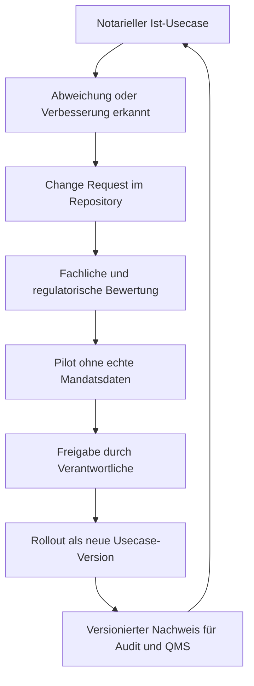

# Fachanwender-Guide: Notariat as Code Ohne IT-Spezialwissen

## Warum Dieses Modell Hilft

Ein Notariat lebt von wiederholbaren Entscheidungen, Fristen, Nachweisen und
klaren Verantwortlichkeiten. Wenn diese Regeln nur in Köpfen, E-Mails oder
einzelnen Fachsystemmasken liegen, entstehen Risiken:

- unklare Zuständigkeiten,
- unvollständige Vorgangs- und Freigabespuren,
- schwere Prüfbarkeit bei Datenschutz, QMS, Audit oder berufsrechtlichen
  Nachweisen,
- hohe Abhängigkeit von Einzelpersonen.

NaC löst dieses Problem, indem notarielle Vorgangsarten versioniert,
freigegeben und dauerhaft nachvollziehbar dokumentiert werden.

Kurz gesagt:

- Das LLM ist die einfache Spracheingabe für Mitarbeitende.
- Git ist das verlässliche Protokoll- und Freigabesystem.
- Python ist die standardisierte Prüfung für wiederholbare Schritte.
- Der Mensch im Notariat bleibt fachlich verantwortlich.

## Warum Usecases Zuerst Gebaut Werden Sollten

Bevor ein Ablauf im Notariat ausgerollt wird, sollte er im Muster sauber
modelliert sein. Sonst werden Fehler erst im Tagesgeschäft sichtbar. Das Muster
liefert:

- klare Rollen,
- eindeutige Statusschritte,
- definierte Freigabepunkte,
- prüfbare Dokumentationspflichten,
- Grenzen für KI, Fachsysteme und echte Mandatsdaten.

Dadurch gilt: Erst Usecase-Design, dann operative Einführung.

## Kanonische Notarielle Bausteine

NaC ist kein Branchenbaukasten. Es gibt keine Beispiele für nicht-notarielle
Unternehmensarten.

Fachliche Beispiele kommen ausschließlich aus dem
[Usecase-Katalog](../../usecases/README.md), unter anderem:

- Immobilienkaufvertrag,
- Unterschriftsbeglaubigung,
- Online-GmbH-Gründung,
- Handelsregisteranmeldung,
- Testament oder Erbvertrag,
- Vorsorgevollmacht und Patientenverfügung.

Das Muster kombiniert:

- gemeinsame Notariatsregeln für Rollen, Freigaben, Nachweise,
  Datenschutz und Versionierung,
- konkrete Usecase-Regeln je Vorgangsart.

## Entscheidungsprinzip Bei Unterschiedlichen Arbeitsweisen

Wenn Notariate unterschiedlich arbeiten, wird das als freigegebene Variante
modelliert, nicht als stille Ausnahme.

Beispiel:

- Variante A: Ein Immobilienkaufvertrag startet mit Grundbuchprüfung vor
  Entwurfsfreigabe.
- Variante B: Ein einfaches Beglaubigungsverfahren startet mit Identitäts- und
  Vertretungsprüfung.

Beide Varianten können gültig sein. Das System dokumentiert, welche Variante
für welchen Standort oder Usecase gilt und seit wann.

## So Startet Ein Nicht-IT-Entscheider Im Notariat

## Schritt 1: Verantwortung Und Zielbild Festlegen

- Benennen Sie fachliche Verantwortliche im Notariat.
- Wählen Sie ein bis drei priorisierte Usecases aus
  [usecases/](../../usecases), zum Beispiel Immobilienkaufvertrag oder
  Unterschriftsbeglaubigung.
- Legen Sie fest, welche Nachweise aus Datenschutz-, Berufsrechts-,
  Haftungs- oder QMS-Sicht zwingend sind.

## Schritt 2: Privaten Notariats-Fork Aufsetzen

- Legen Sie ein eigenes, privates Repository für das Notariat an.
- Nutzen Sie dieses Muster als Vorlage und übernehmen Sie nur passende Teile.
- Definieren Sie Zugriff und Rollen: wer darf vorschlagen, prüfen, freigeben.

## Schritt 3: Erste Notariatsvariante Erstellen

- Klonen Sie das Muster in Ihre Umgebung.
- Passen Sie nur notarielle Usecases und Regeln an den lokalen Betrieb an.
- Starten Sie mit einer Pilotstrecke, etwa Immobilienkaufvertrag oder
  Unterschriftsbeglaubigung ohne echte Mandatsdaten.

## Schritt 4: Freigaberegeln Verbindlich Machen

- In produktiven Notariats-Forks werden Prozesse über Pull Request geändert;
  im aktiven Referenzrepo kann der Owner direkte Lieferung ausdrücklich
  beauftragen.
- Sensible Schritte erhalten Vier-Augen-Freigabe.
- Release-Stände werden versioniert markiert.

## Schritt 5: Betrieb Mit Kontinuierlicher Verbesserung

- Jede Abweichung wird als Change Request dokumentiert.
- Jede Änderung erhält eine Versionsnummer mit Begründung.
- Jede neue Version wird vor Rollout in einer Teststrecke geprüft.

## Kontinuierliches Verbesserungswesen In Git

## Standardisierung Und Zertifizierung

Wenn viele Notariate denselben geprüften Usecase-Stand nutzen, kann ein Verband
oder eine fachliche Prüfstelle eine konkrete Version bewerten und empfehlen.

Mögliches Modell:

- Referenz-Usecase mit klarer Versionshistorie,
- formale Prüfung gegen Qualitäts- und Compliance-Kriterien,
- optionales Zertifikat oder Testat für eine bestimmte Usecase-Version,
- öffentliche Nachweise, welche Version geprüft wurde.

Wichtig:

- Das Zertifikat sollte immer auf eine konkrete Version verweisen.
- Jede Änderung nach Zertifizierung braucht neue Bewertung.
- Notariate dürfen lokal erweitern, verlieren aber ggf. den
  Zertifizierungsstatus für geänderte Teile, bis diese neu geprüft sind.

## Praktische Empfehlung Für Den Start In 90 Tagen

- Woche 1-2: Zielbild, Rollen und ersten Usecase festlegen.
- Woche 3-4: privaten Fork aufsetzen und Freigaberegeln definieren.
- Woche 5-8: Pilot für Immobilienkaufvertrag oder Unterschriftsbeglaubigung
  mit synthetischen Daten durchführen.
- Woche 9-10: lokale Arbeitsplatz-, XNP-, Karten- und Registergates prüfen.
- Woche 11-12: Lessons Learned, Change Requests und erste Version freigeben.

So entsteht ein belastbares, prüfbares und lernfähiges Betriebssystem für
notarielle Vorgangsarten.
