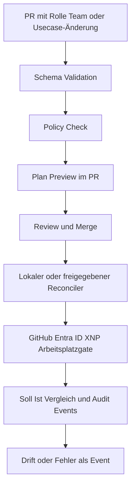

# NaC Enterprise Control Plane MVP Für Notariate (6 Monate)

## Ziel Und Rahmen

Dieses Dokument konkretisiert ein realistisches MVP für `Notariat as Code` im
Modell `NaC + Enterprise GitOps`.

Das MVP schließt einen kleinen, aber vollständigen End-to-End-Kreis:

- deklarative Änderung in Git,
- Policy- und Freigabeprüfung,
- lokale oder freigegebene Reconciliation in Zielsysteme,
- Audit- und Drift-Sichtbarkeit.

Der synchrone Pilotpfad ist `notary`. Nicht-notarielle Produktpfade sind nicht
Teil des MVP.

## MVP-Scope

Fokus:

- Notariatsrollen, Arbeitsplatz-Readiness und Zugriff,
- erster fachlicher Usecase aus [usecases/](../../usecases), bevorzugt
  Immobilienkaufvertrag oder Unterschriftsbeglaubigung,
- technische Change-Typen für Team, Rolle und lokale Zugriffskoordination.

Enthaltene Change-Typen, Schema v1:

- `team`
- `role_change`
- `joiner_mover`

Nicht im MVP:

- autonome notarielle Freigaben,
- echte Mandatsdaten im öffentlichen Repository,
- nicht-notarielle Branchenmodule,
- schreibende Fachsystemadapter ohne gesonderte Freigabe.

## Referenzfluss

## Repository-Zuschnitt Für Den Pilot

- `usecases/` enthält den fachlichen Pilot.
- `policies/` enthält verbindliche Regeln.
- `plugins/` und `workflows/` enthalten geplante oder implementierte
  Notariatsanbindungen.
- [schemas/](../../schemas) enthält maschinenprüfbare Vertragsdefinitionen.

## 6-Monats-Plan

### Monat 1: Modell Fixieren

- Notariats-Scope verbindlich machen.
- Pilot-Usecase auswählen.
- Rollen- und Freigabeminimum prüfbar machen.

### Monat 2: Validation Und Policy

- CI validiert betroffene Schemas.
- Policy Checks liefern PR-fähiges Feedback.
- Plan-Preview wird menschenlesbar.

### Monat 3: Lokaler Reconciler Und Arbeitsplatzgate

- Merge-Ereignis oder lokaler Auftrag startet Reconciliation.
- Arbeitsplatz-, Karten-, XNP- oder Register-Readiness wird metadata-only
  geprüft.
- Audit Trail besteht für jede Ausführung.

### Monat 4: Anbindungen Stabilisieren

- GitHub-, Entra-ID- und Notariatsarbeitsplatzpfade sind dokumentiert.
- Retry, Fehlerklassifikation und Idempotenzpfad sind stabil.

### Monat 5: Observability Und Drift

- Soll/Ist-Abgleich mit klaren Drift-Signalen.
- Dashboard für Durchlaufzeit, Fehler und Governance.

### Monat 6: Pilotbetrieb

- Ein Notariatsbereich arbeitet produktiv über den freigegebenen Flow.
- Ein notarieller Usecase läuft Ende-zu-Ende mit synthetischem oder privatem
  Datenbestand.
- KPI-Review mit Skalierungsentscheidung.

## KPI-Set Für Das MVP

Delivery:

- Lead Time pro Usecase- oder Rollenänderung.
- Anteil validierter Änderungen gegen manuelle Tickets.

Governance:

- Policy Violations pro PR.
- Audit Coverage pro ausgeführter Änderung.

User Value:

- Time-to-readiness für neue Mitarbeitende.
- Time-to-pilot für einen notariellen Usecase.
