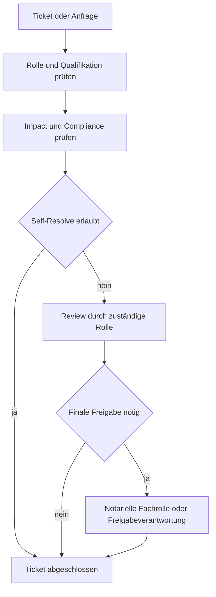

# Rollenmodell: Notariat

## Ziel

Dieses Modell stellt sicher, dass:

- jede Person im zulässigen Rahmen Tickets erstellen kann,
- nur qualifizierte Rollen fachkritische Schritte final entscheiden,
- notarielle Freigaben nachvollziehbar und revisionsfest dokumentiert sind.

## 1) Grundprinzip Im Notariat

- Beobachten darf jede berechtigte Rolle.
- Ein Ticket aufmachen darf jede berechtigte Rolle.
- Selbst lösen darf jede Rolle nur innerhalb ihrer freigegebenen Kompetenz.
- Fachkritische Entscheidungen brauchen qualifizierte Rollen und ggf.
  Vier-Augen-Freigabe.
- Accounts werden provider-qualifiziert als `<provider>:<login>` geführt und
  auf stabile `principal_id`-Werte abgebildet. Rollen und Qualifikationen gehören
  zum Principal. Für das Vier-Augen-Prinzip müssen die `principal_id`-Werte
  verschieden sein; verschiedene Logins desselben Principals zählen nicht als
  verschiedene Personen.
- Ohne konkret zitierte gesetzliche, regulatorische, vertragliche oder
  verbindliche Security-Policy, die für den Vorgang zwei natürliche Personen
  verlangt, ist `OWNER_SOLO_APPROVAL` zulässig und ausdrücklich keine
  Vier-Augen-Freigabe. Ist eine solche Quelle anwendbar und nur ein Principal
  verfügbar, blockiert `BLOCKED_SINGLE_PRINCIPAL` fail-closed.
  Eine Rollenbezeichnung oder ein abstraktes `four_eyes`-Merkmal allein ist
  kein Quellenbeleg für eine externe Zwei-Personen-Pflicht.

Beispiel: Wenn ein Arbeitsplatz-Gate fehlschlägt, muss niemand Notar sein, um
das zu melden. Eine notarielle Freigabe bleibt aber bei der qualifizierten
fachlichen Rolle.

## 2) Mindestrollen

- `mitarbeiter`: darf melden, kommentieren, Status aktualisieren.
- `sachbearbeitung`: darf operative Tickets bearbeiten und abschließen, sofern
  kein fachkritischer Impact besteht.
- `notariatsfachkraft`: darf Vorgangsdaten, offene Angaben und Nachweise
  vorbereiten.
- `notar_fachlich`: darf notarielle Fachentscheidungen treffen.
- `kostenverantwortung`: darf Kosten- und Gebührenfragen prüfen, soweit
  qualifiziert.
- `prozessverantwortung`: darf Arbeitsregeln im Fachprozess freigeben.
- `freigabeverantwortung`: darf approval-pflichtige Schritte final freigeben.
- `revision_audit`: darf prüfen, aber nicht operativ entscheiden.
- `automation`: führt technische Standardaufgaben aus, entscheidet nicht
  fachlich.

## 3) Qualifikation Statt Titel

Entscheidend ist nicht nur die Stellenbezeichnung, sondern die dokumentierte
Qualifikation.

Beispiel:

- `notarial_cost_note_review`: erlaubt nur für Rollen mit
  `qualification: notarial_costs_training`.

## 4) Entscheidungsmatrix

- `impact=low` und `compliance=none`: self-resolve erlaubt.
- `impact=medium` oder `financial=true`: Review durch Prozessverantwortung oder
  Kostenverantwortung.
- `impact=high`, `legal=true` oder notarielle Fachentscheidung: Approval durch
  qualifizierte Fachrolle.

## 5) Workflow-Integration

Technische Pflichtfelder je Prozessantrag:

- `actor_context.actor_role`
- `actor_context.requested_decision_type`
- `actor_context.impact_level`
- `actor_context.compliance_impact`
- optional `actor_context.requested_qualification`
- optional `actor_context.qualification_evidence`
- je nach Entscheidung `actor_context.approver_role`

## 6) Gender Und Rollennamen

Die interne Rollen-ID bleibt neutral und stabil, z. B. `notar_fachlich` als
technische Kennung. Die sichtbare Sprachform folgt
[policies/culture-policy.yaml](../../policies/culture-policy.yaml).
