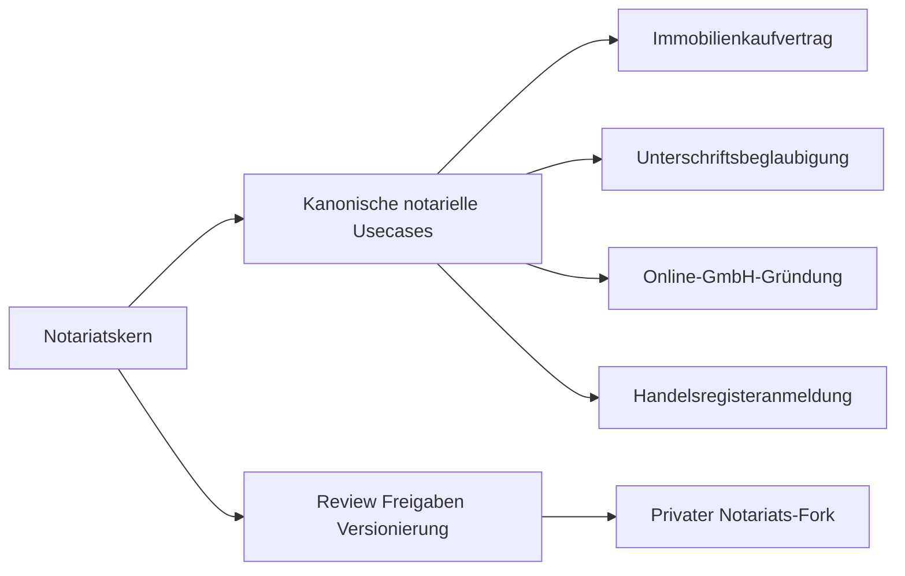

# Blueprint: Notariats-Scope Für NaC

## Ziel

Dieses Blueprint legt die fachliche Grundannahme verbindlich fest:

NaC ist ausschließlich `Notariat as Code`. Das Repository beschreibt keine
nicht-notariellen Produktpfade.

Kanonische fachliche Beispiele stehen nur im [Usecase-Katalog](../../../usecases/README.md).
Dazu gehören unter anderem Immobilienkaufvertrag,
Unterschriftsbeglaubigung, Online-GmbH-Gründung und
Handelsregisteranmeldung.

## Leitprinzip

- `notariat_core` enthält Regeln, die für notarielle Vorgangsarten gemeinsam
  gelten.
- `usecase` enthält nur vorgangsartspezifische Fragen, Dokumente,
  Entscheidungen, Gates und Nachweise.
- Jede wirksame Prozessänderung ist versioniert, geprüft und freigegeben.
- Laufende Vorgänge bleiben auf der beim Start gebundenen Prozessversion.

## Gemeinsame Notariats-Topics

Diese Topics gehören in den gemeinsamen Notariatskern:

1. Rollen, Qualifikation und Freigabepfade im Notariat
2. Vorgangsaufnahme, Aktenanlage und Zuständigkeit
3. Identitäts-, Vollmachts-, Register- und Signatur-Readiness
4. Vorgangsstatus und fachliche Freigabegates
5. Kosten-, Gebühren- und Abschlussnachweise
6. Nachweis, Audit, Archivierung und QMS-Bezug
7. Abweichungs- und Incident-Behandlung

## Usecase-Topics

Usecase-Regeln bleiben in [usecases/](../../../usecases), wenn sie nur eine
notarielle Vorgangsart betreffen:

- `immobilienkaufvertrag`: Grundstück, Beteiligte, Kaufpreis,
  Belastungen, Finanzierung und Vollzug.
- `unterschriftsbeglaubigung`: Identität, Vertretung, Dokumentzweck,
  Registerbezug und Beglaubigungsvermerk.
- `online-gmbh-gruendung`: Gesellschaftsdaten, Gründer, Kapital,
  Geschäftsführung, Registerroute und GwG-Prüfflaggen.
- `handelsregisteranmeldung`: Rechtsträger, Beschluss, Unterzeichner,
  Anlagen, XNP-Route und Einreichungsnachweis.

## Abgrenzungsregel

Eine Regel gehört in `notariat_core`, wenn sie:

- für mehrere notarielle Usecases gleich gilt,
- keine Vorgangsart-spezialisierten Pflichtfelder enthält,
- als Notariatsregel verständlich und prüfbar formuliert werden kann.

Eine Regel gehört in einen `usecase`, wenn sie:

- nur eine konkrete notarielle Vorgangsart betrifft,
- eigene Pflichtdokumente, Prüfgates oder Nachweisartefakte braucht,
- den fachlichen Ablauf eines bestimmten Vorgangs beschreibt.

Nicht-notarielle Fachregeln werden nicht als NaC-Usecases aufgenommen. Falls
eine solche Regel im Repository auftaucht, ist sie entweder ein Altbestand zur
technischen Laufzeitprüfung oder ein Fehler, der über Issue und PR bereinigt
werden muss.

## Strukturmodell

## Versionierung Und Mischbetrieb

- Notariatskern und betroffene Usecases werden gemeinsam als Release im
  privaten Notariats-Fork freigegeben.
- Beim Vorgangsstart wird ein `process_version` gebunden.
- Neue Releases gelten nur für neue Vorgänge.
- Laufende Vorgänge laufen auf gebundener Version zu Ende.

Details stehen in
[parallelbetrieb-version-binding.md](../operations/parallelbetrieb-version-binding.md).
