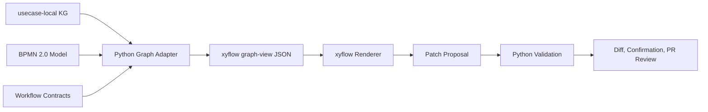

# xyflow- und Frontier-Vertrag für NaC

Datum: 2026-05-26

## Kurzentscheidung

NaC ergänzt die bestehende BPMN- und KG-Architektur um einen contract-first
Graph-View für usecase-lokale Knowledge Graphs, Connector-Abhängigkeiten,
Gates, Evidence und spätere Agenten-Topologien. `bpmn-js` bleibt die
visuelle Bearbeitungsschicht für BPMN-2.0-Prozessmodelle. `xyflow` wird nicht
zur fachlichen Prozessquelle, sondern zu einer optionalen Canvas-Schicht über
einem geprüften JSON-Vertrag.

OpenAI Frontier beeinflusst den Plan als Produktions- und Governance-Maßstab:
Agenten werden in NaC nur als explizit berechtigte, prüfbare und
beobachtbare Ausführungseinheiten behandelt. Chat- oder Canvas-Oberflächen
dürfen Vorschläge, Status und Topologien zeigen, aber nicht ohne
Validierung, Diff, Bestätigung und Review schreiben.

## Kontext

NaC trennt bereits verbindliche Prozessmodelle, usecase-lokale Knowledge
Graphs und lokale Bedienflächen:

- [BPMN-js Business Layer](../../bpmn-js-business-layer.md) macht BPMN 2.0
  zur fachlichen Prozessquelle und `bpmn-js` zur geplanten
  Bearbeitungsschicht.
- [KG-Editor-Workstream](../../kg-editor-workstream.md) stellt usecase-lokale
  Knowledge Graphs als sichere Listen-, Formular- und Checklistenansichten
  bereit.
- [Lokaler Webserver](../../lokaler-webserver.md) bündelt BPMN- und
  KG-Ansichten lokal ohne Mandatsdatenpflicht.
- [OpenAI Enterprise, EU-Datenresidenz und Codex-Kosten](../../openai-enterprise-eu-residency.md)
  beschreibt die OpenAI-bezogenen Datenschutz-, Residency-, Tool- und
  Freigabegrenzen.

`xyflow` ist als React-Flow-/Svelte-Flow-Familie passend für interaktive
Node-basierte Oberflächen. Daraus folgt für NaC: Der Nutzen liegt bei
visualisierten Abhängigkeiten und Bedienkanten, nicht bei einer neuen
fachlichen Wahrheitsschicht.

Die OpenAI-Frontier-Seite beschreibt Unternehmensagenten mit
Unternehmenskontext, Agentenausführung, Evaluierung, Optimierung,
Governance, expliziten Berechtigungen, Audits und Beobachtbarkeit. Daraus
folgt für NaC: Jede spätere Agentenfunktion braucht von Anfang an
Identität, Tool-Scope, Human-Gate, Auditlog und Evaluationsnachweis.

## Ziele

1. Einen maschinenlesbaren Graph-View-Vertrag definieren, der von Python aus
   bestehenden NaC-Artefakten erzeugt werden kann.
2. `xyflow` als austauschbare Rendering-Schicht vorbereiten, ohne es in den
   deterministischen Kern oder die Quality Gates zu ziehen.
3. Agenten- und Connector-Topologien so modellieren, dass OpenAI-Frontier-
   ähnliche Produktionsanforderungen sichtbar werden: Berechtigung,
   Ausführung, Evaluation, Governance und Observability.
4. Bestehende Guardrails erhalten: keine echten Mandatsdaten im Produktrepo,
   keine direkte Bearbeitung von `value`-Feldern, keine Schreibaktion ohne
   Patch, Validierung, Diff und Review.

## Nicht-Ziele

- Kein Ersatz von BPMN 2.0 durch `xyflow`.
- Keine sofortige React-/Vite-Produktapp.
- Kein OpenAI-API-Aufruf aus der Browseroberfläche.
- Keine autonomen Freigaben für notarielle, personenbezogene oder
  berufsrechtlich sensible Schritte.
- Keine Speicherung echter Mandatsdaten, API-Keys, Tokens, PINs,
  Zertifikatsmaterialien oder Registerauszüge im Produktrepo.

## Architektur

Die erste Umsetzung besteht aus drei klaren Grenzen:

1. `nac.xyflow_view` oder ein gleichwertiges Python-Modul erzeugt aus dem
   usecase-lokalen KG und bestehenden Verträgen einen JSON-Graphen.
2. `workflows/contracts/xyflow-graph-view.contract.json` beschreibt
   Schema-Version, Node-Typen, Edge-Typen, erlaubte Aktionen, Datenklassen,
   Guardrails und spätere Rendering-Erwartungen.
3. Die lokale Webapp oder eine spätere ChatGPT-App rendert diesen Vertrag mit
   `xyflow`, behandelt den Graphen aber als Anzeige- und Vorschlagsfläche.

Der kanonische Ablauf bleibt:

## Graph-Modell

Der Vertrag verwendet eine kleine, stabile Typmenge:

| Node-Typ | Bedeutung |
| --- | --- |
| `case` | Usecase oder Vorgangstyp als Root. |
| `information` | Offene Angabe aus dem KG. |
| `document` | Dokumentstatus oder Dokumentanforderung. |
| `decision` | Fachliche Entscheidung mit Status. |
| `gate` | Freigabe-, Datenschutz-, Review- oder Arbeitsplatzgate. |
| `evidence` | Nachweisreferenz oder Auditanker. |
| `bpmn_step` | BPMN-Schritt mit optionaler KG-Referenz. |
| `connector` | Lokales Plugin, Fachsystem, Register- oder Tool-Abhängigkeit. |
| `agent` | Spätere KI-/Codex-/ChatGPT-Agentenrolle mit explizitem Tool-Scope. |
| `eval` | Evaluations- oder Qualitätsnachweis für agentische Schritte. |

Edges bleiben ebenfalls begrenzt:

| Edge-Typ | Bedeutung |
| --- | --- |
| `requires` | Zielknoten ist Voraussetzung. |
| `produces` | Quellknoten erzeugt Zielknoten. |
| `reviews` | Quellknoten prüft oder gibt Zielknoten frei. |
| `blocks` | Zielknoten ist blockiert, bis Quellknoten erfüllt ist. |
| `executes_with` | Schritt nutzt Connector, Tool oder Agent. |
| `evidences` | Zielknoten wird durch Nachweis belegt. |
| `evaluates` | Eval-Knoten bewertet Agent, Tool oder Ergebnis. |

Jeder Node enthält mindestens `id`, `type`, `label`, `status`,
`data_class`, `owner_role`, `source_ref`, `editable`, `requires_review` und
`privacy_boundary`. `value`-Felder aus KGs werden nicht übernommen.

## Datenfluss

Lesefluss:

1. Der Adapter lädt den usecase-lokalen KG über die vorhandenen
   `notary_kg`-Module.
2. Er liest optional BPMN-Schritte und Workflow-Verträge, wenn daraus
   sinnvolle Beziehungen entstehen.
3. Er normalisiert Nodes und Edges in ein UI-neutrales JSON.
4. Tests prüfen, dass keine Mandatswerte, Secrets oder freien Payloads in den
   Graphen gelangen.

Schreibfluss:

1. Die Canvas darf nur erlaubte Vorschläge erzeugen, zum Beispiel Status-,
   Gate- oder Verknüpfungsänderungen.
2. Vorschläge werden als bestehender KG-Editor-Patch oder als neuer
   Graph-Patch formuliert.
3. Python validiert Schema, Datenschutz, Konflikte und Berechtigungen.
4. Die Änderung wird als Diff angezeigt und erst nach Bestätigung per Pull
   Request übernommen.

## Fehler- und Sicherheitsverhalten

- Wenn ein KG, BPMN-Modell oder Vertrag nicht geladen werden kann, liefert
  der Adapter einen erklärten Fehler und keinen Teilgraphen mit stillen
  Lücken.
- Unbekannte Node- oder Edge-Typen werden abgelehnt, nicht frei gerendert.
- Mandatswerte, Secrets und direkte Uploadinhalte sind verbotene Felder.
- Agenten-Nodes ohne `tool_scope`, `human_gate`, `audit_event` und
  `eval_policy` gelten als unvollständig.
- Externe KI-Verarbeitung bleibt durch AVV/DPA-, Datenresidenz-, Retention-
  und Tool-Freigabe geblockt.

## Teststrategie

Die erste Implementierung braucht keine Browserabhängigkeit. Sie wird über
Python-Tests abgesichert:

- Unit-Test für die Graph-Erzeugung aus einem bekannten Usecase.
- Schema-/Vertragsvalidierung für den neuen Workflow-Vertrag.
- Datenschutztest: keine `value`-Felder und keine freien Mandatswerte im
  Graph-JSON.
- CLI-Test für einen späteren Einstieg wie `nac kg graph-view <slug>` oder
  `nac graph view <slug>`.
- Strict-Quality-Gate bleibt Abschlussnachweis.

Browser- und Screenshottests werden erst notwendig, wenn eine konkrete
`xyflow`-Rendering-Schicht in die lokale Webapp oder eine App-Komponente
eingebaut wird.

## Umsetzungsplan Nach Review

1. Vertrag `workflows/contracts/xyflow-graph-view.contract.json` ergänzen.
2. Python-Adapter für `nodes` und `edges` aus `notary_kg` implementieren.
3. CLI-/API-Einstieg hinzufügen, der JSON ausgibt.
4. Tests und Validator in das bestehende Quality Gate integrieren.
5. Dokumentation in Deutsch und Englisch spiegeln, sobald der Vertrag
   implementiert ist.
6. Erst danach eine `xyflow`-Webansicht entwerfen.

## Nachgelagerte Rendering-Entscheidung

Die Rendering-Schicht soll erst nach dem Vertrag entschieden werden. Wenn die
lokale Webapp bei serverseitigem HTML bleibt, kann `xyflow` als schlanke
eingebettete JS-Komponente dienen. Wenn NaC ohnehin eine React-basierte
Operator-Oberfläche bekommt, sollte `@xyflow/react` dort als reguläre
Komponente eingebunden werden. Diese Entscheidung ist bewusst nachgelagert,
weil der Vertrag wichtiger ist als das Framework.
