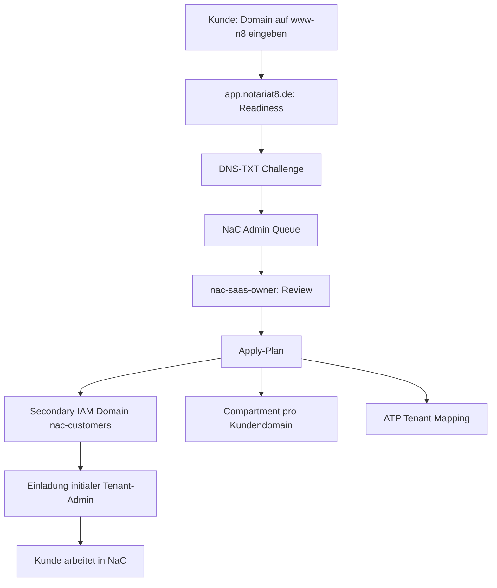

# Customer-Centric Tenant Onboarding Journey Design

Datum: 2026-05-28

Issue: https://github.com/notariat8/NaC/issues/40

## Entscheidung

NaC behandelt das nächste Onboarding nicht als Sammlung einzelner Features,
sondern als durchgehende App-Reise:

1. Ein Neukunde startet auf `www-n8` und gibt seine Domain ein.
2. `app.notariat8.de` führt eine Domain-Readiness mit DNS-Nachweis aus.
3. Die Rolle `nac-saas-owner` arbeitet als SaaS-Admin über eine
   NaC-Admin-Queue.
4. NaC erzeugt einen prüfbaren Apply-Plan für OCI Identity, Compartment,
   ATP-Tenant-Mapping und initiale Einladung.
5. Der Kunde arbeitet nach der Einladung in NaC, nicht in der OCI Console.

Die Startarchitektur nutzt eine gemeinsame Notariat8-SaaS-Tenancy. Die
`Default` Identity Domain bleibt der SaaS-Administration und Break-glass
vorbehalten. Kundenbenutzer melden sich über eine Secondary Identity Domain
für NaC-Kunden an. Die Ressourcen- und Betriebsgrenze wird über ein
Compartment pro Kundendomain vorbereitet. Die ATP-Datenhaltung startet als
gemeinsame NaC-Datenbank mit expliziter Tenant-Isolation und kann später auf
Schema-, Datenbank- oder Child-Tenancy-Isolation eskalieren.

## Quellenrahmen

Oracle beschreibt Organization Management als Werkzeug für zentrale Verwaltung
mehrerer Tenancies, Child Tenancies, Subscriptions und Governance-Regeln:
<https://docs.oracle.com/en-us/iaas/Content/General/organization/home.htm>.

Oracle empfiehlt mehrere Tenancies vor allem für starke Isolation; wenn diese
Isolation nicht erforderlich ist, sollen Compartments zur Workload-Trennung
geprüft werden:
<https://docs.oracle.com/en-us/iaas/Content/General/organization/organization_planning.htm>.

Compartments sind logische Ressourcengruppen und Policy-Scopes. Sie haben
keine eigenen Benutzer, Gruppen oder Policies; Identitäten leben in IAM, das
Compartment begrenzt, worauf Gruppen Rechte ausüben dürfen:
<https://docs.oracle.com/en/cloud/foundation/cloud_architecture/governance/compartments.html>.

Identity Domains verwalten Benutzer, Gruppen, Federation, SSO/OAuth,
Sicherheitsregeln und Anwendungen. Jede Tenancy hat eine `Default` Domain; man
kann zusätzliche Domains für getrennte Benutzerpopulationen oder Anwendungen
erstellen:
<https://docs.oracle.com/en-us/iaas/Content/Identity/domains/overview.htm>.

Beim Erstellen einer Identity Domain müssen Typ, Compartment, Name und
gegebenenfalls ein Domain-Administrator bestimmt werden. Zusätzliche Domains
werden nicht automatisch in alle Regionen repliziert:
<https://docs.oracle.com/en-us/iaas/Content/Identity/domains/to-create-new-identity-domain.htm>.

Identity-Domain-Typen haben unterschiedliche Funktionen, Limits und Metering.
Die Free Domain erlaubt Benutzer- und Gruppenverwaltung, hat aber niedrigere
Objekt- und API-Limits als Premium- oder External-User-Domains:
<https://docs.oracle.com/en-us/iaas/Content/Identity/sku/overview.htm>.

Autonomous Database unterstützt IAM-Integration auch mit Default- und
Non-Default-Domains. IAM-Policies können Zugriff auf Autonomous Database in der
Tenancy, im Compartment oder auf einzelne Datenbanken begrenzen:
<https://docs.oracle.com/en-us/iaas/autonomous-database/doc/manage-users-iam.html>.

## Zielbild

## Kunden-Workflow

1. Der Kunde öffnet `www-n8`.
2. Der Kunde gibt eine Domain ein und klickt `Readiness vormerken`.
3. `www-n8` übergibt nur unverbindliche Hinweise an `app.notariat8.de`.
4. NaC zeigt eine Readiness-Seite mit Domain, abgeleitetem Tenant-Slug und
   erforderlicher Admin-E-Mail derselben Domain.
5. NaC erzeugt eine DNS-TXT-Challenge ohne Secret im Repository.
6. Der Kunde trägt den DNS-TXT-Eintrag bei seinem DNS-Anbieter ein.
7. NaC prüft die Domain und markiert die Anfrage als `domain_verified`.
8. Nach SaaS-Admin-Freigabe erhält der initiale Tenant-Admin eine Einladung.
9. Der Tenant-Admin meldet sich in NaC an und verwaltet Benutzer und Rollen in
   NaC. Die OCI Console bleibt für Endkunden unsichtbar.

## SaaS-Admin-Workflow

1. `nac-saas-owner` sieht neue Readiness-Anfragen in der NaC-Admin-Queue.
2. NaC zeigt Domain, Admin-E-Mail, DNS-Status, AVV-/Vertragsstatus,
   Risiko-Gates und den aktuellen Apply-Plan.
3. Der SaaS-Admin prüft, ob die Domain plausibel, kontrolliert und vertraglich
   freigegeben ist.
4. NaC erzeugt einen Apply-Plan mit:
   - Tenant Registry Record,
   - Identity-Gruppen und initialem Admin,
   - Compartment-Namen und Tags,
   - ATP-Tenant-Mapping,
   - Audit-Event und Rollback-Plan.
5. Produktive Applies brauchen Owner-Freigabe. Ohne Freigabe bleibt der Plan
   ein Review-Artefakt.
6. Nach Apply erhält der Kunde eine Einladung; `nac-saas-owner` bleibt
   SaaS Owner, arbeitet aber nicht als operativer Kundenadmin.

## OCI-Entscheidung

### Start: eine Secondary IAM Domain für Kunden

Für den MVP genügt eine Secondary Identity Domain, zum Beispiel
`nac-customers`, mit einem OIDC-App-Client für `app.notariat8.de` und Gruppen
pro Tenant:

- `tenant/<slug>/admin`
- `tenant/<slug>/notary`
- `tenant/<slug>/case-worker`
- `tenant/<slug>/auditor`
- `tenant/<slug>/billing-viewer`

Die `Default` Domain bleibt für `nac-saas-owner`, Break-glass und
OCI-SaaS-Administration reserviert.

### Start: ein Compartment pro Kundendomain

Ein Compartment pro Kundendomain ist der richtige Resource-Scope für
kundenbezogene OCI-Ressourcen, Budgets, Quotas, Tags, Object Storage,
Audit-Exports und spätere dedizierte Services. Ein Compartment ersetzt keine
IAM Domain und keine Datenbank-Tenant-Isolation; es ist der OCI-Ressourcenrahmen.

### Start: gemeinsame ATP mit Tenant-Isolation

Die erste ATP-Variante ist eine gemeinsame NaC-ATP-Instanz mit explizitem
Tenant-Mapping:

- `tenant_id` als Pflichtfeld in mandantenbezogenen Tabellen,
- `tenant_registry` als Steuerungstabelle,
- NaC-App als einzige Datenbank-Zugriffsschicht,
- keine direkten Kunden-Datenbankzugänge,
- später optional Schema pro Tenant oder dedizierte ATP pro Tenant.

Wenn IAM-Token-Zugriff auf ATP später erforderlich wird, kann NaC
IAM-Gruppen aus Default- oder Non-Default-Domains auf Datenbankrollen oder
globale Benutzer mappen. Für den App-MVP bleibt diese Komplexität außerhalb
des ersten Apply.

## Eskalationsregeln

Eine eigene IAM Domain pro Kunde wird erst nötig, wenn ein Kunde eigene
Sign-on-Policies, eigene Federation, eigene Admin-Delegation oder streng
getrennte App-Registrierungen braucht.

Eine Child Tenancy wird erst nötig, wenn starke Isolation, getrennte
Service-Limits, eigene Netzwerke, eigene Governance-Regeln, eigene Abrechnung
oder klare vertragliche Exit-Isolation verlangt werden.

Eine dedizierte ATP pro Kunde wird erst nötig, wenn Datenresidenz,
Performance, Restore, Exit, Schlüsselmanagement oder vertragliche
Mandantentrennung die gemeinsame ATP übersteigen.

## Grenzen

- Keine Mandatsdaten auf `www-n8`.
- Keine OCI Console für Kundenbenutzer.
- Keine produktiven OCI-Schreiboperationen ohne separaten Owner-Apply.
- Keine Secrets, API Keys, Private Keys, Tokens oder Passwörter in GitHub.
- Kein Child-Tenancy-Default für den MVP.
- Keine direkte Kunden-DB-Nutzung im MVP.

## Akzeptanz

- Die Journey ist aus Kundensicht und SaaS-Admin-Sicht vollständig beschrieben.
- Die OCI-Startentscheidung ist nachvollziehbar und quellenbasiert.
- Das ATP-Zielbild bildet Tenant-Isolation ab, ohne sofort dedizierte
  Datenbanken zu erzwingen.
- Der nächste Implementation-Track kann daraus konkrete Views, APIs,
  Apply-Pläne und Tests ableiten.
