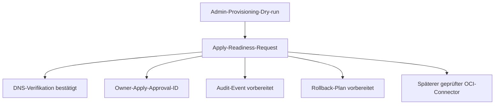

# OCI Identity Apply-Readiness Design

Diese Spezifikation erweitert das OCI Identity Tenant-Onboarding um eine
prüfbare Apply-Readiness-Schicht. Sie bereitet produktive Identity-Writes vor,
führt sie aber nicht aus.

## Ziel

NaC soll aus einem bestehenden OCI-Admin-Provisioning-Dry-run einen
Apply-Request ableiten können. Dieser Request ist ein Review-Artefakt für
Owner, Audit und späteren Connector-Code. Er enthält keine Credentials,
Private Keys, OAuth-Secrets oder Tokens und ruft keine OCI-Schreiboperation
auf.

## Designentscheidung

Der Track baut einen geschlossenen Drei-Schritt-Pfad:

1. `nac tenant provision-admin --dry-run` erzeugt wie bisher den technischen
   Plan.
2. Ein neuer Apply-Readiness-Builder prüft DNS-Verifikation, Owner-Approval,
   Audit-Event-ID und Rollback-Plan.
3. `nac tenant apply-request --dry-run` gibt ein maschinenlesbares
   Review-Artefakt aus.

Produktive Ausführung bleibt absichtlich außerhalb dieses PRs. Ein späterer
Connector darf erst schreiben, wenn die Apply-Readiness vollständig ist und ein
separater Owner-Apply freigegeben wurde.

## Vertragsgrenze

Der bestehende Vertrag `oci-tenant-identity.contract.json` wird erweitert:

- `apply_readiness_schema`
- erforderliche Gates `dns_verified`, `owner_apply_approval`,
  `audit_event_prepared`, `rollback_plan_prepared`
- Blocker für direkte OCI-Writes ohne Apply-Request
- explizite Aussage, dass Apply-Requests keine Credentials enthalten dürfen

## Datenfluss

## Akzeptanzkriterien

- `build_apply_request(...)` erzeugt ein deterministisches Artefakt mit
  `schema_version: nac.oci-identity-apply-request/v0.1`.
- Ohne DNS-Verifikation, Owner-Approval, Audit-Event oder Rollback-Plan ist
  `ready_to_apply` immer `false`.
- Das Artefakt enthält keine Secrets, Tokens oder Private-Key-Marker.
- `nac tenant apply-request --dry-run` ist über die zentrale CLI erreichbar.
- `scripts/validate_oci_tenant_identity.py` prüft die neue Apply-Grenze.
- Der strikte Quality Gate bleibt grün.
