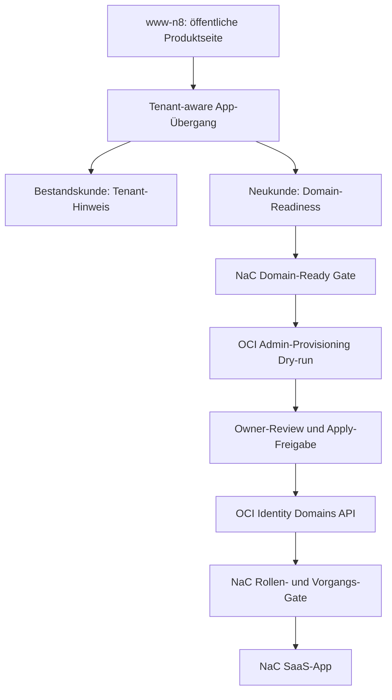

# OCI Tenant Identity Design

Diese Spezifikation beschreibt den ersten echten SaaS-Übergang von der
öffentlichen `www-n8`-Welt in die NaC-Plattform. Sie ersetzt die bisherige
Microsoft-IdP-Annahme für diesen Track durch Oracle OCI Identity Domains.

## Ziel

`www-n8` bleibt die öffentliche Produkt- und Informationsseite. NaC wird die
authentifizierte SaaS-Plattform für notarielle Arbeit. Der Übergang ist
tenant-aware: Bestandskunden landen mit Tenant-Hinweis in der App,
Neukunden durchlaufen zuerst eine Domain-Readiness-Prüfung.

Der produktive IdP ist Oracle OCI Identity Domains. Endbenutzer arbeiten nicht
in der OCI Console. NaC verwaltet fachliche Rollen, Tenant-Bindung und spätere
Benutzerverwaltung über eigene Bedienflächen und geprüfte API-Verträge.

## Quellenlage

Oracle beschreibt die Identity Domains REST API als SCIM-2.0-kompatible
Schnittstelle zur Verwaltung von Benutzern, Gruppen und Apps:
<https://docs.oracle.com/en/cloud/paas/iam-domains-rest-api/index.html>.

Benutzer werden über `/admin/v1/Users` verwaltet; das Erstellen verlangt laut
Oracle geeignete Identity-Domain- oder User-Administrator-Berechtigungen:
<https://docs.oracle.com/en/cloud/paas/iam-domains-rest-api/api-identity-users.html>.

Gruppen werden über `/admin/v1/Groups` verwaltet und dienen als Rollenanker:
<https://docs.oracle.com/en/cloud/paas/iam-domains-rest-api/api-identity-groups.html>.

Die OCI CLI dokumentiert Identity-Domain-Endpunkte nach dem Muster
`https://<domainURL>/admin/v1/`:
<https://docs.oracle.com/en-us/iaas/tools/oci-cli/latest/oci_cli_docs/cmdref/identity-domains.html>.

Für spätere visuelle Tenant- und Rollenflüsse ist `xyflow` geeignet, weil
React-Flow-Nodes normale React-Komponenten sind und über `nodeTypes` fachliche
Node-Typen registriert werden können:
<https://reactflow.dev/examples/nodes/custom-node>.

## Architektur

Die erste Implementierung liefert keine produktiven OCI-Schreibzugriffe. Sie
liefert eine prüfbare Vertrags- und Dry-run-Schicht:

- Domain-Readiness prüft Domain-Syntax, Tenant-Slug, Admin-E-Mail-Domain und
  erzeugt einen DNS-TXT-Verifikationsvorschlag ohne Secret.
- OCI-Admin-Provisioning erzeugt einen Plan für Benutzer, Gruppen und
  Mitgliedschaften, schreibt aber nicht gegen OCI.
- NaC-Web/API und CLI geben die gleichen Payloads aus.
- `www-n8` verlinkt bewusst in diesen Prozess, speichert aber keine Tokens,
  Mandatsdaten, Rohdokumente oder OCI-Details.

## Daten- Und Rollenmodell

Der Tenant wird über einen stabilen Slug adressiert. Der Slug ist kein Secret.
Die Domain ist die fachliche Kunden-Domain, zum Beispiel
`kanzlei-notariat.example`. Die Admin-E-Mail muss zur Domain passen, damit
keine privaten Freemail- oder Fremddomain-Konten als initialer Tenant-Admin
gesetzt werden.

NaC kennt für diesen Track folgende fachliche Rollen:

- `nac-tenant-admin`
- `nac-notary`
- `nac-case-worker`
- `nac-auditor`
- `nac-billing-viewer`

OCI-Gruppen sind nur technische IdP-Anker. Die fachliche Entscheidung bleibt im
NaC-Rollen- und Vorgangs-Gate.

## Sicherheitsgrenze

Produktive Identity-Writes sind in diesem Track verboten. Zulässig sind:

- lokale Validierung,
- read-only OCI-Diagnostik,
- Dry-run-Payloads,
- Review-Artefakte im Pull Request.

Nicht zulässig sind:

- OCI-Benutzer oder Gruppen ohne separaten Owner-Review anzulegen,
- Client-Secrets, API-Keys, Tokens oder Private Keys im Repo zu speichern,
- Endbenutzern OCI-Console-Arbeitsschritte zuzumuten,
- echte Mandatsdaten in `www-n8`, Demo-Payloads oder PR-Beschreibungen zu
  verwenden.

## Akzeptanzkriterien

- `nac tenant domain-check` liefert deterministische JSON-Ausgabe.
- `nac tenant provision-admin --dry-run` liefert einen OCI-Identity-Plan mit
  `requires_human_approval: true`.
- Web-API-Routen liefern dieselben Payloads.
- `nac contracts validate` prüft den neuen Vertrag mit.
- `docs/de` und `docs/en` spiegeln das Betriebsmodell ohne Microsoft-IdP-First-Annahme.
- `www-n8` enthält einen tenant-aware Übergang zur NaC-App und keinen
  Mandatsdatenpfad.
- Quality Gate läuft im strikten Profil.
