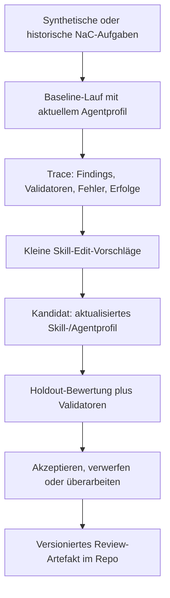

# NaC Builder SkillOpt Pilot Design

Datum: 2026-06-14

```nac-spec-traceability
schema_version: nac.spec-traceability/v0.1
spec_id: nac-builder-skillopt-pilot
leading_issue: thread:2026-06-14-skillopt-pilot
risk_gate: Agentic Development Harness
delivery_mode: Design first, protected PR before implementation
acceptance_ids:
  - AC-001
  - AC-002
  - AC-003
  - AC-004
  - AC-005
  - AC-006
  - AC-007
validation_commands:
  - /home/ubuntu/.venvs/nac/bin/python scripts/validate_language_parity.py
  - /home/ubuntu/.venvs/nac/bin/python scripts/validate_doc_links.py
  - /home/ubuntu/.venvs/nac/bin/python scripts/validate_spec_traceability.py
```

Diese Spezifikation beschreibt einen kleinen, kontrollierten Pilot für
SkillOpt-ähnliche Optimierung beim Erstellen und Prüfen von NaC. Der Pilot
verbessert nicht den späteren Notariatsbetrieb, sondern die repo-lokalen
Arbeitsanweisungen, mit denen Codex NaC baut, prüft und dokumentiert.

## Ziel

NaC soll wiederkehrende Fehler in agentischen Entwicklungs- und Reviewläufen
systematisch in bessere Skill- und Agentprofil-Anweisungen überführen. Das
Ziel ist ein kompakter, versionierter NaC-Builder-Skill oder ein geschärftes
Agentprofil, das nachweislich weniger Doku-, Governance- und Paritätsfehler
macht als der heutige Stand.

Der Pilot bleibt absichtlich klein. Er beginnt mit dem Profil
`nac_docs_parity_reviewer`, weil dessen Erfolg vergleichsweise gut messbar ist:
Deutsch/Englisch-Parität, Linkstatus, öffentliche Sprachregeln,
Styleguide-Beachtung und Quality-Gate-Abdeckung.

## Designentscheidung

NaC übernimmt nicht sofort einen vollständigen automatischen SkillOpt-Loop.
Stattdessen entsteht zuerst ein manuell geführter SkillOpt-light-Prozess:

1. synthetische oder historische NaC-Aufgaben als Benchmark sammeln;
2. den heutigen Skill oder das heutige Agentprofil auf diesen Aufgaben
   ausführen;
3. wiederkehrende Fehler und robuste Erfolgsweisen aus den Traces ableiten;
4. kleine Add-, Delete- oder Replace-Edits am Skill vorschlagen;
5. Edits nur übernehmen, wenn Holdout-Aufgaben und relevante Validatoren
   mindestens gleich stabil und in der Zielmetrik besser laufen;
6. akzeptierte und verworfene Edits als Review-Artefakte dokumentieren.

Damit bleibt der Zielagent unverändert. Trainiert wird nur ein lesbares
Markdown- oder TOML-Artefakt im Repository.

## Abgrenzung Zum Späteren Betrieb

Der Pilot betrifft ausschließlich die Erstellung, Wartung und Review von NaC.
Er darf keine echten Vorgänge, keine echten Mandatsdaten und keine produktiven
notariellen Entscheidungen optimieren.

Erlaubt sind:

- synthetische NaC-Aufgaben;
- frühere Repo-Aufgaben ohne Mandatsdaten;
- Validator-Ausgaben;
- Git-Diffs;
- Review-Kommentare;
- öffentliche oder repo-interne Dokumentation ohne Secrets.

Nicht erlaubt sind:

- echte Mandatsdaten;
- echte personenbezogene Daten;
- PINs, Passwörter, Tokens, API-Keys oder geheime Links;
- automatisches Mergen von Skill-Edits;
- Ableitung notarieller Wahrheit aus Modell- oder Skill-Ausgaben.

## Pilotumfang

Der erste Pilot optimiert nur `nac_docs_parity_reviewer`. Die Benchmark-Aufgaben
decken diese Fälle ab:

- deutsche Dokuänderung braucht passende englische Spiegelung;
- öffentliche Begriffe müssen dem Agent Style Guide entsprechen;
- neue Workflow- oder Plugin-Dokumente brauchen passende Contract- und
  Gantt-Hinweise;
- Links und relative Pfade müssen nach Umstrukturierungen weiter stimmen;
- Quality-Gate- oder Validator-Hinweise müssen in der Reviewempfehlung
  erscheinen.

Der Pilot soll mit 15 bis 30 Aufgaben starten. Davon dienen etwa zwei Drittel
als Trainingsfälle und ein Drittel als Holdout-Auswahl. Die Aufgaben enthalten
erwartete Findings, erwartete Nicht-Findings und passende Prüfbefehle.

## Bewertungsmodell

Jeder Lauf erzeugt ein einfaches Bewertungsartefakt:

- erkannte Pflicht-Findings;
- fälschlich gemeldete Findings;
- vergessene Validatoren;
- Verletzungen von Daten- oder Review-Grenzen;
- Ergebnis der relevanten Prüfbefehle.

Ein Skill-Edit ist nur akzeptierbar, wenn er auf den Holdout-Aufgaben weniger
kritische Fehler verursacht und keine neue Guardrail-Verletzung einführt.
Gleichstand ist nur zulässig, wenn der Skill dadurch kürzer, klarer oder
leichter prüfbar wird.

## Datenfluss



## Artefakte

Der Pilot erzeugt später voraussichtlich diese Artefakte:

- ein kurzes Benchmark-Manifest mit Aufgaben-IDs, Scope, erwarteten Findings
  und Prüfbefehlen;
- ein Bewertungsformat für Baseline- und Kandidatenläufe;
- einen abgelehnten-Edit-Puffer als Markdown- oder JSONL-Nachweis;
- einen akzeptierten Skill- oder Agentprofil-Diff;
- einen kurzen Reviewbericht für die menschliche Freigabe.

Diese Spezifikation führt noch keinen neuen Runner und keine neue Automation
ein. Sie beschreibt die fachliche und technische Grenze für den nächsten
Implementierungsplan.

## Fehlerbehandlung

Wenn ein Kandidat eine Guardrail verletzt, wird er verworfen, auch wenn er mehr
Findings erkennt. Wenn die Holdout-Bewertung uneindeutig ist, bleibt der
bisherige Skill gültig. Wenn ein Skill-Edit eine Regel nur deshalb verbessert,
weil er auf konkrete Aufgaben-IDs oder Beispieltexte überpasst, wird er als
Overfitting verworfen.

## Akzeptanzkriterien

- AC-001: Der Pilot ist ausdrücklich auf NaC-Erstellung und NaC-Review begrenzt.
- AC-002: `nac_docs_parity_reviewer` ist das erste Zielprofil.
- AC-003: Benchmark-Fälle verwenden nur synthetische oder repo-zulässige Daten.
- AC-004: Jeder akzeptierte Skill-Edit braucht eine Holdout-Begründung, einen Git-Diff
  und menschliche Review.
- AC-005: Verworfene Edits bleiben als negative Beispiele nachvollziehbar.
- AC-006: Der Pilot darf keine produktiven Schreibaktionen, keine echten Mandatsdaten
  und keine automatische Freigabe enthalten.
- AC-007: Der spätere Implementierungsplan kann mit einem manuellen SkillOpt-light-
  Harness beginnen und muss keinen vollständigen Optimizer bauen.

## Quellenbezug

Der Pilot orientiert sich an SkillOpt als textbasierter Optimierung von
Agent-Skills mit begrenzten Edits, Validierungs-Gate und wiederverwendbarem
Skill-Artefakt. Für NaC wird daraus bewusst nur eine auditierbare
Entwicklungs- und Review-Harness abgeleitet.
