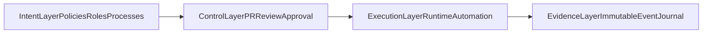
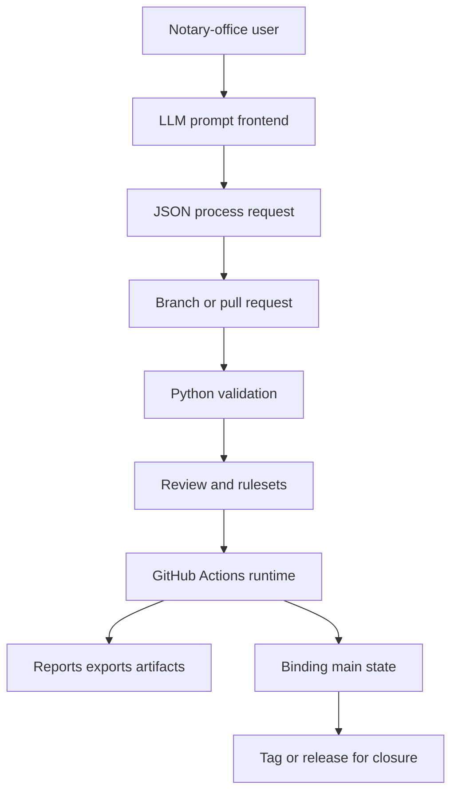
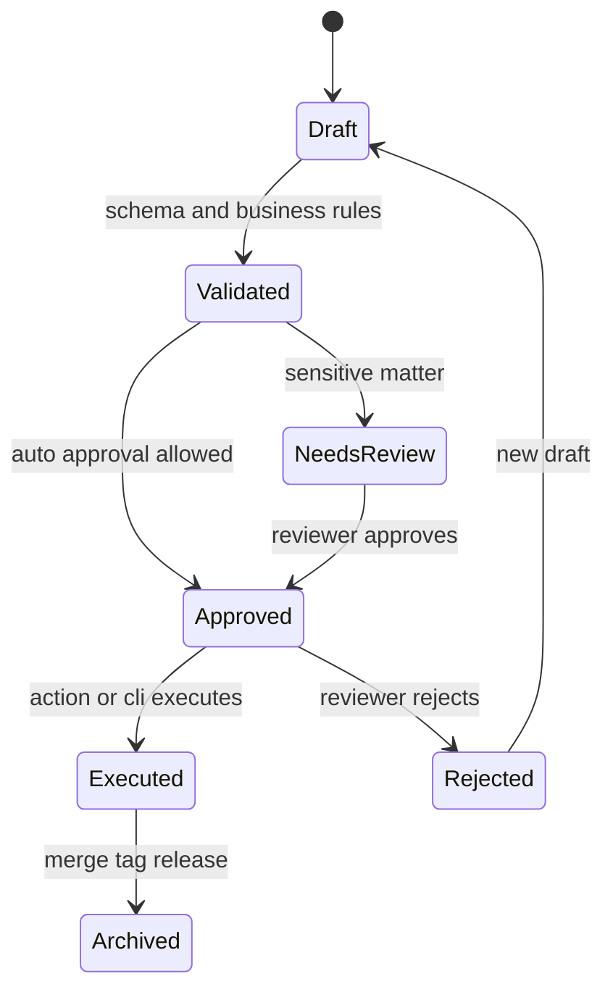
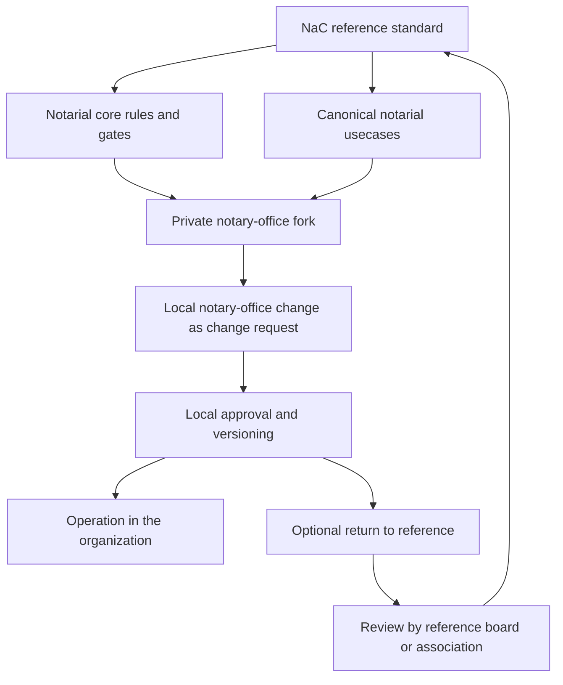

# Architecture

## Architecture Frame

This architecture follows the `Notariat as Code` model with `Enterprise GitOps`
as the control principle. `NaC` is the concrete implementation of this frame.

Reference: [docs/en/organization-as-code-positioning.md](organization-as-code-positioning.md)

The operational execution model with office UI and checkable core is described in
[docs/en/ausfuehrungsmodell.md](ausfuehrungsmodell.md).

## Layers

1. `Prompt Frontend`
   An LLM or bot receives natural-language requests and fills standardized
   process requests.
2. `Git Control Plane`
   Branches, pull requests, reviews, rulesets, tags and releases manage the
   official lifecycle.
3. `Python Execution Plane`
   The engine validates schemas, checks state transitions, computes derived
   values and creates summaries.
4. `Automation Plane`
   GitHub Actions execute PR checks, periodic processes and approval gates.
5. `Plugin and Connector Plane`
   Local plugin and connector adapters create plan previews, execute approved
   changes idempotently and write audit evidence back.
6. `Client And Agent Governance Plane`
   Office 365 / Microsoft 365 is the mandatory client and workstation layer.
   Microsoft Agent 365 Agent Registry is the target-architecture Preview
   governance anchor for external agent surfaces.

## NaC Layer Mapping

## Data Flow

## Data Sovereignty

Git is the control and template plane for code, IaC, governance, BPMN process
definitions and synthetic demo data. ATP is the runtime data plane for tenants,
user bindings, sessions, matter/case metadata, process instances, process
events and audit metadata.

Productive mandate data is not stored in Git. Concrete process instances
reference approved Git template versions, but run in ATP. ATP is not treated as
a SQL-only subject-matter model: relational anchors, JSON payloads and graph or
ontology projections are kept separate. The detailed decisions are documented in
[data-sovereignty-git-vs-atp.md](architecture/data-sovereignty-git-vs-atp.md)
and
[atp-graph-runtime-model.md](architecture/atp-graph-runtime-model.md). The
first runtime storage contract is documented in
[atp-runtime-storage-contract.md](architecture/atp-runtime-storage-contract.md).

## Subject-Matter State Machine

## Control Through GitHub Actions

### `validate-process.yml`

- starts on `pull_request` and `workflow_dispatch`,
- validates changed process files,
- creates a readable summary for reviewers.

### `run-process.yml`

- allows a targeted manual run for one matter,
- uses the Python CLI entry point,
- is suitable for bot calls from an LLM frontend.

The local operator webapp is an operator channel for workstation gates. It does
not execute NaC remotely. It talks to a `127.0.0.1` bridge started through
`nac operator --open`; the bridge runs approved local check scripts in the
workspace and returns minimized readiness metadata.

## Office 365 Client And Agent Governance

Office 365 is the mandatory client side of the target architecture. NaC
therefore plans Microsoft 365-adjacent work surfaces such as OneDrive,
SharePoint, Outlook and Teams as possible operating and evidence edges, without
placing subject-matter truth or mandate data there without checks.

Microsoft Agent 365 Agent Registry is included as a governance layer for
agentic integrations. The Microsoft Learn source
[Registry sync in the Microsoft 365 Agent Registry](https://learn.microsoft.com/de-de/microsoft-agent-365/admin/agent-registry)
describes Agent Registry Sync as a Preview feature in the Microsoft 365 Admin
Center for central visibility and governance of external agent environments,
including Amazon Bedrock, Google Vertex AI, Salesforce Agentforce and
Databricks Genie.

For NaC, adding this registry to the target architecture is not a current deploy step.
The current technical deployment remains OCI/App Release Overlay;
OCI Identity Domains remains the current SaaS IdP layer. Agent Registry is a
target-state control and review anchor for future NaC agents, MCP connectors
and external agent platforms.

The productive agentic runtime is
[NVIDIA NeMo Agent Toolkit / AI-Q](architecture/nemo-agent-toolkit-aiq-m365.md).
Microsoft 365 data from Outlook, Teams, OneDrive and SharePoint is connected
to NaC through Microsoft Graph and matter-, role- and purpose-bound MCP
servers. NemoClaw/OpenClaw remains target-control and sandbox evidence unless
a separate owner gate makes a different runtime decision.
MVP storage is defined in the
[Teams SharePoint Graph Data Plane](architecture/teams-sharepoint-graph-data-plane.md):
one Teams team per notary team, connected Microsoft 365 group, SharePoint team
site as storage and Microsoft Graph REST only.

### `monthly-close.yml`

- runs periodically or manually,
- aggregates bookings and invoices for a monthly close,
- creates a closing report as an artifact.

## Governance Mapping

- Pull request: subject-matter request.
- Review: human approval.
- Environment: hard approval point for sensitive processes.
- Ruleset: repository-wide enforcement rule.
- Tag: versioned closure.
- Release artifact: externally auditable derivative.

## Reference, Fork And Return Flow

Operational details are maintained in:

- [docs/en/operations/fork-and-release-operating-model.md](operations/fork-and-release-operating-model.md)
- [docs/en/operations/release-sync-playbook.md](operations/release-sync-playbook.md)
- [docs/en/operations/parallelbetrieb-version-binding.md](operations/parallelbetrieb-version-binding.md)
- [docs/en/issues/taxonomy.md](issues/taxonomy.md)
- [docs/en/service-model/notariat-scope-blueprint.md](service-model/notariat-scope-blueprint.md)
- [docs/en/service-model/notarial-usecase-starter.md](service-model/notarial-usecase-starter.md)
- [docs/en/operations/single-repo-refactor-plan.md](operations/single-repo-refactor-plan.md)
- [docs/en/plugin-plans/README.md](plugin-plans/README.md)

## Plugin And Connector Principle

Plugins and connectors are execution adapters, not subject-matter truth. The
subject-matter truth remains in Git, policies, schemas and review decisions.
Every adapter must create a readable plan before a change, reconcile
idempotently after approval and make Day 2 drift visible.

Local execution happens in the WSL workspace `~/NaC`. Omnistation is not an
execution location for NaC.

## Python Components

- `models.py`: normalized data classes for process requests.
- `registry.py`: process definitions with allowed state transitions.
- `schema_tools.py`: lightweight validation against JSON schemas.
- `engine.py`: orchestration, idempotency check and monthly close.
- `cli.py`: command-line interface for local and CI runs.
- `scripts/nac_hw_bridge.py`: localhost bridge started through `nac operator`
  for the local operator webapp and hardware-readiness checks.
