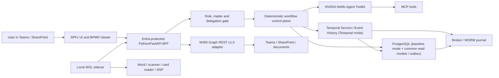

# Microsoft-First, On-Prem AI Target Architecture

Status: accepted target model and implementation frame; no runtime or deployment approval.

Leading issue: [#613](https://github.com/notariat8/NaC/issues/613)

## Decision

NaC is **Microsoft-first at the user, identity and data edge**, while remaining
**on-prem-first for AI and process execution**; the authoritative WORM evidence copy produced by the on-prem publisher is stored separately in tenant-bound Azure Blob immutable storage.

- Microsoft Teams is the primary workplace.
- SharePoint Framework (SPFx) provides Teams/SharePoint surfaces and the
  read-only `bpmn-js` viewer.
- Entra ID authenticates users and technical applications.
- Microsoft Graph REST `v1.0`, or MCP servers exclusively backed by Graph REST
  `v1.0`, is the only M365 data edge.
- SharePoint stores documents, visible lists and business projections, but is
  neither the workflow engine nor the long-lived technical source of truth.
- Python/FastAPI, the deterministic workflow control plane, PostgreSQL and
  outbox/broker run centrally on-prem. An on-prem evidence publisher writes
  create-only to Azure Blob immutable storage; that tenant-bound copy is the
  authoritative WORM evidence and has no workflow-runtime authority.
- NVIDIA NeMo Agent Toolkit is the only productive agentic toolkit.
- Microsoft 365 Agents SDK may later serve only as a Teams channel adapter. It
  must not introduce a second agentic runtime or business truth.
- Local WSL containers are non-authoritative workstation sidecars for Word,
  Track Changes, scanners, card workstations and XNP.

Temporal is **not an approved platform**. It is one candidate in a timeboxed
durable-workflow spike. The spike compares Temporal with a small
Python/PostgreSQL baseline against explicit requirements. Temporal is not an
exception to the NeMo decision: it would be a deterministic workflow control
plane only.

## Assessment Of The Supplied PDF

The supplied `Python in Teams with SharePoint Hosting` concept has the right
high-level split between an SPFx frontend, external Python backend and
SharePoint data/document services. NaC adopts it only with the final security
and runtime boundaries below.

| PDF recommendation | Verdict | NaC decision |
| --- | --- | --- |
| Teams as user entry | Adopt | Teams is the primary work surface; SharePoint pages remain directly usable. |
| SPFx + React/TypeScript | Adopt | One web part can serve SharePoint, a Teams tab and later a personal app. |
| SPFx 1.22+ with the Heft toolchain | Adopt | New surfaces use the current SPFx/Heft toolchain with a reproducibly pinned Node and package baseline. |
| App Catalog, .sppkg, Teams publishing and admin approval | Adapt | Packaging and publishing use a separate App Catalog/Teams lifecycle with an early admin gate; there is no silent tenant deployment. |
| Python outside SharePoint | Adopt | Python/FastAPI runs on-prem behind an Entra-protected API. |
| SharePoint as hosting platform | Adapt | SharePoint hosts SPFx and manages documents/projections, not Python or technical workflow truth. |
| Graph or SharePoint REST | Adapt | Raw Graph REST v1.0 or Graph-v1.0-backed MCP only; no SharePoint REST, PnP, Graph SDK or Graph Beta. |
| Entra SSO/AadHttpClient | Adopt | SPFx calls the NaC BFF in user context; app roles and `Sites.Selected` constrain technical access. |
| SharePoint lists for process state | Adapt | Lists show business projections and tasks; timers, leases, retries and authoritative execution state remain central. |
| BPMN.js | Adapt | Viewer first; modeler only after versioning, approval and roundtrip gates. No BPMN execution in SharePoint. |
| BPMN model version per running instance | Adopt | Every process instance pins an immutable BPMN model version; new model revisions do not silently alter running instances. |
| Lazy loading and code splitting for bpmn-js | Adopt | The viewer loads separately so Teams/SharePoint startup time and bundle size remain controlled. |
| Teams custom-app policies and early admin gate | Adapt | Tenant policies, app permissions and approval viability are checked before pilot implementation and enforced as a deployment gate. |
| SpiffWorkflow as default | Reject | No hidden engine choice. Durable execution is selected through a spike. |
| PostgreSQL | Adapt | Always used for domain read models, outbox, task metadata and projections; only the baseline mode additionally makes it authoritative for workflow state, timers, leases and retries. |
| Microsoft 365 Agents SDK | Adapt | Optional channel adapter, never the agentic toolkit or workflow control plane. |
| Azure App Service/Container Apps | Reject as prerequisite | No cloud-AI or Azure-runtime requirement; a later hosting option needs its own decision. |
| WSL containers | Adapt | Pilot and workstation sidecar, not central process truth or the sole synchronization node. |

## Binding Layer Separation

| Layer | Responsibility | Must not |
| --- | --- | --- |
| SPFx/Teams UI | Forms, tasks, matter view, BPMN viewer and user interaction | Own business rules, secrets, durable timers or an agentic runtime |
| Python/FastAPI BFF | Validate Entra tokens, API facade, role/purpose binding, DTO redaction | Forward raw Graph responses or matter data without control |
| Workflow control plane | 3–12 month processes, human tasks, deadlines, retries and idempotency | Accept probabilistic agent output as a binding transition |
| Personal agent | User assistance, local document work, proposals and MCP calls | Own global permissions, durable matter data or process truth |
| M365 adapter | Graph REST v1.0, ETag, paging, retry, delta/webhook boundaries | Use SharePoint REST, PnP, Graph SDK, beta endpoints or business decisions |
| Persistence | Temporal mode: Temporal Service/Event History for execution; baseline mode: PostgreSQL for execution; PostgreSQL in both modes for read models/outbox/task metadata/projections | Create parallel execution truths or use SharePoint as a lease/timer/retry store |
| Audit | Append-only events, hash binding, WORM and reconciliation | Rely only on SharePoint versioning or runtime logs |

## Storage Roles And Synchronization

| Store | Authoritative for | Not authoritative for |
| --- | --- | --- |
| SharePoint | Documents, visible metadata, task/matter projections and team permission surface | Timers, retries, leases, global idempotency or immutable legal evidence |
| PostgreSQL (both modes) | Domain read models, outbox, human-task metadata, projections and synchronization state | Workflow state, timers or retries in Temporal mode |
| Temporal mode | Temporal Service and Event History are authoritative for workflow execution state, timers and retries | A parallel PostgreSQL timer/lease store or sole notarial audit evidence |
| Baseline mode | PostgreSQL is additionally authoritative for workflow state, timers, leases and retries | Temporal History or any parallel execution truth |
| Workflow history | Technical replay/execution history of the selected mode | Sole notarial audit evidence |
| WORM journal | Approvals, delegations, access, mutations and signature/anchor evidence | Operational UI projection |
| Local sidecar cache | Encrypted short-lived data and signed outbox for workstation integration | Central process or authorization truth |
| Agent memory | Personal interaction preferences without matter data | Business truth, matter state, approvals or audit |

Temporal and baseline modes are mutually exclusive execution modes. In both modes, the WORM journal remains the separate audit-relevant evidence; neither Temporal History nor PostgreSQL replaces it.

Synchronization uses outbox/inbox semantics. Every mutation has a correlation
ID, idempotency key, expected version and redacted evidence. Offline workstation
work produces signed proposals or outbox entries only. A central authorized
service resolves acceptance and conflicts.

## Durable Workflow Spike

The spike lasts no more than six weeks and implements the same synthetic matter
in two variants:

1. Self-hosted Temporal with Python SDK and PostgreSQL.
2. A small Python/PostgreSQL baseline with explicit timers, leases, retries,
   replay and outbox.

Required measurements are restart after process/host failure, month-long timer,
human-task waiting, workflow/schema versioning, idempotency, backup/restore, HA
effort, monitoring, operating hours and license/infrastructure cost. Temporal
receives a Go only if it demonstrably removes critical custom operating logic
and has an accepted on-prem operating plan. Otherwise the Python/PostgreSQL
control plane remains leading or a new candidate is evaluated.

## Roadmap

### 0–90 Days

- Complete S3 BusinessCaseType runtime and S4 Graph read adapter.
- Specify the Entra-protected FastAPI BFF as a narrow API boundary.
- Deliver an SPFx read-only workspace with matter status, tasks and BPMN viewer.
- Design the common PostgreSQL schema for domain read models, outbox, task
  metadata, projections and idempotency; bind workflow state, timers and leases
  to Temporal or the PostgreSQL baseline only after the spike decision.
- Fix the SPFx/Heft baseline, App Catalog/sppkg/Teams publishing gate and early
  admin approval.
- Prove immutable BPMN model version pinning per process instance and lazy
  loading of the bpmn-js viewer.
- Run the durable-workflow spike and record the decision.
- Demonstrate one synthetic end-to-end matter with document, task, deadline and delegation.

### 91–180 Days

- Implement the selected workflow control plane with human tasks, deadlines,
  retries and versioning in a production-like environment.
- Connect NeMo activities only as bounded workflow activities through MCP.
- Add outbox/inbox synchronization, reconciliation and WORM evidence.
- Pilot a local Word/scanner/card/XNP sidecar with encrypted short-lived cache
  and signed outbox.
- Run failure, month-duration, backup/restore and delegation tests.

### 181–365 Days

- Operate four first-wave business cases end to end.
- Demonstrate HA, monitoring, capacity, backup/restore and WORM retention.
- Add Teams notifications and an optional M365 Agents channel adapter only if
  the pilot shows measurable benefit.
- Run a controlled pilot with two notaries and two specialist employees.
- Release the BPMN modeler only after viewer, versioning, review and roundtrip maturity.

## Critical Path

1. S3 BusinessCaseType runtime and S4 Graph adapter.
2. Durable-workflow spike and explicit engine decision.
3. Entra-protected BFF and deterministic access gate.
4. SPFx read-only work surface.
5. One complete synthetic matter with human task, deadline, document,
   delegation, outbox and WORM evidence.
6. Only then modeler, Teams chat agent and broad rollout.

## Repository Ownership

Everything remains in the NaC repository until operating lifecycles prove a
need to split:

- `spfx/`: Teams/SharePoint surfaces and BPMN viewer.
- `src/nac_m365_graph/`: Graph REST v1.0 only.
- `src/notary_kg/`: ontology and BusinessCaseType runtime.
- `src/nac_runtime/`: future workflow control plane and engine adapters.
- `workflows/`: BPMN, NeMo, domain and verification contracts.
- `deploy/runtime/onprem/`: future container, PostgreSQL, broker and gateway manifests.
- `plugins/`: local workstation and device interfaces.

A separate deployment repository is created only when customer-specific
infrastructure manifests need their own lifecycle. Secrets, certificate private
keys and matter data belong in no product repository.

## Cost And Operations Implications

- Existing M365/Teams/SharePoint licenses reduce additional UI/collaboration
  cost but do not replace verification of Entra, Teams, SharePoint, App Catalog
  and compliance license boundaries.
- On-prem costs include redundant hosts, PostgreSQL, backup, broker,
  monitoring, patching, certificates, GPU/model operation and on-call support.
- Azure WORM adds separate storage, versioning, CMK/Key Vault, retention, legal
  hold, monitoring and exit/export operating costs.
- Temporal would add operating, upgrade and observability complexity; the spike
  must quantify it against custom durable-execution logic.
- WSL sidecars move support into workstation patching, device connectors, local
  encryption and offline conflicts.
- `Sites.Selected`, app roles and separated provisioning/runtime identities
  reduce privilege but add bootstrap, certificate and review work.
- Serverless-like on-prem means stateless APIs/workers, queues, jobs and scalable
  containers. It does not mean zero server operation.

## Open Owner Decisions

Production implementation requires decisions on:

1. RPO, RTO, availability class and maintenance windows.
2. WORM target, retention, signature/anchor approach and exit.
3. Entra/M365 license level for Conditional Access, PIM, App Catalog and audit.
4. Outcome of the durable-workflow spike.
5. Whether Teams chat is required in the first pilot or the SPFx tab is enough.
6. Operating ownership for PostgreSQL, broker, models/GPU and sidecars.

These do not block S3, S4, the BFF specification, SPFx read-only work or the
offline spike. Every live, credential, tenant or deployment action remains
separately owner-gated.

## Evidence

- [Decision contract](../../../workflows/contracts/microsoft-first-onprem-target-architecture.contract.json)
- [Spec](../superpowers/specs/2026-07-11-microsoft-first-onprem-target-architecture-design.md)
- [Implementation plan](../superpowers/plans/2026-07-11-microsoft-first-onprem-target-architecture.md)
- Validator: `python3 scripts/validate_microsoft_first_onprem_target_architecture.py`

