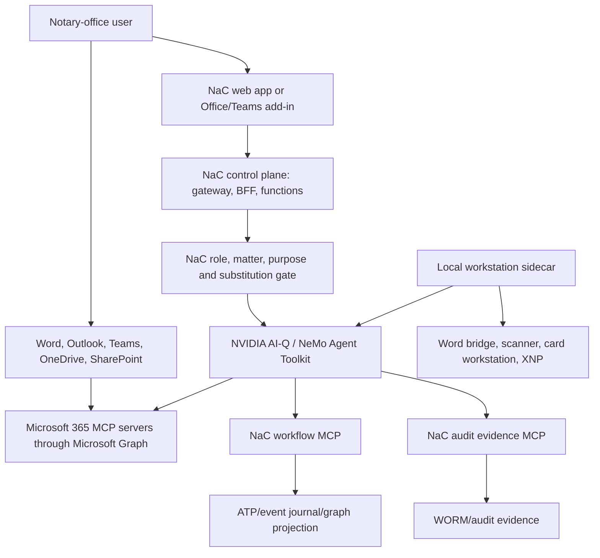

# NeMo Agent Toolkit, AI-Q And Microsoft 365 MCP Target Architecture

Status: architecture decision and integration boundary
Last content update: 2026-07-05

## Purpose

This page defines how NaC combines productive agentic workflows, Microsoft 365
data surfaces and local workstation agents. It extends the existing
[NaC On-Prem Agent Runtime](nac-onprem-agent-runtime.md): NemoClaw/OpenClaw
remains target-control and sandbox evidence there, but it is not the leading
productive agentic runtime for new NaC workflows.

## Decision

The leading agentic toolkit for NaC is
[NVIDIA NeMo Agent Toolkit](https://docs.nvidia.com/nemo/agent-toolkit/latest/index.html).
The preferred blueprint and packaging path is
[NVIDIA AI-Q](https://build.nvidia.com/nvidia/aiq). Other agentic toolkits
such as CrewAI, LangChain as the primary runtime, OpenClaw runtime activation
or custom agent frameworks are blocked for productive NaC agents unless an
explicit owner gate documents a deliberate exception.

This decision applies to:

- agent orchestration,
- agentic workflows,
- tool calling,
- MCP client binding,
- runtime and packaging decisions for agents.

It does not prohibit:

- deterministic Python validators and CLI tools,
- Office, Word or Teams add-ins as the user interface,
- slim MCP server adapters in Python,
- event journal, WORM, storage and Vault layers,
- local device and workstation connectors.

Python therefore remains the leading language for NaC. Java is not required
for this layer.

## Why It Fits NaC

NeMo Agent Toolkit provides workflow configuration, functions, LLMs,
retrievers, memory, object stores, MCP, API server, UI, MCP server and FastMCP
server as runtime building blocks. Workflows can act as an MCP host, connect to
external MCP servers, use their tools as regular functions and use locally
hosted LLMs through NIM, vLLM or OpenAI-compatible APIs.

AI-Q fits as a blueprint because it provides enterprise-data agents as
composable workflows, CLI/web UI/async job modes, Docker Compose and Helm
assets, and MCP tool integration through NeMo Agent Toolkit. For NaC this
means: AI-Q is the integration and deployment template, while NeMo Agent
Toolkit is the runtime and tool orchestration layer.

NeMo-owned MCP servers must not be exposed directly to the public internet in
production. The NeMo documentation points out that `nat mcp serve` currently
starts without built-in server authentication. NaC therefore puts an
authenticating gateway or BFF with HTTPS, OAuth2/JWT or mTLS in front of every
MCP endpoint used for production traffic. Local MCP servers stay bound to
`localhost` or to an explicitly controlled workstation boundary.

## Target Model

The durable source of truth does not live inside the agent. Long-running cases
are stored as process instances, events, grants, leases and audit metadata in
the central runtime layer. Agents are repeatable workers that read this state,
propose next steps, call approved tools and write results back as events.

## Serverless And Container Boundary

The target architecture stays as serverless as possible:

- API Gateway or BFF for browser, Office and Teams calls,
- functions for metadata-only APIs, webhooks, delta sync, grant checks and
  short tool calls,
- ATP or an approved runtime store for process instances, leases, role
  bindings, grant metadata and audit anchors,
- object store or private payload layer for documents,
- queue or streaming for idempotent agent jobs,
- Vault for secrets, certificates and connector credentials.

NeMo/AI-Q itself should run as a short-lived worker, job or container when the
execution lasts longer than a function, needs WebSocket/human-in-the-loop,
requires local models/GPU or executes tools with stronger runtime context. The
rule is: workflow state stays central and serverless-compatible; the agent
process may restart without losing subject-matter truth.

## Microsoft 365 Data Path

Outlook, Teams, OneDrive and SharePoint remain the leading Microsoft 365 work
surfaces. NaC does not bulk-copy this data into agent memory. Access runs
through Microsoft Graph and matter-/purpose-bound MCP servers. Where possible,
delta APIs, webhooks, pointers, metadata and approved document handles are used;
raw content is loaded only after the NaC role, matter, purpose and private
payload gates pass.

The architecture therefore follows the federated connector principle: regulated
content remains in its source, and the agent retrieves it at runtime through
MCP. For NaC, this remains the correct boundary even if Microsoft 365 Copilot
later uses its own federated MCP connectors.

## Required MCP Servers

| MCP server | Placement | Task | Boundary |
| --- | --- | --- | --- |
| `nac-workflow-mcp` | central, serverless or container | BPMN, knowledge graph, process status, next actions, tool gates | metadata-only, no raw matter payloads |
| `nac-access-grant-mcp` | central | roles, matter binding, purpose, substitution, time-limited grants | grant metadata and audit; every substitution with reason and duration |
| `m365-mail-calendar-mcp` | central or workstation sidecar | Outlook mail, calendar, free/busy, meeting context through Graph | least privilege, no bulk export; send only after human approval |
| `m365-teams-mcp` | central | Teams chats, channels, threads, meeting messages through Graph | matter-bound search, no unbounded chat dumps |
| `m365-files-mcp` | central | OneDrive, SharePoint drives, document libraries, lists, delta/webhooks | pointers/metadata first; content only through private payload gate |
| `entra-identity-mcp` | central | Entra ID subjects, groups, app roles, consent evidence | no token or raw-claim storage |
| `nac-document-mcp` | central private runtime | document envelopes, hashes, versions, track-changes state, extraction jobs | raw documents only in approved private storage |
| `nac-audit-evidence-mcp` | central | append-only journal, WORM evidence, access, grant, revocation | redacted evidence, no secrets, no raw payload |
| `local-workstation-mcp` | per workstation, WSL container or local sidecar | Word bridge, scanner/OCR, card workstation, XNP readiness | local cache/outbox; central truth remains mandatory |
| `nac-office-addin-mcp` | optional local or app backend | Word/Teams add-in commands when the UI does not run directly in NeMo/AI-Q | UI commands and document pointers; human-in-the-loop |

## Local Operation With WSL Containers

A local workflow is possible, but only with a clear synchronization boundary.
Microsoft WSL Containers is available as Public Preview in WSL release 2.9.3
and can manage containers, images, networks, volumes and GPU-enabled containers
inside WSL. This is useful for pilots, local sidecars and workstation adapters,
but it is not yet the sole production baseline for regulated notary-office
workflows.

Recommended pattern:

- central process state, role binding, grants, leases and audit stay in the
  NaC control plane,
- the local container performs only work that needs local proximity,
- local results flow through a signed outbox,
- every call carries an idempotency key, lease, version and purpose binding,
- conflicts are detected centrally and resolved by a person.

A fully local workflow with later synchronization is technically possible, but
more expensive: it needs event sourcing, conflict resolution, rollback rules,
WORM evidence, backup, revocation and substitution grants on every workstation.
For NaC, the better start is therefore: central serverless control plane, with
local sidecars only for workstation and document proximity.

## Exceptions

An exception against NeMo Agent Toolkit is justified only if a concrete
regulated requirement cannot be met through NeMo/AI-Q, Python adapters, MCP
servers or a preceding BFF/gateway layer. The exception needs:

- documented reason,
- scope,
- owner gate,
- security and privacy review,
- rollback or migration path,
- validator or contract extension.

Without that exception, CrewAI, LangChain as the leading runtime, OpenClaw
runtime activation and custom agent frameworks remain blocked for productive
NaC agents.

## Next Implementation Steps

1. Track NeMo/AI-Q as the only productive agentic runtime in the runtime
   contract.
2. Cut the required MCP servers first as Python adapters with metadata-only
   tools.
3. Run a first case, such as a real-estate purchase contract, as a NeMo
   workflow against `nac-workflow-mcp`, `nac-access-grant-mcp` and
   `nac-audit-evidence-mcp`.
4. Test Microsoft 365 access first as read-only, least-privilege and
   matter-bound access through Graph.
5. Build the workstation sidecar for Word/track changes, scanner, card and
   XNP-near functions separately from the central source of truth.
6. Enable write operations against Microsoft 365 and documents only after
   human-in-the-loop, audit and owner gate.
