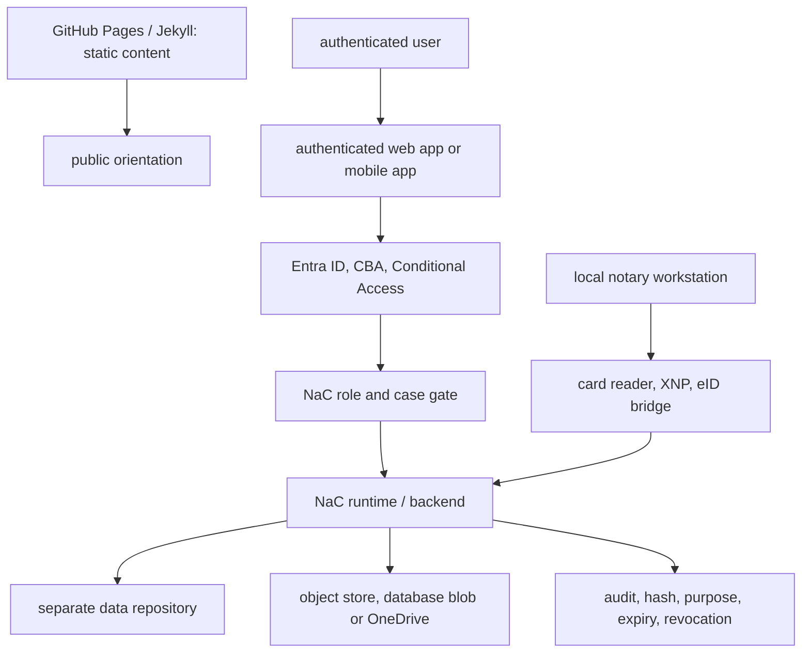

# Authenticated Web-App Operating Model

This target model describes how public static content, real authenticated
users, local notary workstations and mobile participant access should fit
together in NaC.

## Core Decision

GitHub Pages with a Jekyll/Hydra-like theme is useful for public static
content:

- product communication,
- documentation,
- onboarding,
- release and status notes,
- synthetic demos without mandate data.

This static layer must not hold the subject-matter source of truth or real case
data. It is the public reading surface, not the place for login, matter access,
uploads, signing, card readers or approvals.

Real case work for authenticated users needs a separate authenticated web app
or mobile app. That operating edge calls reviewed NaC runtime and backend
services, writes evidence in a controlled way and remains bounded by policies,
roles, contracts and `nac` validation.

## Target Architecture



The static site may link to the authenticated web app. It must not serve
tokens, secret upload links, raw documents, identity-card data, certificate
materials or mandate content.

## Identity And Authorization

Entra ID is a sensible first enterprise identity layer. For office and internal
users, NaC should check whether Entra ID with Certificate-Based Authentication,
Conditional Access and KeyCards or smartcards can secure login.

This check only answers whether a person or device is trusted for login. The
subject-matter permission is decided afterwards by the NaC role and case gate:

- role in the notary office,
- client or tenant binding,
- matter and case binding,
- purpose of access,
- approval state,
- four-eyes requirement for sensitive steps.

XNP and German eID paths with card readers remain local workstation gates. They
can provide identity or readiness evidence, but they do not replace NaC
authorization and they do not store PINs, raw card data, raw eID data or
certificate secrets in the repository.

## Mobile App And Secure Links

A mobile app such as `n8-demonotariat` can serve as a client or participant
app. After login and approval, the user does not receive blanket NaC access,
but only a tightly bounded secure link.

Allowed link targets are:

- upload into an object store,
- upload into a database blob,
- upload or read view in OneDrive,
- read-only view of current matter information, where the case permits it.

Every link must be short-lived, revocable, tenant-, matter- and purpose-bound.
NaC stores only evidence in the product repository, such as hash, storage
target class, matter binding, expiry, issuing role, approval state and audit
event. The secret link itself, access tokens and raw documents do not belong in
Git.

Uploads from the app first land in an inbox or import proposal. They are linked
to a matter only after human review, role checks and, where required, four-eyes
approval.

## Checkable Boundary

The minimum technical boundary is defined in the
[Secure Document Link contract](../../workflows/contracts/secure-document-link.contract.json)
and validated through the central NaC CLI:

```bash
nac contracts validate
```

The contract requires purpose, expiry, matter binding, storage target,
revocation and audit evidence. This turns the mobile or authenticated web app
from a product idea into a checkable NaC artifact path.

## Implementation Order

1. Keep using the static GitHub Pages layer for public content and synthetic
   demos.
2. Design the internal authenticated web app for notary-office users through
   Entra ID and the NaC role gate.
3. Check card-reader, XNP and eID paths only locally through the
   `notary-workstation` profile.
4. Connect the mobile app to storage targets only through short-lived secure
   links.
5. Treat uploads as inbox items or import proposals first.
6. Make contract, validator, audit and human approval mandatory before
   productive links.
