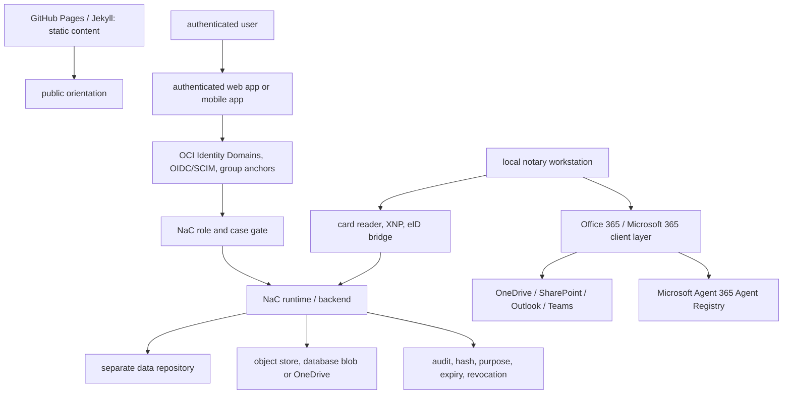

# Authenticated Web-App Operating Model

This target model describes how public static content, real authenticated
users, local notary workstations and mobile participant access should fit
together in NaC.

## Core Decision

GitHub Pages with a Jekyll/Hydra-like theme is useful for public static
content:

- product communication,
- documentation,
- onboarding,
- release and status notes,
- synthetic demos without mandate data.

This static layer must not hold the subject-matter source of truth or real case
data. It is the public reading surface, not the place for login, matter access,
uploads, signing, card readers or approvals.

Real case work for authenticated users needs a separate authenticated web app
or mobile app. That operating edge calls reviewed NaC runtime and backend
services, writes evidence in a controlled way and remains bounded by policies,
roles, contracts and `nac` validation.

## Target Architecture



Office 365 is mandatory on the client side. For NaC, that does not mean the
SaaS identity layer or the current OCI deployment changes. Office 365 is the
mandatory workstation, document, calendar, communication and collaboration
layer for the notary office; NaC may therefore plan integrations with OneDrive,
SharePoint, Outlook, Teams and future Microsoft 365 features, while every
access path remains bounded by NaC roles, matter binding, purpose binding,
audit and human approval.

Microsoft Agent 365 Agent Registry is included as a target-architecture
building block for agent governance. Microsoft Learn describes Agent Registry
Sync in the Microsoft 365 Admin Center as a Preview feature that can provide
central visibility and governance for agents from external AI-agent
environments. The listed platforms are Amazon Bedrock, Google Vertex AI,
Salesforce Agentforce and Databricks Genie. This is not a current deploy step.
For NaC it is not a production integration requirement. It is a future
control anchor: when NaC agents, MCP connectors or external agent platforms are
connected productively, their registration, visibility, accountability and
deactivation must be reconciled with Microsoft 365 agent governance.

The static site may link to the authenticated web app. It must not serve
tokens, secret upload links, raw documents, identity-card data, certificate
materials or mandate content.

For external legal research and MCP connections, the web app may initially show
only a status and review backlog. The
[Legal Research Connector backlog](plugin-plans/legal-research-connectors.md)
separates source, license state, DPA/AI-SBOM review, security boundary and next
review step without turning the source into a product integration.

## Identity And Authorization

Oracle OCI Identity Domains is the productive identity layer for this SaaS
path. The public transition from `www-n8` into the NaC app is tenant-aware:
existing customers pass a tenant hint, while new customers first run through a
domain-readiness check. NaC then creates a reviewable admin-provisioning plan
for OCI Identity Domains.

Office 365 complements this path on the client and workstation side. OCI
Identity Domains remains the IdP and tenant-provisioning layer for the current
SaaS path; Microsoft 365 supplies workstation services and agent governance
unless a separate reviewed IdP change decides otherwise.

End users do not work in the OCI Console. NaC operates Identity Domains through
reviewed API and CLI contracts; productive writes to users, groups or
memberships require a separate owner review and explicit approval before
apply.

The IdP login only answers whether a person is trusted for login. The
subject-matter permission is decided afterwards by the NaC role and case gate:

- role in the notary office,
- client or tenant binding,
- matter and case binding,
- purpose of access,
- approval state,
- four-eyes requirement for sensitive steps.

The first NaC app entry therefore uses a login-intent contract instead of an
implicit login. NaC builds the OIDC redirect to OCI Identity Domains through
`/.well-known/openid-configuration` and `/oauth2/v1/authorize`, requires
server-generated `state` and `nonce` values, and treats `tenant_hint` only as
context. The hint must not be translated into roles, groups, matter access or
OCI writes.

In this model, the auth callback is not yet a successful login. It is first a
closed intermediate event with its own `nac.auth-callback/v0.1` contract:
`code`, `state`, and provider error details are not displayed, not copied into
customer-facing text, and not treated as authorization. Without configured
server-side state validation and token exchange, the notariat8 workspace stays
closed; only after that may the NaC role and case gate decide access.

The operational boundary for signed state values and callback logs is defined
in [OIDC State and Log Boundary](operations/oidc-state-log-boundary.md).

XNP and German eID paths with card readers remain local workstation gates. They
can provide identity or readiness evidence, but they replace neither OCI login
nor NaC authorization and they do not store PINs, raw card data, raw eID data
or certificate material in the repository.

## Mobile App And Secure Links

A mobile app such as `n8-demonotariat` can serve as a client or participant
app. After login and approval, the user does not receive blanket NaC access,
but only a tightly bounded secure link.

Consumer ChatGPT, free accounts or non-EU-resident ChatGPT access are not a
client gateway. A client must not send an identity-card photo, mandate document
or other raw document to such a chat so it can then be forwarded into an
Enterprise workspace. That detour is not matter-bound, not reliably revocable
and not checkable as a NaC audit path.

The first product path is therefore:

1. The NaC backend creates a secure link with purpose, expiry, matter binding
   and revocation.
2. The client opens a mobile web app or PWA; a native iOS/Android app is added
   only for NFC eID, push, device binding, liveness checks, offline operation
   or app-store trust.
3. The file or photo first lands in an EU-controlled storage target.
4. Optionally, a server-side backend processes metadata or extraction through
   approved services such as OpenAI API Europe with
   `https://eu.api.openai.com`; mobile devices do not receive API keys.
5. Internal users review the inbox through the NaC web app or an approved
   Enterprise workspace connector.

Allowed link targets are:

- upload into an object store,
- upload into a database blob,
- upload or read view in OneDrive,
- read-only view of current matter information, where the case permits it.

Every link must be short-lived, revocable, tenant-, matter- and purpose-bound.
NaC stores only evidence in the product repository, such as hash, storage
target class, matter binding, expiry, issuing role, approval state and audit
event. The secret link itself, access tokens and raw documents do not belong in
Git.

Uploads from the app first land in an inbox or import proposal. They are linked
to a matter only after human review, role checks and, where required, four-eyes
approval.

## Checkable Boundary

The minimum technical boundary is defined in the
[Secure Document Link contract](../../workflows/contracts/secure-document-link.contract.json)
and validated through the central NaC CLI:

```bash
nac contracts validate
```

The contract requires purpose, expiry, matter binding, storage target,
revocation and audit evidence. This turns the mobile or authenticated web app
from a product idea into a checkable NaC artifact path.

## Implementation Order

1. Keep using the static GitHub Pages layer for public content and synthetic
   demos.
2. Design the internal authenticated web app for notary-office users through
   OCI Identity Domains and the NaC role gate.
3. Track Office 365 as the mandatory client layer and Microsoft Agent 365 Agent
   Registry as a Preview governance anchor in the target architecture and
   backlog.
4. Explicitly disallow consumer ChatGPT as a client-upload gateway.
5. Check card-reader, XNP and eID paths only locally through the
   `notary-workstation` profile.
6. Connect the mobile web app or PWA to storage targets first through
   short-lived secure links; build native apps only for concrete device needs.
7. Treat uploads as inbox items or import proposals first.
8. Make contract, validator, audit and human approval mandatory before
   productive links.
