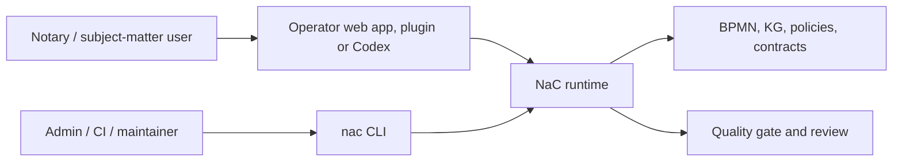

# NaC CLI: Technical Control Surface Behind The Office UI

Status: first unified CLI implemented on 2026-05-19

## Idea

The NaC CLI is not the product surface for a notary office. It is the
technical control and validation layer behind the local office UI, Codex
plugins and later automations.

For subject-matter users, NaC starts with the local operator web app:

```bash
python scripts/nac.py operator --open
```

The CLI remains important because it makes the same checks reproducible:
status, quality gate, BPMN, knowledge graphs, plugins and configuration.

The shared entry point is:

```bash
nac
```

Without installation, the same entry point can be started from the repository:

```bash
python scripts/nac.py status
```

After a local editable installation, the short command is available:

```bash
python -m pip install -e .
nac status
```

## Why This Still Matters For Non-Technical Readers

A CLI is a clearly named work order for the computer. A notary does not need
to memorize these commands. The office benefits because every button, plugin
action and automated check can be traced back to a checkable technical action.

| Question | Answer |
| --- | --- |
| Does the notary need to memorize commands? | No. The visible entry point is the office UI; the CLI is the technical validation surface behind it. |
| Why not only a web UI? | A UI alone can hide logic. The CLI keeps checks, results and repetition visible. |
| Why is this future-ready? | Local web app, Codex plugin, CI and later apps can reuse the same reviewed runtime. |
| What becomes traceable? | Command, input, result, review and Git change. |

## First Commands

```bash
python scripts/nac.py status
python scripts/nac.py doctor --profile strict
python scripts/nac.py web
python scripts/nac.py kg status
python scripts/nac.py kg cost-view immobilienkaufvertrag
python scripts/nac.py kg workflow-contract immobilienkaufvertrag
python scripts/nac.py kg pilot-checklist online-gmbh-gruendung
python scripts/nac.py legal-graph status
python scripts/nac.py legal-graph model-card-proposal
python scripts/nac.py legal-graph ai-sbom-delta-proposal
python scripts/nac.py ai-sbom export-mapping
python scripts/nac.py gnotkg quote --business-value 500000 --table A --fee-rate 1.0 --kv-number 21100
python scripts/nac.py bpmn validate
python scripts/nac.py config list
python scripts/nac.py plugins actions
python scripts/nac.py tenant domain-check --domain kanzlei-notariat.example --tenant-slug kanzlei-notariat --admin-email admin@kanzlei-notariat.example
python scripts/nac.py import jobs status --repo ../demo8notariat
python scripts/nac.py time-ledger summary
```

After installation:

```bash
nac status
nac doctor --profile strict
nac web
nac kg status
nac kg cost-view immobilienkaufvertrag
nac kg workflow-contract immobilienkaufvertrag
nac kg pilot-checklist online-gmbh-gruendung
nac legal-graph status
nac legal-graph model-card-proposal
nac legal-graph ai-sbom-delta-proposal
nac ai-sbom export-mapping
nac gnotkg quote --business-value 500000 --table A --fee-rate 1.0 --kv-number 21100
nac bpmn validate
nac config list
nac plugins actions
nac tenant domain-check --domain kanzlei-notariat.example --tenant-slug kanzlei-notariat --admin-email admin@kanzlei-notariat.example
nac tenant provision-admin --tenant-slug kanzlei-notariat --domain kanzlei-notariat.example --admin-email admin@kanzlei-notariat.example --admin-display-name "Admin Notariat" --identity-domain-url ${NAC_OCI_IDENTITY_DOMAIN_URL} --identity-domain-id ${NAC_OCI_IDENTITY_DOMAIN_ID} --dry-run
nac tenant apply-request --tenant-slug kanzlei-notariat --domain kanzlei-notariat.example --admin-email admin@kanzlei-notariat.example --admin-display-name "Admin Notariat" --identity-domain-url ${NAC_OCI_IDENTITY_DOMAIN_URL} --identity-domain-id ${NAC_OCI_IDENTITY_DOMAIN_ID} --dns-verified --owner-approval-id OWNER-APPROVED-32 --audit-event-id AUDIT-32 --rollback-plan-id ROLLBACK-32 --dry-run
nac tenant status --repo ../demo8notariat
nac import jobs status --repo ../demo8notariat
nac qms status
nac time-ledger summary
```

## Technical Operating Areas

| Area | Command | Purpose |
| --- | --- | --- |
| Overview | `nac status` | Shows usecases, open required information, BPMN models and configuration files. |
| Quality | `nac doctor --profile strict` | Runs the strict quality gate. |
| Office UI | `nac operator --open` | Starts the local operator web app with cases, checklists, BPMN, editor and workstation tests. |
| Graphical model view | `nac web` | Starts the local web server for BPMN and KG views. |
| Knowledge graphs | `nac kg status`, `nac kg workflow-contract <slug>` and `nac kg pilot-checklist <slug>` | Shows the state of usecase-local knowledge graphs, creates mandate-data-free workflow contract drafts and builds deterministic pilot intake checklists from a usecase KG. |
| Legal graph | `nac legal-graph status`, `nac legal-graph sources`, `nac legal-graph source-inventory`, `nac legal-graph model-card-proposal`, `nac legal-graph ai-sbom-delta-proposal`, `nac legal-graph review erbrecht` and `nac legal-graph update-dry-run erbrecht` | Shows the mandate-data-free legal graph, primary sources, source-inventory/license/TDM gates, model-card and AI-SBOM delta proposals, review points and update patches without auto-merge. |
| AI-SBOM | `nac ai-sbom export-mapping` | Shows the selected CycloneDX/SPDX export mapping without enabling release export, external tool execution, mandate data or secrets. |
| GNotKG cost review | `nac kg cost-view <slug>` and `nac gnotkg quote` | Shows the mandate-data-free cost review view and calculates local technical cost drafts. |
| BPMN | `nac bpmn list` and `nac bpmn validate` | Lists and validates subject-matter BPMN process models. |
| Processes | `nac process validate-all` | Validates deterministic process requests. |
| Workflow contracts | `nac contracts validate` | Validates workflow contracts, spec traceability, secure-link boundaries, OCI tenant identity and legal-research connector candidates. |
| Import jobs | `nac import jobs status --repo ../demo8notariat` | Controls bounded Codex/OCR jobs for import proposals in the separate data repository. |
| Plugins | `nac plugins actions` and `nac plugins install --mode dry-run` | Lists subject-matter plugin commands and checks local plugin mirroring. |
| Configuration | `nac config list` and `nac config validate` | Shows and validates policies, contracts and runtime configuration. |
| Data repository | `nac tenant status --repo ../demo8notariat` | Checks a separate NaC data repository for demo or later production data. |
| Tenant identity | `nac tenant domain-check`, `nac tenant provision-admin --dry-run` and `nac tenant apply-request --dry-run` | Checks new-customer domains and creates OCI Identity dry-run and apply-readiness artifacts without productive writes. |
| QMS | `nac qms status` and `nac qms evidence --repo ../demo8notariat` | Shows ISO 9001/QMS artifacts and evidence counts from the data repository. |
| Codex Time Ledger | `nac time-ledger add`, `nac time-ledger run` and `nac time-ledger summary` | Records agentic work blocks and summarizes tool time, approvals, waiting time, local CPU/I/O and estimated LLM time. |

## Codex Time Ledger

The Time Ledger is the local measurement layer for longer Codex sessions. It
writes completed work blocks as JSONL under
`out/observability/codex-time-ledger.jsonl` and summarizes them by category and
phase.

```bash
nac time-ledger add --session-id 2026-06-15-nac --task "NaC Time Ledger" --phase context-read --category local_io --started-at 2026-06-15T10:00:00Z --ended-at 2026-06-15T10:08:00Z
nac time-ledger run --session-id 2026-06-15-nac --task "NaC Time Ledger" --phase unit-tests --category local_cpu -- python -m unittest tests/test_codex_time_ledger.py
nac time-ledger summary --session-id 2026-06-15-nac
```

Usage and privacy boundaries are documented in
[operations/codex-time-ledger.md](operations/codex-time-ledger.md).

## `nac legal-graph`

This command controls the mandate-data-free NaC legal graph. The first MVPs are
inheritance law, family law and corporate law. Automatic source runs only
create review patches; a merge requires professional review.

```bash
nac legal-graph status
nac legal-graph sources --format json
nac legal-graph source-inventory --format json
nac legal-graph model-card-proposal --format json
nac legal-graph ai-sbom-delta-proposal --format json
nac legal-graph review erbrecht --format json
nac legal-graph update-dry-run erbrecht --format json
```

The first update pilot uses a primary-source manifest for inheritance law with
`metadata_only_fixture`, `commentary_access_allowed=false`,
`provider_query_allowed=false` and `credentials_required=false`. This keeps
commentaries and publisher databases outside the run until a licensed MCP/API
connector is professionally, contractually and technically approved.

Licensed commentaries and publisher sources do not use scraping or full-text
imports. They require reviewed MCP/API connectors with license, AVV/DPA,
professional-secrecy, AI-SBOM and review gates.

The model-card proposal is also metadata-only. It shows which sections,
candidates and blocks must be reviewed before later Legal-Nemotron use; it
does not start training, publish a checkpoint or claim legal-answer quality.

The AI-SBOM delta proposal has the same boundary. It shows later components,
candidates, attestations and blocks, but activates no runtime, endpoint,
training, evaluation or checkpoint.

## `nac ai-sbom`

This command shows repository-wide AI-SBOM governance artifacts. The current
export mapping selects CycloneDX JSON and SPDX JSON as target profiles, but it
does not enable release export and does not execute external SBOM tools.

```bash
nac ai-sbom export-mapping --format json
```

Release binding, tool execution and published artifacts need a separate owner
apply gate.

## QMS And ISO 9001 Layer

NaC contains a QMS layer under [qms/](../../qms). It maps quality policy,
quality objectives, roles, process map, internal audits, management review and
nonconformities to NaC artifacts.

```bash
nac qms status
nac qms iso9001-map
nac qms audit-plan
nac qms evidence --repo ../demo8notariat
```

## Separate Data Repository

NaC does not write case and test data into the product repository. Synthetic
demo data lives in a separate data repository, for example `../demo8notariat`:

```bash
nac tenant init --repo ../demo8notariat --name demo8notariat --remote-url https://github.com/notariat8/demo8notariat.git
nac tenant write-sample-akte --repo ../demo8notariat --akten-id UVZ-2026-0001
nac tenant list-akten --repo ../demo8notariat
nac tenant show-akte --repo ../demo8notariat --akten-id UVZ-2026-0001
nac tenant write-demo immobilienkaufvertrag --repo ../demo8notariat --case-id DEMO-2026-0001
```

## Tenant Identity And OCI Dry Run

New customers do not start in the OCI Console. NaC first checks whether the
customer domain and initial admin email match:

```bash
nac tenant domain-check --domain kanzlei-notariat.example --tenant-slug kanzlei-notariat --admin-email admin@kanzlei-notariat.example --format json
```

NaC then creates an admin-provisioning plan for OCI Identity Domains. This
command does not write to OCI and contains no credentials:

```bash
nac tenant provision-admin --tenant-slug kanzlei-notariat --domain kanzlei-notariat.example --admin-email admin@kanzlei-notariat.example --admin-display-name "Admin Notariat" --identity-domain-url ${NAC_OCI_IDENTITY_DOMAIN_URL} --identity-domain-id ${NAC_OCI_IDENTITY_DOMAIN_ID} --dry-run --format json
```

Productive identity writes require separate owner review and explicit apply
approval.

When DNS verification, owner approval, audit event and rollback plan are
prepared, NaC still creates only a review artifact:

```bash
nac tenant apply-request --tenant-slug kanzlei-notariat --domain kanzlei-notariat.example --admin-email admin@kanzlei-notariat.example --admin-display-name "Admin Notariat" --identity-domain-url ${NAC_OCI_IDENTITY_DOMAIN_URL} --identity-domain-id ${NAC_OCI_IDENTITY_DOMAIN_ID} --dns-verified --owner-approval-id OWNER-APPROVED-32 --audit-event-id AUDIT-32 --rollback-plan-id ROLLBACK-32 --dry-run --format json
```

This command is not yet an OCI connector and performs no user, group or
membership change.

The leading matter model uses small JSON files with stable IDs for matters,
people, documents, events and indices. PDF, JPG and other binary files live as
ordinary files next to their metadata. The separation is documented in
[datenrepo-demo8notariat.md](datenrepo-demo8notariat.md).
The subject-matter derivation from common notary-software building blocks is in
[notarsoftware-datenmodell.md](notarsoftware-datenmodell.md).

## Workflow Contracts, Secure Document Links And Connector Candidates

Workflow contracts describe which operating edge may trigger which
subject-matter actions and which evidence is mandatory. The Secure Document
Link contract bounds mobile apps and authenticated web apps to short-lived,
revocable, matter- and purpose-bound upload or read links. The Legal Research
Connector contract records external legal research, MCP and publisher-database
references only as candidates until license, DPA, AI-SBOM, security boundary
and human review are settled.
The legal graph contract limits legal graph updates for inheritance law,
family law and corporate law to mandate-data-free primary sources and review
patches; the commentary connector contract requires licensed MCP/API access
without credentials, mandate data or commentary full text in the product
repository and records provider-level license status, evidence fields, output
boundaries, activation gates, license basis, DPA status, professional-secrecy
status, AI-SBOM status, security boundary and credential operating model.
Primary-source manifests are also validated as a separate artifact type so an
update run cannot introduce commentary access, provider queries or credential
requirements.
The source-inventory, license and TDM gate is visible through
`nac legal-graph source-inventory --format json`. The command only reads the
gate contract, shows no source text, generates no benchmark dataset and starts
no training.
The spec traceability contract connects issue, spec, plan, AC IDs and
validation commands for spec-driven work.

```bash
nac contracts validate
```

The GNotKG cost contract is validated there as well. The source basis is
[GNotKG section 3](https://www.gesetze-im-internet.de/gnotkg/__3.html),
[GNotKG section 34](https://www.gesetze-im-internet.de/gnotkg/__34.html),
[GNotKG section 35](https://www.gesetze-im-internet.de/gnotkg/__35.html),
[annex 1](https://www.gesetze-im-internet.de/gnotkg/anlage_1.html) and
[annex 2](https://www.gesetze-im-internet.de/gnotkg/anlage_2.html).
`nac gnotkg quote` stores no entered values; final notarial cost review
remains a review gate.

The check ensures that the contract requires purpose, expiry, matter binding,
storage target, revocation and audit evidence, that spec manifests carry valid
AC IDs and validation commands, and that connector candidates contain no
tracking URLs, credentials, mandate data or productive integration levels. The
target model is described in the
[Authenticated Web-App Operating Model](authenticated-webapp-operating-model.md)
and the
[Legal Research Connector backlog](plugin-plans/legal-research-connectors.md).

## Import Jobs For Codex And OCR

The inbox channel separates upload, machine extraction and subject-matter
acceptance. The web app first creates an import proposal with staged test files
in the data repository. It then creates a bounded import job under
`eingang/jobs/`. Codex or the CLI processes that job metadata-only and writes a
reviewable result to `eingang/extraktionen/`.

```bash
nac import jobs create --repo ../demo8notariat --proposal-id IMP-20260521-BEISPIEL
nac import jobs status --repo ../demo8notariat
nac import jobs process --repo ../demo8notariat --job-id JOB-20260521-BEISPIEL --format json
nac import jobs apply-result --repo ../demo8notariat --job-id JOB-20260521-BEISPIEL
```

`apply-result` only merges the extraction result back into the import proposal
and marks it for human review. Only the visible `Übernehmen` action in the
operator web app creates a demo matter from it. For real OCR, AI or SaaS
processing with personal data, DPA, role, permission and data-storage
boundaries remain mandatory.

## Plugin Commands

Plugin management and the existing local plugin checks now also run through
`nac`:

```bash
nac plugins actions
nac plugins status
nac plugins status nac-grundbuch-portal
nac plugins validate
nac plugins install --mode dry-run
nac plugins card-readiness
nac plugins xnp-reader-prompt
nac plugins xnp-workflow-gate --evidence out/xnp-reader-prompt.json
nac plugins pkcs7-inspect --input example.p7b
```

| Command | Meaning |
| --- | --- |
| `nac plugins status` | Lists all repo-local NaC integrations from the marketplace with CLI status. |
| `nac plugins status <plugin>` | Shows the boundary between Codex plugin and canonical NaC CLI for one integration. |
| `nac plugins card-readiness` | Checks local card-reader, SAK/XNP and readiness metadata. With installed hardware, a real local hardware test is possible; PINs and raw card data are not stored. |
| `nac plugins xnp-reader-prompt` | Creates a safe XNP reader prompt with the card gate in front. |
| `nac plugins xnp-workflow-gate` | Evaluates existing XNP reader-prompt evidence as a mandate-data-free workflow gate. |
| `nac plugins pkcs7-inspect` | Inspects a local PKCS7/P7B/P7C certificate bundle metadata-only, without signing or private-key access. |

The old plugin scripts remain the internal execution layer. The visible path
for users, docs and agents is `nac plugins ...`. Planned integrations are also
reachable through `nac plugins status <plugin>`, but they are shown as
`planned` until a real subject-matter CLI command exists.

For a workstation with installed real hardware:

```bash
nac plugins card-readiness --manual-card-present yes --manual-rfid-off yes --probe-morris-api --json
nac plugins xnp-reader-prompt --manual-card-present yes --manual-rfid-off yes --probe-morris-api --json
nac plugins xnp-workflow-gate --evidence out/xnp-reader-prompt.json --json
```

These commands may check real local drivers, morris, PC/SC, card-reader and XNP
reachability and turn existing evidence into workflow-gate metadata. Productive
portal actions, signing, PIN capture, raw card data, secrets and mandate data in
the repository remain blocked.

## Architecture Rule

New NaC functionality needs an understandable user surface and a checkable
technical execution path. For subject-matter use, that may be a web app,
plugin or Codex surface; for reproducibility, tests and operations, the
technical edge should be reachable through `nac`. Direct scripts such as
`scripts/quality_gate.py` may remain as internal or compatibility layers.

For configuration writes, there is an additional boundary: until a configuration
family has a clear schema, validation and approval rule, the CLI only shows and
validates it. Write commands are added per configuration family once the safe
change contract exists.

## Relationship To The Local Web App

The local web app is the visible office surface. It starts through `nac`,
reads the same BPMN/KG files and uses the same reviewed runtime family. The
target picture is:



This makes NaC visually usable for the office while keeping it machine-checkable
for operations, review and further development.
