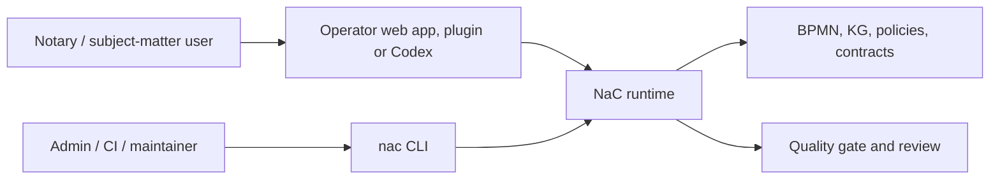

# NaC CLI: Technical Control Surface Behind The Office UI

Status: first unified CLI implemented on 2026-05-19

## Idea

The NaC CLI is not the product surface for a notary office. It is the
technical control and validation layer behind the local office UI, Codex
plugins and later automations.

For subject-matter users, NaC starts with the local operator web app:

```bash
python scripts/nac.py operator --open
```

The CLI remains important because it makes the same checks reproducible:
status, quality gate, BPMN, knowledge graphs, plugins and configuration.

The shared entry point is:

```bash
nac
```

Without installation, the same entry point can be started from the repository:

```bash
python scripts/nac.py status
```

After a local editable installation, the short command is available:

```bash
python -m pip install -e .
nac status
```

## Why This Still Matters For Non-Technical Readers

A CLI is a clearly named work order for the computer. A notary does not need
to memorize these commands. The office benefits because every button, plugin
action and automated check can be traced back to a checkable technical action.

| Question | Answer |
| --- | --- |
| Does the notary need to memorize commands? | No. The visible entry point is the office UI; the CLI is the technical validation surface behind it. |
| Why not only a web UI? | A UI alone can hide logic. The CLI keeps checks, results and repetition visible. |
| Why is this future-ready? | Local web app, Codex plugin, CI and later apps can reuse the same reviewed runtime. |
| What becomes traceable? | Command, input, result, review and Git change. |

## First Commands

```bash
python scripts/nac.py status
python scripts/nac.py doctor --profile strict
python scripts/nac.py git worktree-audit --format json
python scripts/nac.py web
python scripts/nac.py kg status
python scripts/nac.py kg cost-view immobilienkaufvertrag
python scripts/nac.py kg workflow-contract immobilienkaufvertrag
python scripts/nac.py kg pilot-checklist online-gmbh-gruendung
python scripts/nac.py legal-graph status
python scripts/nac.py legal-graph model-card-proposal
python scripts/nac.py legal-graph ai-sbom-delta-proposal
python scripts/nac.py ai-sbom export-mapping
python scripts/nac.py gnotkg quote --business-value 500000 --table A --fee-rate 1.0 --kv-number 21100
python scripts/nac.py bpmn validate
python scripts/nac.py contracts verify
python scripts/nac.py config list
python scripts/nac.py m365 teams-sharepoint application-owner-readiness --format json
python scripts/nac.py m365 teams-sharepoint bff-azure-readiness --format json
python scripts/nac.py m365 teams-sharepoint runtime-certificate-expiry-monitor --format json
python scripts/nac.py m365 teams-sharepoint runtime-certificate-readiness --format json
python scripts/nac.py m365 teams-sharepoint runtime-env-bootstrap --format json
python scripts/nac.py m365 teams-sharepoint test-environment-deploy --owner-approved --mcp-smoke-workspace-id notary_team_01 --mcp-smoke-correlation-id <correlation-id> --test-environment-package-sha256 <sha256> --test-environment-include-teams --format json
python scripts/nac.py m365 teams-sharepoint bpmn-viewer-plan --format json
python scripts/nac.py m365 teams-sharepoint matter-access-plan --format json
python scripts/nac.py m365 teams-sharepoint matter-access-decision-replay --format json
python scripts/nac.py m365 teams-sharepoint matter-access-apply-readiness --mcp-smoke-workspace-id notary_team_01 --format json
python scripts/nac.py m365 teams-sharepoint matter-access-apply-request-plan --mcp-smoke-workspace-id notary_team_01 --mcp-smoke-correlation-id <correlation-id> --format json
python scripts/nac.py m365 teams-sharepoint matter-access-smoke --mcp-smoke-workspace-id notary_team_01 --format json
python scripts/nac.py m365 teams-sharepoint bpmn-viewer-runtime-readiness --format json
python scripts/nac.py m365 teams-sharepoint spfx-bpmn-viewer-skeleton --format json
python scripts/nac.py m365 teams-sharepoint spfx-bpmn-viewer-process-selection --format json
python scripts/nac.py m365 teams-sharepoint privileged-plan --format json
python scripts/nac.py m365 teams-sharepoint release-gate-run --owner-approved --mcp-smoke-workspace-id notary_team_01 --mcp-smoke-correlation-id <correlation-id> --format json
python scripts/nac.py m365 teams-sharepoint release-gate-run --owner-approved --mcp-smoke-workspace-id notary_team_01 --mcp-smoke-correlation-id <correlation-id> --release-gate-write-audit-pack --release-gate-compare-left <baseline-correlation-id> --release-gate-write-readiness --release-gate-readiness-require-audit-pack --release-gate-write-post-run-report --release-gate-write-post-run-report-index --format json
python scripts/nac.py m365 teams-sharepoint release-gate-run --owner-approved --mcp-smoke-workspace-id notary_team_01 --mcp-smoke-correlation-id <correlation-id> --release-gate-write-audit-pack --release-gate-write-readiness --release-gate-readiness-require-audit-pack --format json
python scripts/nac.py m365 teams-sharepoint release-readiness --format json
python scripts/nac.py m365 teams-sharepoint release-gate-post-run-report --release-gate-readiness-correlation-id <correlation-id> --format json
python scripts/nac.py m365 teams-sharepoint release-gate-post-run-report-index --format json
python scripts/nac.py m365 teams-sharepoint release-gate-post-run-report-index-artifact --format json
python scripts/nac.py m365 teams-sharepoint release-gate-retention-list --format json
python scripts/nac.py m365 teams-sharepoint release-gate-retention-compare --release-gate-compare-left <left-correlation-id> --release-gate-compare-right <right-correlation-id> --format json
python scripts/nac.py m365 teams-sharepoint release-gate-retention-compare-artifact --release-gate-compare-left <left-correlation-id> --release-gate-compare-right <right-correlation-id> --format json
python scripts/nac.py m365 teams-sharepoint release-gate-retention-compare-index --format json
python scripts/nac.py m365 teams-sharepoint release-gate-retention-compare-index-artifact --format json
python scripts/nac.py m365 teams-sharepoint release-gate-retention-audit-pack --release-gate-compare-left <left-correlation-id> --release-gate-compare-right <right-correlation-id> --format json
python scripts/nac.py plugins actions
python scripts/nac.py tenant domain-check --domain kanzlei-notariat.example --tenant-slug kanzlei-notariat --admin-email admin@kanzlei-notariat.example
python scripts/nac.py import jobs status --repo ../demo8notariat
python scripts/nac.py time-ledger summary
```

After installation:

```bash
nac status
nac doctor --profile strict
nac git worktree-audit --format json
nac web
nac kg status
nac kg business-case-inventory --format json
nac kg ontology-storage-contract --format json
nac kg process-ontology-contract --format json
nac kg process-ontology-schema-gap --format json
nac kg process-ontology-schema-apply-plan --format json
nac kg process-ontology-schema-apply-readiness --format json
nac kg process-ontology-schema-apply-execution-contract --format json
nac kg process-ontology-schema-apply-runner-dry-run --format json
nac kg process-ontology-schema-apply-runner-dry-run-artifact --format json
nac kg process-ontology-schema-apply-artifact-index --format json
nac kg process-ontology-schema-apply-live-readiness-gate --format json --workspace-id notary_team_01
nac kg process-ontology-schema-apply-owner-gated-live-plan --format json
nac kg process-ontology-schema-apply-owner-gated-runner-contract --format json
nac kg process-ontology-schema-apply-live --format json --workspace-id notary_team_01 --owner-approved --owner-approval-reference <approval-reference> --reason "Approved schema apply for workspace rollout" --execute-live-schema-apply --live-readiness-gate out/notary-kg/process-ontology-schema-apply-live-readiness-gate.redacted.json --correlation-id nac-schema-apply-live --write-redacted-evidence
nac kg process-ontology-schema-apply-live-dispatch --format json --workspace-id notary_team_01 --owner-approved --owner-approval-reference <approval-reference> --reason "Approved schema apply for workspace rollout" --execute-live-schema-apply --live-readiness-gate out/notary-kg/process-ontology-schema-apply-live-readiness-gate.redacted.json --provisioner-state <privileged-apply-state.json> --provisioner-certificate-path <provisioner.cert.pem> --provisioner-private-key-path <provisioner.key.pem> --provisioner-env-bootstrap-output <provisioner-env-bootstrap.redacted.json> --correlation-id nac-schema-apply-live-dispatch --write-redacted-evidence
nac kg ontology-scale-budget --format json
nac kg deep-process-candidates --format json
nac kg first-wave-bpmn-outline --format json
nac kg first-wave-gap-review --format json
nac kg first-wave-process-deep-model --format json
nac kg first-wave-gap-review-artifact --format json
nac kg cost-view immobilienkaufvertrag
nac kg workflow-contract immobilienkaufvertrag
nac kg pilot-checklist online-gmbh-gruendung
nac legal-graph status
nac legal-graph model-card-proposal
nac legal-graph ai-sbom-delta-proposal
nac ai-sbom export-mapping
nac gnotkg quote --business-value 500000 --table A --fee-rate 1.0 --kv-number 21100
nac bpmn validate
nac contracts verify
nac config list
nac m365 teams-sharepoint application-owner-readiness --format json
nac m365 teams-sharepoint bff-azure-readiness --format json
nac m365 teams-sharepoint runtime-certificate-expiry-monitor --format json
nac m365 teams-sharepoint runtime-certificate-readiness --format json
nac m365 teams-sharepoint runtime-env-bootstrap --format json
nac m365 teams-sharepoint test-environment-deploy --owner-approved --mcp-smoke-workspace-id notary_team_01 --mcp-smoke-correlation-id <correlation-id> --test-environment-package-sha256 <sha256> --test-environment-include-teams --format json
nac m365 teams-sharepoint bpmn-viewer-plan --format json
nac m365 teams-sharepoint matter-access-plan --format json
nac m365 teams-sharepoint matter-access-decision-replay --format json
nac m365 teams-sharepoint matter-access-apply-readiness --mcp-smoke-workspace-id notary_team_01 --format json
nac m365 teams-sharepoint matter-access-apply-request-plan --mcp-smoke-workspace-id notary_team_01 --mcp-smoke-correlation-id <correlation-id> --format json
nac m365 teams-sharepoint matter-access-smoke --mcp-smoke-workspace-id notary_team_01 --format json
nac m365 teams-sharepoint bpmn-viewer-runtime-readiness --format json
nac m365 teams-sharepoint spfx-bpmn-viewer-skeleton --format json
nac m365 teams-sharepoint spfx-bpmn-viewer-process-selection --format json
nac m365 teams-sharepoint privileged-plan --format json
nac m365 teams-sharepoint release-gate-run --owner-approved --mcp-smoke-workspace-id notary_team_01 --mcp-smoke-correlation-id <correlation-id> --format json
nac m365 teams-sharepoint release-gate-run --owner-approved --mcp-smoke-workspace-id notary_team_01 --mcp-smoke-correlation-id <correlation-id> --release-gate-write-audit-pack --release-gate-compare-left <baseline-correlation-id> --release-gate-write-readiness --release-gate-readiness-require-audit-pack --release-gate-write-post-run-report --release-gate-write-post-run-report-index --format json
nac m365 teams-sharepoint release-gate-run --owner-approved --mcp-smoke-workspace-id notary_team_01 --mcp-smoke-correlation-id <correlation-id> --release-gate-write-audit-pack --release-gate-write-readiness --release-gate-readiness-require-audit-pack --format json
nac m365 teams-sharepoint release-readiness --format json
nac m365 teams-sharepoint release-gate-post-run-report --release-gate-readiness-correlation-id <correlation-id> --format json
nac m365 teams-sharepoint release-gate-post-run-report-index --format json
nac m365 teams-sharepoint release-gate-post-run-report-index-artifact --format json
nac m365 teams-sharepoint release-gate-retention-list --format json
nac m365 teams-sharepoint release-gate-retention-compare --release-gate-compare-left <left-correlation-id> --release-gate-compare-right <right-correlation-id> --format json
nac m365 teams-sharepoint release-gate-retention-compare-artifact --release-gate-compare-left <left-correlation-id> --release-gate-compare-right <right-correlation-id> --format json
nac m365 teams-sharepoint release-gate-retention-compare-index --format json
nac m365 teams-sharepoint release-gate-retention-compare-index-artifact --format json
nac m365 teams-sharepoint release-gate-retention-audit-pack --release-gate-compare-left <left-correlation-id> --release-gate-compare-right <right-correlation-id> --format json
nac plugins actions
nac tenant domain-check --domain kanzlei-notariat.example --tenant-slug kanzlei-notariat --admin-email admin@kanzlei-notariat.example
nac tenant customer-plan --domain kanzlei-notariat.example --tenant-slug kanzlei-notariat --admin-email admin@kanzlei-notariat.example --saas-admin-email saas-owner@example.com --format json
nac tenant status --repo ../demo8notariat
nac import jobs status --repo ../demo8notariat
nac qms status
nac time-ledger summary
```

## Technical Operating Areas

| Area | Command | Purpose |
| --- | --- | --- |
| Overview | `nac status` | Shows usecases, open required information, BPMN models and configuration files. |
| Quality | `nac doctor --profile strict` | Runs the strict quality gate. |
| Git hygiene | `nac git worktree-audit` | Checks local worktrees, branches and cleanup candidates read-only; deletion actions remain owner-gated. |
| Office UI | `nac operator --open` | Starts the local operator web app with cases, checklists, BPMN, editor and workstation tests. |
| Graphical model view | `nac web` | Starts the local web server for BPMN and KG views. |
| Knowledge graphs | `nac kg status`, `nac kg business-case-inventory`, `nac kg business-case-type-get`, `nac kg business-case-type-migration-dry-run`, `nac kg ontology-storage-contract`, `nac kg process-ontology-contract`, `nac kg process-ontology-schema-gap`, `nac kg process-ontology-schema-apply-plan`, `nac kg process-ontology-schema-apply-readiness`, `nac kg process-ontology-schema-apply-execution-contract`, `nac kg process-ontology-schema-apply-runner-dry-run`, `nac kg process-ontology-schema-apply-runner-dry-run-artifact`, `nac kg process-ontology-schema-apply-artifact-index`, `nac kg process-ontology-schema-apply-live-readiness-gate`, `nac kg process-ontology-schema-apply-owner-gated-live-plan`, `nac kg process-ontology-schema-apply-owner-gated-runner-contract`, `nac kg process-ontology-schema-apply-live`, `nac kg process-ontology-schema-apply-live-dispatch`, `nac kg ontology-scale-budget`, `nac kg deep-process-candidates`, `nac kg first-wave-bpmn-outline`, `nac kg first-wave-gap-review`, `nac kg first-wave-process-deep-model`, `nac kg first-wave-gap-review-artifact`, `nac kg workflow-contract <slug>` and `nac kg pilot-checklist <slug>` | Shows the state of usecase-local knowledge graphs, creates a thin business-case inventory for ontology sizing without a central knowledge graph, checks the ontology/storage boundary against SharePoint MVP and Graph REST rules, fixes the process/ontology product-model contract for SharePoint MVP projections, checks that contract against the current SharePoint list model, creates an owner-gated offline Graph REST apply plan without live apply, checks offline workspace/ID/permission/ordering readiness before a later live apply, defines the owner-gated execution edge, dry-run runner, redacted dry-run evidence, its offline index, a live-readiness gate, an owner-gated live plan, the runner contract, the owner-gated live-runner envelope and the Graph REST dispatcher for a SharePoint schema apply, measures offline scale budgets across all business cases, routes candidates for deep BPMN/ontology modeling, creates first-wave BPMN/ontology outline plans, reviews these outlines for SharePoint/BPMN/ontology gaps, compresses them into a mandate-data-free deep process model contract, writes redacted JSON/Markdown evidence artifacts, creates mandate-data-free workflow contract drafts and builds deterministic pilot intake checklists from a usecase KG. |
| Legal graph | `nac legal-graph status`, `nac legal-graph sources`, `nac legal-graph source-inventory`, `nac legal-graph model-card-proposal`, `nac legal-graph ai-sbom-delta-proposal`, `nac legal-graph review erbrecht` and `nac legal-graph update-dry-run erbrecht` | Shows the mandate-data-free legal graph, primary sources, source-inventory/license/TDM gates, model-card and AI-SBOM delta proposals, review points and update patches without auto-merge. |
| AI-SBOM | `nac ai-sbom export-mapping` | Shows the selected CycloneDX/SPDX export mapping without enabling release export, external tool execution, mandate data or secrets. |
| GNotKG cost review | `nac kg cost-view <slug>` and `nac gnotkg quote` | Shows the mandate-data-free cost review view and calculates local technical cost drafts. |
| BPMN | `nac bpmn list` and `nac bpmn validate` | Lists and validates subject-matter BPMN process models. |
| Processes | `nac process validate-all` | Validates deterministic process requests. |
| Workflow contracts | `nac contracts validate` and `nac contracts verify` | Validates workflow contracts, spec traceability, secure-link boundaries, Teams/SharePoint Graph data plane, legal-research connector candidates and the agentic verification-contract harness. |
| Microsoft 365 | `nac m365 teams-sharepoint plan`, `nac m365 teams-sharepoint application-owner-readiness`, `nac m365 teams-sharepoint runtime-certificate-expiry-monitor`, `nac m365 teams-sharepoint runtime-certificate-readiness`, `nac m365 teams-sharepoint runtime-env-bootstrap`, `nac m365 teams-sharepoint bpmn-viewer-plan`, `nac m365 teams-sharepoint matter-access-plan`, `nac m365 teams-sharepoint matter-access-decision-replay`, `nac m365 teams-sharepoint matter-access-apply-readiness`, `nac m365 teams-sharepoint matter-access-apply-request-plan`, `nac m365 teams-sharepoint matter-access-apply-smoke --owner-approved`, `nac m365 teams-sharepoint matter-access-smoke`, `nac m365 teams-sharepoint bpmn-viewer-runtime-readiness`, `nac m365 teams-sharepoint spfx-bpmn-viewer-skeleton`, `nac m365 teams-sharepoint privileged-plan`, `nac m365 teams-sharepoint privileged-apply --owner-approved`, `nac m365 teams-sharepoint runtime-smoke --owner-approved`, `nac m365 teams-sharepoint runtime-metadata --owner-approved`, `nac batch-approval m365`, `nac m365 teams-sharepoint release-gate-run --owner-approved`, `nac m365 teams-sharepoint release-readiness`, `nac m365 teams-sharepoint release-gate-post-run-report`, `nac m365 teams-sharepoint release-gate-post-run-report-index`, `nac m365 teams-sharepoint release-gate-post-run-report-index-artifact`, `nac m365 teams-sharepoint release-gate-evidence`, `nac m365 teams-sharepoint release-gate-retention-list`, `nac m365 teams-sharepoint release-gate-retention-compare`, `nac m365 teams-sharepoint release-gate-retention-compare-artifact`, `nac m365 teams-sharepoint release-gate-retention-compare-index`, `nac m365 teams-sharepoint release-gate-retention-compare-index-artifact`, `nac m365 teams-sharepoint release-gate-retention-audit-pack`, `nac m365 teams-sharepoint mcp-manifest`, `nac m365 teams-sharepoint mcp-inventory-smoke` and `nac m365 teams-sharepoint mcp-stdio` | Plans the Teams/SharePoint data plane, checks the Application Owner/Technical Owner path and the runtime certificate path offline with redacted evidence, monitors runtime certificate expiry without live access, prepares the certificate-based runtime environment from non-secret evidence and local paths without Graph access, creates the optional BPMN viewer provisioning plan without live apply, renders the M365 matter/deputy access plan offline without live tenant action, locally replays synthetic SharePoint list snapshots for matter-access decisions, checks the future owner-gated apply edge for timeboxed deputy grants offline, renders the concrete redacted apply request plan for `grant_request` and `audit_append` without live apply, executes the synthetic apply edge owner-gated with write/read/cleanup, writes the redacted offline smoke for the matter/deputy access boundary, checks BPMN viewer runtime readiness for SPFx packaging, the App Catalog and later `.bpmn` Graph content reads without live access, renders the source-only SPFx/bpmn-js viewer skeleton without app-catalog deploy, runs the privileged app/Sites.Selected bootstrap only owner-gated through Microsoft Graph REST v1.0, verifies runtime-app read access to sites, lists and document libraries without reading list items, renders batch approval text without live access, executes the runtime release gate only owner-gated as a fixed sequence and can then write a redacted audit pack directly, summarizes local release-gate evidence into a compact MVP readiness status, creates a redacted offline post-gate report with automatic previous baseline selection and a GitHub evidence comment draft, lists and indexes those post-gate reports offline, creates redacted release-gate completion reports from local evidence artifacts, lists and compares local release-gate retention run folders offline, writes redacted comparison evidence, lists/searches that comparison evidence offline, writes redacted index artifacts from it and bundles the retention list, comparison, comparison index and manifest as a redacted offline audit pack, shows the safe `teams-sharepoint-data-mcp` tool manifest without live access, checks the metadata-only interface inventory offline, starts the local MCP stdio adapter for request planning and cleans synthetic smoke leftovers only owner-gated. |
| Import jobs | `nac import jobs status --repo ../demo8notariat` | Controls bounded Codex/OCR jobs for import proposals in the separate data repository. |
| Plugins | `nac plugins actions` and `nac plugins install --mode dry-run` | Lists subject-matter plugin commands and checks local plugin mirroring. |
| Configuration | `nac config list` and `nac config validate` | Shows and validates policies, contracts and runtime configuration. |
| Data repository | `nac tenant status --repo ../demo8notariat` | Checks a separate NaC data repository for demo or later production data. |
| Tenant onboarding | `nac tenant domain-check` and `nac tenant customer-plan` | Checks new-customer domains and creates the Entra/M365/SharePoint plan without productive Graph writes. |
| QMS | `nac qms status` and `nac qms evidence --repo ../demo8notariat` | Shows ISO 9001/QMS artifacts and evidence counts from the data repository. |
| Codex Time Ledger | `nac time-ledger add`, `nac time-ledger run` and `nac time-ledger summary` | Records agentic work blocks and summarizes tool time, approvals, waiting time, local CPU/I/O and estimated LLM time. |

## Codex Time Ledger

The Time Ledger is the local measurement layer for longer Codex sessions. It
writes completed work blocks as JSONL under
`out/observability/codex-time-ledger.jsonl` and summarizes them by category and
phase.

```bash
nac time-ledger add --session-id 2026-06-15-nac --task "NaC Time Ledger" --phase context-read --category local_io --started-at 2026-06-15T10:00:00Z --ended-at 2026-06-15T10:08:00Z
nac time-ledger run --session-id 2026-06-15-nac --task "NaC Time Ledger" --phase unit-tests --category local_cpu -- python -m unittest tests/test_codex_time_ledger.py
nac time-ledger summary --session-id 2026-06-15-nac
```

Usage and privacy boundaries are documented in
[operations/codex-time-ledger.md](operations/codex-time-ledger.md).

## `nac legal-graph`

This command controls the mandate-data-free NaC legal graph. The first MVPs are
inheritance law, family law and corporate law. Automatic source runs only
create review patches; a merge requires professional review.

```bash
nac legal-graph status
nac legal-graph sources --format json
nac legal-graph source-inventory --format json
nac legal-graph model-card-proposal --format json
nac legal-graph ai-sbom-delta-proposal --format json
nac legal-graph review erbrecht --format json
nac legal-graph update-dry-run erbrecht --format json
```

The first update pilot uses a primary-source manifest for inheritance law with
`metadata_only_fixture`, `commentary_access_allowed=false`,
`provider_query_allowed=false` and `credentials_required=false`. This keeps
commentaries and publisher databases outside the run until a licensed MCP/API
connector is professionally, contractually and technically approved.

Licensed commentaries and publisher sources do not use scraping or full-text
imports. They require reviewed MCP/API connectors with license, AVV/DPA,
professional-secrecy, AI-SBOM and review gates.

The model-card proposal is also metadata-only. It shows which sections,
candidates and blocks must be reviewed before later Legal-Nemotron use; it
does not start training, publish a checkpoint or claim legal-answer quality.

The AI-SBOM delta proposal has the same boundary. It shows later components,
candidates, attestations and blocks, but activates no runtime, endpoint,
training, evaluation or checkpoint.

## `nac ai-sbom`

This command shows repository-wide AI-SBOM governance artifacts. The current
export mapping selects CycloneDX JSON and SPDX JSON as target profiles, but it
does not enable release export and does not execute external SBOM tools.

```bash
nac ai-sbom export-mapping --format json
```

Release binding, tool execution and published artifacts need a separate owner
apply gate.

## QMS And ISO 9001 Layer

NaC contains a QMS layer under [qms/](../../qms). It maps quality policy,
quality objectives, roles, process map, internal audits, management review and
nonconformities to NaC artifacts.

```bash
nac qms status
nac qms iso9001-map
nac qms audit-plan
nac qms evidence --repo ../demo8notariat
```

## Separate Data Repository

NaC does not write case and test data into the product repository. Synthetic
demo data lives in a separate data repository, for example `../demo8notariat`:

```bash
nac tenant init --repo ../demo8notariat --name demo8notariat --remote-url https://github.com/notariat8/demo8notariat.git
nac tenant write-sample-akte --repo ../demo8notariat --akten-id UVZ-2026-0001
nac tenant list-akten --repo ../demo8notariat
nac tenant show-akte --repo ../demo8notariat --akten-id UVZ-2026-0001
nac tenant write-demo immobilienkaufvertrag --repo ../demo8notariat --case-id DEMO-2026-0001
```

## Tenant Identity And M365 Graph Plan

New customers do not start in a cloud console. NaC first checks whether the
customer domain and initial admin email match:

```bash
nac tenant domain-check --domain kanzlei-notariat.example --tenant-slug kanzlei-notariat --admin-email admin@kanzlei-notariat.example --format json
```

NaC then creates an M365/SharePoint plan. This command does not write to
Microsoft Graph and contains no credentials:

```bash
nac tenant customer-plan --domain kanzlei-notariat.example --tenant-slug kanzlei-notariat --admin-email admin@kanzlei-notariat.example --saas-admin-email saas-owner@example.com --format json
```

Productive Graph changes then run through the M365 operating edge and require
an owner gate:

```bash
nac m365 teams-sharepoint application-owner-readiness --format json
nac m365 teams-sharepoint bff-azure-readiness --format json
nac m365 teams-sharepoint bff-azure-activation-plan --format json
nac m365 teams-sharepoint bff-azure-activation-attestations --bff-attestation-provisioner-certificate <public-certificate-path> --format json
nac m365 teams-sharepoint bff-azure-activation-owner-gate --bff-provisioner-state <absolute-state-path> --bff-attestation-provisioner-certificate <absolute-public-certificate-path> --bff-provisioner-private-key <absolute-private-key-path> --format json
nac m365 teams-sharepoint bff-azure-activate-live --owner-approved --execute-live-activation --expected-activation-hash <64-lowercase-hex> --approval-reference https://github.com/notariat8/NaC/issues/632#issuecomment-<id> --approval-body-sha256 <64-lowercase-hex> --approved-commit <40-lowercase-hex> --approved-tree <40-lowercase-hex> --azure-cli-toolchain-sha256 <64-lowercase-hex> --m365-cli-sha256 <64-lowercase-hex> --m365-node-sha256 <64-lowercase-hex> --build-python-sha256 <64-lowercase-hex> --build-node-sha256 <64-lowercase-hex> --build-npm-cli-sha256 <64-lowercase-hex> --gh-cli-sha256 <64-lowercase-hex> --provisioner-certificate-sha256 <64-lowercase-hex> --provisioner-bootstrap-binding-sha256 <64-lowercase-hex> --provisioner-state <absolute-state-path> --provisioner-certificate-path <absolute-public-certificate-path> --provisioner-private-key-path <absolute-private-key-path> --reason "<owner-reason>" --correlation-id <safe-correlation-id> --format json
nac m365 teams-sharepoint bff-azure-activation-recovery --owner-approved --expected-activation-hash <64-lowercase-hex> --approval-reference https://github.com/notariat8/NaC/issues/632#issuecomment-<id> --approval-body-sha256 <64-lowercase-hex> --approved-commit <40-lowercase-hex> --approved-tree <40-lowercase-hex> --azure-cli-toolchain-sha256 <64-lowercase-hex> --m365-cli-sha256 <64-lowercase-hex> --m365-node-sha256 <64-lowercase-hex> --build-python-sha256 <64-lowercase-hex> --build-node-sha256 <64-lowercase-hex> --build-npm-cli-sha256 <64-lowercase-hex> --gh-cli-sha256 <64-lowercase-hex> --provisioner-certificate-sha256 <64-lowercase-hex> --provisioner-bootstrap-binding-sha256 <64-lowercase-hex> --reason "<owner-reason>" --correlation-id <safe-correlation-id> [--confirm-unlock] --format json
nac m365 teams-sharepoint runtime-certificate-expiry-monitor --runtime-certificate-warning-days 90 --runtime-certificate-critical-days 30 --format json
nac m365 teams-sharepoint runtime-certificate-readiness --format json
nac m365 teams-sharepoint runtime-env-bootstrap --format json
nac m365 teams-sharepoint test-environment-deploy --owner-approved --mcp-smoke-workspace-id notary_team_01 --mcp-smoke-correlation-id <correlation-id> --test-environment-package-sha256 <sha256> --test-environment-include-teams --format json
nac m365 teams-sharepoint privileged-plan --format json
nac m365 teams-sharepoint mcp-manifest --format json
nac batch-approval m365 --batch-pr 383 --batch-pr 385 --format json
nac batch-approval m365 --batch-mode release-gate --workspace-id notary_team_01 --format json
nac batch-approval m365 --batch-mode release-gate --workspace-id notary_team_01 --correlation-id <correlation-id> --release-gate-compare-left <baseline-correlation-id> --format json
nac batch-approval m365 --batch-mode runtime-certificate-rotation --workspace-id notary_team_01 --correlation-id <correlation-id> --format json
nac m365 teams-sharepoint release-gate-run --owner-approved --mcp-smoke-workspace-id notary_team_01 --mcp-smoke-correlation-id <correlation-id> --format json
nac m365 teams-sharepoint release-gate-run --owner-approved --mcp-smoke-workspace-id notary_team_01 --mcp-smoke-correlation-id <correlation-id> --release-gate-write-audit-pack --release-gate-compare-left <baseline-correlation-id> --release-gate-write-readiness --release-gate-readiness-require-audit-pack --release-gate-write-post-run-report --release-gate-write-post-run-report-index --format json
nac m365 teams-sharepoint release-gate-evidence --mcp-smoke-workspace-id notary_team_01 --mcp-smoke-correlation-id <correlation-id> --format json
nac m365 teams-sharepoint release-gate-post-run-report-index --release-gate-post-run-report-query <search-text> --format json
nac m365 teams-sharepoint release-gate-post-run-report-index-artifact --release-gate-post-run-report-query <search-text> --format json
nac m365 teams-sharepoint release-gate-retention-list --format json
nac m365 teams-sharepoint release-gate-retention-compare --release-gate-compare-left <left-correlation-id> --release-gate-compare-right <right-correlation-id> --format json
nac m365 teams-sharepoint release-gate-retention-compare-artifact --release-gate-compare-left <left-correlation-id> --release-gate-compare-right <right-correlation-id> --format json
nac m365 teams-sharepoint release-gate-retention-compare-index --release-gate-compare-query <search-text> --format json
nac m365 teams-sharepoint release-gate-retention-compare-index-artifact --release-gate-compare-query <search-text> --format json
nac m365 teams-sharepoint release-gate-retention-audit-pack --release-gate-compare-left <left-correlation-id> --release-gate-compare-right <right-correlation-id> --format json
nac m365 teams-sharepoint runtime-smoke --owner-approved --runtime-smoke-output out/m365/teams-sharepoint/runtime-smoke.redacted.json --format json
nac m365 teams-sharepoint runtime-metadata --owner-approved --runtime-metadata-output out/m365/teams-sharepoint/runtime-metadata.redacted.json --format json
nac m365 teams-sharepoint mcp-inventory-smoke --format json
nac m365 teams-sharepoint mcp-stdio
nac m365 teams-sharepoint mcp-stdio --owner-approved --mcp-live-read
nac m365 teams-sharepoint mcp-live-read-smoke --owner-approved --mcp-smoke-tool case_get --mcp-smoke-case-id <case-id> --format json
nac m365 teams-sharepoint mcp-positive-write-read-smoke --owner-approved --format json
nac m365 teams-sharepoint mcp-smoke-cleanup --owner-approved --mcp-smoke-case-id <case-id> --format json
nac m365 teams-sharepoint mcp-smoke-suite --owner-approved --mcp-suite-cleanup --format json
nac m365 teams-sharepoint mcp-smoke-leftover-cleanup --owner-approved --mcp-leftover-dry-run --format json
nac m365 teams-sharepoint mcp-smoke-leftover-cleanup --owner-approved --format json
```

`application-owner-readiness` is offline and checks the least-privilege path
for the configured technical direct application owner. The command only reads
the privileged-change config and, when present, the non-secret applied state. It
reports Graph-REST-only, separated provisioning and runtime apps,
`nac_platform_admins` as governance group, owner gates, Sites.Selected
readiness and review points such as license/terms review. The output contains
no tenant ID, app/client IDs, site IDs, tokens, secrets, raw Graph responses or
mandate data.

`bff-azure-readiness` runs exclusively offline. The command reads only the
defined repository files, no environment secrets, and performs no HTTP, DNS,
Azure or Graph access and no live action. It checks source, Function host,
packaging, Bicep, managed identity, CORS, and the health/readiness files. The
redacted output contains only repository-relative paths, static check results,
and a `READY` or `NOT_READY` plan; file contents, environment values,
credentials, tenant/application IDs, and raw provider responses remain
excluded.

`bff-azure-activation-attestations` locally measures the eight non-secret execution digests and emits the combined owner hash plus the complete live CLI argument map. It reads no private key and makes no provider request. Optional `--bff-attestation-*` paths may only confirm the documented pinned execution paths explicitly; any mismatch returns `NOT_READY`.

`bff-azure-activation-owner-gate` uses those values offline to emit the exact compact owner comment and its SHA-256. It checks the commit, tree, and clean worktree before and after generation, reads no private key, and makes no provider request. Binding hashes use compact sorted JSON without a trailing newline; the separate combined toolchain hash retains exactly one newline. Pretty JSON, extra whitespace, or a trailing comment newline are not approval-equivalent and are rejected by the live verifier. `NOT_READY` never emits a partial approval payload. The pre-write provisioner bootstrap requires explicit absolute paths for state, public certificate, and private key, verifies their metadata plus the exact tenant/application binding, and never reads private-key content. Its readiness is redacted and emits neither IDs, credential paths, nor credential values. The live command copies the current process environment, applies only the bootstrap overlay to that copy, and passes it explicitly to the live factory; it does not mutate the global process environment. The state is read atomically through exactly one size-bounded `O_NOFOLLOW` descriptor. Its digest, digests of all three absolute paths, and the tenant, provisioner-app, and Graph-v1.0 bindings produce the redacted `provisioner_bootstrap_binding_sha256`. The offline owner gate places it in the approval payload and `live_cli_arguments`; live execution and recovery must supply the exact same value through `--provisioner-bootstrap-binding-sha256`. Raw state and paths are never emitted. For live execution, a changed hash stops with `PROVISIONER_BOOTSTRAP_BINDING_MISMATCH`; recovery stops a mismatch with `FINALIZATION_STATE_INVALID`. Every other bootstrap failure stops with a stable `PROVISIONER_*` error, before the live factory, provider access, or a tenant write.

On Ubuntu with
`kernel.apparmor_restrict_unprivileged_userns=1`, install and load the bound
`deploy/runtime/azure/nac-bff/apparmor/nac-azure-cli-sealed-runtime` profile
as `/etc/apparmor.d/nac-azure-cli-sealed-runtime` before
`bff-azure-activate-live`. Start the live command through
`aa-exec -p nac-azure-cli-sealed-runtime --`. Disabling the global Ubuntu
user-namespace restriction is not permitted.

`bff-azure-activation-recovery` is the only recovery edge for a lock intentionally retained after a finalization failure. Without `--confirm-unlock` it only inspects the bound local state, ledger, evidence and marker artifacts. Unlocking additionally requires `--confirm-unlock`, writes a redacted reconcile marker and performs no provider request, resume, rollback or automatic deletion. Lock files remain as durable secure `0600` markers and are never removed automatically; `flock` signals process ownership, while an append-only canonical JSON-lines journal records each fsync-backed `HELD` or `RELEASED` transition. An incomplete trailing record is truncated under the held `flock` only when a prior complete valid record exists; a pre-existing empty or otherwise invalid journal blocks fail-closed. The canonical legacy single-object format with its trailing newline remains readable only through bound recovery and does not authorize unattended reacquisition. Before releasing a non-ambiguous terminal `FAILED_PARTIAL`, a hash-bound `TERMINAL_RELEASE_IN_PROGRESS` marker is persisted so a torn release remains owner-bound recoverable; ambiguous provider states continue to retain quarantine. An orphaned `HELD` marker blocks every unattended rerun. A partial `RELEASED` transition remains idempotently recoverable because the recovery marker is retained until complete marker readback; missing primary or legacy markers block fail-closed. The narrow terminal-release recovery applies only to a fully validated, non-ambiguous `FAILED_PARTIAL` with `TERMINAL_RELEASE_IN_PROGRESS`; other `FAILED_PARTIAL` states, a crash during an ordinary write step without that marker, or ambiguous ARM state additionally require provider-specific read-only reconciliation and manual owner review.

`bff-azure-activation-plan` creates the hash-bound offline plan for activation
Issue [#632](https://github.com/notariat8/NaC/issues/632);
[#620](https://github.com/notariat8/NaC/issues/620) remains parent context
only. `bff-azure-activate-live` accepts exactly one immutable comment from
exact GitHub login `ofunk` on Issue #632. GitHub must report
`author_association` exactly as `OWNER` or, for an organization-owned
repository, `MEMBER`; missing, malformed, or any other value stops before the
first provider write with `APPROVAL_OWNER_MISMATCH`. Before the first provider
write, the
complete duplicate and broader-permission inventory, target-global lock, and
prebuilt hash-bound Function/SPFx packages and Bicep/parameter snapshots must
pass. Azure deployment readbacks accept only exact `value` wrappers or the
exact ARM-provided `type`/`value` shape. Each parameter must match both its
ARM type and value type; comparison and hashing use the canonical `value`
shape, and any additional wrapper field fails closed. Step 11 checks `healthz` before auth, authenticated reads and deny cases,
deterministically restores the assigned synthetic baseline, and checks
`readyz` only after another authenticated read. Evidence, including `summary`,
follows exact field allowlists.

Resume is disabled for the MVP: the CLI exposes no `--resume`, and every
resume request must stop before lock or provider access with
`RESUME_DISABLED_FOR_MVP`. Enabling it requires provider-specific read-only
reconciliation for every write step and crash window plus independent review.

`runtime-certificate-readiness` is offline and checks the preferred
`client_credentials_with_certificate` runtime path. The command reads only
non-secret runtime-smoke/runtime-metadata evidence, emits environment variable
names, owner gates, expiry and rotation hints, and reads no certificate,
private-key or secret files. Certificate generation, private-key storage,
public-certificate upload and Entra app credential changes remain separate
owner gates. The output contains no tenant ID, client ID, site ID, certificate
thumbprint, certificate body, private-key data, tokens, secrets, raw Graph
responses or mandate data.

`runtime-certificate-expiry-monitor` is the early expiry signal for the runtime
certificate. The command reads the same non-secret runtime-smoke and
runtime-metadata evidence as `runtime-certificate-readiness`, writes the
redacted artifact
`out/m365/teams-sharepoint/runtime-certificate-expiry-monitor.redacted.json`
and evaluates `--runtime-certificate-warning-days` and
`--runtime-certificate-critical-days`. Outside the warning window it reports
`PASSED`; inside the warning or critical window it reports `REVIEW_REQUIRED`
and points to the bundled `runtime-certificate-rotation` approval path. It
reads no certificate, private-key or secret files and emits no thumbprint,
tenant ID, client ID, site ID, raw Graph response or mandate data.

`runtime-env-bootstrap` is offline and prepares the certificate-based
runtime environment for local release-gate child processes. The command reads
only the non-secret runtime-smoke state, checks local certificate and
private-key paths for existence without reading file contents, and writes
`out/m365/teams-sharepoint/runtime-env-bootstrap.redacted.json`. The
artifact contains variable names, status and privacy flags, but no tenant ID,
client ID, certificate thumbprint, certificate body, private-key data, token
or secret values. `release-gate-run` uses the same bootstrap logic
internally so `runtime-smoke`, `runtime-metadata`, and the MCP smoke
steps receive the needed runtime environment values as a child-process
overlay. The runner also writes this bootstrap evidence as a redacted artifact
and attaches it to `release-gate-evidence` and the artifact index. The
live run remains owner-gated and does not execute without
`--owner-approved`.

`test-environment-deploy` is the owner-gated one-shot runner for the
synthetic MVP test environment. It accepts only the exact workspace
`notary_team_01`, binds the site-scoped SPFx package to the SHA-256
supplied through `--test-environment-package-sha256`, and uses the
existing `runtime-env-bootstrap` boundary. With
`--test-environment-include-teams`, the derived Teams package is
optionally published and installed in the exact team. The run may write only
the declared synthetic real-estate purchase matter, its tasks, and due date
through Microsoft Graph REST `v1.0`, read them back by exact identifier,
and then perform run-owned cleanup. Deployment, readback, and cleanup evidence
is redacted. The command creates or changes no permission, scope, or
credential. The live BFF, delegated BFF scope, and Entra token validation
remain `DEFERRED`; until their separate activation, the visible UI uses
the package-bound synthetic projection only.

`runtime-smoke` and `runtime-metadata` read only Graph REST metadata and compare
the discovered lists and document libraries against the declarative MVP schema.
Both commands also write redacted artifacts to
`out/m365/teams-sharepoint/runtime-smoke.redacted.json` and
`out/m365/teams-sharepoint/runtime-metadata.redacted.json`. These artifacts
contain counts, status and privacy flags, but no site IDs, URLs, list or drive
IDs, raw Graph responses, tokens, secrets or file content.
`mcp-manifest` is offline and only emits the planned runtime tools, gates and
Graph REST boundaries. `mcp-stdio` is also offline and speaks newline-delimited
JSON-RPC over stdin/stdout. `tools/call` only plans Microsoft Graph v1.0
requests and does not execute requests.
`mcp-inventory-smoke` is offline and checks the metadata-only tools
`notarial_interface_inventory_list` and `notarial_interface_boundary_check`
through the same MCP server path. The command needs no `--owner-approved`, no
credentials and writes
`out/m365/teams-sharepoint/mcp-inventory-smoke.redacted.json` by default. The
artifact contains only gate status, counters and privacy flags; BNotK HTML, raw
XSD data, credentials, tokens, message payloads and matter data are not stored.
`matter-access-smoke` is also offline and checks the M365 matter/deputy access
plan from `matter-access-plan` as redacted evidence. The command needs no
`--owner-approved`, no credentials and writes
`out/m365/teams-sharepoint/matter-access-delegation-smoke.redacted.json` by
default. The artifact contains only workspace/correlation metadata, counters,
planned action names and privacy flags; concrete Graph paths, SharePoint file
content, raw matter payloads, tokens and secrets are not stored.
`matter-access-decision-replay` is also offline and replays synthetic
SharePoint list snapshots for concrete matter-access decisions. By default,
the command writes
`out/m365/teams-sharepoint/matter-access-decision-replay.redacted.json` and
stores only hashes, counts, decision codes and privacy flags; it executes no
Graph requests, Graph writes or tenant actions.
`matter-access-apply-readiness` is also offline and checks the future apply
boundary for `grant_request` and `audit_append`. By default, it writes
`out/m365/teams-sharepoint/matter-access-apply-readiness.redacted.json` and
attests the owner gate, write approval, role/matter/purpose gate, validity
window, reason, approver, audit correlation and privacy boundary without Graph
requests or SharePoint item writes.
`matter-access-apply-request-plan` is also offline and renders the concrete
redacted owner-apply request for `grant_request` and `audit_append` from that
readiness. By default, the evidence writes
`out/m365/teams-sharepoint/matter-access-apply-request-plan.redacted.json` and
contains only hashes, field names, list roles and privacy flags; concrete Graph
paths, raw Graph responses, tokens, user data and matter payloads are not
stored.
`matter-access-apply-smoke --owner-approved` is the prepared live smoke for a
real synthetic deputy grant. Through Graph REST v1.0, the command writes only
`NAC-SMOKE-`-bounded items to `Vertretungsfreigaben` and `AuditJournalLite`,
reads both back, deletes them in the same run and writes
`out/m365/teams-sharepoint/matter-access-apply-smoke.redacted.json`. The
artifact stores no raw paths, raw responses, user data, reasons, tokens or
secrets. When invoked through the central `nac` CLI, the command automatically
uses the existing `runtime-env-bootstrap` overlay when explicit runtime env is
missing: tenant ID and runtime client ID come from the non-secret runtime smoke
state, while certificate and key paths come from bootstrap defaults or CLI
options. Explicit runtime credentials are not overwritten; the bootstrap does
not read certificate, key or secret contents. After `PASSED`, the command also
automatically writes a redacted
retention copy under
`out/m365/teams-sharepoint/matter-access-apply-live-smokes/<correlation-id>/`
and updates `matter-access-apply-live-smoke-retention-index.redacted.json`.
Existing artifacts can be retained offline with
`matter-access-apply-live-smoke-retain`; the local index is read with
`matter-access-apply-live-smoke-retention-index` filtered by correlation ID,
workspace, status or query. These retention and index commands perform no
Graph request, tenant write or delete. The retention evidence sets
`retention_executes_graph_requests=false` and
`retention_tenant_writes_executed=false`; additionally, the recursive
redaction-shape check must report `redaction_shape_status=PASSED` and
`sourceArtifactRedactionShapeChecked=true`. The local index and readiness
output also expose `redaction_shape_status_counts` and
`redaction_shape_legacy_missing_count`, so older retention runs without shape
evidence are explicitly visible as `NOT_EVALUATED` instead of being silently
absent. When such runs are found, evidence sets
`redaction_shape_upgrade_required=true` and
`upgrade_advice.status=UPGRADE_REQUIRED` with a local
`matter-access-apply-live-smoke-retain` re-retention command without Graph or
tenant action. The validator runs an `upgrade advice` smoke with a legacy
fixture through the CLI index/readiness outputs and the Markdown `Upgrade Advice`
section. `matter-access-apply-live-smoke-retention-upgrade-plan` renders the
same re-retention command as an explicit dry-run plan with `dry_run=true`,
`mutates_artifacts=false` and `would_execute=false`; the command changes no
retention artifact, executes no shell command and uses no Graph or tenant
access. With
`matter-access-apply-live-smoke-retention-readiness`, the same local retention
index is evaluated offline as `READY`/`NOT_READY`; optionally,
`--matter-access-apply-live-smoke-write-readiness` writes the redacted artifacts
`matter-access-apply-live-smoke-retention-readiness.redacted.json` and
`matter-access-apply-live-smoke-retention-readiness.redacted.md` without Graph
or tenant action.
`nac batch-approval m365` is offline as well. The command renders copyable
owner approval texts for prepared PR batches, synthetic live-smoke batches and
the M365 Runtime Release Gate and M365 runtime certificate lifecycle, but
performs no GitHub or Microsoft Graph write action.

`mcp-stdio --owner-approved --mcp-live-read` additionally enables live reads for
`case_get` and `document_list`. Runtime credentials must be set outside the
repository, for example through `M365_RUNTIME_GRAPH_ACCESS_TOKEN_FILE` or
through `M365_TENANT_ID`, `M365_RUNTIME_CLIENT_ID` and
`M365_RUNTIME_CLIENT_SECRET`. For the preferred certificate-based runtime path,
set `M365_TENANT_ID`, `M365_RUNTIME_CLIENT_ID`,
`M365_RUNTIME_CLIENT_CERTIFICATE_PATH` and `M365_RUNTIME_CLIENT_KEY_PATH`; for
an encrypted key also set `M365_RUNTIME_CLIENT_KEY_PASSWORD`. Write tools are
not executed in this mode.

`mcp-live-read-smoke` executes exactly one owner-gated live read and writes the
redacted artifact
`out/m365/teams-sharepoint/mcp-live-read-smoke.redacted.json`. The artifact
contains no raw Graph response, no cleartext case ID, no Graph path, no field
values and no tokens or secrets.

`mcp-positive-write-read-smoke` writes exactly one synthetic `Akten` row with
the `NAC-SMOKE-WRITE-READ-` prefix and reads the same matter back. The
standalone command is useful only when the related cleanup path is explicitly
prepared. For regular runtime evidence, prefer
`mcp-smoke-suite --mcp-suite-cleanup` because it verifies write, read and
cleanup in the same owner-gated run.

`mcp-smoke-cleanup` deletes exactly one synthetic smoke matter named by
case ID. The case ID must start with `NAC-SMOKE-WRITE-READ-`; other matches are
refused.

`mcp-smoke-suite` creates a synthetic case ID only in process memory, executes
write and read, and deletes the same matter in the same run when
`--mcp-suite-cleanup` is set. It remains the isolated MCP component evidence
and diagnostic path; for full runtime/MCP operating evidence, `release-gate-run`
is the standard path. The suite remains owner-gated because it writes and
deletes in the live tenant.

`mcp-smoke-leftover-cleanup` finds and deletes only synthetic `Akten` list items
whose `NacCaseId` starts with `NAC-SMOKE-WRITE-READ-`. The command refuses
pagination and non-smoke results before any delete. With `--mcp-leftover-dry-run`
it only reads the owner-gated match count. The redacted artifact is written to
`out/m365/teams-sharepoint/mcp-smoke-leftover-cleanup.redacted.json`.

`batch-approval m365 --batch-mode release-gate` renders the repeatable release
gate approval for runtime/MCP changes. The packet emits the owner-gated
one-shot `release-gate-run --owner-approved` command as the leading live path
and documents the covered internal steps:
`mcp-inventory-smoke`, `runtime-certificate-expiry-monitor`, `runtime-smoke`,
`runtime-metadata`, `mcp-smoke-suite --mcp-suite-cleanup`,
`mcp-smoke-leftover-cleanup --mcp-leftover-dry-run` and
`release-gate-evidence --release-gate-require-runtime-artifacts`,
`release_gate_audit_pack` and `release_gate_readiness`. The renderer itself is
offline; the emitted live command remains owner-gated. Audit pack, MVP
readiness status and `--release-gate-readiness-require-audit-pack` are the
default in this batch mode; `--release-gate-compare-left` only sets the
optional baseline and `--release-gate-audit-pack-dir` sets the optional target
directory.

`batch-approval m365 --batch-mode runtime-certificate-rotation` renders a
bundled approval for the runtime certificate lifecycle. The renderer is
offline, reads no certificate or private-key files, reads no secret values and
performs no Graph request. The packet describes the owner-gated sequence:
`runtime-certificate-readiness`, generate a local certificate, upload the
public certificate to Entra, update the local runtime credential boundary, run
`release-gate-run`, refresh non-secret runtime evidence through a PR, remove
the stale Entra credential, delete the local old-certificate archive and log
out the local delegated M365 CLI session.

`release-gate-run` executes the same sequence in one owner-gated run and
prepares the runtime environment offline before live steps run. It stops at the
first failed step. The runner writes only the redacted standard
artifacts under `out/m365/teams-sharepoint/`, requires `--owner-approved` and
runs the final evidence export with `--release-gate-require-runtime-artifacts`.
After a successful run, the runner also copies the existing redacted artifacts
to `out/m365/teams-sharepoint/release-gates/<correlation-id>/` and writes
`release-gate-retention-index.redacted.json` there. This retention copy keeps
audits from comparing only the overwritten `latest` state; the run folder can
be overridden with `--release-gate-run-artifact-dir`. After copying, the runner
refreshes `release-gate-evidence.redacted.md`,
`release-gate-evidence.redacted.json` and
`release-gate-artifact-index.redacted.json` with the retention path and copies
the refreshed artifacts into the run folder again. The archived completion
report copy therefore points to its own
`release-gate-retention-index.redacted.json`. With
`--release-gate-write-audit-pack`, the runner then writes a redacted offline
audit pack directly. `--release-gate-compare-left` is the baseline,
`--release-gate-compare-right` defaults to the current correlation ID, and
`--release-gate-audit-pack-dir` can set the target directory.
The audit pack also bundles the local
`matter-access-apply-live-smoke-retention-upgrade-plan` as redacted JSON and
Markdown artifacts and copies `matter_access_retention_upgrade_plan_status`
and `matter_access_retention_upgrade_command_count` into the manifest.
`UPGRADE_REQUIRED` remains a retention upgrade hint and does not fail the audit
pack; `BLOCKED` remains a real blocker. If an explicitly
requested baseline is missing, only this post-retention step fails; Graph
requests, tenant writes, deletes and SharePoint content reads remain excluded.
With `--release-gate-write-readiness`, the runner then writes the redacted
`release-readiness` status for the current correlation ID directly, stores the
JSON in the run folder by default and reports `release_gate_readiness=READY` or
`NOT_READY` in the runner summary. With
`--release-gate-readiness-require-audit-pack`, the status is `READY` only when
a matching redacted audit pack with `PASSED` exists.
`release-readiness` summarizes the latest local release-gate run, or the run
selected with `--release-gate-readiness-correlation-id`, into a compact MVP
status. The command reads only redacted retention, evidence and optional
audit-pack artifacts, checks `complete_release_gate_artifacts`, all required
artifacts including `matter_access_delegation_smoke` and
`matter_access_apply_readiness`, `matter_access_apply_request_plan` and
`matter_access_apply_policy_smoke`, the retention reference, step statuses and
privacy flags, and emits `mvp_release_readiness=READY` only for a complete
`PASSED` state. With
`--release-gate-readiness-require-audit-pack`, the status blocks when no
matching redacted audit pack with `PASSED` exists. An explicit
`--release-gate-audit-pack-dir` takes precedence; without an explicit path the
command searches locally for redacted audit packs whose right correlation ID
matches the selected run. The command performs no
Graph request, tenant write, delete or SharePoint content read.
`release-gate-post-run-report` creates a redacted offline post-gate report from
a correlation ID after a release gate. The command runs `release-readiness`
with the audit-pack requirement, compares the target run with
`--release-gate-compare-left` or automatically with the previous complete
`PASSED` run for the same workspace ID, and also writes a GitHub evidence
comment draft. The comment is only a local Markdown artifact; the command posts
nothing to GitHub and performs no Graph request, tenant write, delete or
SharePoint content read. The output paths can be set with
`--release-gate-post-run-report-output`,
`--release-gate-post-run-report-json-output` and
`--release-gate-github-comment-output`.
The report and GitHub comment draft also surface the local Matter-Access
retention upgrade plan through `matter_access_retention_upgrade_plan_status`,
`matter_access_retention_upgrade_command_count`, `dry_run=true`,
`mutates_artifacts=false` and `would_execute_commands=false`; this evidence
reads only local redacted retention artifacts.
With `--release-gate-write-post-run-report`, `release-gate-run` can write this
post-gate report directly after the audit pack and readiness steps. The switch
implies `--release-gate-write-audit-pack`, `--release-gate-write-readiness` and
`--release-gate-readiness-require-audit-pack`; without an explicit baseline,
the runner uses the previous complete `PASSED` run for the same workspace ID.
With `--release-gate-write-post-run-report-index`, the one-shot runner also
writes the redacted post-gate report index artifact directly afterwards. The
switch implies `--release-gate-write-post-run-report`; the target paths can be
set with `--release-gate-post-run-report-index-output` and
`--release-gate-post-run-report-index-json-output`.
`release-gate-post-run-report-index` lists those local post-gate reports
offline. The command reads only
`release-gate-post-run-report.redacted.json` under
`out/m365/teams-sharepoint/release-gate-post-run-reports/`, emits correlation
ID, baseline, status, MVP readiness,
`matter_access_retention_upgrade_plan_status`,
`matter_access_retention_upgrade_command_count` and report, JSON and comment
paths, and supports filters through `--release-gate-post-run-report-correlation-id`,
`--release-gate-post-run-report-baseline`,
`--release-gate-post-run-report-status` and
`--release-gate-post-run-report-query`. Graph requests, GitHub posts, tenant
writes, deletes, tokens, raw case IDs and SharePoint file content are excluded.
`release-gate-post-run-report-index-artifact` also writes that filtered index
view as redacted JSON and Markdown artifacts. Without explicit paths, they are
written under
`out/m365/teams-sharepoint/release-gate-post-run-report-indexes/<filter>/`.
`--release-gate-post-run-report-index-output` overrides the Markdown path and
`--release-gate-post-run-report-index-json-output` overrides the JSON path.
The offline
`release-gate-retention-list` command is the audit index for those run
folders. It reads only local `release-gate-retention-index.redacted.json` files
and the optional matching `release-gate-evidence.redacted.json`, sorts runs by
timestamp and emits the correlation ID, status, workspace, artifact counts,
retention-index path and evidence paths. The root can be overridden with
`--release-gate-retention-root`; Graph requests, tenant writes, deletes,
tokens, raw Graph responses, raw case IDs and SharePoint file content are
excluded.
`release-gate-retention-compare` compares two of these local run folders
offline. `--release-gate-compare-left` and `--release-gate-compare-right`
accept correlation IDs, run folders or direct
`release-gate-retention-index.redacted.json` paths. The output reports
differences in status, workspace, timestamp, artifact counts, missing
attachments, artifact IDs, artifact hashes and local evidence paths. The
command reads no SharePoint file content and performs no Graph request, tenant
write or delete.
`release-gate-retention-compare-artifact` writes the same comparison as
redacted JSON and Markdown artifacts. Without explicit paths, they are written
under `out/m365/teams-sharepoint/release-gate-comparisons/<left>__<right>/`.
`--release-gate-compare-output` overrides the Markdown path and
`--release-gate-compare-json-output` overrides the JSON path. The export uses
only local retention-index and evidence JSON files and stores no tokens, raw
Graph responses, raw case IDs or SharePoint file content.
`release-gate-retention-compare-index` lists and searches those local
comparison evidence artifacts offline. The command reads only
`release-gate-retention-compare.redacted.json` files under
`out/m365/teams-sharepoint/release-gate-comparisons/`, emits left/right
correlation IDs, timestamp, status, difference counts and report/JSON paths,
and supports filters through `--release-gate-compare-left`,
`--release-gate-compare-right`, `--release-gate-compare-status` and
`--release-gate-compare-query`. Graph requests, tenant writes, deletes, tokens,
raw case IDs and SharePoint file content are excluded.
`release-gate-retention-compare-index-artifact` also writes that filtered index
view as redacted JSON and Markdown artifacts. Without explicit paths, they are
written under
`out/m365/teams-sharepoint/release-gate-comparison-indexes/<filter>/`.
`--release-gate-compare-index-output` overrides the Markdown path and
`--release-gate-compare-index-json-output` overrides the JSON path. The export
is offline and uses the same redaction and filter boundaries as
`release-gate-retention-compare-index`.
`release-gate-retention-audit-pack` bundles the retention list, comparison,
comparison index and manifest into one redacted offline package. Without an
explicit target directory, the package is written under
`out/m365/teams-sharepoint/release-gate-audit-packs/<filter>/`;
`--release-gate-audit-pack-dir` sets a custom target directory. The command
writes `release-gate-retention-audit-pack.redacted.md/json`,
`release-gate-retention-list.redacted.md/json`, the comparison under
`comparisons/<left>__<right>/` and the filtered comparison index in the package.
It reads only local redacted retention and evidence artifacts and performs no
Graph request, tenant write, delete or SharePoint content read.
The offline
`mcp-inventory-smoke` is part of the one-shot runner, runs offline before the
owner-gated live steps without the runtime credential overlay and automatically
attaches its redacted inventory artifact to `release-gate-evidence`. The
`matter-access-smoke` step runs directly after that, also offline, and
attaches its redacted matter/deputy access artifact to `release-gate-evidence`
and the artifact index. For `release-readiness`,
`matter_access_delegation_smoke` is required evidence.
`matter-access-apply-readiness` runs after the smoke, also without the runtime
credential overlay, and attaches the redacted evidence for the future
owner-gated apply edge to `release-gate-evidence` and the artifact index. For
`release-readiness`, `matter_access_apply_readiness` is required evidence. The
individual command remains the diagnostic and fallback path when that runner
step must be reproduced in isolation.
`matter-access-apply-request-plan` then also runs in the one-shot runner and
attaches the concrete redacted owner-apply request for `grant_request` and
`audit_append` to `release-gate-evidence`, the artifact index and the retained
run copy. For `release-readiness`, `matter_access_apply_request_plan` is
required evidence. A manual `release-gate-evidence` export can reference the
same artifact with `--release-gate-matter-access-apply-request-artifact`.
`matter-access-apply-policy-smoke` checks negative apply cases offline:
missing reason, expired deputy access, wrong workspace, missing cleanup and
missing audit readback. The command writes
`out/m365/teams-sharepoint/matter-access-apply-policy-smoke.redacted.json`,
uses only a fake Graph client, performs no Graph request, writes no SharePoint
items and stores no concrete Graph paths, raw responses, user data, reasons,
tokens or matter payloads.
`matter-access-apply-smoke` does not run automatically in the one-shot runner
because it performs real synthetic SharePoint item writes. An already
owner-gated `matter-access-apply-smoke.redacted.json` can still be attached to
`release-gate-evidence`, the artifact index and the retained run copy with
`--release-gate-matter-access-apply-smoke-artifact`. The binding release-lane
standard is documented in
`docs/en/operations/m365-matter-access-apply-live-smoke-release-lane.md`.
The related live-smoke retention index lives separately under
`out/m365/teams-sharepoint/matter-access-apply-live-smokes/` and is searched
offline with `matter-access-apply-live-smoke-retention-index`.

`release-gate-evidence` reads only local redacted JSON artifacts under
`out/m365/teams-sharepoint/` and creates
`out/m365/teams-sharepoint/release-gate-evidence.redacted.md`,
`out/m365/teams-sharepoint/release-gate-evidence.redacted.json` and
`out/m365/teams-sharepoint/release-gate-artifact-index.redacted.json`. The
artifact index contains step status, required/attached flags, local paths and
SHA-256 hashes of the redacted local artifacts, but no tokens, raw Graph
responses, raw case IDs or SharePoint file content. Paths can be overridden
with `--release-gate-evidence-output`, `--release-gate-evidence-json-output`
and `--release-gate-artifact-index-output`. The exporter performs no Graph
request and does not write to or delete from the tenant. When runtime and MCP
artifacts are present, it reports
`complete_release_gate_artifacts`; if optional runtime artifacts are missing,
the report marks the runtime steps as `NOT_ATTACHED`. With
`--release-gate-require-runtime-artifacts`, export blocks in that case.
An existing `runtime-env-bootstrap.redacted.json` can additionally be attached
with `--release-gate-runtime-env-bootstrap-artifact`; when it is missing, this
evidence step remains `NOT_ATTACHED` without degrading the completeness
assessment. If it is present but invalid or not redacted, the export fails.
An existing `mcp-inventory-smoke.redacted.json` can still be attached to a
manual `release-gate-evidence` export with `--release-gate-inventory-artifact`;
when it is missing outside the one-shot runner, this evidence step remains
`NOT_ATTACHED` without blocking manual release-gate evidence. If it is present
but invalid, the export fails.
An existing `matter-access-delegation-smoke.redacted.json` can be attached the
same way with `--release-gate-matter-access-artifact`. When it is missing
outside the one-shot runner, this evidence step remains `NOT_ATTACHED`; if it
is present but not redacted or inconsistent, the export fails.
An existing `matter-access-apply-readiness.redacted.json` can be attached with
`--release-gate-matter-access-apply-readiness-artifact`. When it is missing
outside the one-shot runner, this evidence step remains `NOT_ATTACHED`;
`release-readiness` still marks a retained run without this required evidence
as `NOT_READY`.
An existing `matter-access-apply-request-plan.redacted.json` can be attached
with `--release-gate-matter-access-apply-request-artifact`. When it is missing
outside the one-shot runner, this evidence step remains `NOT_ATTACHED`;
`release-readiness` also marks a retained run without this required evidence as
`NOT_READY`.
An existing `matter-access-apply-smoke.redacted.json` can additionally be
attached with `--release-gate-matter-access-apply-smoke-artifact`. When it is
missing, this optional evidence step remains `NOT_ATTACHED`; if it is present
but not redacted, lacks cleanup or has inconsistent privacy flags, export
fails.

OCI/ATP is archived for the MVP and is not an active CLI operating edge.

The leading matter model uses small JSON files with stable IDs for matters,
people, documents, events and indices. PDF, JPG and other binary files live as
ordinary files next to their metadata. The separation is documented in
[datenrepo-demo8notariat.md](datenrepo-demo8notariat.md).
The subject-matter derivation from common notary-software building blocks is in
[notarsoftware-datenmodell.md](notarsoftware-datenmodell.md).

## Workflow Contracts, Secure Document Links And Connector Candidates

Workflow contracts describe which operating edge may trigger which
subject-matter actions and which evidence is mandatory. The Secure Document
Link contract bounds mobile apps and authenticated web apps to short-lived,
revocable, matter- and purpose-bound upload or read links. The Legal Research
Connector contract records external legal research, MCP and publisher-database
references only as candidates until license, DPA, AI-SBOM, security boundary
and human review are settled.
The legal graph contract limits legal graph updates for inheritance law,
family law and corporate law to mandate-data-free primary sources and review
patches; the commentary connector contract requires licensed MCP/API access
without credentials, mandate data or commentary full text in the product
repository and records provider-level license status, evidence fields, output
boundaries, activation gates, license basis, DPA status, professional-secrecy
status, AI-SBOM status, security boundary and credential operating model.
Primary-source manifests are also validated as a separate artifact type so an
update run cannot introduce commentary access, provider queries or credential
requirements.
The source-inventory, license and TDM gate is visible through
`nac legal-graph source-inventory --format json`. The command only reads the
gate contract, shows no source text, generates no benchmark dataset and starts
no training. For each source it also reports review depth for seed metadata,
license/TDM, attribution, storage boundary and the next review.
The spec traceability contract connects issue, spec, plan, AC IDs and
validation commands for spec-driven work.

```bash
nac contracts validate
```

The GNotKG cost contract is validated there as well. The source basis is
[GNotKG section 3](https://www.gesetze-im-internet.de/gnotkg/__3.html),
[GNotKG section 34](https://www.gesetze-im-internet.de/gnotkg/__34.html),
[GNotKG section 35](https://www.gesetze-im-internet.de/gnotkg/__35.html),
[annex 1](https://www.gesetze-im-internet.de/gnotkg/anlage_1.html) and
[annex 2](https://www.gesetze-im-internet.de/gnotkg/anlage_2.html).
`nac gnotkg quote` stores no entered values; final notarial cost review
remains a review gate.

The check ensures that the contract requires purpose, expiry, matter binding,
storage target, revocation and audit evidence, that spec manifests carry valid
AC IDs and validation commands, and that connector candidates contain no
tracking URLs, credentials, mandate data or productive integration levels. The
target model is described in the
[Authenticated Web-App Operating Model](authenticated-webapp-operating-model.md)
and the
[Legal Research Connector backlog](plugin-plans/legal-research-connectors.md).

## Import Jobs For Codex And OCR

The inbox channel separates upload, machine extraction and subject-matter
acceptance. The web app first creates an import proposal with staged test files
in the data repository. It then creates a bounded import job under
`eingang/jobs/`. Codex or the CLI processes that job metadata-only and writes a
reviewable result to `eingang/extraktionen/`.

```bash
nac import jobs create --repo ../demo8notariat --proposal-id IMP-20260521-BEISPIEL
nac import jobs status --repo ../demo8notariat
nac import jobs process --repo ../demo8notariat --job-id JOB-20260521-BEISPIEL --format json
nac import jobs apply-result --repo ../demo8notariat --job-id JOB-20260521-BEISPIEL
```

`apply-result` only merges the extraction result back into the import proposal
and marks it for human review. Only the visible `Übernehmen` action in the
operator web app creates a demo matter from it. For real OCR, AI or SaaS
processing with personal data, DPA, role, permission and data-storage
boundaries remain mandatory.

## Plugin Commands

Plugin management and the existing local plugin checks now also run through
`nac`:

```bash
nac plugins actions
nac plugins status
nac plugins status nac-grundbuch-portal
nac plugins validate
nac plugins install --mode dry-run
nac plugins card-readiness
nac plugins xnp-reader-prompt
nac plugins xnp-workflow-gate --evidence out/xnp-reader-prompt.json
nac plugins pkcs7-inspect --input example.p7b
```

| Command | Meaning |
| --- | --- |
| `nac plugins status` | Lists all repo-local NaC integrations from the marketplace with CLI status. |
| `nac plugins status <plugin>` | Shows the boundary between Codex plugin and canonical NaC CLI for one integration. |
| `nac plugins card-readiness` | Checks local card-reader, SAK/XNP and readiness metadata. With installed hardware, a real local hardware test is possible; PINs and raw card data are not stored. |
| `nac plugins xnp-reader-prompt` | Creates a safe XNP reader prompt with the card gate in front. |
| `nac plugins xnp-workflow-gate` | Evaluates existing XNP reader-prompt evidence as a mandate-data-free workflow gate. |
| `nac plugins pkcs7-inspect` | Inspects a local PKCS7/P7B/P7C certificate bundle metadata-only, without signing or private-key access. |

The old plugin scripts remain the internal execution layer. The visible path
for users, docs and agents is `nac plugins ...`. Planned integrations are also
reachable through `nac plugins status <plugin>`, but they are shown as
`planned` until a real subject-matter CLI command exists.

For a workstation with installed real hardware:

```bash
nac plugins card-readiness --manual-card-present yes --manual-rfid-off yes --probe-morris-api --json
nac plugins xnp-reader-prompt --manual-card-present yes --manual-rfid-off yes --probe-morris-api --json
nac plugins xnp-workflow-gate --evidence out/xnp-reader-prompt.json --json
```

These commands may check real local drivers, morris, PC/SC, card-reader and XNP
reachability and turn existing evidence into workflow-gate metadata. Productive
portal actions, signing, PIN capture, raw card data, secrets and mandate data in
the repository remain blocked.

## Architecture Rule

New NaC functionality needs an understandable user surface and a checkable
technical execution path. For subject-matter use, that may be a web app,
plugin or Codex surface; for reproducibility, tests and operations, the
technical edge should be reachable through `nac`. Direct scripts such as
`scripts/quality_gate.py` may remain as internal or compatibility layers.

For configuration writes, there is an additional boundary: until a configuration
family has a clear schema, validation and approval rule, the CLI only shows and
validates it. Write commands are added per configuration family once the safe
change contract exists.

## Relationship To The Local Web App

The local web app is the visible office surface. It starts through `nac`,
reads the same BPMN/KG files and uses the same reviewed runtime family. The
target picture is:



This makes NaC visually usable for the office while keeping it machine-checkable
for operations, review and further development.

## Offline S3 Business-Case-Type Validation
The `nac kg business-case-type-get` command is the fixture-only S3 offline entry point. It reads only the synthetic JSON supplied through `--registry-fixture` and exposes no token, tenant, Graph, HTTP, credential or live option. Relative fixture paths are resolved against the repository. The exit code is zero only for `status=VALID`.

Example local fixture:

```json
{
  "status": "OK",
  "pages_complete": true,
  "rows": [
    {
      "business_case_type_id": "immobilienkaufvertrag",
      "lifecycle_status": "active",
      "selectable": true,
      "catalog_version": "<current-64-character-CatalogVersion>",
      "etag": "\"synthetic-etag\""
    }
  ]
}
```

Invocation:

```bash
nac kg business-case-type-get immobilienkaufvertrag --site-id synthetic-site-01 --purpose canonical_assignment --registry-fixture tests/fixtures/business-case-type-registry.json --format json
```

## Offline S4 Graph Read Plan

`nac m365 teams-sharepoint business-case-type-read-plan` produces only a redacted offline request plan for the BusinessCaseType read edge from Issue #616. It loads no credentials, performs no HTTP, DNS or live Graph calls, and plans Graph REST v1.0 `GET` only with `Sites.Selected` and site grant `read`. S4b writes remain open.
