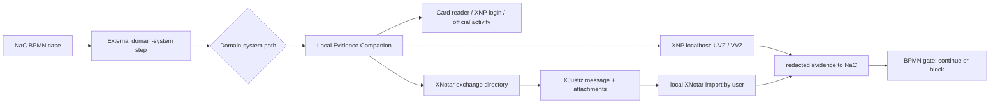

# Notarkammer Demo: XNP As A Local Domain-System Boundary

Status: 2026-06-20

This demo specification describes how NaC should present XNP, XNotar,
XJustiz, card readers and external register paths in BPMN process flows. The
goal is a defensible demo narrative for the Notarkammer: NaC is 100% notariat,
orchestrates the notarial workflow, while BNotK and register systems stay
behind their official, local or file-based boundaries. XNP is the external
notarial environment, not a NaC backend.

## Public Evidence Base

- BNotK documents XNP as a local integration edge for notarial software. As of
  October 2025, the public feature list covers login, UVZ search, UVZ lookup,
  next free UVZ number, UVZ creation, adding documents to UVZ entries, VVZ
  search, VVZ lookup and VVZ creation.
- The XNP interface is local. XNP starts a local web server on `localhost`;
  without custom configuration it tries a port in the 12774 to 12784 range.
- For login, login information, official-activity context and possibly a local
  API key are relevant. These values do not belong in NaC SaaS.
- For XNotar, BNotK does not describe a software interface that accepts matter
  data and triggers an import from the outside. Land-register, commercial-
  register and other applications are prepared through an exchange directory
  and XJustiz structures, then imported locally in XNotar.
- XJustiz is the electronic legal-communication standard and describes
  structured content data for automated forwarding and direct data adoption.

Sources:

- BNotK Onlinehilfe, Integration XNP mit Notariatssoftware:
  https://onlinehilfe.bnotk.de/technischer-bereich/systembetreuer/xnp-die-basisanwendung-der-bnotk/integration-xnp-mit-notariatssoftware.html
- BNotK Onlinehilfe, Integration XNP-XNotar mit weiterer Notariatssoftware:
  https://onlinehilfe.bnotk.de/technischer-bereich/systembetreuer/xnotar/integration-xnp-xnotar-mit-weiterer-notariatssoftware.html
- XJustiz:
  https://xjustiz.justiz.de/

## Hard Demo Boundary

The public documentation does not support direct land-register data delivery
from XNP to NaC. XNP does not deliver land-register data to NaC in the NaC demo
model. The public documentation only supports this demo model:

1. NaC may model a BPMN step that checks local XNP, card-reader and
   official-activity context as a prerequisite.
2. NaC may model UVZ/VVZ-related steps as local XNP work with evidence, as
   long as no secrets, PINs, login tokens or raw documents enter NaC SaaS.
3. NaC may model land-register and commercial-register paths as XNotar/XJustiz
   packages or exchange directories to be prepared or validated.
4. NaC may model a local user attestation: "package was imported locally in
   XNotar" or "external response was captured locally".
5. NaC must not claim direct XNP-to-NaC land-register content delivery.
6. NaC must not model an automated external XNotar import trigger.
   There is no automated external XNotar import trigger in the demo contract.

## BPMN Target Architecture

The `Local Evidence Companion` runs on the same workstation and user context
as XNP. It is the only component that checks local XNP, card-reader or file
paths. The SaaS only receives redacted evidence, status and hashes.

## BPMN Modeling

Each XNP/XNotar-related step is modeled as a Service Task or User Task with an
explicit gate:

| BPMN step | System boundary | Input | Output | Critical dependency |
| --- | --- | --- | --- | --- |
| Check workstation | local | XNP configuration, card-reader status | readiness evidence | user, card and XNP available locally |
| Prepare UVZ/VVZ | local XNP | case metadata, document hashes | local XNP action or attestation | XNP login and official activity |
| Prepare land-register application | XNotar/XJustiz | application data, attachments | XJustiz package in exchange directory | package validation |
| Prepare commercial-register filing | XNotar/XJustiz | register data, attachments | XJustiz package in exchange directory | signature, approval and import |
| Capture response | local/manual | external response or evidence | redacted evidence | human review |

Gate rules for BPMN profiles:

- Every step with `xnp_local`, `xnotar_xjustiz`, `register_portal` or
  `land_register_portal` needs `nac:evidence="required"` or remains
  fail-closed.
- Local XNP, local-notary-workstation and card-reader checks need
  `nac:localExecution="true"` or manual notary-office approval.
- Register and land-register gates are modeled only as external waiting,
  handoff or evidence points. Without evidence, the next path must not be
  shown as clear.
- `durationBand`, `parallelGroup` and `criticalPath` are required
  considerations for demo readiness: duration band for the expected
  dependency, parallel group for simultaneously tracked completion gates and
  critical path for external blockers.

The critical path is not just NaC waiting time. It is driven by external
dependencies: local login, signature/card, XNotar import, register or
land-register office, evidence, payment, approvals and intermediate orders.

## Customer UI

The customer UI shows no provider details, XNP ports, local file paths,
register or land-register system names, or card-reader diagnostics. The
allowed status is: "External notarial environment required". Internally, the
notary workstation may distinguish `local-notary-workstation`, `card-reader`,
`register` and `land-register`.

## Demo Statement

Allowed demo statement:

> NaC shows in BPMN when XNP, card readers, XNotar, XJustiz, land-register or
> commercial-register paths become relevant. NaC makes those steps visible,
> checkable and auditable. The actual XNP/XNotar work remains local and follows
> the official interface and import boundaries.

Forbidden demo statement, by meaning:

> NaC receives land-register content directly from XNP, or NaC controls XNP
> from the cloud.

## One-Hour Demo Slice

1. Show public process overview: real-estate purchase with parallel tracks for
   land register, financing, municipality/tax and evidence.
2. Show BPMN detail: XNP/card-reader readiness as a local gate.
3. Show XNotar/XJustiz step: prepare package, import locally, return evidence.
4. Show fail-closed behavior: without local readiness or evidence, the next
   BPMN step remains blocked.
5. Show audit view: only status, hashes, timestamp, role and check result; no
   PINs, login tokens, secrets or mandate content.

## Next Implementable Tracks

1. Sharpen the BPMN profile with external-system gates for `xnp_local`,
   `xnotar_xjustiz`, `grundbuch_external` and `register_external`.
2. Enrich the real-estate purchase, mortgage/land-charge and
   commercial-register BPMN models with explicit XNP/XNotar gates.
3. Extend the demo UI so external waiting time, parallel tracks and the
   critical path are visible.
4. Build the Local Companion as a readiness demo without live XNP API:
   configuration/path status, card-reader status, package validation and
   redacted evidence.
5. Only after official interface documentation and security approval: local
   XNP REST adapters for approved UVZ/VVZ functions.
