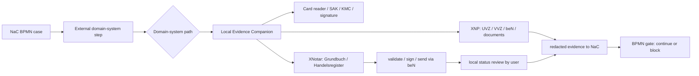

# Notarkammer Demo: XNP As A Local Domain-System Boundary

Status: 2026-06-20

This demo specification describes how NaC should present XNP, XNotar, card
readers and external register paths in BPMN process flows. The
goal is a defensible demo narrative for the Notarkammer: NaC is 100% notariat,
orchestrates the notarial workflow, while BNotK and register systems stay
behind their official, local or file-based boundaries. XNP is the external
notarial environment, not a NaC backend.

## Public Evidence Base

- NotarNet describes XNP as the BNotK base application. The named modules are
  UVZ, VVZ, notarial online procedures, beN, documents with PDF viewer and
  signature folder, user management and card management.
- BNotK Onlinehilfe describes XNP as the base application for BNotK
  applications and electronic legal communication. The XNotar modules
  Grundbuch and Handelsregister are provided within the XNP base application.
- NotarNet describes XNotar for electronic legal communication in register
  and land-registry matters, eNoVA, AML and qES certification. Named modules
  include Handelsregister, Grundbuch, other applications, GWG, eNoVA, qeS and
  transparency-register access.
- BNotK Onlinehilfe shows a land-registry application flow from basic data,
  properties, applications, parties and documents through validation,
  signing, PIN/card reader, sending via beN and status "Versendet".
- BNotK Onlinehilfe shows a commercial-register filing flow from basic data,
  legal entity, filing cases, parties and documents through completing
  preparation, signing, SAK/KMC/card reader, sending via beN and status
  "Versendet".
- For card readers, BNotK references tested REINER SCT devices. For other
  devices it names at least class 3, display and own PIN pad.
- Details not supported by these public sources are marked in this demo
  contract as "to be clarified in XNP test access".

Sources:

- NotarNet, XNP:
  https://notarnet.de/produkte/xnp
- NotarNet, XNotar:
  https://notarnet.de/produkte/xnotar
- BNotK Onlinehilfe, XNP - die Basisanwendung der BNotK:
  https://onlinehilfe.bnotk.de/technischer-bereich/systembetreuer/xnp-die-basisanwendung-der-bnotk.html
- BNotK Onlinehilfe, all steps of a Grundbuch application:
  https://onlinehilfe.bnotk.de/einrichtungen/notarnet/xnotar/einstiegshilfen/alle-schritte-eines-grundbuchantrags-auf-einen-blick.html
- BNotK Onlinehilfe, all steps of a register filing:
  https://onlinehilfe.bnotk.de/einrichtungen/notarnet/xnotar/einstiegshilfen/alle-schritte-einer-registeranmeldung-auf-einen-blick.html
- BNotK Onlinehilfe, card-reader notice:
  https://onlinehilfe.bnotk.de/einrichtungen/zertifizierungsstelle/hinweis-zu-kartenlesegeraeten.html

## Hard Demo Boundary

The public documentation does not support direct cloud access from NaC to XNP,
XNotar, beN, signature card, card reader, register or land registry. NaC does
not claim direct XNP-to-NaC land-register data delivery in the demo model;
whether and which local data handoffs are technically possible is to be
clarified in XNP test access. The public documentation only supports this demo
model:

1. NaC may model a BPMN step that checks local XNP, card-reader and
   official-activity context as a prerequisite.
2. NaC may model UVZ/VVZ-related steps as local XNP work with evidence, as
   long as no secrets, PINs, login tokens or raw documents enter NaC SaaS.
3. NaC may model land-register and commercial-register paths as the public
   XNotar steps in the external notarial environment: basic data, properties
   or legal entity, applications or filing cases, parties, documents,
   validation, signature, sending via beN and status.
4. NaC may model a local user attestation: "application was processed locally
   in XNP/XNotar", "send status was captured locally" or "external response
   was captured locally".
5. NaC must not claim direct XNP-to-NaC land-register content delivery.
6. Automated adapters, import/export details, local ports, API keys and
   productive interface parameters are to be clarified in XNP test access.

## BPMN Target Architecture

The `Local Evidence Companion` runs on the same workstation and user context
as XNP. It is the only component that checks local XNP, XNotar, beN,
signature or card-reader readiness. The SaaS only receives redacted evidence,
status and hashes. Technical reachability, port/API behavior and adapter
details are to be clarified in XNP test access.

## BPMN Modeling

Each XNP/XNotar-related step is modeled as a Service Task or User Task with an
explicit gate:

| BPMN step | System boundary | Input | Output | Critical dependency |
| --- | --- | --- | --- | --- |
| Check workstation | local | XNP/XNotar readiness, SAK/KMC, card-reader status | readiness evidence | user, card and XNP available locally |
| Prepare UVZ/VVZ/beN/documents | local XNP | case metadata, document hashes | local XNP action or attestation | XNP official activity and signature path |
| Prepare land-register application | XNotar within XNP | basic data, properties, applications, parties, documents | validation, signature, send status via beN | application validation and signature |
| Prepare commercial-register filing | XNotar within XNP | basic data, legal entity, filing cases, parties, documents | preparation, signature, send status via beN | SAK/KMC/card reader, signature and sending |
| Capture response | local/manual | external response or evidence | redacted evidence | human review |

Gate rules for BPMN profiles:

- Every step with `xnp_local`, `xnotar_xjustiz`, `register_portal` or
  `land_register_portal` needs `nac:evidence="required"` or remains
  fail-closed.
- Local XNP, local-notary-workstation and card-reader checks need
  `nac:localExecution="true"` or manual notary-office approval.
- Register and land-register gates are modeled only as external waiting,
  handoff or evidence points. Without evidence, the next path must not be
  shown as clear.
- `durationBand`, `parallelGroup` and `criticalPath` are required
  considerations for demo readiness: duration band for the expected
  dependency, parallel group for simultaneously tracked completion gates and
  critical path for external blockers.

The critical path is not just NaC waiting time. It is driven by external
dependencies: local login, signature/card, XNotar import, register or
land-register office, evidence, payment, approvals and intermediate orders.

## Customer UI

The customer UI shows no provider details, XNP ports, local file paths,
register or land-register system names, or card-reader diagnostics. The
allowed status is: "External notarial environment required". Internally, the
notary workstation may distinguish `local-notary-workstation`, `card-reader`,
`register` and `land-register`. For card readers, internal readiness notes may
refer to REINER SCT, class 3, display and own PIN pad; the customer view does
not show those details.

## Demo Statement

Allowed demo statement:

> NaC shows in BPMN when XNP, card readers, XNotar, land-register or
> commercial-register paths become relevant. NaC makes those steps visible,
> checkable and auditable. The actual XNP/XNotar work remains local and follows
> the official interface and import boundaries.

Forbidden demo statement, by meaning:

> NaC receives land-register content directly from XNP, or NaC controls XNP
> from the cloud.

## One-Hour Demo Slice

1. Show public process overview: real-estate purchase with parallel tracks for
   land register, financing, municipality/tax and evidence.
2. Show BPMN detail: XNP/card-reader readiness as a local gate.
3. Show XNotar step: prepare the land-register or commercial-register
   application locally, validate, sign, send via beN and return redacted
   evidence.
4. Show fail-closed behavior: without local readiness or evidence, the next
   BPMN step remains blocked.
5. Show audit view: only status, hashes, timestamp, role and check result; no
   PINs, login tokens, secrets or mandate content.

## Next Implementable Tracks

1. Sharpen the BPMN profile with external-system gates for `xnp_local`,
   `xnotar_xjustiz`, `grundbuch_external` and `register_external`.
2. Enrich the real-estate purchase, mortgage/land-charge and
   commercial-register BPMN models with explicit XNP/XNotar gates.
3. Extend the demo UI so external waiting time, parallel tracks and the
   critical path are visible.
4. Build the Local Companion as a readiness demo without live XNP API:
   configuration/path status, card-reader status, package validation and
   redacted evidence.
5. Only after official interface documentation and security approval: local
   XNP REST adapters for approved UVZ/VVZ functions.
