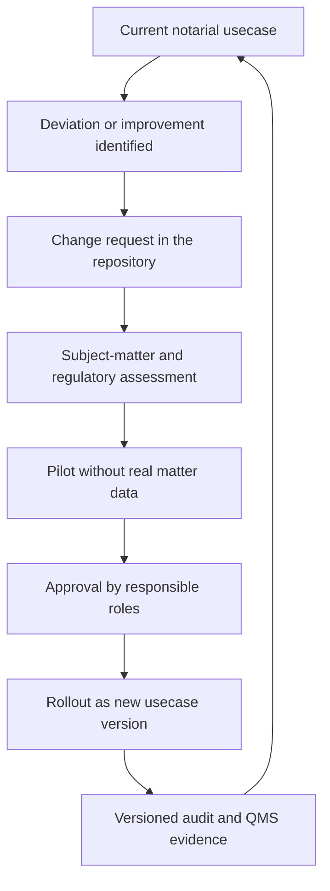

# Non-Technical Guide: Notariat As Code Without IT Specialist Knowledge

## Why This Model Helps

A notary office depends on repeatable decisions, deadlines, evidence and clear
responsibilities. When these rules live only in people's heads, emails or
individual specialist-system screens, risks appear:

- unclear responsibilities,
- incomplete matter and approval traces,
- difficult auditability for privacy, QMS, audit or professional evidence,
- high dependency on individual people.

NaC solves this by versioning, approving and permanently documenting notarial
case types.

In short:

- The LLM is the simple language input for staff.
- Git is the reliable protocol and approval system.
- Python is the standardized check layer for repeatable steps.
- The human in the notary office remains professionally responsible.

## Why Usecases Should Be Built First

Before a flow is rolled out in the notary office, it should be modeled cleanly
in the pattern. Otherwise errors become visible only in daily work. The pattern
provides:

- clear roles,
- unambiguous status steps,
- defined approval points,
- auditable documentation duties,
- boundaries for AI, specialist systems and real matter data.

Therefore: usecase design first, operational rollout second.

## Canonical Notarial Building Blocks

NaC is not an industry toolkit. There are no examples for non-notarial
organization types.

Subject-matter examples come only from the
[usecase catalog](../../usecases/README.md), including:

- real-estate purchase contract,
- signature certification,
- online GmbH formation,
- commercial-register filing,
- testament or inheritance contract,
- power of attorney and patient directive.

The pattern combines:

- shared notary-office rules for roles, approvals, evidence, privacy and
  versioning,
- concrete usecase rules per case type.

## Decision Principle For Different Ways Of Working

When notary offices work differently, this is modeled as an approved variant,
not as a silent exception.

Example:

- Variant A: a real-estate purchase contract starts with land-register review
  before draft approval.
- Variant B: a simple certification starts with identity and representation
  review.

Both variants can be valid. The system documents which variant applies to which
location or usecase and since when.

## How A Non-IT Decision Maker Starts In A Notary Office

## Step 1: Define Responsibility And Target Picture

- Name the responsible roles in the notary office.
- Select one to three prioritized usecases from [usecases/](../../usecases),
  for example real-estate purchase contract or signature certification.
- Define which evidence is mandatory from privacy, professional, liability or
  QMS perspectives.

## Step 2: Set Up A Private Notary-Office Fork

- Create a dedicated private repository for the notary office.
- Use this pattern as a template and adopt only the suitable parts.
- Define access and roles: who may propose, review and approve.

## Step 3: Create The First Notary-Office Variant

- Clone the pattern into your environment.
- Adapt only notarial usecases and rules to local operations.
- Start with a pilot path such as real-estate purchase contract or signature
  certification without real matter data.

## Step 4: Make Approval Rules Binding

- In production notary-office forks, processes are changed through pull
  requests; in the active reference repo, the owner may explicitly request
  direct delivery.
- Sensitive steps receive four-eyes approval.
- Release states are marked with versions.

## Step 5: Operate With Continuous Improvement

- Every deviation is documented as a change request.
- Every change receives a version number with rationale.
- Every new version is tested in a pilot path before rollout.

## Continuous Improvement In Git

## Standardization And Certification

When many notary offices use the same reviewed usecase state, an association or
subject-matter review body can assess and recommend a concrete version.

Possible model:

- reference usecase with clear version history,
- formal review against quality and compliance criteria,
- optional certificate or attestation for a specific usecase version,
- public evidence of which version was reviewed.

Important:

- A certificate should always refer to a concrete version.
- Every change after certification requires a new assessment.
- Notary offices may extend locally, but may lose certification status for
  modified parts until those parts have been reviewed again.

## Practical 90-Day Start Recommendation

- Weeks 1-2: define target picture, roles and first usecase.
- Weeks 3-4: set up private fork and define approval rules.
- Weeks 5-8: pilot real-estate purchase contract or signature certification
  with synthetic data.
- Weeks 9-10: check local workstation, XNP, card and register gates.
- Weeks 11-12: lessons learned, change requests and first version approval.

This creates a robust, auditable and learnable operating system for notarial
case types.
