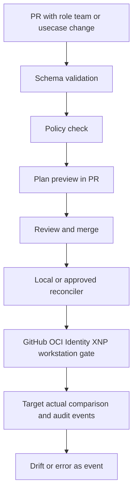

# NaC Enterprise Control Plane MVP For Notary Offices, 6 Months

## Goal And Frame

This document makes a realistic MVP for `Notariat as Code` concrete within the
`NaC + Enterprise GitOps` model.

The MVP closes a small but complete end-to-end loop:

- declarative change in Git,
- policy and approval check,
- local or approved reconciliation into target systems,
- audit and drift visibility.

The synchronous pilot path is `notary`. Non-notarial domain sets are not part
of the MVP.

## MVP Scope

Focus:

- notary-office roles, workstation readiness and access,
- first subject-matter usecase from [usecases/](../../usecases), preferably
  real-estate purchase contract or signature certification,
- technical change types for team, role and local access coordination.

Included change types, schema v1:

- `team`
- `role_change`
- `joiner_mover`

Not in the MVP:

- autonomous notarial approvals,
- real matter data in the public repository,
- non-notarial domain modules,
- write-capable specialist-system adapters without separate approval.

## Reference Flow

## Repository Shape For The Pilot

- [usecases/](../../usecases) contains the subject-matter pilot.
- [policies/](../../policies) contains binding rules.
- [plugins/](../../plugins) and [workflows/](../../workflows) contain planned or
  implemented notary-office integrations.
- [schemas/](../../schemas) contains machine-checkable contract definitions.

## Six-Month Plan

### Month 1: Fix The Model

- Make the notarial scope binding.
- Select the pilot usecase.
- Make role and approval minimums checkable.

### Month 2: Validation And Policy

- CI validates affected schemas.
- Policy checks provide PR-ready feedback.
- Plan preview becomes human-readable.

### Month 3: Local Reconciler And Workstation Gate

- Merge event or local request starts reconciliation.
- Workstation, card, XNP or register readiness is checked metadata-only.
- Audit trail exists for every execution.

### Month 4: Stabilize Integrations

- GitHub, OCI Identity and notary-workstation paths are documented.
- Retry, error classification and idempotency path are stable.

### Month 5: Observability And Drift

- Target/actual comparison with clear drift signals.
- Dashboard for lead time, errors and governance.

### Month 6: Pilot Operation

- One notary-office area works productively through the approved flow.
- One notarial usecase runs end to end with synthetic or private data.
- KPI review with scaling decision.

## KPI Set For The MVP

Delivery:

- lead time per usecase or role change,
- share of validated changes compared with manual tickets.

Governance:

- policy violations per PR,
- audit coverage per executed change.

User value:

- time to readiness for new staff,
- time to pilot for one notarial usecase.
