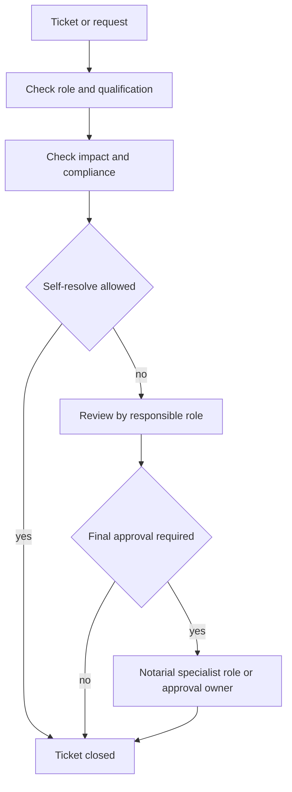

# Role Model: Notary Office

## Goal

This model ensures that:

- every authorized person can create tickets within the allowed scope,
- only qualified roles can make final decisions in subject-critical steps,
- notarial approvals are documented in a traceable and audit-proof way.

## 1. Basic Principle In The Notary Office

- Every authorized role may observe.
- Every authorized role may open a ticket.
- Every role may self-resolve only within its approved competence.
- Subject-critical decisions require qualified roles and, where necessary,
  four-eyes approval.

Example: if a workstation gate fails, nobody has to be a notary to report it.
A notarial approval still remains with the qualified subject-matter role.

## 2. Minimum Roles

- `mitarbeiter`: may report, comment and update status.
- `sachbearbeitung`: may process and close operational tickets when there is no
  subject-critical impact.
- `notariatsfachkraft`: may prepare matter data, open information and evidence.
- `notar_fachlich`: may make notarial subject-matter decisions.
- `kostenverantwortung`: may review cost and fee questions where qualified.
- `prozessverantwortung`: may approve working rules in the subject process.
- `freigabeverantwortung`: may finally approve approval-required steps.
- `revision_audit`: may review, but not decide operationally.
- `automation`: executes technical standard tasks and does not decide on
  subject matter.

## 3. Qualification Instead Of Title

The decisive factor is not only the job title, but the documented
qualification.

Example:

- `notarial_cost_note_review`: allowed only for roles with
  `qualification: notarial_costs_training`.

## 4. Decision Matrix

- `impact=low` and `compliance=none`: self-resolve allowed.
- `impact=medium` or `financial=true`: review by process owner or cost owner.
- `impact=high`, `legal=true` or notarial subject-matter decision: approval by
  a qualified specialist role.

## 5. Workflow Integration

Required technical fields per process request:

- `actor_context.actor_role`
- `actor_context.requested_decision_type`
- `actor_context.impact_level`
- `actor_context.compliance_impact`
- optional `actor_context.requested_qualification`
- optional `actor_context.qualification_evidence`
- depending on the decision, `actor_context.approver_role`

## 6. Gender And Role Names

The internal role ID remains neutral and stable, for example
`notar_fachlich` as a technical identifier. Visible wording follows
[policies/culture-policy.yaml](../../policies/culture-policy.yaml).
