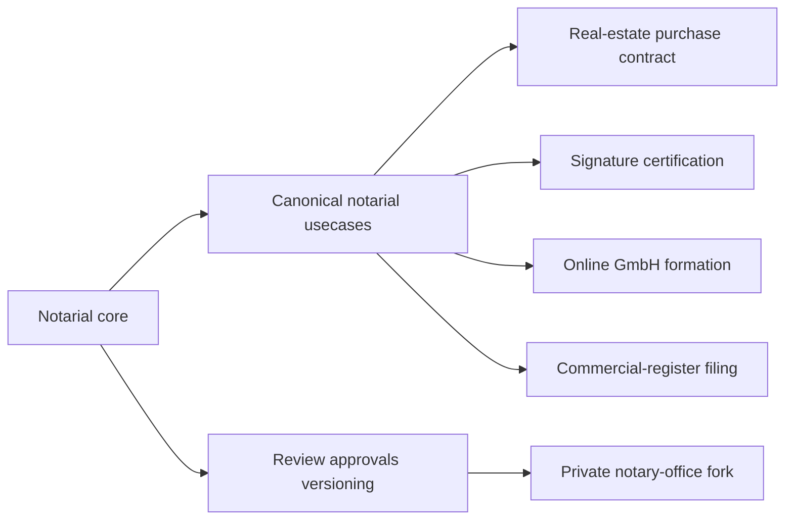

# Blueprint: Notarial Scope For NaC

## Goal

This blueprint makes the binding subject-matter assumption explicit:

NaC is only `Notariat as Code`. The repository does not define non-notarial
product paths.

Canonical subject-matter examples live only in the
[usecase catalog](../../../usecases/README.md). Examples include real-estate
purchase contracts, signature certification, online GmbH formation and
commercial-register filings.

## Guiding Principle

- `notariat_core` contains rules shared by notarial case types.
- `usecase` contains only case-type-specific questions, documents, decisions,
  gates and evidence.
- Every effective process change is versioned, reviewed and approved.
- Running matters remain bound to the process version selected at start.

## Shared Notarial Topics

These topics belong in the shared notarial core:

1. roles, qualifications and approval paths in the notary office,
2. matter intake, file creation and responsibility,
3. identity, power-of-attorney, register and signature readiness,
4. matter status and subject-matter approval gates,
5. cost-note, fee and closure evidence,
6. evidence, audit, archiving and QMS relation,
7. deviation and incident handling.

## Usecase Topics

Usecase rules remain in [usecases/](../../../usecases) when they affect only one
notarial case type:

- `immobilienkaufvertrag`: property, parties, purchase price, encumbrances,
  financing and completion.
- `unterschriftsbeglaubigung`: identity, representation, document purpose,
  register relation and certification note.
- `online-gmbh-gruendung`: company data, founders, capital, management,
  register route and AML flags.
- `handelsregisteranmeldung`: entity, resolution, signers, attachments, XNP
  route and filing evidence.

## Boundary Rule

A rule belongs in `notariat_core` when it:

- applies equally to several notarial usecases,
- contains no case-type-specific required fields,
- can be phrased as a clear and checkable notary-office rule.

A rule belongs in a `usecase` when it:

- affects only one concrete notarial case type,
- needs its own required documents, gates or evidence artifacts,
- describes the subject-matter flow of a specific matter.

Non-notarial rules are not NaC usecases. If such a rule appears in the
repository, it is either legacy runtime fixture material or an error that must
be corrected through issue and pull request.

## Structure Model

## Versioning And Mixed Operation

- The notarial core and affected usecases are approved together as a release in
  the private notary-office fork.
- A `process_version` is bound when a matter starts.
- New releases apply only to new matters.
- Running matters finish on their bound version.

Details are in
[parallelbetrieb-version-binding.md](../operations/parallelbetrieb-version-binding.md).
