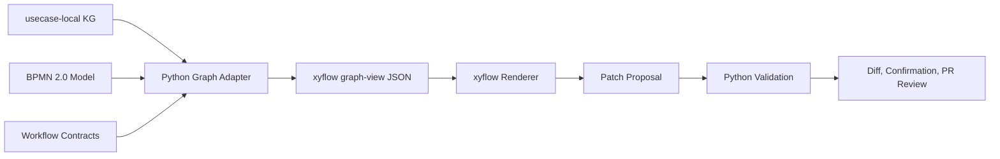

# xyflow and Frontier Contract for NaC

Date: 2026-05-26

## Short Decision

NaC adds a contract-first graph view to the existing BPMN and KG architecture
for usecase-local knowledge graphs, connector dependencies, gates, evidence
and future agent topologies. `bpmn-js` remains the visual editing layer for
BPMN 2.0 process models. `xyflow` does not become the source of process
truth; it becomes an optional canvas layer above a validated JSON contract.

OpenAI Frontier changes the plan by setting the production and governance
bar: agents in NaC are treated only as explicitly authorized, verifiable and
observable execution units. Chat or canvas surfaces may show proposals,
status and topologies, but they may not write without validation, diff,
confirmation and review.

## Context

NaC already separates binding process models, usecase-local knowledge graphs
and local operating surfaces:

- [BPMN-js Business Layer](../../bpmn-js-business-layer.md) makes BPMN 2.0
  the process source and `bpmn-js` the planned editing layer.
- [KG Editor Workstream](../../kg-editor-workstream.md) exposes
  usecase-local knowledge graphs as safe list, form and checklist views.
- [Local Web Server](../../lokaler-webserver.md) bundles BPMN and KG views
  locally without a mandate-data requirement.
- [OpenAI Enterprise, EU Data Residency And Codex Costs](../../openai-enterprise-eu-residency.md)
  describes OpenAI-related privacy, residency, tool and approval boundaries.

The React Flow and Svelte Flow family from `xyflow` is suitable for
interactive node-based surfaces. For NaC, this means the value is in
visualized dependencies and operating edges, not in a new layer of factual
truth.

The OpenAI Frontier page describes enterprise agents with business context,
agent execution, evaluation, optimization, governance, explicit permissions,
audits and observability. For NaC, this means every future agent function
needs identity, tool scope, a human gate, an audit log and evaluation
evidence from the beginning.

## Goals

1. Define a machine-readable graph-view contract that Python can generate
   from existing NaC artifacts.
2. Prepare `xyflow` as an exchangeable rendering layer without pulling it
   into the deterministic core or the quality gates.
3. Model agent and connector topologies so that OpenAI-Frontier-like
   production requirements become visible: authorization, execution,
   evaluation, governance and observability.
4. Preserve existing guardrails: no real mandate data in the product
   repository, no direct editing of `value` fields, and no write action
   without patch, validation, diff and review.

## Non-Goals

- No replacement of BPMN 2.0 with `xyflow`.
- No immediate React or Vite product app.
- No OpenAI API call from the browser surface.
- No autonomous approvals for notarial, personal-data or professionally
  sensitive steps.
- No storage of real mandate data, API keys, tokens, PINs, certificate
  material or registry extracts in the product repository.

## Architecture

The first implementation has three clear boundaries:

1. `nac.xyflow_view`, or an equivalent Python module, generates a JSON graph
   from the usecase-local KG and existing contracts.
2. `workflows/contracts/xyflow-graph-view.contract.json` describes the schema
   version, node types, edge types, allowed actions, data classes, guardrails
   and later rendering expectations.
3. The local web app or a future ChatGPT app renders this contract with
   `xyflow`, while treating the graph only as a display and proposal surface.

The canonical flow remains:

## Graph Model

The contract uses a small and stable type set:

| Node type | Meaning |
| --- | --- |
| `case` | Usecase or matter type as the root. |
| `information` | Open information from the KG. |
| `document` | Document status or document requirement. |
| `decision` | Professional decision with status. |
| `gate` | Approval, privacy, review or workstation gate. |
| `evidence` | Evidence reference or audit anchor. |
| `bpmn_step` | BPMN step with an optional KG reference. |
| `connector` | Local plugin, expert system, registry or tool dependency. |
| `agent` | Future AI, Codex or ChatGPT agent role with explicit tool scope. |
| `eval` | Evaluation or quality evidence for agentic steps. |

Edges are limited as well:

| Edge type | Meaning |
| --- | --- |
| `requires` | The target node is a prerequisite. |
| `produces` | The source node creates the target node. |
| `reviews` | The source node checks or approves the target node. |
| `blocks` | The target node is blocked until the source node is satisfied. |
| `executes_with` | The step uses a connector, tool or agent. |
| `evidences` | The target node is evidenced by the source node. |
| `evaluates` | The eval node assesses an agent, tool or result. |

Every node contains at least `id`, `type`, `label`, `status`, `data_class`,
`owner_role`, `source_ref`, `editable`, `requires_review` and
`privacy_boundary`. `value` fields from KGs are not transferred.

## Data Flow

Read flow:

1. The adapter loads the usecase-local KG through the existing `notary_kg`
   modules.
2. It optionally reads BPMN steps and workflow contracts when they create
   useful relationships.
3. It normalizes nodes and edges into UI-neutral JSON.
4. Tests verify that no mandate values, secrets or free payloads enter the
   graph.

Write flow:

1. The canvas may only create allowed proposals, such as status, gate or link
   changes.
2. Proposals are expressed as an existing KG editor patch or as a new graph
   patch.
3. Python validates schema, privacy, conflicts and authorization.
4. The change is shown as a diff and is only accepted through confirmation
   and pull request review.

## Failure And Security Behavior

- If a KG, BPMN model or contract cannot be loaded, the adapter returns an
  explained error instead of a partial graph with silent gaps.
- Unknown node or edge types are rejected rather than rendered freely.
- Mandate values, secrets and direct upload contents are forbidden fields.
- Agent nodes without `tool_scope`, `human_gate`, `audit_event` and
  `eval_policy` are incomplete.
- External AI processing remains blocked by DPA, data-residency, retention
  and tool approval.

## Test Strategy

The first implementation does not need a browser dependency. It is protected
with Python tests:

- Unit test for graph generation from a known usecase.
- Schema and contract validation for the new workflow contract.
- Privacy test: no `value` fields and no free mandate values in graph JSON.
- CLI test for a later entry point such as `nac kg graph-view <slug>` or
  `nac graph view <slug>`.
- The strict quality gate remains the final evidence.

Browser and screenshot tests become necessary only when a concrete `xyflow`
rendering layer is added to the local web app or an app component.

## Implementation Plan After Review

1. Add `workflows/contracts/xyflow-graph-view.contract.json`.
2. Implement a Python adapter for `nodes` and `edges` from `notary_kg`.
3. Add a CLI or API entry point that emits JSON.
4. Integrate tests and validation into the existing quality gate.
5. Mirror documentation in German and English once the contract is
   implemented.
6. Design a `xyflow` web view only after that.

## Later Rendering Decision

The rendering layer should be decided only after the contract exists. If the
local web app stays on server-side HTML, `xyflow` can serve as a small
embedded JS component. If NaC gets a React-based operator surface anyway,
`@xyflow/react` should be used there as a regular component. This decision is
intentionally deferred because the contract matters more than the framework.
