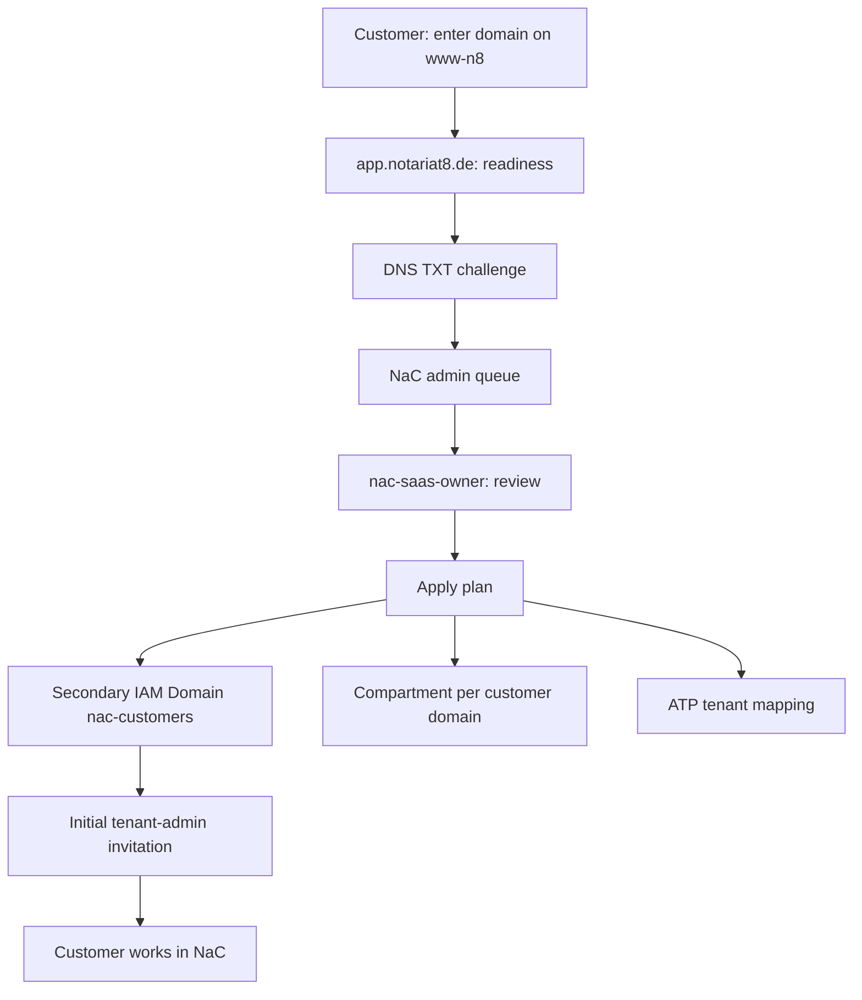

# Customer-Centric Tenant Onboarding Journey Design

Date: 2026-05-28

Issue: https://github.com/notariat8/NaC/issues/40

## Decision

NaC treats the next onboarding step as an application journey, not as a list of
individual features:

1. A new customer starts on `www-n8` and enters a domain.
2. `app.notariat8.de` runs domain readiness with DNS proof.
3. The `nac-saas-owner` role works as SaaS admin through a NaC admin queue.
4. NaC creates a reviewable apply plan for OCI Identity, compartment, ATP
   tenant mapping and the initial invitation.
5. The customer works in NaC after invitation, not in the OCI Console.

The initial architecture uses one shared Notariat8 SaaS tenancy. The `Default`
Identity Domain stays reserved for SaaS administration and break-glass access.
Customer users sign in through a secondary identity domain for NaC customers.
The resource and operations boundary is prepared through one compartment per
customer domain. ATP starts as a shared NaC database with explicit tenant
isolation and can later escalate to schema, database or child-tenancy
isolation.

## Source Frame

Oracle describes Organization Management as the tool for central management of
many tenancies, child tenancies, subscriptions and governance rules:
<https://docs.oracle.com/en-us/iaas/Content/General/organization/home.htm>.

Oracle recommends multiple tenancies mainly for strong isolation; if that
isolation is not required, compartments should be considered for workload
separation:
<https://docs.oracle.com/en-us/iaas/Content/General/organization/organization_planning.htm>.

Compartments are logical resource groups and policy scopes. They do not have
their own users, groups or policies; identities live in IAM, and the
compartment limits where groups can exercise permissions:
<https://docs.oracle.com/en/cloud/foundation/cloud_architecture/governance/compartments.html>.

Identity domains manage users, groups, federation, SSO/OAuth, security rules
and applications. Each tenancy has a `Default` domain, and additional domains
can be created for separate user populations or applications:
<https://docs.oracle.com/en-us/iaas/Content/Identity/domains/overview.htm>.

When creating an identity domain, the type, compartment, name and optional
domain administrator must be selected. Additional domains are not automatically
replicated to every region:
<https://docs.oracle.com/en-us/iaas/Content/Identity/domains/to-create-new-identity-domain.htm>.

Identity domain types have different features, limits and metering. The Free
domain supports user and group management but has lower object and API limits
than Premium or External User domains:
<https://docs.oracle.com/en-us/iaas/Content/Identity/sku/overview.htm>.

Autonomous Database supports IAM integration with default and non-default
domains. IAM policies can limit access to Autonomous Database at tenancy,
compartment or individual database level:
<https://docs.oracle.com/en-us/iaas/autonomous-database/doc/manage-users-iam.html>.

## Target State

## Customer Workflow

1. The customer opens `www-n8`.
2. The customer enters a domain and clicks `Mark readiness`.
3. `www-n8` passes only non-binding hints to `app.notariat8.de`.
4. NaC shows a readiness page with domain, derived tenant slug and required
   admin email from the same domain.
5. NaC creates a DNS TXT challenge without storing secret material in the
   repository.
6. The customer adds the DNS TXT record with the DNS provider.
7. NaC checks the domain and marks the request as `domain_verified`.
8. After SaaS-admin approval, the initial tenant admin receives an invitation.
9. The tenant admin signs in to NaC and manages users and roles in NaC. The OCI
   Console remains invisible to end customers.

## SaaS Admin Workflow

1. `nac-saas-owner` sees new readiness requests in the NaC admin queue.
2. NaC shows domain, admin email, DNS status, DPA/contract status, risk gates
   and the current apply plan.
3. The SaaS admin checks that the domain is plausible, controlled and
   contractually approved.
4. NaC creates an apply plan with:
   - tenant registry record,
   - identity groups and initial admin,
   - compartment name and tags,
   - ATP tenant mapping,
   - audit event and rollback plan.
5. Productive applies require owner approval. Without approval, the plan stays
   a review artifact.
6. After apply, the customer receives an invitation; `nac-saas-owner`
   remains SaaS owner but does not work as the operational customer admin.

## OCI Decision

### Start: One Secondary IAM Domain For Customers

For the MVP, one secondary identity domain is sufficient, for example
`nac-customers`, with one OIDC app client for `app.notariat8.de` and groups per
tenant:

- `tenant/<slug>/admin`
- `tenant/<slug>/notary`
- `tenant/<slug>/case-worker`
- `tenant/<slug>/auditor`
- `tenant/<slug>/billing-viewer`

The `Default` domain stays reserved for `nac-saas-owner`, break-glass and
OCI SaaS administration.

### Start: One Compartment Per Customer Domain

One compartment per customer domain is the right resource scope for
customer-related OCI resources, budgets, quotas, tags, Object Storage, audit
exports and later dedicated services. A compartment does not replace an IAM
domain or database tenant isolation; it is the OCI resource boundary.

### Start: Shared ATP With Tenant Isolation

The first ATP variant is one shared NaC ATP instance with explicit tenant
mapping:

- `tenant_id` is mandatory in tenant-related tables,
- `tenant_registry` is the control table,
- the NaC app is the only database access layer,
- customers do not get direct database access,
- schema per tenant or dedicated ATP per tenant can be added later.

If IAM token access to ATP becomes required later, NaC can map IAM groups from
default or non-default domains to database roles or global users. For the app
MVP, this complexity stays outside the first apply.

## Escalation Rules

A dedicated IAM domain per customer becomes necessary only when a customer
needs dedicated sign-on policies, federation, admin delegation or separate app
registrations.

A child tenancy becomes necessary only when strong isolation, separate service
limits, separate networks, dedicated governance rules, dedicated billing or
contractual exit isolation are required.

A dedicated ATP per customer becomes necessary only when data residency,
performance, restore, exit, key management or contractual tenant separation
exceed the shared ATP model.

## Boundaries

- No mandate data on `www-n8`.
- No OCI Console for customer users.
- No productive OCI writes without a separate owner apply.
- No secrets, API keys, private keys, tokens or passwords in GitHub.
- No child-tenancy default for the MVP.
- No direct customer database usage in the MVP.

## Acceptance

- The journey is complete from the customer and SaaS-admin perspective.
- The OCI starting decision is source-based and understandable.
- The ATP target state models tenant isolation without requiring dedicated
  databases immediately.
- The next implementation track can derive concrete views, APIs, apply plans
  and tests from this design.
