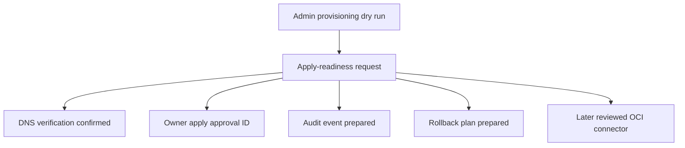

# OCI Identity Apply-Readiness Design

This specification extends OCI Identity tenant onboarding with a checkable
apply-readiness layer. It prepares productive identity writes, but does not
execute them.

## Goal

NaC should be able to derive an apply request from an existing OCI admin
provisioning dry run. This request is a review artifact for owners, audit and
later connector code. It contains no credentials, private keys, OAuth secrets
or tokens and does not call OCI write operations.

## Design Decision

The track builds a closed three-step path:

1. `nac tenant provision-admin --dry-run` creates the technical plan as before.
2. A new apply-readiness builder checks DNS verification, owner approval,
   audit event ID and rollback plan.
3. `nac tenant apply-request --dry-run` emits a machine-readable review
   artifact.

Productive execution intentionally remains outside this pull request. A later
connector may write only when apply readiness is complete and a separate owner
apply has been approved.

## Contract Boundary

The existing `oci-tenant-identity.contract.json` contract is extended with:

- `apply_readiness_schema`
- required gates `dns_verified`, `owner_apply_approval`,
  `audit_event_prepared`, `rollback_plan_prepared`
- blockers for direct OCI writes without an apply request
- an explicit statement that apply requests must not contain credentials

## Data Flow

## Acceptance Criteria

- `build_apply_request(...)` creates a deterministic artifact with
  `schema_version: nac.oci-identity-apply-request/v0.1`.
- Without DNS verification, owner approval, audit event or rollback plan,
  `ready_to_apply` is always `false`.
- The artifact contains no secrets, tokens or private-key markers.
- `nac tenant apply-request --dry-run` is reachable through the central CLI.
- `scripts/validate_oci_tenant_identity.py` validates the new apply boundary.
- The strict Quality Gate remains green.
