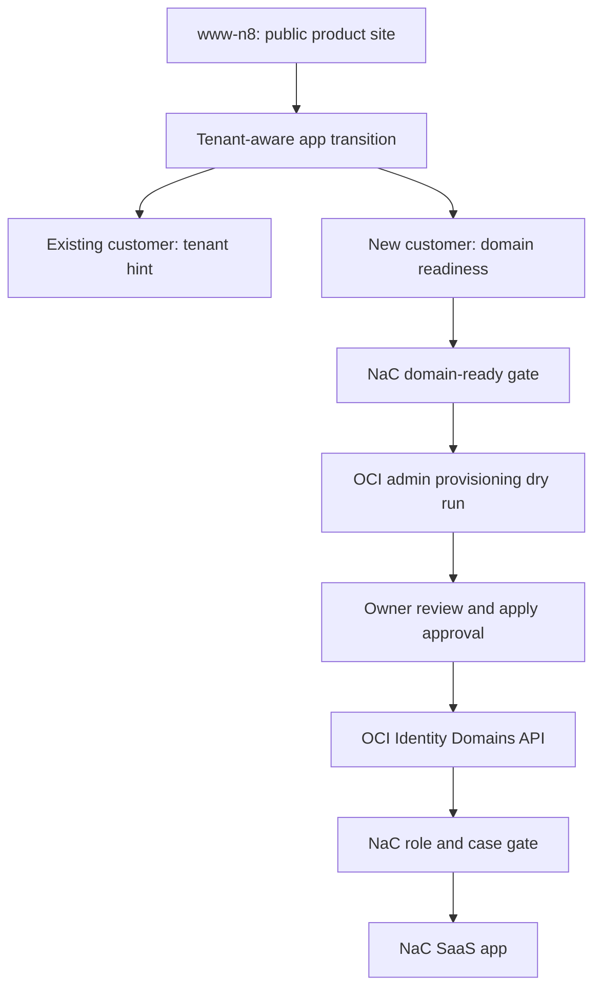

# OCI Tenant Identity Design

This specification describes the first real SaaS transition from the public
`www-n8` surface into the NaC platform. For this track, it replaces the earlier
"Entra ID first" assumption with Oracle OCI Identity Domains.

## Goal

`www-n8` remains the public product and information site. NaC becomes the
authenticated SaaS platform for notarial work. The transition is tenant-aware:
existing customers enter the app with tenant context, while new customers first
run through a domain-readiness check.

The productive IdP is Oracle OCI Identity Domains. End users do not work in
the OCI Console. NaC manages subject-matter roles, tenant binding and later
user management through its own surfaces and reviewed API contracts.

## Sources

Oracle describes the Identity Domains REST API as a SCIM 2.0 compliant surface
for managing users, groups and apps:
<https://docs.oracle.com/en/cloud/paas/iam-domains-rest-api/index.html>.

Users are managed through `/admin/v1/Users`; Oracle documents that creating a
user requires suitable Identity Domain Administrator or User Administrator
permissions:
<https://docs.oracle.com/en/cloud/paas/iam-domains-rest-api/api-identity-users.html>.

Groups are managed through `/admin/v1/Groups` and act as role anchors:
<https://docs.oracle.com/en/cloud/paas/iam-domains-rest-api/api-identity-groups.html>.

The OCI CLI documents Identity Domain endpoints with the
`https://<domainURL>/admin/v1/` pattern:
<https://docs.oracle.com/en-us/iaas/tools/oci-cli/latest/oci_cli_docs/cmdref/identity-domains.html>.

For later visual tenant and role flows, `xyflow` is a good fit because React
Flow nodes are regular React components and domain-specific node types can be
registered via `nodeTypes`:
<https://reactflow.dev/examples/nodes/custom-node>.

## Architecture

The first implementation performs no productive OCI writes. It delivers a
checkable contract and dry-run layer:

- Domain readiness checks domain syntax, tenant slug and admin email domain,
  and emits a DNS TXT verification proposal without secrets.
- OCI admin provisioning creates a plan for users, groups and memberships but
  does not write to OCI.
- NaC web/API and CLI return the same payloads.
- `www-n8` links into this process deliberately, but stores no tokens, mandate
  data, raw documents or OCI details.

## Data And Role Model

The tenant is addressed by a stable slug. The slug is not a secret. The domain
is the customer's subject-matter domain, for example
`kanzlei-notariat.example`. The admin email must match the domain so private
freemail or foreign-domain accounts are not used as the initial tenant admin.

NaC knows these subject-matter roles for this track:

- `nac-tenant-admin`
- `nac-notary`
- `nac-case-worker`
- `nac-auditor`
- `nac-billing-viewer`

OCI groups are only technical IdP anchors. The subject-matter decision remains
in the NaC role and case gate.

## Security Boundary

Productive identity writes are prohibited in this track. Allowed work is:

- local validation,
- read-only OCI diagnostics,
- dry-run payloads,
- review artifacts in the pull request.

Disallowed work is:

- creating OCI users or groups without separate owner review,
- storing client secrets, API keys, tokens or private keys in the repo,
- requiring end users to work in the OCI Console,
- using real mandate data in `www-n8`, demo payloads or pull request
  descriptions.

## Acceptance Criteria

- `nac tenant domain-check` returns deterministic JSON output.
- `nac tenant provision-admin --dry-run` returns an OCI Identity plan with
  `requires_human_approval: true`.
- Web API routes return the same payloads.
- `nac contracts validate` validates the new contract.
- `docs/de` and `docs/en` reflect the operating model without an Entra-first
  assumption.
- `www-n8` contains a tenant-aware transition to the NaC app and no mandate-data
  path.
- The strict Quality Gate passes.
