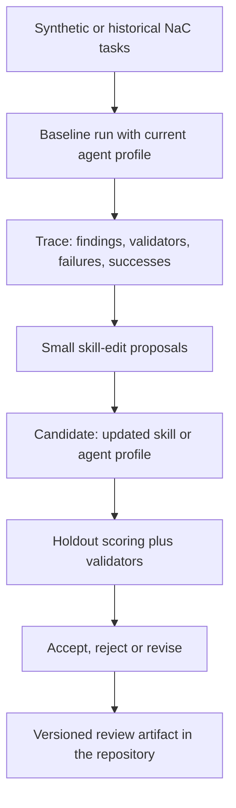

# NaC Builder SkillOpt Pilot Design

Date: 2026-06-14

```nac-spec-traceability
schema_version: nac.spec-traceability/v0.1
spec_id: nac-builder-skillopt-pilot
leading_issue: thread:2026-06-14-skillopt-pilot
risk_gate: Agentic Development Harness
delivery_mode: Design first, protected PR before implementation
acceptance_ids:
  - AC-001
  - AC-002
  - AC-003
  - AC-004
  - AC-005
  - AC-006
  - AC-007
validation_commands:
  - /home/ubuntu/.venvs/nac/bin/python scripts/validate_language_parity.py
  - /home/ubuntu/.venvs/nac/bin/python scripts/validate_doc_links.py
  - /home/ubuntu/.venvs/nac/bin/python scripts/validate_spec_traceability.py
```

This specification describes a small, controlled pilot for SkillOpt-like
optimization while building and reviewing NaC. The pilot does not improve the
later notarial operating workflow. It improves the repository-local
instructions that Codex uses to build, review and document NaC.

## Goal

NaC should systematically turn recurring errors in agentic development and
review runs into better skill and agent-profile instructions. The target output
is a compact, versioned NaC builder skill or sharpened agent profile that
measurably produces fewer documentation, governance and parity errors than the
current baseline.

The pilot stays deliberately small. It starts with `nac_docs_parity_reviewer`
because its success is comparatively measurable: German/English parity, link
status, public wording rules, style-guide compliance and quality-gate coverage.

## Design Decision

NaC will not start with a fully automatic SkillOpt loop. The first step is a
manually guided SkillOpt-light process:

1. collect synthetic or historical NaC tasks as a benchmark;
2. run the current skill or agent profile on those tasks;
3. derive recurring failures and robust successful behavior from traces;
4. propose small add, delete or replace edits to the skill;
5. accept edits only when holdout tasks and relevant validators remain at least
   as stable and improve in the target metric;
6. document accepted and rejected edits as review artifacts.

The target agent stays unchanged. Only a readable Markdown or TOML artifact in
the repository is trained.

## Boundary To Later Operations

The pilot applies only to creating, maintaining and reviewing NaC. It must not
optimize real matters, real mandate data or productive notarial decisions.

Allowed inputs are:

- synthetic NaC tasks;
- earlier repository tasks without mandate data;
- validator outputs;
- Git diffs;
- review comments;
- public or repository-internal documentation without secrets.

Prohibited inputs are:

- real mandate data;
- real personal data;
- PINs, passwords, tokens, API keys or secret links;
- automatic merging of skill edits;
- deriving notarial truth from model or skill output.

## Pilot Scope

The first pilot optimizes only `nac_docs_parity_reviewer`. The benchmark tasks
cover these cases:

- German documentation changes need matching English mirrors;
- public wording must follow the agent style guide;
- new workflow or plugin documents need matching contract and Gantt signals;
- links and relative paths must stay valid after restructuring;
- quality-gate or validator hints must appear in the review recommendation.

The pilot should start with 15 to 30 tasks. About two thirds are training cases
and one third is the holdout selection set. The tasks include expected findings,
expected non-findings and relevant validation commands.

## Scoring Model

Each run produces a simple scoring artifact:

- detected required findings;
- false positive findings;
- missed validators;
- data or review-boundary violations;
- result of relevant validation commands.

A skill edit is acceptable only if it causes fewer critical errors on the
holdout tasks and introduces no new guardrail violation. A tie is acceptable
only when the skill becomes shorter, clearer or easier to review.

## Data Flow



## Artifacts

The pilot is expected to produce these artifacts later:

- a short benchmark manifest with task IDs, scope, expected findings and
  validation commands;
- a scoring format for baseline and candidate runs;
- a rejected-edit buffer as Markdown or JSONL evidence;
- an accepted skill or agent-profile diff;
- a short review report for human approval.

This specification introduces no new runner and no new automation yet. It
defines the functional and technical boundary for the next implementation plan.

## Error Handling

If a candidate violates a guardrail, it is rejected even if it detects more
findings. If holdout scoring is ambiguous, the current skill remains valid. If
a skill edit improves a rule only by overfitting to concrete task IDs or sample
texts, it is rejected as overfitting.

## Acceptance Criteria

- AC-001: The pilot is explicitly limited to NaC creation and NaC review.
- AC-002: `nac_docs_parity_reviewer` is the first target profile.
- AC-003: Benchmark cases use only synthetic or repository-allowed data.
- AC-004: Every accepted skill edit needs a holdout rationale, a Git diff and human
  review.
- AC-005: Rejected edits remain traceable as negative examples.
- AC-006: The pilot must not include productive writes, real mandate data or automatic
  approval.
- AC-007: The later implementation plan can start with a manual SkillOpt-light harness
  and does not have to build a full optimizer.

## Source Relationship

The pilot is informed by SkillOpt as text-based optimization of agent skills
with bounded edits, a validation gate and a reusable skill artifact. For NaC,
this is deliberately reduced to an auditable development and review harness.
