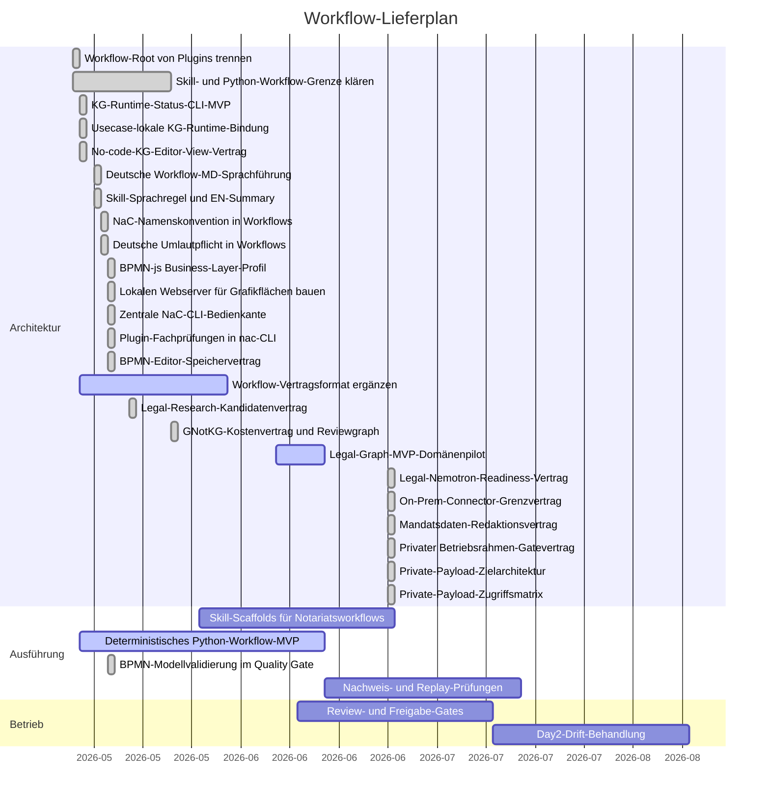

# Workflow Gantt

Letzte Aktualisierung: 2026-06-12

## Status

| Schicht | Root | Status | Grenze |
| --- | --- | --- | --- |
| Installierbare Skills | `workflows/skills/` | Geplant / Sprachregel bereit | Deutsche fachliche Anweisung führt; englische Summary dient technischer Anschlussfähigkeit, keine finale rechtliche Wahrheit. |
| Python-Workflows | `workflows/python/` plus `src/notary_kg/`, `src/nac_legal_graph/` und `src/nac_cli/` | Aktiv | Die deterministische KG-Status-Runtime liest usecase-lokale KG-Dateien; der Legal-Graph-Pilot erzeugt nur Review-Patches aus metadata-only Primärquellenmanifesten für Erbrecht, Familienrecht und Gesellschaftsrecht ohne Kommentarzugriff. Beides ist über die zentrale `nac`-CLI zusammen mit Prozess-, BPMN-, Plugin-Fachprüfungs-, Konfigurations-, Webserver- und Quality-Gate-Befehlen erreichbar. |
| BPMN-js Business Layer | `bpmn/` plus `workflows/contracts/bpmn-js-editor.contract.json` | Nutzbarer MVP | BPMN ist fachliche Prozessquelle; alle Usecases haben bpmn-js-taugliche Basismodelle mit `nac:channel`, Python validiert NaC-Properties, Sequenzflüsse und Diagrammflächen. |
| GNotKG-Kostenmodul | `src/nac_gnotkg/` plus `workflows/contracts/gnotkg-cost-review.contract.json` | Nutzbarer MVP | Zentrale Wertgebührenlogik mit GNotKG § 35-Höchstwerten, mandatsdatenfreier Reviewgraph und `xyflow` als reine Visualisierungsschicht. |
| Lokaler Webserver | `src/nac_web/` plus `scripts/nac_web.py` | Heute nutzbar | Zeigt BPMN-SVG, BPMN-JSON, BPMN-XML/Editierfläche, KG-Editor-Views, GNotKG-Kostenansichten und KG-JSON lokal im Browser; BPMN-Speichern nutzt SHA-256-Konfliktprüfung, GNotKG-Quotes laufen per POST. |
| Workflow-Verträge | `workflows/contracts/` | Aktiv | Eingaben, Ausgaben, Freigaben, Datenklassen, Plugin-Abhängigkeiten sowie KG-Editor-, BPMN-js-Editor-, GNotKG-Kosten-, lokaler Webpreview-, Secure-Document-Link-, Legal-Research-Connector-Kandidaten-, Legal-Graph-, Legal-Nemotron-Readiness-, Kommentar-Connector-, NaC-On-Prem-Agent-Runtime-, On-Prem-Connector-Grenz-, Mandatsdaten-Redaktions-, privater Betriebsrahmen-Gate-, Private-Payload-Ziel- und Zugriffsmatrixvertrag. Kommentar-, Legal-Nemotron-, On-Prem-Connector-, Mandatsdaten- und Private-Payload-Verträge bleiben vor produktivem Zugriff durch Lizenzbasis-, AVV-/DPA-, Berufsgeheimnis-, AI-SBOM-, Sicherheitsgrenzen-, Credential-, Testmodus-, Privacy-, Benchmark-, Evaluation-, Model-Card-, Rollen-, Zweck-, Speicher-, Retention-, Verschlüsselungs- und Owner-Gates blockiert. |

Der repo-weite Marken- und ID-Standard heißt `NaC` für `Notariat as Code`;
alte Schreibweisen sind in Workflow-Dokumenten nicht mehr
zulässig.
Deutsche Menschentexte nutzen echte Umlaute; technische IDs, Pfade und Befehle
bleiben ASCII-stabil.
